# multi-view GAN(image generation)

- keywords
  - GAN 3d scene multi view
  - GAN multi view geometry
  - multi view image generation from graph

---

**`"CR-GAN: Learning Complete Representations for Multi-view Generation"`**  
**[** `IJCAI 2018` **]** **[[paper]](https://www.ijcai.org/Proceedings/2018/0131.pdf)** **[** :mortar_board: `Rutgers University` **]**  
**[**  `Yu Tian`,  `Dimitris N. Metaxas` **]**  
**[** _`complete representation`, `GAN`, `encoder-decoder`_  **]**  

  
Click to expand

- **主要贡献**
  
  - 第一个调查GAN模型的"complete representations"
  - 用CR-GAN来学习完整的表达，使用一种两通路的模式(`reconstruction path` + `generation path`)
  - CR-GAN可以利用`unlabeled data`来`self supervision`，使得生成的质量更好
  - 即使对于**unseen**的dataset，对于**wild conditions**，CR-GAN可以产生高质量的**multi view**图片
  
- **之前的GAN-based方法**：encoder-decoder+discriminator
  
  
  - |                  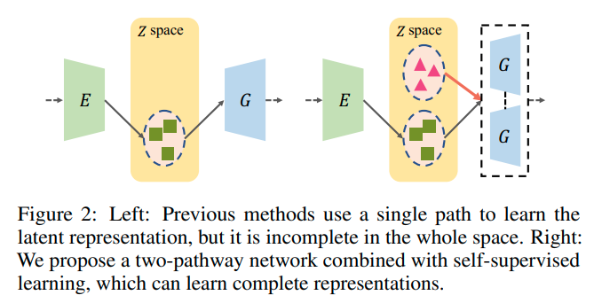                  |
    | :----------------------------------------------------------: |
    | 相比于之前的GAN-based方法，多了一条`generation path`，试图补全z space |
    
  - encoder把图片map到一个latent space，然后操作embedding，然后decoder生成新视角
  
  - [CVPR 2017] [[paper]](https://openaccess.thecvf.com/content_cvpr_2017/papers/Tran_Disentangled_Representation_Learning_CVPR_2017_paper.pdf) <DR-GAN> Disentangled Representation Learning GAN for Pose-Invariant Face Recognition
  
  - [2017]  Multi-view image generation from a single-view. 
  
  - **_之前的GAN-based方法的问题_**：
  
  
    - 学到的都是“不完整”的表征，对于"unseen"data\无边界的data的泛化性很差
    - ==**思考**==：encoder网络学到的大概率就是不完整的表征；这也是为什么用auto-decoder而不是encoder-decoder
  
- **proposal**
  - 除了`reconstruction path`外，引入另一条`generation path`来 从随机采样的sample 创建view-specific images
  - 两条path **共享**同样的G参数：在生成通路学到的G 会引导reconstruction path中的E和D的学习，反过来也是一样
  - E is force to be G的逆向过程，使得学到的**representation可以span the entire Z space**  
  - 更重要的是，两通路的学习过程可以很容易地利用**有label、无label**的数据，对于自监督学习而言，从而大大丰富了Z space，对于自然的生成来说。
  
- **discriminators** 
  
  
  - 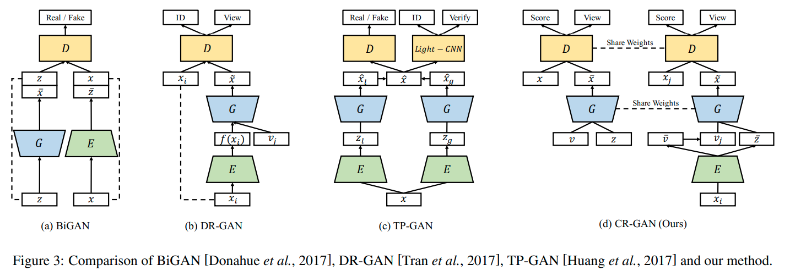
  - **==问题==** ：原来这些GAN-based方法中的discriminator都是干什么用的？单纯只是增加图像的细节程度？
  - DR-GAN中：discriminator有两个任务：① id 分类。discriminator输出一个分类输出。② pose分类。分类器输出。

---

**`< multi-view BiGAN > "Multi-view Generative Adversarial Networks"`**  
**[** `2016` **]** **[[paper]](https://arxiv.org/pdf/1611.02019.pdf)** **[** :mortar_board: `UPMC` **]** 
**[**  `Mickaël Chen`, `Ludovic Denoyer`  **]**  
**[** _`BiGAN`_ **]**  

  
Click to expand

too old

- 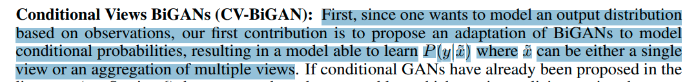
  - 把BiGAN改造成适应conditional 概率；一个可以学到P(y\|x)，x可以是单张图片或者是多张view的集合
- 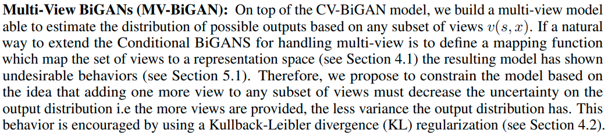
  - 创造了一个multi-view model，给予任意一组subset of views，评估可能的输出的分布
  - 如果说，一种自然的把BiGAN 延伸到适应multi view输入的方式 是 定义一个从a set of view到一个representation space的mapping function，那么，这种方法已经被证明会有不达到要求的表现
  - 因此，我们提出了一种约束模型的方式：基于一个想法：对任意一组subset of views添加一个view都应该降低输出分布的不确定性。给的view越多，方差越小。用KL散度来正则化

---

**`"Conditional Single-view Shape Generation for Multi-view Stereo Reconstruction"`**  
**[** `2019` **]** **[[paper]](https://arxiv.org/pdf/1904.06699.pdf)** **[[code]](https://github.com/weiyithu/OptimizeMVS)** **[** :mortar_board: `Tsinghua University` **]**  
**[**  `Yi Wei`, `Shaohui Liu`, `Jiwen Lu`  **]**  
**[** _`multi view geometry constraint`, `image based shape generation`_ **]**  

  
Click to expand

- **task**: image based shape generation
- 把多张图片的重建问题 建模为 计算每个单张图片重建出的shape 空间的 交集

---

**`"Multi-view Relighting using a Geometry-Aware Network"`**  
**[** `ACM T-Graphics 2019` **]** **[[paper]](https://repo-sam.inria.fr/fungraph/deep-relighting/Multi-view-Relighting.pdf)** **[** :mortar_board: `Université Côte d'Azur and Inria`,`UCB` **]** **[** :office: `Adobe` **]**  
**[**  `Julien Philip, MICHAËL GHARBI,TINGHUI ZHOU, ALEXEI A. EFROS, GEORGE DRETTAKIS `  **]**  
**[** _`multi view video relighting`_ **]**  

  
Click to expand

- **task**: multi-view video relighting
- 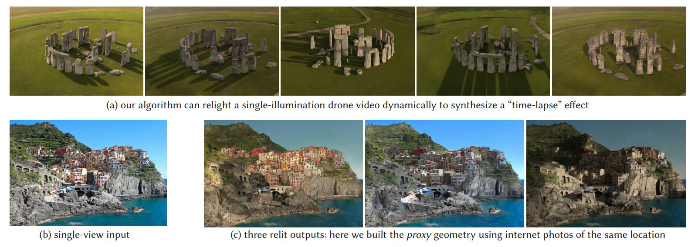
- 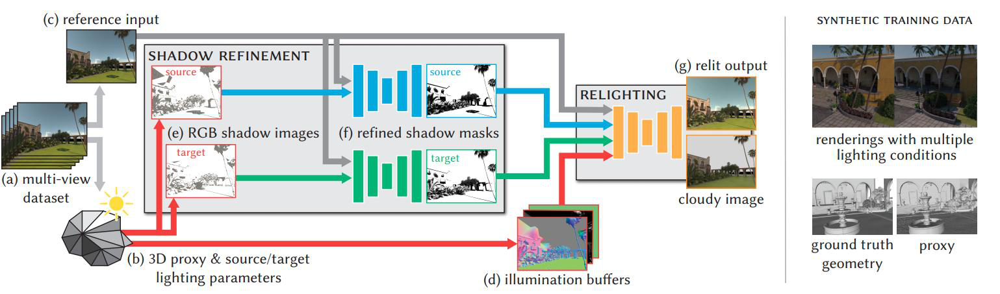

  - 首先从multi view的视频创建一个proxy geometry，然后考虑relighting

---

**`"Geometry-Consistent Generative Adversarial Networks for One-Sided Unsupervised Domain Mapping"`**  
**[** `CVPR2019` **]** **[[paper]](https://openaccess.thecvf.com/content_CVPR_2019/papers/Fu_Geometry-Consistent_Generative_Adversarial_Networks_for_One-Sided_Unsupervised_Domain_Mapping_CVPR_2019_paper.pdf)**  **[** :mortar_board: `University of Sydney`, `University of Pittsburgh`, `CMU`,`Universite Paris-Est` **]**   
**[**  `Huan Fu, Mingming Gong, Chaohui Wang, Kayhan Batmanghelich, Kun Zhang, Dacheng Tao`  **]**  
**[** _`  `_ **]**  

  
Click to expand

- TODO

---

**`"RGBD-GAN: Unsupervised 3D Representation Learning From Natural Image Datasets via RGBD Image Synthesis"`**  
**[** `ICLR2020` **]** **[[paper]](https://arxiv.org/abs/1909.12573)**  **[** :mortar_board: `University` **]** **[** :office: `company` **]**  
**[**  `JohnDoe`  **]**  
**[** _`multi view geometry constraint`, `GAN`_ **]**  

  
Click to expand

- **natural datasets**下，通过RGBD图像生成，进行**无监督**的**3D表征**学习
- **3.2.2 SELF-SUPERVISED RGBD CONSISTENCY LOSS**
  - 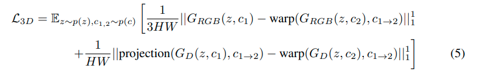

---

**`"Towards Unsupervised Learning of Generative Models for 3D Controllable Image Synthesis"`**  
**[** `CVPR2020` **]** **[[paper]](https://arxiv.org/pdf/1912.05237.pdf)** **[[code]](https://github.com/autonomousvision/controllable_image_synthesis)** **[** :mortar_board: `University of Tubingen ` **]** **[** :office: `MPI-IS`,`Amazon` **]**  
**[**  `Yiyi Liao`, `Andreas Geiger`  **]**  
**[** _`HoloGAN->baseline`,`RGBD-GAN based`, `multi object multi view`,  `Controllable Image Synthesis`_ **]**  

  
Click to expand

| 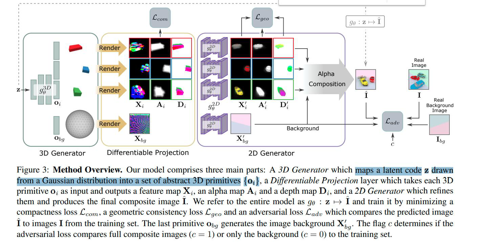                                   |
| ------------------------------------------------------------ |
| 首先 从一个高斯采样的latent code 映射到一系列3D primitives（一些原初3D物体表征）  再渲染物体 再渲染背景 |

- | Input   | unlabeled image                                              |
  | ------- | :----------------------------------------------------------- |
  | output  | multi view images                                            |
  | dataset | 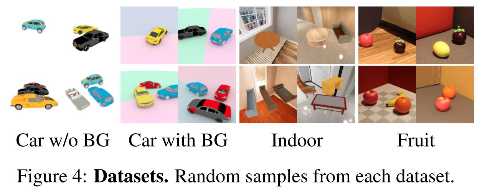  **随机背景、随机物体、随机view point**  3D primitives: no label   instance segmentation: no label   pose annotations: no label |
  
- 训练这样的模型是有挑战的：

  - 比如有可能把2个物体理解为同一个primitive，甚至...；
  - 因此，使用多个loss来鼓励一个解耦、可解释的3D表征；同时从训练集分布中生成图片。

- **loss**

    - _**adversarial loss**_：标准的real/fake loss + condition

      - > condition on: 是完全的composite image还是background image
        >
        > 实验证明，这个condition有助于从背景中解耦物体  

      - 因此在训练时，收集两组数据集：带有物体的和没有物体的

    - _**compactness loss**_ ：紧凑性loss

        - > To bias solutions towards compact representations and to encourage the 3D primitives to tightly encase the objects, we minimize the projected shape of each object.
        >
        > 为了让solutions 倾向于完整的表征，鼓励3D primitives能够紧贴合物体，我们最小化每个物体的投影shape

      - 惩罚每个物体`alpha map`的 `L1-范数`

      - > 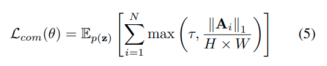
        >
        > $\tau=0.1$ 是一个防止收缩到一个固定最小值以下的截短阈值， $A_i$ 依赖于模型参数和 latent code z（so 这个loss可以对模型参数有作用）

  - **(==self supervised==) geometry consistency loss**

    - > 为了得到在不同的 `camera viewpoints` 和 `3D物体pose `中都**consistent**的solutions，遵循 _**[33]RGBD-GAN**_ 来鼓励生成模型来遵守多视几何约束。

    - >  比如，对于pose(外参)的改变应该改变物体的pose但是不应该alter它的颜色或者identity.

    - > 这样formulate这个约束：
      >
      > 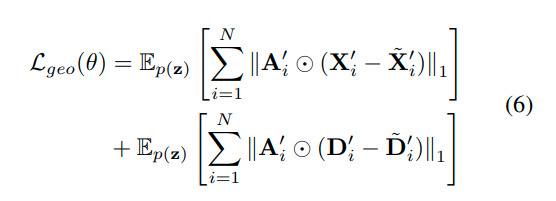
      >
      > $X_i'$ $D_i'$ 是 latent code z的2D generator 输出
      >
      > $\tilde{X}_i'$ $\tilde{D}_i'$ 是 同一个latent code对每个primitive的pose加入随机噪声 并且 [**Warp**ing the result back to the original viewpoint] (即**重投影**回加噪声之前的viewpoint)  后的2D generator输出

    - 相当于是一个自监督的重投影误差loss

---

**`"GRAF: Generative Radiance Fields for 3D-Aware Image Synthesis"`**  
**[** `2020` **]** **[[paper]](https://arxiv.org/pdf/2007.02442.pdf)**  **[** :mortar_board: `University of Tubingen ` **]** **[** :office: `MPI-IS`**]**  
**[**  `Katja Schwarz, Yiyi Liao, Michael Niemeyer, Andreas Geiger`  **]**  
**[** _`neural radiance field`, `continuous representation`_, `camera viewpoint/object pose controllable image synthesis` **]**  

  
Click to expand

| 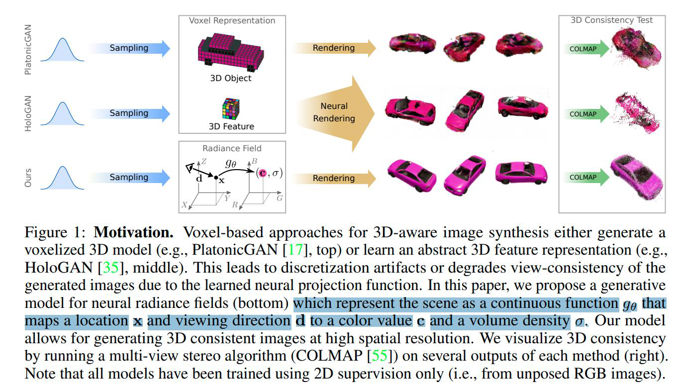 |
| -------------------------- |
| motivation                 |

- _**Motivation**_
  
  
  - > While 2D generative adversarial networks have enabled high-resolution image synthesis, they largely lack an understanding of the 3D world and the image formation process. 
    >
    > Thus, they do not provide precise control over camera viewpoint or object pose.
    >
    > **因为2D GAN缺少对3D世界的理解；缺少图像生成过程的理解，所以不能提供对于camera viewpoint和物体pose的精确控制**。
  
- 使用连续表征neural radiance filed
  
  
  - 从location x, view direction d映射到color c 和 体素密度$\sigma$
  
- 数据集使用unposed RGB images

---

**`"Inverse Graphics GAN: Learning to Generate 3D Shapes from Unstructured 2D Data"`**  
**[** `2020` **]** **[[paper]](https://arxiv.org/pdf/2002.12674.pdf)**  **[** :mortar_board: `University of Cambridge` **]**  
**[**  `Sebastian Lunz, Yingzhen Li, Andrew Fitzgibbon, Nate Kushman`  **]**  
**[** _`Inverse Graphics`, `GAN`_ **]**  

  
Click to expand

- TODO

