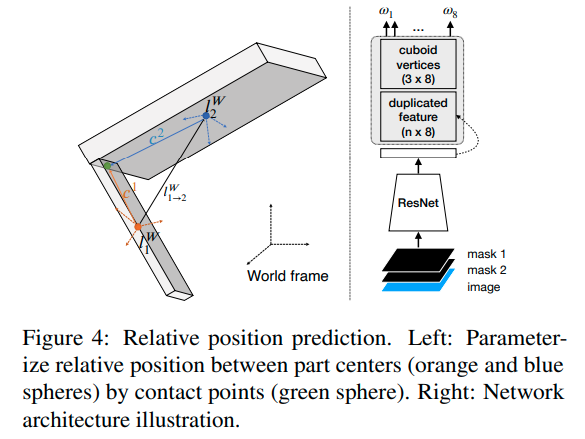
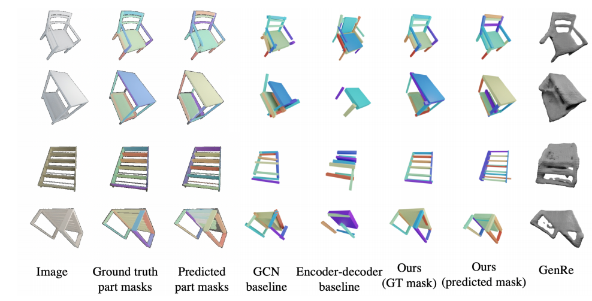

---

**`"Compositionally Generalizable 3D Structure Prediction"`**  
**[** `2021` **]** **[[paper]](https://arxiv.org/pdf/2012.02493.pdf)** **[[code]](https://www.github.com)** **[** :mortar_board: `UCSD`, `USTC`, `Stanford` **]** **[** :office: `Google` **]**  
**[**  `Songfang Han`, `Jiayuan Gu`, `Kaichun Mo`, `Li Yi`, `Siyu Hu`, `Xuejin Chen`, `Hao Su`  **]**  
**[** _`object parts`, `single view`_ **]**  

  
Click to expand

- **Review**
  - 思路、框架清晰；carefully designed subproblems
  - 可解释性很强，不是随随便便拿来GCN胡乱用一下
- **Motivation**
  - 学到不同物体、不同物体类别之间那些公共的部件、部件间的关系、连接
  - 把整个物体的shape生成问题转为几个子问题的组合
  - 关注的是逐part pair的相对位置的预测
  - 
- **overview**
  
  - 用geometry primitives来代表部件（具体来说，oriented bounding cuboids，长方体），每个部件有$`p_i=[c_x,c_y,c_z,s_x,s_y,s_z,q]`$
  
    - 遵循StructureNet的设定 *Structurenet: Hierarchical graph networks for 3d shape generation 2019*
  - 所有模块都是有监督的；part真值来自于PartNet的3D labels
  - 步骤：
    - MaskRCNN来提取部件instance mask
    - identify parallelism for part pairs，对每组平行的部件预测他们共享的edge direction
    - identify translational symmetry within part pairs，对每组平动对称的部件预测他们共享的edge length
    - 预测部件pairs之间的连接性，提取一个基于连接性的部件树
    - 预测邻接部件的相对位置，在遍历部件树的时候组装整个形状
  - [isolation principle] 重度依赖部件masks作为模块的输入来引起对局部区域的关注
  - [relativity principle] 依赖于pairwise关系
  - 
- ==**relative position prediciton**==
  - 从root part开始，逐pair地添加other parts
  - 很多过去的工作都是估计在相机坐标系下的绝对位置，或者是一个(类别级别先验)canonical space下的pose
  - 然而，绝对位置对于shape scale敏感，对optical axis的平动也很敏感，对于简单的类别内预测的表现都很差
  - <u>**Connectivity-based Part Tree**</u>：追求通过strong **pairwise** relationships来组装parts
    - 主要用的是基于连接性的关系
    - 首先识别空间上接触的部件pair，然后预测他们之间的相对位置
    - 选择【接触关系】原因：
      - 接触的部件空间上接近，互相之间有strong arrangement constraints
      - 当没有遮挡情况下，评估两个部件有没有接触在图像上都不太难，并不需要类别级别的知识
      - 这种关系非常普遍
      - 对于新类别的物体也可以很好地迁移
    - ==**思考**==
      - 这里的想法和我们非常一致，我们扩展到更多类型的关系应该就可以实现
    - 主要方法
      - 训练一个连接性分类器，预测parts pair是否在原来的3D shape 互相接触
      - 用连接性类构建一个part tree
        - 首先构建一个连接图，把连接性分数高的pair连接起来
        - 然后贪婪地构建一个spanning tree
          - 具体：通过预测出的大小，选最大的part作为root node，然后迭代地选剩下的最大的部件连到当前树上
          - 如果图中包含多个连接起来的components，那就构建part forest
  - **<u>joint-based relative position</u>** 逐pair预测相对位置
    - instead of 直接预测两个center的相对位置，基于接触点来用上更强的位置先验
    - 接触点必须位于每个部件的cuboid中
    - 用接触点来参数化部件center之间的相对关系
      - 接触点
        - 在part $`p_1`$坐标系下接触点坐标$`c^1`$，在part $`p_2`$坐标系下接触点坐标$`c^2`$，假设$`p_1`$, $`p_2`$在world frame下坐标为$`l_1^W`$, $`l_2^W`$，由于是同一个点，应有 $`l_1^W+c^1=l_2^W+c^2`$
        - 则两个center之间的相对位置可以这样infer： $`l_{1 \rightarrow2}^W=l_2^W-l_1^W=c^1-c^2`$
        - - [x] Q：这里可能有些问题，考虑到坐标系旋转，并不应是简单加法，不过意思到了 A：没有问题，这里$`c^1`$, $`c^2`$都是世界坐标系下的
      - 接触点估计：如何infer $`c^i`$
        - 接触点应位于cuboid表面或者cuboid内部，因此将接触点表示为cuboid顶点的interpolation $`c^i=\sum_{j=1}^{8}\omega_{i,j}\cdot v_{i,j}`$, where $`\sum_{j=1}^8\omega_{i,j}=1`$ and $`\omega_{i,j} \geq0`$
        - 用神经网络预测$`\omega_i,j`$，输入reference image和两个部件mask的feature的stack
        - 为了让接触点预测的结果和cuboid顶点顺序无关，结构和PointNet segmentation的结构类似
        - *Deep learning on point sets for 3d classification and segmentation.2017* 
      - 
- **效果**

  - 真值mask基本可以做到很完美的组装，predicted mask效果也可以接受，毕竟predict出来的mask会出问题
  - 

