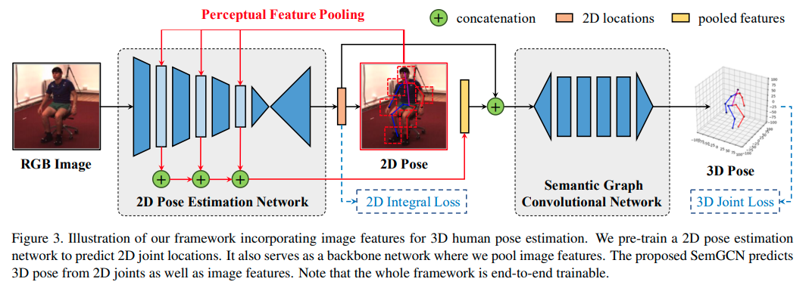
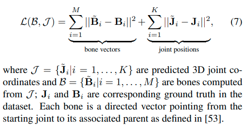
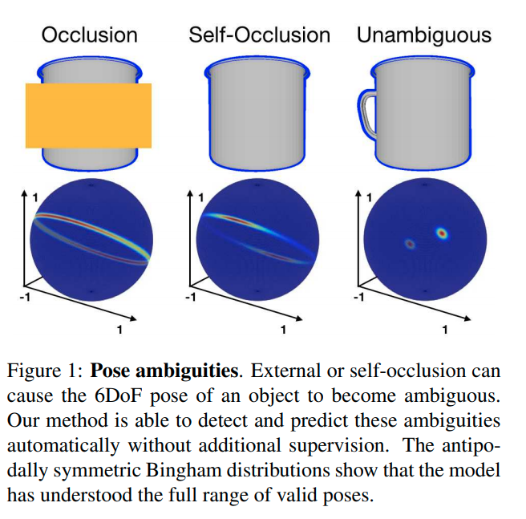

[[_TOC_]]
# deep learning perform [regression on 6D pose] / [transformation]

## topic: object 6D pose estimation from images

| paper                                                        | method                                                       |
| ------------------------------------------------------------ | ------------------------------------------------------------ |
| DPOD: 6D Pose Object Detector and Refiner                    |                                                              |
| [ICCV2017] SSD-6D: Making rgb-based 3d detection and 6d pose estimation great again | extended the ideas of the 2D object detector [20] by 6D pose estimation based on a discrete viewpoint classification rather than direct regression of rotations. 用离散的viewpoint分类而不是直接回归rotations   The method is rather slow and poses predicted this way are quite inaccurate since they are only a rough discrete approximation of the real poses. 这种方法非常慢卡而且预测出的pose很不精确，since他们只是rough discrete approximation.  **The refinement is a must in order to produce presentable results.** |
| [ICCV2017] BB8: A scalable, accurate, robust to partial occlusion method for predicting the 3d poses of challenging objects without using depth. | uses a three-stage approach.  头两个阶段coarse-to-fine的进行segmentation 然后把结果喂到第3个网络去输出projections of the object's bounding box points ==已知了2D-3D相关性==，可以用PnP算法来估计6D pose 主要是因为多阶段导致运算速度比较低 |
| [CVPR2018] YOLO6D: Real-time seamless single shot 6d object pose prediction. | build on BB8 and YOLO 高效而精确地检测物体和估计pose，不需要refinement. 像在BB8中的情况一样，这里的核心feature是 perform the regression of **reprojected bounding box corners in the image.** 这种参数化的优势：相对地紧凑性，以及没有带来<像直接回归旋转时会遇到的>的pose ambiguity(模棱两可) |
| Pix2Pose: Pixel-Wise Coordinate Regression of Objects for 6D Pose Estimation | 2D-3D correspondence + PnP + RANSAC                          |
| [CVPR2020] Single-Stage 6D Object Pose Estimation            | 2D-3D correspondence + PnP + RANSAC                          |
| [CVPR2020] HybridPose: 6D Object Pose Estimation under Hybrid Representations | 大杂烩                                                       |
|                                                              |                                                              |
|                                                              |                                                              |

---

**`"DPOD: 6D Pose Object Detector and Refiner"`**  
**[** `ICCV2019` **]** **[[paper]](https://arxiv.org/pdf/1902.11020v3.pdf)** **[[code]](https://github.com/yshah43/DPOD)** **[** :mortar_board: `TUM` **]** **[** :office: `Siemens Corporate Technology` **]**  
**[**  `Sergey Zakharov`,`Ivan Shugurov`,`Slobodan Ilic  `  **]**  
**[** _`6D pose esimation [2020 SOTA]`, `correspondence`_ **]**  

[思考：虽然我们的生成模型用不上这里的一些计算设定方式，但是在图定位的时候这个会很有用]

  
Click to expand

- **Motivation**
- **相关研究**
  - full 6D detection from RGB images
    - SSD6D
    - YOLO6D -> real
    - AAE
    - PoseCNN -> real
    - PVNet -> real
    - BB8
    - iPose
  - datasets
    - LineMOD
    - OCCLUSION
  - refiners：在检测后还要再进行一次refinement

|  |
| ------------------------------------------------------------ |
| Pipeline                                                     |

- **大概思路**
  - 首先，每个物体都有一个具体的材质图-三维模型对应；知道材质图上的uv坐标就知道物体模型三维坐标系下的坐标；*vice versa.*
  - 然后，在预测的时候，事实上是预测RGB中的每个像素都属于哪个物体，属于那个物体的材质图中的哪一个uv像素；
  - 这样，知道了RGB中的每个点对应物体的材质uv图，也就知道了每个点对应物体的三维坐标系值；这样一来，其实对于每个物体，就相当于知道了一些关键点的在物体三维坐标系下的坐标和图像坐标以及相机内参矩阵，于是可以利用PnP算法来计算相机在物体坐标系下的外参；反过来就知道了物体在相机坐标系下的坐标
  - $\Delta$ 即关键feature是不直接预测rotations itself (因为会有pose ambiguity问题)，而是预测uv map；
    - 思考：我们如果同时预测$cos(\theta)$和$sin(\theta)$，是不是就可以避免这个问题？
      - 预测的输出要满足$cos(\theta)^2+sin(\theta)^2=1$，这样可以吗？
        - 搜索了一圈以后的回答：
          似乎存在一个explicitly normalized 操作
          现在这些回归四元数q的方法都可以做到这一点
      - 只预测$cos(\theta)$ 不够，不够一圈；那么预测$tan(\theta)$可以吗？可能不如预测cos,sin的语义更强，毕竟旋转矩阵操作的时候本身就是由sin,cos构成的
- **correspondence mapping** ==(2D-3D correspondence)==
- 有一个三维模型数据集
  - 数据集中的每一个三维model的材质都是用correspondence map来建模的
  - 用simple spherical 或者 cylindrical投射的方式给物体上材质
  - 
  - 这样便建立了一个bijective(双射)函数：
  - 给定一个材质图上的u,v点，我们便知道了其三维模型坐标；
    - 给定了三维模型坐标，可以计算出材质图上的u,v点
- **pipeline**
  - **correspondence block**
    - 有3个通道的输出，预测3个信息：ID,u,v值
    - 
    - 也就是预测图片中的每个像素属于哪个ID，以及属于那个ID的材质图中的哪个point
  - **pose block** 负责预测pose
    - 给定一个估计的ID mask，我们可以观察哪些物体在图片中被检测到了、以及他们的2D位置；
    - correspondence 把每一个2D point映射到一个真实三维模型的坐标系下
      - 这个三维坐标系其实是模型定义材质时候的那个三维坐标系
    - 然后就可以用PnP算法来计算6D Pose；
      - 相当于给定了一些关键点的2D坐标、3D坐标、相机内参矩阵，估计相机外参矩阵
      - 相机外参矩阵是相机在物体三维模型坐标系下的位置，事实逆一下就是物体在相机坐标系下的位置
- pose refinement
  - [ ] what?

## topic: regression 3d transformation / regression 6d pose

- **keyword**
  - neural network regression 3d transformation
  - 3d pose regression
  - deep 3d pose regression
  - ***3D Pose Regression Using Convolutional Neural Networks*** 被引
    - 发现这个就是一般的四元数计算推导；有些论文并没有引用它
  - (deep) pose regression quaternion
  - pose estimation quaternion

---

**` < 109被引 > "3D Pose Regression Using Convolutional Neural Networks"`**  
**[** `ICCV2017` **]** **[[paper]](https://openaccess.thecvf.com/content_ICCV_2017_workshops/papers/w31/Mahendran_3D_Pose_Regression_ICCV_2017_paper.pdf)**  **[** :mortar_board: `JHU` **]**   
**[**  `Siddharth Mahendran，Haider Ali，Rene Vidal  `  **]**  
**[** _`abcd`, `efgh`_ **]**  

[ 3D pose estimation，其实只考虑旋转角，没有考虑位移 ]

  
Click to expand

- 2017年的认知：大多数这类任务是用的pose分类问题，把pose space分成离散的bins，用CNN分类器
  - 所以作者要用CNN regression framework
  - 主要针对的还是 pose estimation问题
  - 挑战在于：3D pose space是非欧几里得的，因此CNN算法需要修改来应对输出空间的非线性
- **Motivation**
  - 设计了一个CNN框架来解决连续域下的pose 估计问题，通过设计一个尊重3D pose 空间非线性结构的合适的表征、数据增强和loss函数
- **具体细节**
  - 网络
    - feature network, shared between 所有的物体类别；
    - pose network，为每个类别单独设计
  - 表征：两种表征：轴角和四元数
- representing 3D poses
  - 一个三维旋转群的定义：$$ SO(3)\dot=\{R:R \in \mathbb{R}^{3 \times 3}, R^TR=I_3, det(R)=1 \} $$ 
  - 然后可以定义两个旋转矩阵$$ R_1 $$, $$ R_2 $$之间的测地距离(`geodesic distance`) $$ d(R_1, R_2)=\frac {\lVert \log(R_1R_2^T) \rVert_F} {\sqrt{2}} $$
  - **axis-angle** 轴角定义
    - 一个旋转矩阵$$ R $$代表着3D点绕着轴$$ v $$旋转角$$ \theta $$ , $$ \lVert v \rVert_2=1 $$
    - 这可以被表达为 $$ R=\exp(\theta[v]_\times) $$
      - $$ \exp $$是矩阵指数
      - $$ [v]_\times $$是$$ v $$的skew-symmetric操作符，i.e., $$ [v]_\times=\left( \begin{smallmatrix} 0 & -v_3 & v_2 \\ v_3 & 0 & -v_1 \\ -v_2 & v_1 & 0 \end{smallmatrix} \right) $$  for $$ v=[v_1,v_2,v_3]^T $$ 
        - skew-symmetric 斜对称矩阵，$$ A=-A^T $$  i.e.  $$ a_{ij}=-a_{ji} $$ 
    - 因此，每一个旋转矩阵$$ R $$有一个相应的aixs-angle vector  $$ y=\theta v $$, vice-versa
        - 限制 $$ \theta \in [0,\pi) $$，定义$$ R=I_3 \iff y=\boldsymbol{0}_3 $$ ，保证旋转矩阵R和表征y的单一映射
        - 矩阵指数可以被简化为$$ R=I_3+\sin\theta[v]_\times+(1-\cos\theta)[v]_\times $$，用Rodrigues' rotation formula
    - 于是，$$ d(R_1, R_2)=\frac {\lVert \log(R_1R_2^T) \rVert_F} {\sqrt{2}} $$可以被简化为：
        - $$ d_A(R_1,R_2)=\cos^{-1}[\frac {tr(R_1^TR^2)-1} {2}] $$ 
        - 注意到 $$ \lVert \log\left( \exp(\theta_1[v_1]_\times)\exp(\theta_2[v_2]_\times)^T \right)\rVert_F /\sqrt{2} $$ 看上去很像 $$ \lVert \theta_1 v_1 - \theta_2 v_2 \rVert_2 $$ ，但是他们不一样，因为$$ \exp(\theta_1[v_1]_\times)\exp(\theta_2[v_2]_\times)^T \neq  \exp\left( \theta_1[v_1]_{\times}-\theta_2[v_2]_{\times} \right) $$ in general. 这个等式只在 matrices $$ [v_1]_{\times} $$和$$ [v_2]_{\times} $$ commute时才成立。i.e. $$ v_1=\pm v_2 $$ 
  - **quaternion** 四元数定义 另一个3D旋转矩阵常用的表征
    - 给定一个轴角向量$$ y=\theta v $$，相应的四元数$$ q=(c,s) $$由$$ (\cos \frac {\theta} {2}, \sin \frac {\theta} {2} v)^T $$
      - 在构造时，四元数是unit-norm的（单位正交），$$ \lVert q \rVert_2=1 $$
      - 使用四元数代数，我们有：$$ (c_1,s_1)\cdot (c_2, s_2)=\left( c_1 c_2-\langle s_1,s_2 \rangle, c_1s_2+c_2s_1+s_1\times s_2 \right) $$ 以及 $$ (c,s)^{-1}=(c,-s) $$对于单位正交$$ q=(c,s) $$. 
        - 这里是四元数乘法的定义，以及单位正交四元数的性质(共轭为逆运算)
      - 现在，用四元数来表达$$ d(R_1, R_2)=\frac {\lVert \log(R_1R_2^T) \rVert_F} {\sqrt{2}} $$：
        - $$ d(q_1,q_2)=2\cos^{-1}(\lvert c \rvert) \quad where \quad (c,s)=q_1^{-1}\cdot q_2 $$ ，再简化一些得到： $$ d_Q(q_1,q_2)=2\cos^{-1} \left( \lvert \langle q_1, q_2 \rangle \rvert \right) $$
          - 加绝对值是为了handle double cover问题
- **网络结构**
  - 对于轴角表示：
    - 输出$$ \theta v $$，用$$ \pi \tanh $$ 非线性激活层来建模 约束$$ \theta \in [0,\pi) $$ 与 $$ v_i \in [-1,1] $$ 
    - 用$$ \mathcal{L}=d_A(R,\hat{R})=\cos^{-1}[\frac {tr(R_1^TR^2)-1} {2}] $$来最优化
    - ==思考==：这里还是直接回归角度，是否还是会存在pose-ambiguity问题？也许angle 会存在一个既接近0又接近$$ \pi $$的值？是否会因为这个有影响？
    - loss这头先在没有影响了，因为用的是geodesic loss
      - 主要是输出这头，可能在输出时存在ambiguity
  - ==思考==：用一个周期性的激活函数是否可以消除这个问题？
  - 对于四元数表示：
    - 输出是一个4维量，单位正交约束通过 choosing the non-linearity as L2 normalization 来保证
      - [ ] what ?
    - 用$$ \mathcal{L}=d_Q(R,\hat{R})=2\cos^{-1} \left( \lvert \langle q_1, q_2 \rangle \rvert \right) $$ 来最优化

---

**`< not deep > "Regression of 3D Rigid Transformations on Real-Valued Vectors in
Closed Form"`**  
**[** `0000` **]** **[[paper]](https://abc.efg)** **[[code]](https://www.github.com)** **[** :mortar_board: `University` **]** **[** :office: `company` **]**  
**[**  `xxxx`  **]**  
**[** _`abcd`, `efgh`_ **]**  

  
Click to expand

- **Motivation**

## topic: regression 3d transformation GCN

- **keyword**
  - regression transformation tree GCN
  - regression tf tree GCN
  - encoder-decoder tranformation/tf tree GCN
  - encoder-decoder for 3d transformations
  - neural representations with implicit transformations

## topic: human pose estimation

- 考虑人的各个关节的pose就是由关系约束的，这里可能有一些带关系约束的pose估计
- ==考虑==：有没有用关系/GCN + 生成模型/neural representations去解决human pose estimation的
  - 这里面有些2D pose, 3D pose, 3D joint loss等公共问题
  - 
- **keyword**

---

**`"Semantic Graph Convolutional Networks for 3D Human Pose Regression"`**  
**[** `2019` **]** **[[paper]](https://abc.efg)** **[[code]](https://www.github.com)** **[** :mortar_board: `Rutgers University`,`Binghamton University ` **]**  
**[**  `Long Zhao`,`Dimitris N. Metaxas `  **]**  
**[** _`abcd`, `efgh`_ **]**  

  
Click to expand

- **Motivation**
  - 
- **loss function**
  - 
  - 其实只有骨骼向量和关节点3D位置的L2-loss. 没有涉及到rigid body transformation

## topic: pose estimation / regression + ambiguity 如何消除ambiguity

- **keyword**
  - 3d pose regression ambiguity
  - ***Explaining the Ambiguity of Object Detection and 6D Pose From Visual Data*** 被引

---

**`"Explaining the Ambiguity of Object Detection and 6D Pose From Visual Data"`**  
**[** `ICCV2019` **]** **[[paper]](https://openaccess.thecvf.com/content_ICCV_2019/papers/Manhardt_Explaining_the_Ambiguity_of_Object_Detection_and_6D_Pose_From_ICCV_2019_paper.pdf)**  **[** :mortar_board: `TUM`, `Oxford`, `Stanford` **]** **[** :office: `Huawei`, `Google` **]**  
**[**  ` Fabian Manhardt`  **]**  
**[** _`Ambiguity`, `efgh`_ **]**  

[]

  
Click to expand

- **Motivation**
  - 3D object detection and pose estimation from a single image are two inherently ambiguous problems.
  - 很经常的，不同viewpoints下的物体由于对称性、遮挡和重复的材质出现相似的外观
  - 检测和pose估计中都带有的ambiguity意味着物体实例可以被几个不同的pose甚至结构不同的类别完美描述
  - 这个工作中，我们显式地处理这些ambiguity
  - 对于每个物体实例，我们预测多个6D pose 输出来估计 由对称性和重复材质产生的具体的pose分布 当视觉外观可以uniquely identifies 只有一个有效的pose时，这个分布collapses to 单个输出
  - 优势：不仅是对pose ambiguity更好的解释，同时也在pose估计上实现了更好的精确度
- **ambiguity in object detection and pose estimation的正式建模表述**
- 描述刚体transformations: $$ SE(3) $$, 它是 $$ SO(3) $$和$$ \mathbb{R}^3 $$的semi-direct product
  - 对于$$ \mathbb{R}^3 $$，我们使用欧几里得3-vectors
    - 对于$$ SO(3) $$，用 the algebra of $$ \mathbb{H}_1 $$ of unit quaternions 来model $$ SO(3) $$中的空间旋转
    - a quaternion is given by
      $$ \boldsymbol{q}=q_1 \boldsymbol{1}+q_2 \boldsymbol{i}+q_3 \boldsymbol{j} + q_4 \boldsymbol{k}=(q_1,q_2,q_3,q_4) $$, with $$ (q_1,q_2,q_3,q_4) \in \mathbb{R}^3 $$ and $$ i^2=j^2=k^2=ijk=-1 $$
    - we regress the quaternions above the $$ q_1=0 $$ hyperplane 并且因此忽略掉souther hemisphere，这样任何3D rotation可以被单个的quaternion表达
  - 在有ambiguity的情况下，a direct naive regression of the rotation as a quaternion将带来很糟糕的结果，因为网络将会学习到一个closest to all results in the symmetry group的rotation。
      这个学出的预测可以被看做(conditional) mean rotation
    - 正式表述：在一个典型的有监督学习的设定下，we associate images $$ I_i $$ with poses $$ p_i $$ in a dataset $$ (I_i, p_i) $$ ；为了描述对称性，我们定义对于一张给定的image $$ I_i $$, the set $$ \mathcal{S}(I_i) $$ of poses 都有这一张相同的image
        $$ \mathcal{S}(I_i)=\{P_J \vert I_j=I_i \} $$
        注意对于非离散的对称性，$$ \mathcal{S} $$中将含有无数个poses
    - 直接从$$ I $$回归一个pose $$ p' $$的 naive model $$ f(I,\theta) $$，最小化loss $$ \mathcal{L}(p,p') $$来最优化
      $$ \theta^*={\underset {\theta}{\operatorname {arg\,min} }} \sum_{i=1}^N \mathcal{L}(f_{\theta}(I_i), p_i) $$
        然而，从$$ I $$到$$ p $$的映射is not well defined 并且不能被model为一个function
    - 于是，$$ f $$事实上学到的是和$$ \mathcal{S}(I_i) $$中所有点都equally close的一个rotation.
    - [ ] multiple pose hypothesis
- **网络结构**
    - SSD-300带一个InceptionV4的backbone，每次检测时额外提供6D pose：每个anchor box提供$$ C+M \cdot P $$个输出：$$ C $$代表类别个数，$$ M $$代表symmetry hypotheses的个数，$$ P $$代表来描述6D pose的参数个数
        $$ P=5 $$，4(explicitly normalized四元数)+1(物体到camera的距离)
        剩下的两个自由度通过把2D检测框的中心用深度back-project可以获得
    - **loss**
        - class: cross-entropy $$ \mathcal{L}_{class} $$
        - anchor box: L1-norm $$ \mathcal{L}_{fit} $$
        - quaternion: $$ \mathcal{L}_{rotation}(q,q')=\arccos \left( 2 \langle q,q' \rangle^2-1 \right) $$
          - $$  \iff 2\cos^{-1} \left( \lvert \langle q_1, q_2 \rangle \rvert \right) $$，等价的，只是用二倍角公式变一下而已
          - $$ let\,\cos\beta=\langle q,q'\rangle $$
            $$ 2\beta=2\beta \; \Rightarrow \cos^{-1}(\cos 2\beta)=2\cos^{-1}(\cos\beta) $$
            $$ \Rightarrow \cos^{-1}(2\cos^2 \beta-1)=2\cos^{-1}\beta $$
            $$ \Rightarrow \cos^{-1}(2\langle q,q' \rangle^2-1)=2\cos^{-1}(\lvert \langle q,q' \rangle \rvert) $$
        - depth: smooth L1-norm  $$ \mathcal{L}_{depth} $$

