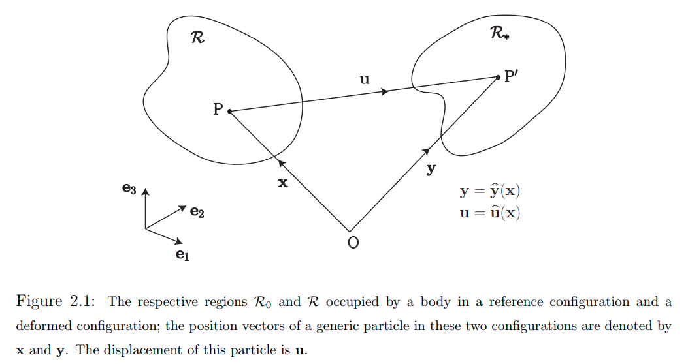
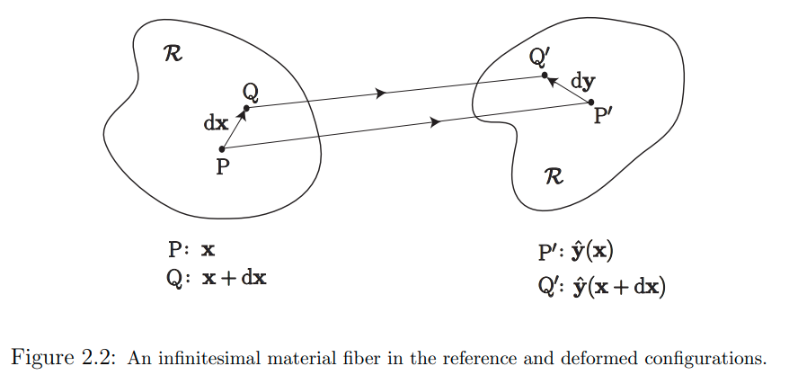
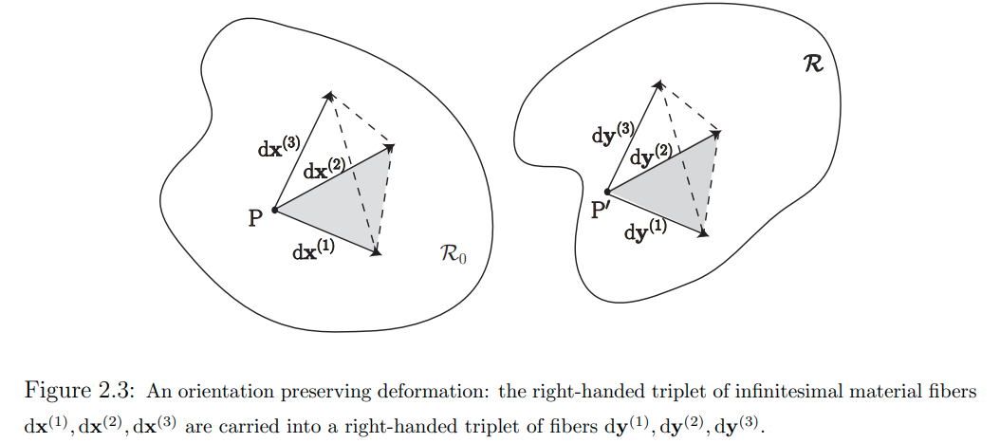
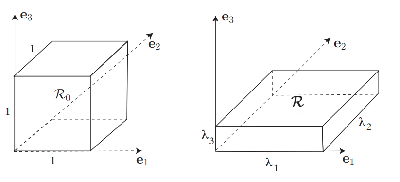
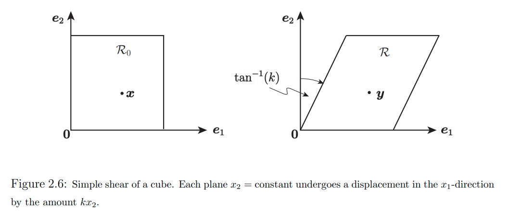
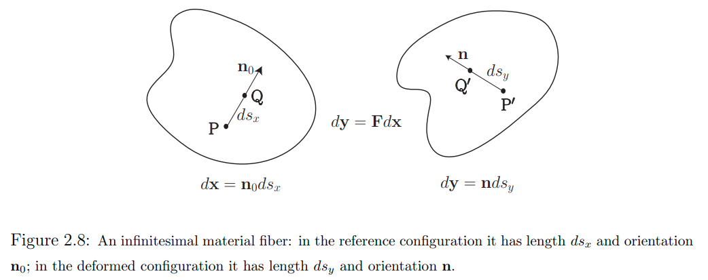
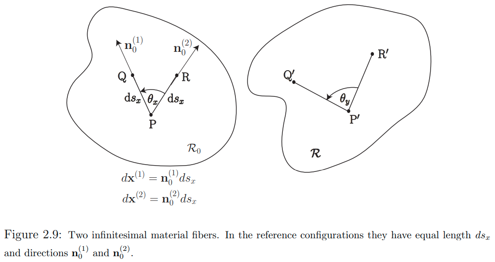
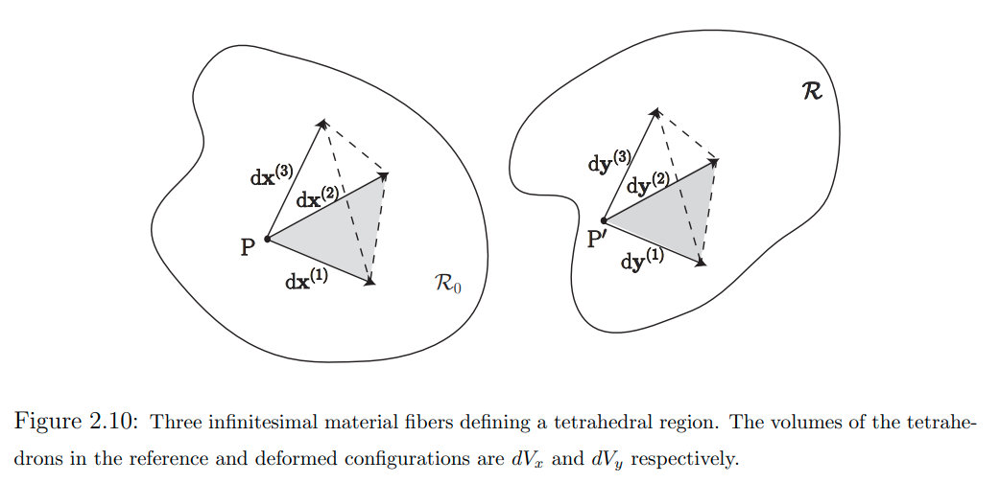
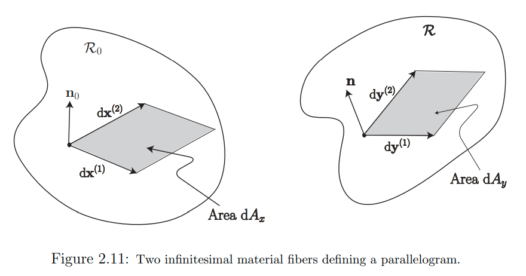

* TOC
{:toc}
# math for deformations

 - resource
    - MIT [Continuum Mechanics 课程笔记](http://web.mit.edu/abeyaratne/Volumes/RCA_Vol_II.pdf)，Chapter 2
       - 重要参考资料：非常详尽、非常严谨、非常简洁明了，与线代知识紧密接续

## basics

 - 两个向量的`dot product`点积
    -  $$\vec{a} \cdot \vec{b}$$
 - 两个向量的`vector product`向量积；叉乘
    - $$\vec{a} \times \vec{b}$$
 - 两个向量的`tensor product`张量积
    - $$\vec{a} \otimes \vec{b}=\vec{a} \vec{b}^{\top}$$
    - e.g. $$\underset{3 \times 1}{\vec{a}}  \otimes \underset{3 \times 1}{\vec{b}} = \underset{3 \times 1}{\vec{a}} \quad \underset{1 \times 3}{\vec{b}^{\top}} = \underset{3 \times 3}{C}$$
- 正交矩阵 -> 复数域推广 酉矩阵
- 实对称矩阵 -> 复数域推广 艾尔米特矩阵
- 矩阵的平方根
- 矩阵的极分解
- 矩阵的对数
    - 实对称矩阵的对数矩阵的表达：
        - $$\ln{\boldsymbol {\rm U}}=\overset{3}{\underset{i=1}{\sum}} \ln{\lambda_i} \left( \boldsymbol {\rm r}_i \otimes \boldsymbol {\rm r}_i \right)$$

## deformations

 - `deformation`：形变
    - 考虑一个物体（只需要是`continuum`，连续介质），其中一个`particle`粒子 $$x\in \mathcal{R}_0$$，属于`reference/undeformed configuration`参考物体空间 $$\mathcal{R}_0$$
    - 考虑物体变形以后，粒子$$\boldsymbol {\rm x}$$的新位置：$$\boldsymbol {\rm y} \in \mathcal{R}$$，属于`deformed configuration` 变形后的物体空间 $$\mathcal{R}$$
    - 从 reference configuration 到 deformed configuration的 `deformation` 形变定义为一个映射：
       - $$\boldsymbol {\rm y}=\hat{\boldsymbol {\rm y}}(\boldsymbol {\rm x})$$
       - takes $$\mathcal{R}_0 \rightarrow \mathcal{R}$$
    - `displacment vector field` $$\hat{u}(x)$$ 定义为
       - $$\hat{\boldsymbol {\rm u}}(\boldsymbol {\rm x})=\hat{\boldsymbol {\rm y}}(\boldsymbol {\rm x})-\boldsymbol {\rm x}$$
    - 

## `Deformation Gradient Tensor` 形变梯度张量: deformation in the neighborhood of a particle 在一个粒子邻域中的变形

 - `deformation gradient tensor` 形变梯度张量
    - 为了考虑物体在粒子x处的`state of stress`应力状态等，需要考虑不仅在x处的变形，还要考虑粒子$$\boldsymbol {\rm x}$$的一个`small neighborhood`小邻域中的`all particles`所有粒子的变形
    - 直觉上讲：我们期望在这个局部小邻域球中的粒子经历的变形由`rigid translation`刚体平动、`rigid rotation`刚体旋转 和 `"straining"` "应变"组成；在后面将会准确公式化表述
    - 在一个generic粒子x处的 `deformation gradient tensor`形变梯度张量定义为：
       - $$\boldsymbol{\rm F}(\boldsymbol {\rm x})={\rm Grad} \; \boldsymbol {\rm y}(\boldsymbol {\rm x})$$
       - 这是用于描述、研究在邻域中的变形的主要量
       - $$\boldsymbol{\rm F}(\boldsymbol {\rm x})$$是一个2-tensor，它的元素为：
          - $$F_{ij}(\boldsymbol {\rm x})=\frac{\partial y_i(\boldsymbol {\rm x})}{\partial x_j} $$
          - 是一个3x3矩阵场 $$[F(\boldsymbol {\rm x})]$$
 - 一个`infinitesimal material fiber`无穷小 *物质* 纤维的deformation
    - 考虑两个在reference configuration中放置于$$\boldsymbol {\rm x}$$和$$\boldsymbol {\rm x} + {\rm d}\boldsymbol {\rm x}$$处的两个粒子p, q；
    - 考虑包含这两个粒子的`infinitesimal material fiber`无穷小 *物质* 纤维：$${\rm d}\boldsymbol {\rm x}$$
    - 在deformed configuration中，这两个粒子位于$$\boldsymbol {\rm y}(\boldsymbol {\rm x})$$和$$\boldsymbol {\rm y}(\boldsymbol {\rm x} + {\rm d}\boldsymbol {\rm x})$$处
    - 则这个infinitesimal material fiber的deformed [`image` 像](https://en.wikipedia.org/wiki/Image_(mathematics))（代数中的概念）用如下 **<u>向量</u>** 描述
       - $${\rm d}\boldsymbol {\rm y}=\boldsymbol {\rm y}(\boldsymbol {\rm x} + {\rm d}\boldsymbol {\rm x})-\boldsymbol {\rm y}(\boldsymbol {\rm x})$$
    - 由于这两个粒子p,q是相邻的，距离$$\lVert {\rm d}\boldsymbol {\rm x} \rVert$$很近，因此可以用`Taylor expansion`泰勒展开来近似该表达式
       - $${\rm d}\boldsymbol {\rm y}=\left( {\rm Grad} \; \boldsymbol {\rm y} \right ) {\rm d}\boldsymbol {\rm x} + {\rm O}(\lVert {\rm d}\boldsymbol {\rm x} \rVert^2) = \boldsymbol {\rm F} \; {\rm d}\boldsymbol {\rm x} + {\rm O}(\lVert {\rm d}\boldsymbol {\rm x} \rVert^2)$$
       - 即近似为：
          - $${\rm d}\boldsymbol {\rm y}=\boldsymbol {\rm F}{\rm d}\boldsymbol {\rm x}$$
       - 其组分为：
          - $${\rm d}y_i=\underset{j}{\sum} F_{ij} {\rm d}x_j$$ or $$\{y\}=[F]\{x\}$$
       - 注意，这个近似并不需要假设梯度场的变化小；它只需要假设p和q挨得足够近
       - 即：$$\boldsymbol {\rm F}$$ 把 无穷小未变形物质纤维$${\rm d}\boldsymbol {\rm x}$$ `carries into`带到了它在变形configuration中的位置$${\rm d}\boldsymbol {\rm y}$$处
    - 
 - $$\boldsymbol {\rm F}$$应具有的一些假设
    - 行列式不为0
       - 考虑一个物理上可实现的变形：单个物质纤维不会裂变为两个物质纤维；两个不同的物质纤维不会合并为同一个物质纤维
       - 即，$${\rm d}\boldsymbol {\rm y}=\boldsymbol {\rm F}{\rm d}\boldsymbol {\rm x}$$需要是一个`one-to-one`一一映射，即$$\boldsymbol {\rm F}$$需要是 `non-sigular`非奇异矩阵：
          - $$J=\det \boldsymbol {\rm F} \neq 0$$
          - $$J$$也叫做 `Jacobian determinant` 雅克比行列式
    - 行列式为正值
       - 考虑三个独立物质纤维$${\rm d}\boldsymbol {\rm x}^{(i)}, i=1,2,3$$ 
       - 变形场 把这些纤维带到了3组位置：$${\rm d}\boldsymbol {\rm y}^{(i)}=\boldsymbol {\rm F} {\rm d}\boldsymbol {\rm x}^{(i)}, i=1,2,3$$
       - 如果这个变形把右手组合纤维$$\{ {\rm d}\boldsymbol {\rm x}^{(1)}, {\rm d}\boldsymbol {\rm x}^{(2)}, {\rm d}\boldsymbol {\rm x}^{(3)} \}$$带到了右手组合纤维$$\{ {\rm d}\boldsymbol {\rm y}^{(1)}, {\rm d}\boldsymbol {\rm y}^{(2)}, {\rm d}\boldsymbol {\rm y}^{(3)} \}$$，则称这个变形被称作是`preveserves orientation` `定向保留`的
          - 这里的[`orientation`](https://en.wikipedia.org/wiki/Orientation_(vector_space))是群论/向量空间中的概念：定向；其实反映的是一种类似`手性`的概念，orientation preserving即意味着手性得到保留；
          - 镜射变换，手性就不保留；
       - 一个变形是`orientation preserving`的，当且仅当行列式大于0：
          - $$J=\det \boldsymbol {\rm F} \gt 0$$
       - 
 - **变形的正式表述**
    - 如上，一个粒子$$\boldsymbol {\rm x}$$一般的邻域粒子$$\boldsymbol {\rm x} + {\rm d}\boldsymbol {\rm x}$$的变形正式表述为：
       - $$\boldsymbol {\rm y}(\boldsymbol {\rm x} + {\rm d}\boldsymbol {\rm x})=\boldsymbol {\rm y}(\boldsymbol {\rm x})+\boldsymbol {\rm F}{\rm d}\boldsymbol {\rm x}$$
       - 因此，想要描述粒子$$\boldsymbol {\rm x}$$的整个邻域的变形特征，就必须知道变形函数$$\boldsymbol {\rm y}(\boldsymbol {\rm x})$$和变形梯度张量$$\boldsymbol{\rm F}(\boldsymbol {\rm x})$$
          - 变形函数$$\boldsymbol {\rm y}(\boldsymbol {\rm x})$$刻画的是邻域粒子的平动
          - 变形梯度张量$$\boldsymbol{\rm F}(\boldsymbol {\rm x})$$刻画的是旋转和"应变"

## 特殊形变：一些均匀变形：纯拉伸，简单剪切变形

 - `homogeneous deformation` 均匀变形
   - 如果一个变形的变形梯度张量在整个ref区域$$\mathcal{R}_0$$都是常量，那么这个变形$$\boldsymbol {\rm y}(\boldsymbol {\rm x})$$就是一个`homogeneous deformation`
   - 因为变形梯度张量是一个常量，因此这种变形可以有如下表述：
     - $$\boldsymbol {\rm y}(\boldsymbol {\rm x})=\boldsymbol {\rm F} \boldsymbol {\rm x} + \boldsymbol {\rm b}$$
     - 其中，$$\boldsymbol {\rm F}$$是一个常张量，$$\boldsymbol {\rm b}$$是一个常向量
     - 这其实就是一个一般的仿射变换：平动，旋转，缩放，剪切

- 假设$$\{\boldsymbol {\rm e}_1, \boldsymbol {\rm e}_2, \boldsymbol {\rm e}_3\}$$ 是ref的`orthonormal basis` 标准正规基底；假设基底和一个单位cube的边对齐，从这个单位方出发进行变形

### `pure stretch` 纯拉伸

 - $$\boldsymbol {\rm y}=\boldsymbol {\rm F} \boldsymbol {\rm x} \qquad where \qquad \boldsymbol {\rm F}=\lambda_1 \boldsymbol {\rm e}_1 \otimes \boldsymbol {\rm e}_1 + \lambda_2 \boldsymbol {\rm e}_2 \otimes \boldsymbol {\rm e}_2 + \lambda_3 \boldsymbol {\rm e}_3 \otimes \boldsymbol {\rm e}_3$$
 - 在标准正规基底$$\{\boldsymbol {\rm e}_1, \boldsymbol {\rm e}_2, \boldsymbol {\rm e}_3\}$$下
    - $$\boldsymbol {\rm e}_1 \otimes \boldsymbol {\rm e}_1=\begin{pmatrix} 1 \\ 0 \\ 0 \end{pmatrix} \begin{pmatrix} 1 & 0 & 0 \end{pmatrix} =  \begin{pmatrix} 1 & 0 & 0 \\ 0 & 0 & 0 \\ 0 & 0 & 0 \end{pmatrix}$$
    - $$\boldsymbol {\rm F}=\begin{pmatrix} \lambda_1 & 0 & 0 \\ 0 & \lambda_2 & 0 \\ 0 & 0 & \lambda_3  \end{pmatrix}$$
    - $$\lambda_1, \lambda_2, \lambda_3$$代表在3个基底方向上的拉压比率
 - 如果$$\lambda_1 \lambda_2 \lambda_3 = 1$$，则是`isochoric`等容的变形

 - `pure dilatation` 纯膨胀
    - $$\lambda_1 = \lambda_2 = \lambda_3$$
 - `uniaxial stretch` 单轴拉伸
    - $$\lambda_2 = \lambda_3 =1$$
    - $$\boldsymbol {\rm F}=\lambda_1 \boldsymbol {\rm e}_1 \otimes \boldsymbol {\rm e}_1 + \boldsymbol {\rm e}_2 \otimes \boldsymbol {\rm e}_2 + \boldsymbol {\rm e}_3 \otimes \boldsymbol {\rm e}_3 = \boldsymbol{\rm I} + (\lambda_1-1) \boldsymbol {\rm e}_1 \otimes \boldsymbol {\rm e}_1$$
    - 在标准正规基底$$\{\boldsymbol {\rm e}_1, \boldsymbol {\rm e}_2, \boldsymbol {\rm e}_3\}$$下
       - $$\boldsymbol {\rm F}=\begin{pmatrix} \lambda_1 & 0 & 0 \\ 0 & 1 & 0 \\ 0 & 0 & 1  \end{pmatrix}$$
    - 更一般地：
       - $$\boldsymbol {\rm F}= \boldsymbol{\rm I} + (\lambda_1-1) \boldsymbol {\rm n} \otimes \boldsymbol {\rm n}, \qquad \lVert \boldsymbol {\rm n} \rVert=1$$

### `simple shearing deformation` 简单剪切变形

 - $$\boldsymbol {\rm y}=\boldsymbol {\rm F} \boldsymbol {\rm x} \qquad where \qquad \boldsymbol {\rm F}=\boldsymbol {\rm I} + k \;  \boldsymbol{\rm e}_1 \otimes \boldsymbol {\rm e}_2$$
 - 在标准正规基底$$\{\boldsymbol {\rm e}_1, \boldsymbol {\rm e}_2, \boldsymbol {\rm e}_3\}$$下
    - $$\boldsymbol{\rm e}_1 \otimes \boldsymbol {\rm e}_2=\begin{pmatrix} 1 \\ 0 \\ 0 \end{pmatrix} \begin{pmatrix} 0 & 1 & 0 \end{pmatrix} =  \begin{pmatrix} 0 & 1 & 0 \\ 0 & 0 & 0 \\ 0 & 0 & 0 \end{pmatrix}$$
    - $$\boldsymbol {\rm F}=\begin{pmatrix} 1 & k & 0 \\ 0 & 1 & 0 \\ 0 & 0 & 1  \end{pmatrix}$$
 - $$\boldsymbol {\rm u}(\boldsymbol {\rm x})=\boldsymbol {\rm y}(\boldsymbol {\rm x})-\boldsymbol {\rm x}=\boldsymbol {\rm F}\boldsymbol {\rm x}-\boldsymbol {\rm x}=k \;  \boldsymbol{\rm e}_1 \otimes \boldsymbol {\rm e}_2 \; \boldsymbol {\rm x}=kx_2\boldsymbol {\rm e}_1$$
    - 意味着$$x_2={\rm constant}$$平面朝着$$x_1$$-方向 刚体平动，平动量为$$kx_2$$
    - 把矩阵$$\boldsymbol {\rm F}$$中出现$$k$$的那个剪切量，行标的方向称为`shearing direction`剪切方向，列标的方向对应法向量的平面称为`shearing/glide plane`剪切平面
 - 更一般地：
    - $$\boldsymbol {\rm F}=\boldsymbol {\rm I} + k \;  \boldsymbol{\rm m} \otimes \boldsymbol {\rm n}, \qquad \lVert \boldsymbol {\rm m} \rVert=\lVert \boldsymbol {\rm n} \rVert = 1, \qquad \boldsymbol {\rm m} \cdot \boldsymbol {\rm n} = 0 $$
    - $$\boldsymbol {\rm m}$$为剪切方向，$$\boldsymbol {\rm n}$$法向量对应的平面为剪切平面

## 一般形变：研究长度、朝向、夹角、体积、表面的改变

### 一个物质纤维微元的改变：长度、朝向

 - 长度改变比例：$$\lVert \boldsymbol {\rm F} \boldsymbol {\rm n}_0 \rVert$$
 - 新朝向：$$\frac {\boldsymbol {\rm F} \boldsymbol {\rm n}_0}{\lVert \boldsymbol {\rm F} \boldsymbol {\rm n}_0 \rVert}$$

### 两个物质纤维微元的改变：夹角

 - 考虑由$$\boldsymbol {\rm n}_0^{(1)}$$，$$\boldsymbol {\rm n}_0^{(2)}$$定义的夹角
 - 新夹角大小：$$\cos{\theta_y}= \frac {\boldsymbol {\rm F}\boldsymbol {\rm n}_0^{(1)} \cdot \boldsymbol {\rm F}\boldsymbol {\rm n}_0^{(2)}} { \lVert \boldsymbol {\rm F}\boldsymbol {\rm n}_0^{(1)} \rVert  \lVert \boldsymbol {\rm F}\boldsymbol {\rm n}_0^{(2)} \rVert}$$

### 一块体积物质微元的改变：体积

 - 考虑由$${\rm d}\boldsymbol {\rm x}^{(1)}, {\rm d}\boldsymbol {\rm x}^{(2)}, {\rm d}\boldsymbol {\rm x}^{(3)}$$ 定义的`tetrahedron`四面体
 - 体积改变：$${\rm d}V_y=J {\rm d}V_x \qquad where \qquad J=\det\boldsymbol {\rm F}$$

### :pushpin: :warning: 一块表面物质微元的改变：面积，平面法向量

 - 考虑由$${\rm d}\boldsymbol {\rm x}^{(1)}, {\rm d}\boldsymbol {\rm x}^{(2)}$$ 定义的`parallelogram`平行四边形
 - 新法向量：$$\boldsymbol {\rm n}=\frac {\boldsymbol {\rm F}^{-\top} \boldsymbol {\rm n}_0 }  {\lVert  \boldsymbol {\rm F}^{-\top} \boldsymbol {\rm n}_0  \rVert}$$
 - 面积变化比例：$${\rm d}A_y={\rm d}A_x \, J \lVert \boldsymbol {\rm F}^{-\top} \boldsymbol {\rm n}_0 \rVert$$
 - 注意：平面法向量一般不继承变形操作
    - 变形后的平面的法向量$$\boldsymbol {\rm n}$$，**<u>一般不与</u>** 变形前平面法向量$$\boldsymbol {\rm n}_0$$变形后的向量$$\boldsymbol {\rm F} \boldsymbol {\rm n}_0$$ 平行
    - 变形前与平面垂直的法向量$$\boldsymbol {\rm n}_0$$，在变形后的向量$$\boldsymbol {\rm F} \boldsymbol {\rm n}_0$$ **<u>一般不与</u>** 变形后的平面垂直
    - [ ] Q: 有待数学证明
       -  若要使平面法向量 **<u>处处</u>** 继承变形操作，需要对任意$$\boldsymbol {\rm n}_0$$满足$$\boldsymbol {\rm F}^{-\top} \boldsymbol {\rm n}_0$$与$$\boldsymbol {\rm F} \boldsymbol {\rm n}_0$$方向一致；
       -  $$\boldsymbol {\rm F}^{\top}\boldsymbol {\rm F} \boldsymbol {\rm n}_0=\alpha \boldsymbol {\rm n}_0$$ 对于任意$$\boldsymbol {\rm n}_0$$均成立
       -  意味着$$\boldsymbol {\rm F}^{\top}\boldsymbol {\rm F}$$是正交矩阵？变形是homogeneous的，而且只包含旋转+等比缩放？

## 特殊形变：`rigid deformation`刚性形变

 - 刚性形变的定义
    - 物体中的所有对粒子在变形后保持变形前距离
    - i.e. 任意两个粒子$$\boldsymbol {\rm z}$$，$$\boldsymbol {\rm x}$$在变形前在ref configuration中距离为$$\lVert \boldsymbol {\rm z}-\boldsymbol {\rm x} \rVert$$，应与变形后在deformed configuration中距离$$\lVert \boldsymbol {\rm y}(\boldsymbol {\rm z})-\boldsymbol {\rm y}(\boldsymbol {\rm x}) \rVert$$相等
    - $$\lVert \boldsymbol {\rm y}(\boldsymbol {\rm z})-\boldsymbol {\rm y}(\boldsymbol {\rm x}) \rVert^2 = \underset{i}{\sum} \left[ y_i(\boldsymbol {\rm z}) - y_i(\boldsymbol {\rm x}) \right] \left[ y_i(\boldsymbol {\rm z}) - y_i(\boldsymbol {\rm x}) \right] = \underset{i}{\sum} (z_i-x_i)(z_i-x_i) \qquad {\rm for \; all \;} \boldsymbol {\rm x},\boldsymbol {\rm z} \in \mathcal{R}_0$$
    - 上式等价于 $$\boldsymbol {\rm F}^{\top}(\boldsymbol {\rm x}) \boldsymbol {\rm F}(\boldsymbol {\rm z})=\boldsymbol {\rm I} \qquad {\rm for \; all \;} \boldsymbol {\rm x},\boldsymbol {\rm z} \in \mathcal{R}_0$$
    - 上式等价于$$\boldsymbol {\rm F}(\boldsymbol {\rm x})$$是一个 **<u>常量张量</u>** ，且是一个 **<u>旋转矩阵</u>**（`proper orthogonal tensor`行列式为1的正交矩阵）

证明：点击展开

 - 首先两边对$$x_j$$求偏导
    - $$\underset{i}{\sum} -2 F_{ij}(\boldsymbol {\rm x})(y_i(\boldsymbol {\rm z}) - y_i(\boldsymbol {\rm x}))=-2(z_j-x_j)$$
 - 再两边对$$z_k$$求偏导：
    - $$-2 F_{ij}(\boldsymbol {\rm x})F_{ik}(\boldsymbol {\rm z})= -2\delta_{jk} =\begin{cases} -2 & \text{if $j = k$ } \\ 0 & \text{if $j \neq k$ }  \end{cases}$$
    - i.e. $$F_{ij}(\boldsymbol {\rm x})F_{ik}(\boldsymbol {\rm z})= \delta_{jk}$$
    - 即得： $$\boldsymbol {\rm F}^{\top}(\boldsymbol {\rm x}) \boldsymbol {\rm F}(\boldsymbol {\rm z})=\boldsymbol {\rm I} \qquad {\rm for \; all \;} \boldsymbol {\rm x},\boldsymbol {\rm z} \in \mathcal{R}_0$$
       - 可得出$$\boldsymbol {\rm F}(\boldsymbol {\rm x})$$处处行列式为1
       - 代入$$\boldsymbol {\rm z}=\boldsymbol {\rm x}$$可得$$\boldsymbol {\rm F}^{\top}(\boldsymbol {\rm x}) \boldsymbol {\rm F}(\boldsymbol {\rm x})=\boldsymbol {\rm I}\qquad {\rm for \; all \;} \boldsymbol {\rm x}\in \mathcal{R}_0$$，即$$\boldsymbol {\rm F}(\boldsymbol {\rm x})$$处处正交
       - 两边同乘$$\boldsymbol {\rm F}(\boldsymbol {\rm x})$$，可得$$\boldsymbol {\rm F}(\boldsymbol {\rm z})=\boldsymbol {\rm F}(\boldsymbol {\rm x})\qquad {\rm for \; all \;} \boldsymbol {\rm x},\boldsymbol {\rm z} \in \mathcal{R}_0$$，即$$\boldsymbol {\rm F}(\boldsymbol {\rm x})$$是一个常量张量

 - 结论：<u>刚性形变对应的形变梯度张量是一个常旋转矩阵</u>
    - 记对所有$$\boldsymbol {\rm x} \in \mathcal{R}_0$$ ，$$\boldsymbol {\rm F}(\boldsymbol {\rm x})=\boldsymbol {\rm Q}$$，$$\boldsymbol {\rm Q}$$是一个 **<u>旋转矩阵</u>**（`proper orthogonal tensor`行列式为1的正交矩阵）
    - 则刚性形变的形式为：
       - $$\boldsymbol {\rm y}(\boldsymbol {\rm x})=\boldsymbol {\rm Q} \boldsymbol {\rm x} + \boldsymbol {\rm b}$$

## :pushpin: ​一般形变：形变梯度张量 分解为 旋转矩阵 & stretch tensor

 - 先前结论：
    - 形变梯度张量$$\boldsymbol {\rm F}(\boldsymbol {\rm x})$$完备地描述了在粒子$$\boldsymbol {\rm x}$$一个邻域中的变形的特征；
    - 变形的一部分是刚体旋转，另一部分是一种"distortion"/"strain"
 - 对形变梯度张量进行[`polar decomposition`](https://en.wikipedia.org/wiki/Polar_decomposition) `极分解`
    - 定理：任何带有正值行列式的非奇异矩阵$$\boldsymbol {\rm F}$$可以被uniquely写作一个`proper orthogonal tensor`旋转矩阵$$\boldsymbol {\rm R}$$和一个`symmetric positive definite tensor`实对称正定矩阵$$\boldsymbol {\rm U}$$的矩阵相乘乘积
    - $$\boldsymbol {\rm F}=\boldsymbol {\rm R}\boldsymbol {\rm U}$$
    - $$\boldsymbol {\rm R}$$代表着$$\boldsymbol {\rm F}$$的刚体旋转的部分，$$\boldsymbol {\rm U}$$代表着$$\boldsymbol {\rm F}$$的非旋转的部分
    - $$\boldsymbol {\rm U}$$如此给出：$$\boldsymbol {\rm U}=\sqrt{ \boldsymbol {\rm F}^{\top}\boldsymbol {\rm F} }$$
    - $$\boldsymbol {\rm R}$$如此给出：$$\boldsymbol {\rm R}=\boldsymbol {\rm F}\boldsymbol {\rm U}^{-1}$$
    - 考虑一个`fiber`纤维的形变表达式为$${\rm d}\boldsymbol {\rm x} \rightarrow {\rm d}\boldsymbol {\rm y}=\boldsymbol {\rm F}{\rm d}\boldsymbol {\rm x}$$，也可以写作
       - $${\rm d}\boldsymbol {\rm y}=\boldsymbol {\rm R}(\boldsymbol {\rm U}{\rm d}\boldsymbol {\rm x})$$
       - 即这个纤维可以被看做 首先经过变形$$\boldsymbol {\rm U}{\rm d}\boldsymbol {\rm x}$$，再经过刚体旋转$$\boldsymbol {\rm R}$$
       - $${\rm d}\boldsymbol {\rm x} \rightarrow \boldsymbol {\rm U}{\rm d}\boldsymbol {\rm x} \rightarrow \boldsymbol {\rm R}(\boldsymbol {\rm U}{\rm d}\boldsymbol {\rm x})={\rm d}\boldsymbol {\rm y}$$
 - `right stretch tensor`右拉伸张量 $$\boldsymbol {\rm U}$$ 的性质
    - `symmetric`对称
       - 有3个实数特征值$$\lambda_1, \lambda_2, \lambda_3$$；
       - 有和3个特征值相对应的三元组`orthonormal`正规特征向量$$\boldsymbol {\rm r}_1, \boldsymbol {\rm r}_2, \boldsymbol {\rm r}_3$$ 
    - `positive definite` 正定
       - 3个特征值均为正数
    - 在基底/主方向$$\{ \boldsymbol {\rm r}_1, \boldsymbol {\rm r}_2, \boldsymbol {\rm r}_3 \}$$ 下的表示
       - $$[\boldsymbol {\rm U}]=\begin{pmatrix} \lambda_1 & 0 & 0 \\ 0 & \lambda_2 & 0 \\ 0 & 0 & \lambda_3 \end{pmatrix}, \qquad \lambda_i \gt 0$$
       - 因此对于 $${\rm d}\boldsymbol {\rm x} \rightarrow \boldsymbol {\rm U}{\rm d}\boldsymbol {\rm x}$$，意味着纤维$${\rm d}\boldsymbol {\rm x}$$ 被tensor $$\boldsymbol {\rm U}$$ 在  **$$\boldsymbol {\rm U}$$ 的`principle directions`** 被拉伸，拉伸的量取决于每个方向的`corresponding eigenvalues`相应的特征值
       - 注意：只有在$$\boldsymbol {\rm U}$$的主方向表示$$\boldsymbol {\rm U}$$才是纯拉伸；在一般情况下表示$$\boldsymbol {\rm U}$$，既包含拉伸又包含剪切；不过拉伸的量仍然是由特征值定义；具体见 [strains 应变](#strains 应变) 章节
    - 因为$${\rm d}\boldsymbol {\rm x}$$方向一般不与 $${\rm U}{\rm d}\boldsymbol {\rm x}$$ 平行，因此纤维在进行$${\rm d}\boldsymbol {\rm x} \rightarrow \boldsymbol {\rm U}{\rm d}\boldsymbol {\rm x}$$也带有旋转；但这种旋转不是一种刚体旋转，因为纤维的长度也发生了变化
 - `left stretch tensor`左拉伸张量$$\boldsymbol {\rm V}$$
    - 极分解有一种alternative version：
       - $$\boldsymbol {\rm F}=\boldsymbol {\rm V}\boldsymbol {\rm R}$$
       - $$\boldsymbol {\rm V}$$如此给出：$$\boldsymbol {\rm V}=\sqrt{ \boldsymbol {\rm F}\boldsymbol {\rm F}^{\top} }$$
       - $$\boldsymbol {\rm R}$$如此给出：$$\boldsymbol {\rm R}=\boldsymbol {\rm V}^{-1}\boldsymbol {\rm F}$$
       - $$\boldsymbol {\rm R}$$与$$\boldsymbol {\rm F}=\boldsymbol {\rm R}\boldsymbol {\rm U}$$中的$$\boldsymbol {\rm R}$$ `identical` 完全一样
          - $$\boldsymbol {\rm R}=\boldsymbol {\rm V}^{-1}\boldsymbol {\rm F}=\boldsymbol {\rm F}\boldsymbol {\rm U}^{-1}$$，故有$$\boldsymbol {\rm V}=\boldsymbol {\rm F}\boldsymbol {\rm U}\boldsymbol {\rm F}^{-1}$$
    - 一个一般未变形纤维$${\rm d}\boldsymbol {\rm x}$$的形变也可以看做
       - $${\rm d}\boldsymbol {\rm y}=\boldsymbol {\rm V}(\boldsymbol {\rm R}{\rm d}\boldsymbol {\rm x})$$
       - 首先经过刚体旋转$$\boldsymbol {\rm R}$$，再经过$$\boldsymbol {\rm V}$$的stretching
    - $$\boldsymbol {\rm V}$$与$$\boldsymbol {\rm U}$$性质相似：
       - 有3个正实数特征值$$\lambda_1, \lambda_2, \lambda_3$$及对应的特征向量 $$\boldsymbol {l}_1, \boldsymbol {l}_2, \boldsymbol {l}_3$$，组成主基底$$\{\boldsymbol {l}_1, \boldsymbol {l}_2, \boldsymbol {l}_3 \}$$
 - $$\boldsymbol {\rm U}$$、$$\boldsymbol {\rm V}$$、$$\boldsymbol {\rm F}$$、$$\boldsymbol {\rm R}$$的联系
    - $$\boldsymbol {\rm U}$$和$$\boldsymbol {\rm V}$$的三个特征值$$\lambda_1, \lambda_2, \lambda_3$$一模一样；又被称作`principle stretches` 主拉伸，意味着在$$\boldsymbol {\rm x}$$处的变形
    - $$\boldsymbol {\rm U}$$的特征向量与$$\boldsymbol {\rm V}$$的特征向量的联系：$$\boldsymbol {l}_i=\boldsymbol {\rm R}\boldsymbol {\rm r}_i, i=1,2,3$$
    - $$\boldsymbol {\rm U}$$和$$\boldsymbol {\rm V}$$用其特征向量表示：
       - $$\boldsymbol {\rm U}=\overset{3}{\underset{i=1}{\sum}} \lambda_i \boldsymbol {\rm r}_i \otimes \boldsymbol {\rm r}_i \qquad \boldsymbol {\rm V}=\overset{3}{\underset{i=1}{\sum}} \lambda_i \boldsymbol {l}_i \otimes \boldsymbol {l}_i$$
    - $$\boldsymbol {\rm F}$$、$$\boldsymbol {\rm R}$$也可以用$$\boldsymbol {\rm U}$$和$$\boldsymbol {\rm V}$$的特征向量表示
       - $$\boldsymbol {\rm F}=\overset{3}{\underset{i=1}{\sum}} \lambda_i \boldsymbol {l}_i \otimes \boldsymbol {\rm r}_i \qquad \boldsymbol {\rm R}=\overset{3}{\underset{i=1}{\sum}} \lambda_i \boldsymbol {l}_i \otimes \boldsymbol {\rm r}_i$$
 - $$\boldsymbol {\rm F}=\boldsymbol {\rm R}\boldsymbol {\rm U}$$ 代入 [章节 一般形变：研究长度、朝向、夹角、体积、表面的改变](#一般形变：研究长度、朝向、夹角、体积、表面的改变) 中的每一项，我们可以得到：
    - 只依赖于stretch tensor $$\boldsymbol {\rm U}$$：
       - 纤维长度改变 $${\rm d}s_y={\rm d}s_x \sqrt{ \boldsymbol {\rm U}^2\boldsymbol {\rm n}_0 \cdot \boldsymbol {\rm n}_0 }$$
       - 夹角改变 $$\cos{\theta_y}=\frac  {\boldsymbol {\rm U}^2\boldsymbol {\rm n}_0^{(1)} \cdot \boldsymbol{\rm n}_0^{(2)}}  {\sqrt{\boldsymbol {\rm U}^2\boldsymbol {\rm n}_0^{(1)} \cdot \boldsymbol{\rm n}_0^{(1)}}  \sqrt{\boldsymbol {\rm U}^2\boldsymbol {\rm n}_0^{(2)} \cdot \boldsymbol{\rm n}_0^{(2)}}}$$
       - 体积改变 $${\rm d}V_y={\rm d}V_x \det{\boldsymbol {\rm U}}$$
       - 表面面积改变 $${\rm d}A_y={\rm d}A_x (\det{\boldsymbol {\rm U}}) \lVert \boldsymbol {\rm U}^{-1} \boldsymbol {\rm n}_0 \rVert$$
    - 同时依赖于stretch tensor $$\boldsymbol {\rm U}$$ 和旋转矩阵$$\boldsymbol {\rm R}$$
       - 纤维朝向改变：$$\boldsymbol {\rm n}=\boldsymbol {\rm R} \frac {\boldsymbol {\rm U}\boldsymbol {\rm n}_0} {\lVert \boldsymbol {\rm U}\boldsymbol {\rm n}_0 \rVert}$$
       - 表面法向量改变：$$\boldsymbol {\rm n}=\boldsymbol {\rm R} \frac {\boldsymbol {\rm U}^{-1}\boldsymbol {\rm n}_0} {\lVert \boldsymbol {\rm U}^{-1}\boldsymbol {\rm n}_0 \rVert}$$
 - 逆变形：`left stretch tensor` 左拉伸张量 $$\boldsymbol {\rm V}$$ 可以帮助我们计算从deformed configuration到ref configuration的变形
    - 从 $${\rm d}\boldsymbol {\rm y}=\boldsymbol {\rm V}(\boldsymbol {\rm R}{\rm d}\boldsymbol {\rm x})$$ 推出 $${\rm d}\boldsymbol {\rm x}=\boldsymbol {\rm R}^{-1}(\boldsymbol {\rm V}^{-1}{\rm d}\boldsymbol {\rm y})$$
    - 把$$\boldsymbol {\rm R}^{-1}$$看做"$$\boldsymbol {\rm R}$$"，把$$\boldsymbol {\rm V}^{-1}$$看做"$$\boldsymbol {\rm U}$$"，之前的结论都可以顺带推出
    - 可以这样思考：
       - `right stretch tensor`$$\boldsymbol {\rm U}$$ 是从reference 到 deformed ，可以看做为`Lagrangian stretch tensor` 拉格朗日拉伸张量
       - `left stretch tensor`$$\boldsymbol {\rm V}$$ 是从deformed  到 reference ，可以看做为`Eulerian stretch tensor` 欧拉拉伸张量
 - `Cauchy-Green deformation tensor`柯西-格林变形张量
    - 由于$$\boldsymbol {\rm U}=\sqrt{ \boldsymbol {\rm F}^{\top}\boldsymbol {\rm F} }$$和$$\boldsymbol {\rm V}=\sqrt{ \boldsymbol {\rm F}\boldsymbol {\rm F}^{\top} }$$的计算非常`tedious`繁琐； 由于$$\boldsymbol {\rm U}$$和$$\boldsymbol {\rm U}^2$$之间是一一映射； 可以利用$$\boldsymbol {\rm U}^2$$和$$\boldsymbol {\rm V}^2$$作为stretch 的一种`measure`评估
    - $$\boldsymbol {\rm C}=\boldsymbol {\rm F}^{\top}\boldsymbol {\rm F}=\boldsymbol {\rm U}^2 \qquad \boldsymbol {\rm B}=\boldsymbol {\rm F}\boldsymbol {\rm F}^{\top}=\boldsymbol {\rm V}^2$$
       - 分别为右柯西格林形变张量、左柯西科林形变张量
       - $$\boldsymbol {\rm C}=\overset{3}{\underset{i=1}{\sum}} \lambda_i^2 \left( \boldsymbol {\rm r}_i \otimes \boldsymbol {\rm r}_i \right) \qquad \boldsymbol {\rm B}=\overset{3}{\underset{i=1}{\sum}} \lambda_i^2 \left( \boldsymbol {l}_i \otimes \boldsymbol {l}_i \right)$$

## strains 应变
 - `strains`应变与`deformation`形变的联系
    - $$\boldsymbol {\rm U}$$和$$\boldsymbol {\rm V}$$刻画了变形中的non-rigid part 非刚体变形的部分；
    - 考虑：如果`deformed configuration` coincide with `reference configuration` （即二者相同）
       - 那么变形表达为$$\boldsymbol {\rm y}(\boldsymbol {\rm x}) \equiv \boldsymbol {\rm x}$$
       - 那么$$\boldsymbol {\rm F}=\boldsymbol {\rm I}, \quad \boldsymbol {\rm U}=\boldsymbol {\rm V}=\boldsymbol {\rm I}$$
    - 考虑：应变 一般/习惯上 在 reference configuration中`vanish`消失（i.e. 在未变形空间中，应变一般为零）
    - 上述即为stretch和strain的唯一有必要的区别；
    - 因此，我们在 **<u>选择应变的评估方法</u>** 时，基于这个原则即可
       - 比如$$\boldsymbol {\rm U}-\boldsymbol {\rm I}$$就是一种合适的 **<u>应变评估方法</u>** ；它在ref configuration中为零矩阵
 - 几种不同的`Lagrangian strain`拉格朗日应变评估张量
    - `Green strain` 格林应变：$$\frac {1}{2}(\boldsymbol {\rm U}^2-\boldsymbol {\rm I})$$ `generalized Green strain` 广义格林应变：$$\frac {1}{m}(\boldsymbol {\rm U}^m-\boldsymbol {\rm I})$$ `Hencky strain / logarithmic strain` 对数应变：$$\ln{\boldsymbol {\rm U}}$$
    - 这些应变评估张量都是右拉伸$$\boldsymbol {\rm U}$$的一一映射；所以都是`equivalent`等价的
    - 这些应变评估张量的的`principle directions`主方向都和$$\boldsymbol {\rm U}$$的一样，即$$\{ \boldsymbol {\rm r}_1, \boldsymbol {\rm r}_2, \boldsymbol {\rm r}_3 \}$$ 
    - 这些应变评估张量对应的`principle strain` 主应变为： $$\frac {1}{2}(\lambda_i^2-1)$$ $$\frac {1}{m}(\lambda_i^m-1)$$ $$\ln{\lambda_i}$$
    - 注意：几种应变评估张量在选择的时候，并没有统一的偏好；往往对于特定材质、特定应变种类才有对某种应变评估张量的偏好
    - 几种不同的`Eularian strain`欧拉应变评估张量：与`Lagrangian strain`相似
       - `Almansi strain` 阿尔曼西应变：$$\frac {1}{2}(\boldsymbol {\rm I}-\boldsymbol {\rm V}^{-2})$$ `generalized Almansi strain` 广义阿尔曼西应变：$$\frac {1}{m}(\boldsymbol {\rm I}-\boldsymbol {\rm V}^{-m})$$ `logarithmic strain` 对数应变：$$\ln{\boldsymbol {\rm V}}$$
       - 这些应变评估张量的`principle directions`主方向都和$$\boldsymbol {\rm V}$$的一样，即$$\boldsymbol {l}_1, \boldsymbol {l}_2, \boldsymbol {l}_3$$
 - 更广义、一般化的的`Lagrangian strain tensor`拉格朗日应变张量$$\boldsymbol {\rm E}(\boldsymbol {\rm U})$$
    - 让$$e(\cdot)$$为一个/任意的在$$(0,\infty)$$定义的标量值函数，它满足以下条件：
       - $$\begin{array}{l} \text{(a)} & e(1)=0 \\ \text{(b)} & e'(1)=1 \\ \text{(c)} & e'(\lambda) \gt 0 & \text{for all $\lambda \gt 0$} \end{array}$$
          - (a) 用来保证如果deformed 和reference coincide，`vanish` (i.e. $$\boldsymbol {\rm E}=\boldsymbol {\rm O}$$ )
          - (b) 用来使$$\boldsymbol {\rm E}(\boldsymbol {\rm U})$$适用于经典的`infinitesimal strain tensor` 无穷小应变张量的理论 见章节 [liearization 线性化近似 （无穷小形变张量）](#linearization 线性化近似 （无穷小形变张量）)
          - (c) 用来保证主应变 $$e(\lambda_i)$$ 随相应的主拉伸 $$\lambda_i$$单调递增
    - 则可以用特征向量$$\boldsymbol {\rm r}_i$$和对应的特征值$$e(\lambda_i)$$来构造拉格朗日应变张量：
       - $$\boldsymbol {\rm E}=\overset{3}{\underset{i=1}{\sum}} e(\lambda_i) \left( \boldsymbol {\rm r}_i \otimes \boldsymbol {\rm r}_i \right)$$
 - **应变张量的物理意义**
    - 物理意义：
       - `diagonal components` / `normal components` of 应变 $$\boldsymbol {\rm E}$$： 对角线上的元素$$E_{11}, E_{22}, E_{33}$$描述的是正应变（应变的正分量）
       -  `off-diagonal components` / `shear components` of 应变$$\boldsymbol {\rm E}$$： 非对角线上的元素$$E_{12}, E_{23}, E_{31}$$描述的是切应变（应变的剪切分量）
    - 由于$$\boldsymbol {\rm E}$$ 是对称矩阵，它有`principle basis` 主基底，事实上就是$$\boldsymbol {\rm U}$$的主基底$$\{ \boldsymbol {\rm r}_1, \boldsymbol {\rm r}_2, \boldsymbol {\rm r}_3 \}$$ 
       - 在主基底下，矩阵变为对角矩阵，即`shear components`剪切应变`vanish`消失（i.e.为零），`normal components`即为`principle strains`
    - 以格林应变张量举例说明：
       - $$\boldsymbol {\rm E}=\frac {1}{2}\left(\boldsymbol {\rm U}^2-\boldsymbol {\rm I}\right)=\frac {1}{2} \left( \boldsymbol {\rm F}^{\top}\boldsymbol {\rm F} - \boldsymbol {\rm I} \right)=\frac {1}{2} \left(  {\rm Grad}\,\boldsymbol{\rm u} + ({\rm Grad}\,\boldsymbol{\rm u})^{\top} + ({\rm Grad}\,\boldsymbol{\rm u})^{\top}{\rm Grad}\,\boldsymbol{\rm u}  \right)$$
          - 其中，$$\boldsymbol {\rm u}$$是`displacement vector`
          - $$\boldsymbol {\rm E}$$的组分为：$$E_{ij}=\frac {1}{2} \left( \frac{\partial u_i}{\partial x_j} + \frac{\partial u_j}{\partial x_i} + \frac{\partial u_k}{\partial x_j} \frac{\partial u_k}{\partial x_j} \right)$$
       - 纤维长度改变量代入得：$${\rm d}s_y={\rm d}s_x \sqrt{1 + 2 \boldsymbol {\rm E}\boldsymbol {\rm n}_0 \cdot \boldsymbol {\rm n}_0 }$$
          - 即 $$\frac{ {\rm d}s_y-{\rm d}s_x}{ {\rm d}s_x}  =\sqrt{1 + 2 \boldsymbol {\rm E}\boldsymbol {\rm n}_0 \cdot \boldsymbol {\rm n}_0 } - 1$$
          - 上式刻画了对于 *任意* 纤维方向$$\boldsymbol {\rm n}_0$$ 的长度相对改变量
          - 假设特例：$$\boldsymbol {\rm n}_0=\boldsymbol {\rm e}_1$$
             - 则有$$\frac{ {\rm d}s_y-{\rm d}s_x}{ {\rm d}s_x}  =\sqrt{1 + 2 E_{11} } - 1$$
             - 可见对于一般情况，应变的`normal components` $$E_{11}, E_{22}, E_{33}$$ 描述的是坐标方向$$x_1, x_2, x_3$$的长度变化
       - 夹角改变代入得：$$\cos{\theta_y}=\frac  {(1 + 2 \boldsymbol {\rm E}\boldsymbol) \boldsymbol {\rm n}_0^{(1)} \cdot \boldsymbol{\rm n}_0^{(2)}}  {\sqrt{(1 + 2 \boldsymbol {\rm E})\boldsymbol {\rm n}_0^{(1)} \cdot \boldsymbol{\rm n}_0^{(1)}}  \sqrt{(1 + 2 \boldsymbol {\rm E})\boldsymbol {\rm n}_0^{(2)} \cdot \boldsymbol{\rm n}_0^{(2)}}}$$
          - 假设特例：$$\boldsymbol {\rm n}_0^{(1)}=\boldsymbol {\rm e}_1, \quad \boldsymbol {\rm n}_0^{(2)}=\boldsymbol {\rm e}_2$$
             - 则有$$\cos{\theta_y}=\frac  {2 E_{12}}  {\sqrt{1+2E_{11}}  \sqrt{1+2E_{22}}}$$
             - 角度改变，取决于切应变$$E_{12}$$和正应变$$E_{11}, E_{22}$$

## linearization 线性化近似 （无穷小形变张量）

 - `displacement gradient tensor` 位移梯度张量
    -  `displacement vector` 位移向量定义为：
       - $$\boldsymbol {\rm u}(\boldsymbol {\rm x})=\boldsymbol {\rm y}(\boldsymbol {\rm x})-\boldsymbol {\rm x}$$
    - 位移梯度张量定义为：
       - $$\boldsymbol {\rm H}(\boldsymbol {\rm x})={\rm Grad}\,\boldsymbol{\rm u}(\boldsymbol {\rm x})$$
       - 组分为：$$H_{ij}(\boldsymbol {\rm x})=\frac{\partial u_i}{\partial x_j}$$
       - $$\boldsymbol {\rm H}=\boldsymbol {\rm F}-\boldsymbol {\rm I}$$
 - 在"$$\boldsymbol {\rm H}$$ 很小"的特例情况下，$$\boldsymbol {\rm U}, \boldsymbol {\rm V}, \boldsymbol {\rm R}, \boldsymbol {\rm E}$$ 用 $$\boldsymbol {\rm H}$$ 进行`线性化`近似表述
    - 前面的$$\boldsymbol {\rm U}, \boldsymbol {\rm V}, \boldsymbol {\rm R}, \boldsymbol {\rm E}$$ 都是用$$\boldsymbol {\rm F}$$ 表示
    - 这里假定"$$\boldsymbol {\rm H}$$ 很小"意味着$$\lVert \boldsymbol {\rm H} \rVert$$很小
    - set $$\lVert \boldsymbol {\rm H} \rVert = \epsilon$$，当$$\epsilon \rightarrow 0$$时
       - $$\begin{array}  \boldsymbol {\rm U}^2 = \boldsymbol {\rm F}^{\top}\boldsymbol {\rm F}=\boldsymbol {\rm I}+\boldsymbol {\rm H}+ \boldsymbol {\rm H}^{\top} + O(\epsilon^2) \\  \boldsymbol {\rm V}^2= \boldsymbol {\rm F}\boldsymbol {\rm F}^{\top}= \boldsymbol {\rm I}+\boldsymbol {\rm H}+ \boldsymbol {\rm H}^{\top} + O(\epsilon^2) \\ \boldsymbol {\rm U}=\sqrt{\boldsymbol {\rm U}^2}=\boldsymbol {\rm I}+ \frac{1}{2} \left(  \boldsymbol {\rm H}+ \boldsymbol {\rm H}^{\top} \right) + O(\epsilon^2) \\ \boldsymbol {\rm V}=\sqrt{\boldsymbol {\rm V}^2}=\boldsymbol {\rm I}+ \frac{1}{2} \left(  \boldsymbol {\rm H}+ \boldsymbol {\rm H}^{\top} \right) + O(\epsilon^2) \\ \boldsymbol {\rm R}=\boldsymbol {\rm F}\boldsymbol {\rm U}^{-1}=\boldsymbol {\rm I}+ \frac{1}{2} \left(  \boldsymbol {\rm H}- \boldsymbol {\rm H}^{\top} \right) + O(\epsilon^2) \end{array}$$
       - $$\boldsymbol {\rm E}(\boldsymbol {\rm U})=\overset{3}{\underset{i=1}{\sum}} e(\lambda_i) \left( \boldsymbol {\rm r}_i \otimes \boldsymbol {\rm r}_i \right)=\overset{3}{\underset{i=1}{\sum}} (\lambda_i-1) \left( \boldsymbol {\rm r}_i \otimes \boldsymbol {\rm r}_i \right) + O(\epsilon^2)$$
          - $$e(\lambda_i)$$近似为$$(\lambda_i-1)$$
    - 如果定义两个2-tensor：
       - `infinitesimal strain tensor` 无穷小应变张量
          -  $$\boldsymbol{\varepsilon} \overset{\rm def}{=} \frac{1}{2} \left(  \boldsymbol {\rm H}+ \boldsymbol {\rm H}^{\top} \right) $$
          - 如果$$\varepsilon_i$$为其特征值，则有$$\lambda_i=1+\varepsilon_i+O(\epsilon^2)$$
       - `infinitesimal rotation tensor` 无穷小旋转张量 
          -  $$\boldsymbol{\omega}\overset{\rm def}{=} \frac{1}{2} \left(  \boldsymbol {\rm H}- \boldsymbol {\rm H}^{\top} \right)$$
       - 组分为$$\varepsilon_{ij}=\frac {1}{2} \left( \frac{\partial u_i}{\partial x_j} + \frac{\partial u_j}{\partial x_i} \right) \qquad \omega_{ij}=\frac {1}{2} \left( \frac{\partial u_i}{\partial x_j} - \frac{\partial u_j}{\partial x_i} \right)$$
       - 则有：
          - $$\boldsymbol {\rm H}=\boldsymbol{\varepsilon}+\boldsymbol{\omega}$$
          - $$\boldsymbol {\rm U}=\boldsymbol {\rm I}+\boldsymbol{\varepsilon}+O(\epsilon^2)$$
          - $$\boldsymbol {\rm V}=\boldsymbol {\rm I}+\boldsymbol{\varepsilon}+O(\epsilon^2)$$
          - $$\boldsymbol {\rm R}=\boldsymbol {\rm I}+\boldsymbol{\omega}+O(\epsilon^2)$$
       - $${\rm d}\boldsymbol {\rm y}=(\boldsymbol {\rm H}+\boldsymbol {\rm I}){\rm d}\boldsymbol {\rm x}={\rm d}\boldsymbol {\rm x}+\boldsymbol{\varepsilon}{\rm d}\boldsymbol {\rm x}+\boldsymbol{\omega}{\rm d}\boldsymbol {\rm x}$$
          - 对比$${\rm d}\boldsymbol {\rm y}=\boldsymbol {\rm R}(\boldsymbol {\rm U}{\rm d}\boldsymbol {\rm x})$$，可以看到无穷小形变的线性近似下，局部变形被`additively decomposed`加和分解为应变和旋转；而$${\rm d}\boldsymbol {\rm y}=\boldsymbol {\rm R}(\boldsymbol {\rm U}{\rm d}\boldsymbol {\rm x})$$是乘积分解为应变和旋转
 - "$$\boldsymbol {\rm H}(\boldsymbol {\rm x})={\rm Grad}\,\boldsymbol{\rm u}(\boldsymbol {\rm x})$$很小"可以进行线性近似，假设其他量很小也可以进行线性近似
    - e.g. 卷一张纸时：旋转量$$\boldsymbol {\rm R}$$很大，应变量$$\boldsymbol {\rm U}-\boldsymbol {\rm I}$$很小；此时可以假定$$\boldsymbol {\rm U}-\boldsymbol {\rm I}$$是一个很小量进行线性近似，而$$\boldsymbol {\rm R}$$则还是任意的

