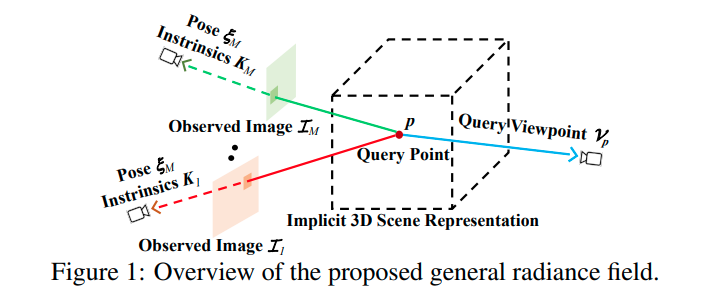
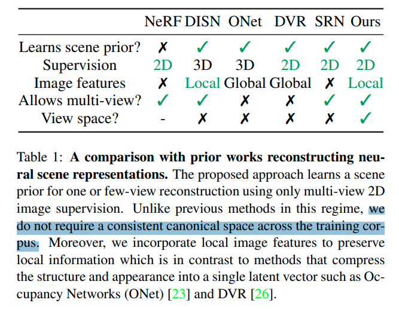
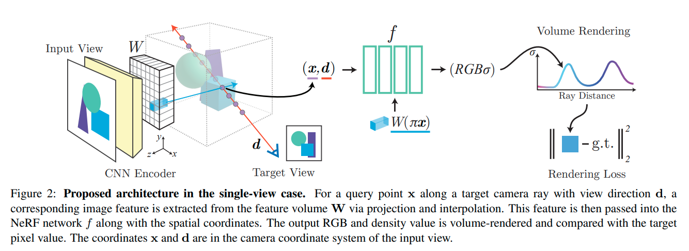
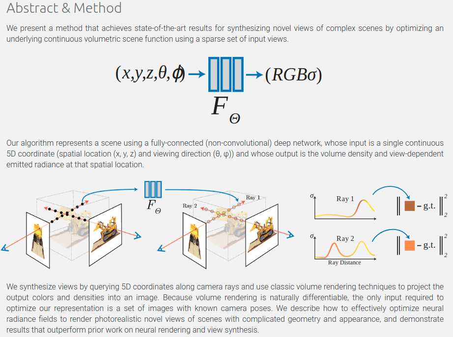
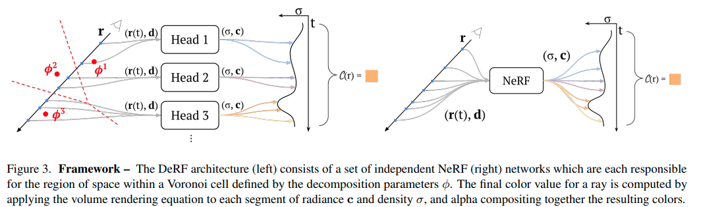
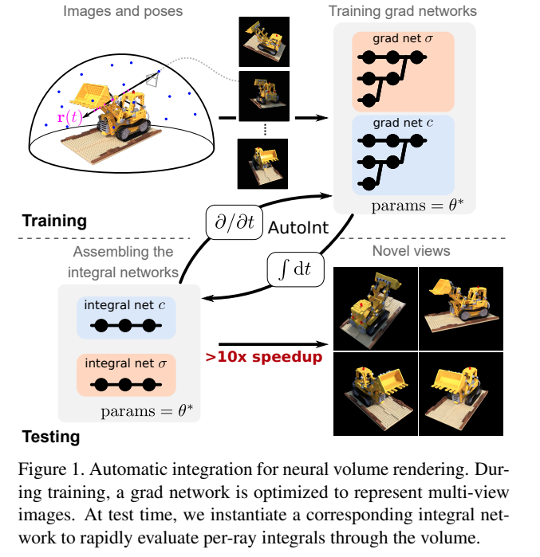
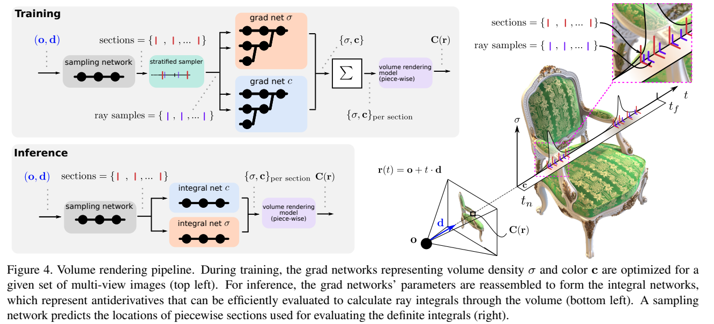
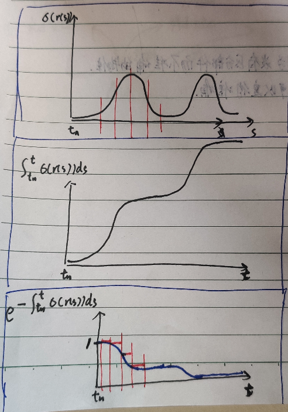

[[_TOC_]] 

## 关键词：NeRF引用中 带 encoder

---

**`"GRF: LEARNING A GENERAL RADIANCE FIELD FOR 3D SCENE REPRESENTATION AND RENDERING"`**  
**[** `ICLR2021` **]** **[[paper]](https://arxiv.org/pdf/2010.04595.pdf)** **[[code]](https://github.com/alextrevithick/GRF)** **[** :mortar_board: `Oxford` **]** **[** :office: `company` **]**  
**[**  `Alex Trevithick`, `Bo Yang`  **]**  
**[** _`encoder-decoder`_ **]**  

  
Click to expand

- **Motivation**
  - NeRF + encoder-decoder结构
  - 用一个**<u>single forward pass</u>** infer出novel scene representations
    - encoder输入：2D images + camera poses + intrinsics
    - encoder输出：neural radiance fieilds
- 主要做法
  - 为每一个light ray (pixel) 提取general features
  - 把features重投影到query 3D point p上
  - 然后从p的feature infer出RGB和volume density
  - **关键在于**：对于任意同一个点，从不同的角度看来的feature是始终一样的，因此不同view的这个点渲染出的RGB和volume density也会保持一致
- 构成：四个部件，连接起来，端到端的训练
  - 对每一个2D pixel的feature extractor
  - 一个reprojector，从2D feature到3D空间
    - 做了一个简单的假设：<u>一个像素的feature，是对这个ray上的每一个点的描述</u>
    - 所以就是把一个query 3D point重投影到每一个输入view上，来从每一个输入view对应点的2D feature得到这个3D point的feature
    - 如果重投影的点落在图像内，那就选最近邻的像素的feature
    - 如果在图像外，就给一个零向量
  - 一个aggregator，得到一个3D点的general features
    - 这里的挑战性在于：Input images的长度是可变的，并且没有顺序；因此，通过reprojector获取到的2D features也是没有顺序、任意尺寸的
    - 因此把这里定义为一个注意力聚集过程
  - 一个neural renderer，来infer出那个点的外观和几何

---

**`"pixelNeRF: Neural Radiance Fields from One or Few Images"`**  
**[** `XXXX2021` **]** **[[paper]](https://arxiv.org/pdf/2012.02190.pdf)** **[[web]](https://alexyu.net/pixelnerf/)** **[** :mortar_board: `UCB` **]**  
**[**  `Alex Yu`,`Vickie Ye`, `Matthew Tancik`, `Angjoo Kanazawa`  **]**  
**[** _`scene prior/category`, `CNN encoder`_ **]**  

  
Click to expand

- **评价**
  - 和GRF思路类似；每个点除了空间坐标以外，还额外condition一个feature，这个feature来自于把这个点重投影到input view之后索引出的input view feature space下的feature
  - 作者评价的与GRF的区别
    - 本篇在view下操作，而不像GRF那样在canonical space下操作，因此本文方法可以适用于更一般的设定；
    - 本文方法的效果更好（笔者注：从web 视频来看，在少量view输入合成任务下的效果非常好）

- **Motivation**
  - image-conditioned NeRF
    - >  To overcome the NeRF representation’s inability to share knowledge between scene
    - 为了克服NeRF这样的表达不能在scene与scene之间保留/共享知识的问题（NeRF每次都要train from scratch）
    - condition a NeRF on spatial image features
  - 在训练时不需要一个一致的标准正视图坐标系

 - **Main components**
   - 全卷积图像encoder E
     - 把输入图像encode进入一个pixel aligned 特征grid
   - NeRF 网络 f
     - 给定一个空间位置、encoded feature（位于重投影后的在图片上的坐标）
     - 输出color + density
   - 

## 关键词：NeRF引用中带encoder-decoder或auto-encoder

## NeRF及NeRF引用

---

**`"NeRF: Representing Scenes as Neural Radiance Fields for View Synthesis"`**  
**[** `ECCV2020(Oral)` **]** **[[web]](https://www.matthewtancik.com/nerf)** **[[paper]](https://arxiv.org/pdf/2003.08934.pdf)** **[[code(tf)]](https://github.com/bmild/nerf)** **[[code(pytorch)]](https://github.com/yenchenlin/nerf-pytorch)** **[[code(pytorch)(re-implement)]](https://github.com/krrish94/nerf-pytorch)** **[** :mortar_board: `UCB`, `UCSD` **]** **[** :office: `Google` **]**  
**[**  `Ben Mildenhall`, `Pratul P. Srinivasan`, `Matthew Tancik`, `Jonathan T. Barron`, `Ravi Ramamoorthi`, `Ren Ng`  **]**  
**[** _`NeRF`_ **]**  

  
Click to expand

- **Motivation**
  - 
- **Review**

  - 颜色值由ray上的积分函数构成：

    - $`C(r)=\int_{t_n}^{t_f} T(t) \; \cdot \; \sigma(r(t)) \; \cdot \; c(r(t),d) \quad {\rm d}t`$

      - 从near平面积分到far平面
    - 其中，$`T(t)=\exp(-\int_{t_n}^t \sigma(r(s))) \; {\rm d}s`$

      - 注意，这里是从near平面开始，累积$`\sigma`$积分的负数的指数；这意味着，如果已经经过了一些$`\sigma`$值很大的值，ray后的点累积值也会很大，T(t) 值就会很小了
      - 这里一定程度上已经cover了遮挡的情况

---

**`"DeRF: Decomposed Radiance Fields"`**  
**[** `2021` **]** **[[paper]](https://arxiv.org/pdf/2011.12490.pdf)** **[[code]](https://www.github.com)** **[** :mortar_board: `University`, `SFU`, `University of Toronto` **]** **[** :office: `Google` **]**  
**[**  `Daniel Rebain`, `Wei Jiang`, `Soroosh Yazdani`, `Ke Li`, `Kwang Moo Yi`, `Andrea Tagliasacchi`  **]**  
**[** _`voronoi space decomposition`_ **]**  

  
Click to expand

- **Motivation**
  
  - 对于NeRF这种研究，在提高网络深度、大小时，有diminishing returns（减小的回报）
  - 因此，instead of 提高单个网络深度、大小，本篇把空间分成几个voronoi cell，对应几个NeRF，来学习
  
    - 因为是空间分区的network，因此无论分多少部分，Infer时间是几乎不变的
    - voronoi空间分解非常合适，因为被证明与Painter's Algorithm 兼容，可以高效GPU渲染
    - 对于现实世界场景，在相同的渲染质量情况下，比NeRF高效3倍以上
- **Overview**

  - 

---

**`"AutoInt: Automatic Integration for Fast Neural Volume Rendering"`**  
**[** `2021` **]** **[[paper]](https://arxiv.org/pdf/2012.01714.pdf)**  **[** :mortar_board: `Stanford` **]**   
**[**  `David B. Lindell`, `Julien N. P. Martel`, `Gordon Wetzstein`  **]**  
**[** _`AutoInt`_ **]**  

  
Click to expand

- **Motivation**
  - 初版NeRF需要离散采样数值积分，计算非常费时：millions of rays，每个ray上hundreds of forward passes，用蒙特卡洛采样来近似积分
  - 本文用了一种快速自动积分的算法，应对这种对一个隐式神经场的积分
    - training: grad net来表征多视角图片
    - testing: integral net来迅速evaluate per-ray integrals
    - 
- **overview**

  - 把grad network的parameters **reassembled** to form integral networks
  - 用一个sampling network 预测ray上的piecewise sections的位置，用于计算定积分
  - 
- neural volumetric rendering

  - automatic integration支持高效地用closed-form solution来evaluate 定积分
  - 不过volume rendering不能直接应用AutoInt，因为包含嵌套的积分：ray上的radiance加权**<u>累积transmittance</u>**以后的积分
  - 因此，把这个积分近似为piecewise sections来用AutoInt高效地积分
  - 将
    - $`\boldsymbol{\rm C}(\boldsymbol{\rm r})=\int_{t_n}^{t_f} T(t) \; \cdot \; \sigma(\boldsymbol{\rm r}(t)) \; \cdot \; c(\boldsymbol{\rm r}(t),\boldsymbol{\rm d}) \quad {\rm d}t`$
    - $`T(t)=\exp(-\int_{t_n}^t \sigma(\boldsymbol{\rm r}(s))) \; {\rm d}s`$
  - 近似为                                                                                                                                                                                                                                              
    - $`\tilde{\boldsymbol{\rm C}}(\boldsymbol{\rm r})=\sum_{i=1}^N \overline{\sigma}_i \overline{\boldsymbol{\rm c}}_i \overline{T}_i, \qquad \overline{T}_i=\exp(-\sum_{j=1}^{i-1}\overline{\sigma}_j)`$
    - 其中$`\overline{\sigma}_i=\delta_i^{-1}\int_{t_i-1}^{t_i}\sigma(t)\;{\rm d}t, \qquad \overline{\boldsymbol{\rm c}}_i = \delta_i^{-1} \int_{t_i-1}^{t_i}\boldsymbol{\rm c}(t)\;{\rm d}t`$
      - 每段的$`\overline{\sigma}_i`$由这段上的$`\sigma(t)`$积分求出，每段的$`\overline{\boldsymbol{\rm c}}_i`$由这段上的$`\boldsymbol{\rm c}(t)`$积分求出
        - 这里用AutoInt近似
      - 解释$`\overline{T}_i=\exp(-\sum_{j=1}^{i-1}\overline{\sigma}_j)`$：每段的累积transimittance$`T(t)`$则由这段之前的那些段的累加$`\overline{\sigma}_i`$的负指数幂近似
        - 这里是真正的数值近似，把一段上的所有T(t)都用这段起始的T(t)近似
        - 
  - 由于目前的autoint是两阶段的，训练很慢；本篇用了一个pytorch custom implementation of AutoDiff

## 关键词：DVR引用中 + generative / generic / generalize / category