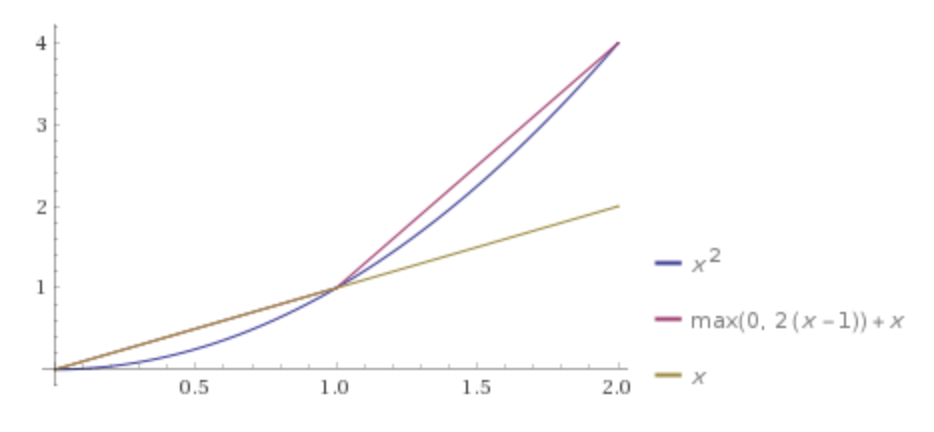
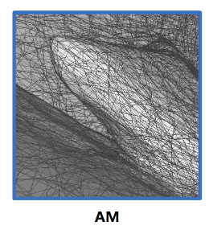
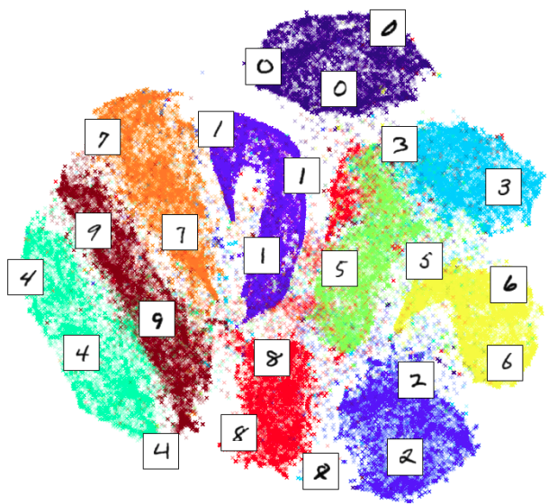

## topic：非线性激活ReLU

 - MLP不能学到multiplier
    - 可以考虑用log-normalization，这样就把乘法转换为加法
       - $`m=x \cdot y \Rightarrow \ln(m)=\ln(x)+\ln(y)`$
    - MLP在一定范围(一定区域)内可以学到这个乘法函数
       - 本质是在学习函数的一定区域内的surface，而不是函数本身 
    
 -  MLP+ReLU的本质：在一定范围内分段线性拟合一个曲线/曲面/超曲面

     - 因此，只要一个函数(数量值或向量值)的值域是闭集，那就基本可以学出任何复杂的连续函数
     - 比如对于一个一元数量值函数y=x^2的MLP+ReLU拟合：
         - 1层感知机+2个中间层neuron，函数就分了2段 
         - 多加层、多加神经元，无非是把函数分了更多段去拟合；
         - 
     - 把上面的折线扩展延伸到空间，MLP+ReLU学到的就是一个个线性平面多边形构成的<u>分段三元数量值函数</u>，去分段拟合一个空间曲面
         - 
         - 这种结构，其实和计算机中存储一个三维模型的Mesh的结构完全一致： 一个mesh就是由一段段polygon构成的
         - 也正因如此，只要我们能够显式地解析出神经元的激活关系，就可以解析地找出MLP零值面对应的polygon  见[Analytic Marching: An Analytic Meshing Solution from
            Deep Implicit Surface Networks](http://proceedings.mlr.press/v119/lei20a/lei20a.pdf)
         - 简单的ReLU带来的强大的非线性能力，让学习空间中的复杂表面成为了可能：因为确实只需要分段地学习每一个多边形而已
     - 继续升维，复杂中间层、神经元的MLP+ReLU，其实就是由一段段超平面构成的多元向量值分段函数

 - 另外也可以看到，对于一元数量值函数来说，y = 0 不仅是一段折线，y > 0 ， y < 0也可以把一个空间分成两部分

    - 从这个角度延伸，继续升维，可以理解到分类器是在特征空间中找到一个（或多个）区分多维特征的超曲面(分段线性拟合出来的)

    - 这个分段函数所围区域，可以是闭合的，也可以是开的；就像线性规划里的多个不等式既可以围成一个闭合的区域也可以围成一个开的区域
    - 这个分段函数所围区域，内、外部有明确的正负号，一定是内正外负或者内负外正

## topic 卷积操作

- 卷积核出现的必要性
  - 考虑图像分类。
    - 如果直接用图像像素作为特征，特征空间区分不同类别的超平面的寻找将十分的困难
      - 而且对于多分类器来说，用图像像素直接作为特征，多个类别之间可能也不会太明显，i.e.多个类别的特征点的分布很有可能都是挤在一起的
      - 毕竟MLP学到的空间分割其实都是二分割，多分类器也只是一个个二分类器的集合；只用图像像素特征难以很好地区分
    - 不用图像像素，用手动设计的一些特征提取子，比如拉普拉斯算子、边缘提取算子、高斯算子...
      - 手动设计，多样性其实不多
    - 考虑图像分类。卷积核的出现，就是为了更好地提取局部特征，从而搭配MLP形成一个合适的特征空间，这个特征空间可以只用一个个二分类的组合就可以分开多个类别 

