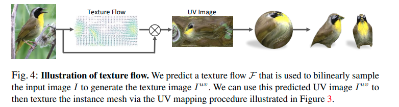
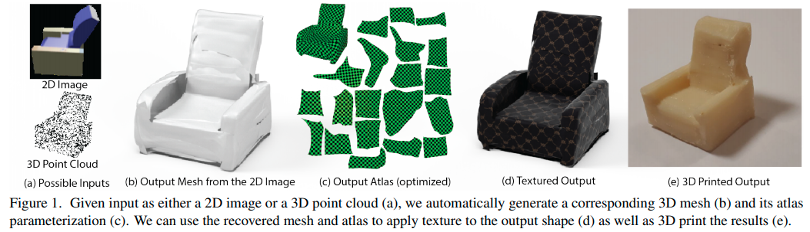
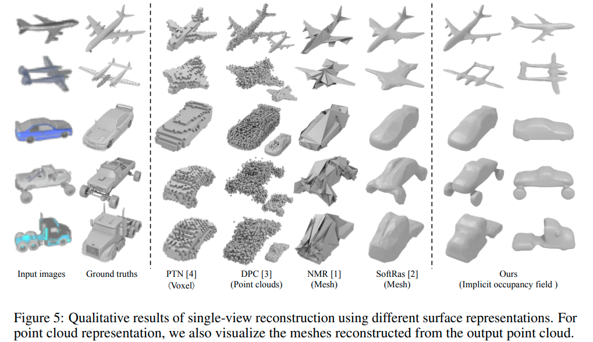

[toc]

## math: implicit surface

###  [[wiki]](https://en.wikipedia.org/wiki/Implicit_surface)

###  很有启发性的 [CG course note](https://people.cs.clemson.edu/~dhouse/courses/405/notes/implicit-parametric.pdf): surface: implicit form & parametric form  

- 一个球面形状的隐式形式和参数化形式：`implicit form` & `parametric form`
- implicit的形式无法直接通过其生成点，但是一般可以通过test来判断点在object内还是object外，对于ray-tracing非常友好
  - 
- parametric的形式可以直接通过其生成surface上的点，对于OpenGL等方法很有帮助
  - 

### 形状(geometry) 与 拓扑(topology)

- 如果用mesh的数据结构来理解：
  - 拓扑相同的几个形状，顶点之间的连接关系相同(不变)，互相之间可以直接通过顶点位移来变换得到；
    - 如甜甜圈和咖啡杯
  - 拓扑不同的形状，只要顶点之间的连接关系保持不变，怎么位移顶点都无法得到
  - 当然，上述的“位移顶点位置”是一个粗糙的描述，具体在形变时是要符合一定规则的，即【<u>光滑同胚/微分同胚</u>】 [bilibili视频：[斯梅尔悖论；球内外翻转](https://www.bilibili.com/video/BV1k54y1R7J5) ]

## implicit form / implicit field 与 parametric form 之间的转换

## learning parametric surface

- keyword
  - neural parametric surface
  - parametric surface generation/generative

---

**`"Learning Category-Specific Mesh Reconstruction from Image Collections"`**  
**[** `ECCV2018` **]** **[[paper]](https://arxiv.org/pdf/1803.07549.pdf)** **[[web]](https://akanazawa.github.io/cmr/)** **[[code]](https://github.com/akanazawa/cmr)** **[** :mortar_board: `UCB` **]**   
**[**  `Angjoo Kanazawa`, `Shubham Tulsiani`, `Alexei A. Efros`, `Jitendra Malik`  **]**  
**[** _`abcd`_ **]**  

  
Click to expand

- **Motivation**
  
- **Overview**
  
  - 一张图片encode到一个latent space, 被三个模块共享
  - shape predictor，学到的是从mean shape出发的顶点的位移改变量
  - texture predictor，学到的是从输入图像的texture flow
  - camera predictor，学到的是canonical space下的camera pose

- deformation predictor事实上学到的是从一个learned mean shape的变形
  texture使用标准UV映射定义

- mesh定义在canonical frame下
    mean shape和sphere有相同的geometry
  - 相同的顶点连接性，相当于fixed topology，拓扑是固定的
    - 思考甜甜圈和咖啡杯的拓扑是一样的：通过顶点移位变形可以变形过去
    - a fixed and pre-determined mesh connectivity 连接性是固定的
  - 所谓shape predictor，其实是预测固定个数的vertices的位置改变
    
  - 我们可以从uv图的坐标映射到球面坐标，再映射到mean shape上的坐标，再通过shape 变形（顶点移位）映射到当前shape上的顶点坐标

- texture predictor 事实上学到的是从单张图片出发的texture flow
  

---

**`"Learning Shape Templates with Structured Implicit Functions"`**  
**[** `ICCV2019` **]** **[[paper]](https://arxiv.org/pdf/1904.06447.pdf)**  **[** :mortar_board: `Princeton` **]** **[** :office: `Google` **]**  
**[**  `Kyle Genova`, `Forrester Cole`, ` Daniel Vlasic`, `Aaron Sarna`,  `William T. Freeman`, `Thomas Funkhouser` **]**  
**[** _`abcd`_ **]**  

learning generalized templates comprised of elements

  
Click to expand

- **Motivation**
  
  - 给这类从canonical space下的shape template学出物体shape的方法，提供一种更通用于各种类别的shape template 学习方法
  - 由于现实世界的形状和拓扑变化丰富，过去的_<u>这类</u>_方法一般用a library of handmade templates
  - 本篇使用了一种基于若干个local shape elements的组合来构成shape template；
    每个element是一个隐式的surface representation
    - 每个element可以当做一个高斯椭球形状
    - 这样，不同的elements位置、扁圆、大小组合，就可以组合出==<u>不同形状、不同拓扑</u>==的shape template
  - 使用10，25，100个不同的elements训练的效果
    
- 隐式的shape表征：

  - 假定每一个input shape都可以建模为一个watertight surface，由一个函数的 $`\mathcal{l}`$ level set描述（l-等值面集）；
  - 这个函数可以由N个local elements构成
  - 每个elements是一个 _scaled axis-aligned anisotropic 3D Gaussians_ 
    由参数$`\theta_i`$描述，$`\theta_i`$包含$`c_i, p_i \in \mathbb{R}^3, r_i \in \mathbb{R}^3`$
    

---

**`"AtlasNet: A Papier-Mâché Approach to Learning 3D Surface Generation"`**  
**[** `CVPR2018` **]** **[[paper]](https://arxiv.org/pdf/1802.05384.pdf)** **[[web]](http://imagine.enpc.fr/~groueixt/atlasnet/)** **[[code]](https://github.com/ThibaultGROUEIX/AtlasNet)** **[[code-easy-to-understand]](https://github.com/ThibaultGROUEIX/AtlasNet/tree/V2.2)** **[** :mortar_board: `University` **]** **[** :office: `Adobe` **]**  
**[**  `Thibault Groueix`  **]**  
**[** _`abcd`_ **]**  

  
Click to expand

- 
- **Motivation**
  
  - represents a surface as a collection of parametric surface elements
    把一个表面表征为一组parametric surface元素的集合
- **overview**
  
  - 
  - pointcloud基线，是把一个latent shape code输出为一组点
  - 本篇方法，额外输入一个从均匀单位方内采样的2D坐标点，用其来产生surface上的一个single point
  
    - 从点云/数据中学出这种`2-manifold`（i.e. `two-dimensional manifolds`，二维流形）的parameterization
    - 属于parametric approaches 分支
    - ==**<u>这里本质上就是一个从二维均匀分布到空间二维流形分布的映射，condition on一个shape code</u>**==
  - 可以轻松扩展多次，来把一个3D shape表征为几个surface 元素的联合

---

**`"Pix2Surf: Learning Parametric 3D Surface Models of Objects from Images"`**  
**[** `ECCV2020` **]** **[[paper]](https://arxiv.org/pdf/2008.07760.pdf)** **[[supp]](https://geometry.stanford.edu/projects/pix2surf/pub/pix2surf_supp.pdf)** **[[web]](https://geometry.stanford.edu/projects/pix2surf/)** **[[code(trained)]](https://github.com/JiahuiLei/Pix2Surf)** **[** :mortar_board: `Zhejiang University`, `Stanford`, `UCL` **]** **[** :office: `Adobe` **]**  
**[**  `Jiahui Lei`, `Srinath Sridhar`, `Niloy Mitra`, `Leonidas J. Guibas`  **]**  
**[** _`parametric 3D shape/parameterization`, `3D reconstruction`, `multi-view`, `single-view`, `surface reconstruction in NOCS`_ **]**  

  
Click to expand

- **Result**
  
  - 评价：可以看到学出来的曲面可以不是闭合的
  - 
    
- **Motivation**
  - learning to generate 3D parametric surface representations for novel object instances, as seen from one or more views
  - 使用2D patch来作为UV parameterization，处理多个non-adjacent views，并且建立2D pixels和3D surface points之间的correspondence
  - 用implicit functions表达的surface，想要得到显式的表面，需要昂贵的后处理步骤：如Marching Cubes

- **主要贡献**
  - high-quality parametric surfaces 遵循multi view一致性
  - 生成的3D表面保留了精确的图像像素到3D表面点的correspondance，使得可以lift texture information去reconstruct 带有丰富集合与外观的 shapes

- **引用的directly reconstruct a parametric representation of a shape's surface**
  - class-specific templates  **<u>(canonical template / mean shape in canonical space)</u>**
    逐个类别手动设计的shape template
    - [ECCV2018] Learning category-specific mesh reconstruction from image collections. 
- [ICCV2019] Canonical surface mapping via geometric cycle consistency
  
  - general structured templates
  适用于各种类别的通用shape template学习方法（应对不同的形状、拓扑）
  - [ICCV2019] Learning shape templates with structured implicit functions.
  
  - more generic surface representations
  
    - meshes deform
      - [ECCV2018] Pixel2mesh: Generating 3d mesh models from single rgb images.
    - [ICCV2019] Pixel2mesh++: Multi-view 3d mesh generation via deformation
      - [CVPR2019] 3DN: 3d deformation network.
  
    - differentiable mesh renderer + image supervision
      - [CVPR2018] Neural 3d mesh renderer
      - [2019]  Soft rasterizer: A differentiable renderer for image-based 3d reasoning
    - [2019] Pix2vex: Image-togeometry reconstruction using a smooth differentiable renderer.
      - [CVPR2019] Learning view priors for single-view 3d reconstruction.
  
    - ==continuous 2D patches== 本篇类似：使用2D patch来作为UV parameterization
      - [CVPR2018] Atlasnet: A papiermch approach to learning 3d surface generation. 

## learning implicit surface: implicit fields/implicit functions
### marching cubes [[explain]](http://www.cs.carleton.edu/cs_comps/0405/shape/marching_cubes.html)

---

**`"MeshSDF: Differentiable Iso-Surface Extraction"`**  
**[** `NeurIPS2020` **]** **[[paper]](https://arxiv.org/pdf/2006.03997.pdf)** **[[code]](https://github.com/cvlab-epfl/MeshSDF)** **[** :mortar_board: `EPFL` **]** **[** :office: `Neuralconcept`, `Intel` **]**  
**[**  `Edoardo Remelli`, `Pascal Fua `   **]**  
**[** _`differentiable iso-surface extraction`, `marching cubes`, `SDF`_  **]**  

[differentiable iso-surface extraction]

  
Click to expand

- **Motivation**

---

**`"Learning Implicit Fields for Generative Shape Modeling"`**  
**[** `CVPR2019` **]** **[[paper]](https://openaccess.thecvf.com/content_CVPR_2019/papers/Chen_Learning_Implicit_Fields_for_Generative_Shape_Modeling_CVPR_2019_paper.pdf)** **[[code]](https://github.com/czq142857/implicit-decoder)** **[[code-improve]](https://github.com/czq142857/IM-NET)**  **[[code-pytorch]](https://github.com/czq142857/IM-NET-pytorch)** **[** :mortar_board: `SFU` **]**   
**[**  `Zhiqin Chen`, `Hao Zhang `  **]**  
**[** _`implicit shape representation`_ **]**  

  
Click to expand

- **Motivation**
  - 其实是一种类别级别的连续函数隐式的shape表征，类似occupancy networks；
    输入code + one point 坐标，输出在shape 内；外；（类似SDF）
  - 

---

**`"Occupancy Networks: Learning 3D Reconstruction in Function Space"`**  
**[** `CVPR2019` **]** **[[paper]](https://openaccess.thecvf.com/content_CVPR_2019/papers/Mescheder_Occupancy_Networks_Learning_3D_Reconstruction_in_Function_Space_CVPR_2019_paper.pdf)** **[[code]](https://github.com/autonomousvision/occupancy_networks)** **[** :mortar_board: `MPI,University of Tubingen ` **]** **[** :office: `Google AI Berlin` **]**  
**[**  `Lars Mescheder，Andreas Geiger `  **]**  
**[** _`continuous function occupancy, multi-resolution isosurface extraction`, `marching cubes`_ **]**  

  
Click to expand

- **Motivation**
  - 用一个隐式函数来表达占用概率，从而可以实现任意分辨率的表达
- **主要框架**

  - **多分辨率等值面提取技术** [Multiresolution IsoSurface Extraction (MISE)]

### ray-casting

- SRN也算此行列；可以微分的ray marching

---

**`"Learning to Infer Implicit Surfaces without 3D Supervision"`**  
**[** `NeuIPS2019` **]** **[[paper]](https://papers.nips.cc/paper/2019/file/bdf3fd65c81469f9b74cedd497f2f9ce-Paper.pdf)**  **[** :mortar_board: `University of Southern California` **]**   
**[**  `Shichen Liu`, ` Shunsuke Saito`, `Weikai Chen`, `Hao Li`  **]**  
**[** _`ray casting`_ **]**  

  
Click to expand

- **Motivation**
  
  - 
  - implicit occupancy field

---

**`<DVR> "Differentiable Volumetric Rendering: Learning Implicit 3D Representations without 3D Supervision"`**  
**[** `CVPR2020` **]** **[[paper]](https://arxiv.org/pdf/1912.07372.pdf)** **[[code]](https://github.com/autonomousvision/differentiable_volumetric_rendering)** **[** :mortar_board: `MPI`, `University of Tubingen` **]**   
**[** `Michael Niemeyer`, `Andreas Geiger ` **]**  
**[**  _`differentiable volumetric rendering`, `ray casting`_ **]**  

  
Click to expand

- **Motivation**
  - 

