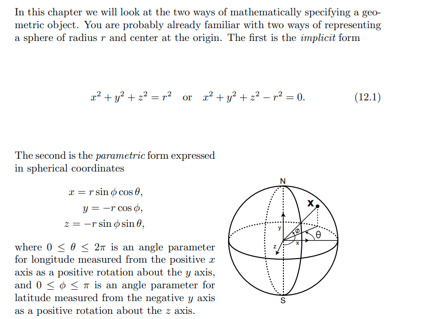
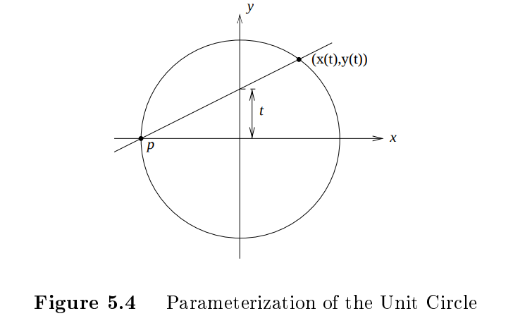
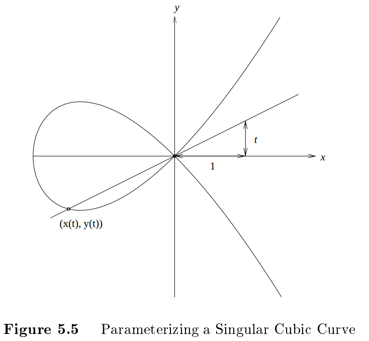
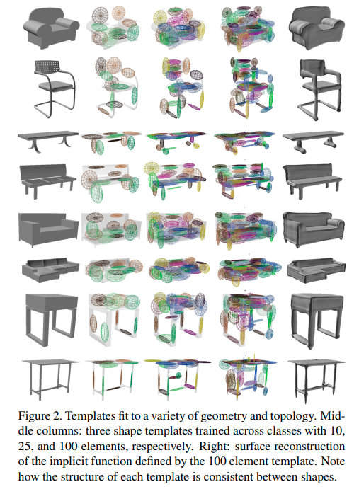
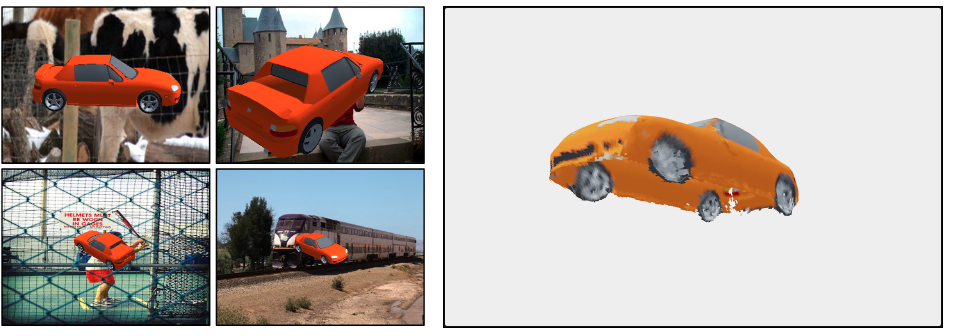
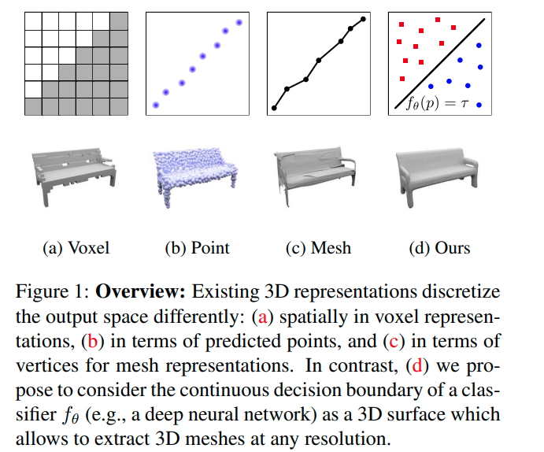
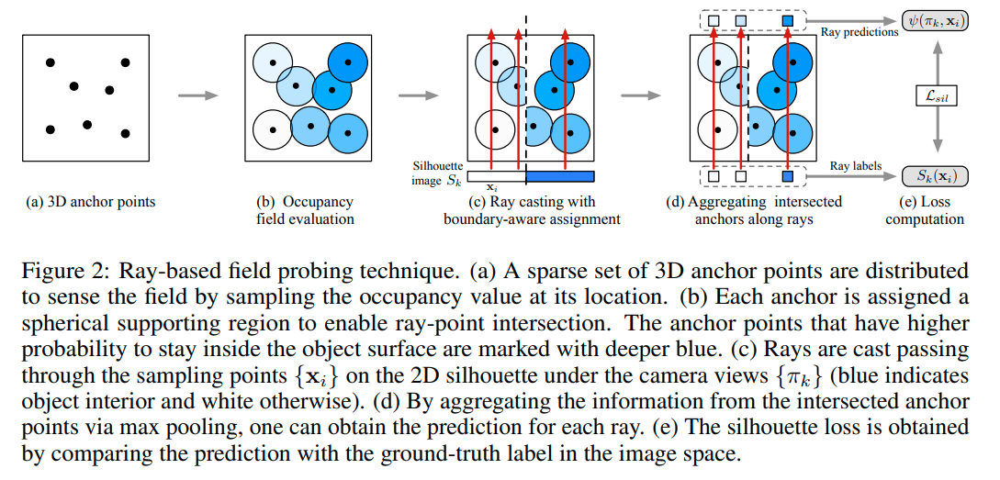
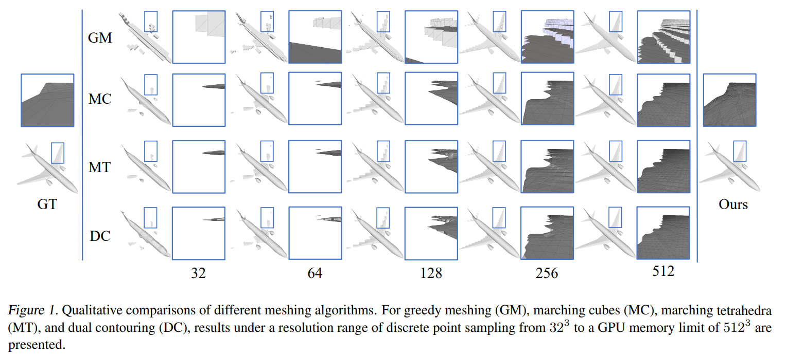
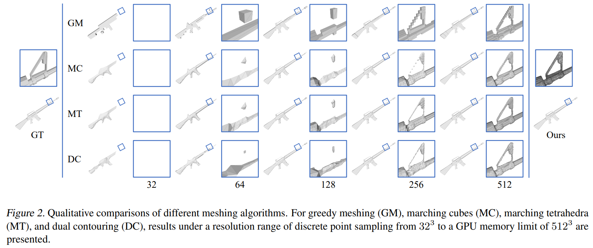

[[_TOC_]]

## math: implicit surface

 - 参考资料
    - [wiki: implicit surface](https://en.wikipedia.org/wiki/Implicit_surface)
    - [wiki: atlas](https://en.wikipedia.org/wiki/Atlas_(topology)#Charts)
    - [知乎: 光滑流形](https://zhuanlan.zhihu.com/p/41563330)
    - Clemson University - [Computer Graphics 计算机图形学课程](https://people.cs.clemson.edu/~dhouse/courses/405/)
       - chapter 12 [Implicit and Parametric Surfaces](https://people.cs.clemson.edu/~dhouse/courses/405/notes/implicit-parametric.pdf)
    - JKU - [Commulative Algebra and Algebraic Geometry - 交换代数与代数几何课程](https://www3.risc.jku.at/education/courses/ss2017/caag/)
       - chapter 7 [Local properties of plane algebraic curves](https://www3.risc.jku.at/education/courses/ss2017/caag/07-local.pdf)
       - chapter 8 [Rational Parametrization of Curves](https://www3.risc.jku.at/education/courses/ss2017/caag/08-para.pdf)
       - 这则课程主要研究平面代数曲线，所有的定理、证明都十分严谨；大多数定理其实都可以延伸至空间超曲面
    - 中科大 - [近世代数](http://staff.ustc.edu.cn/~msheng/references/moderna.pdf)
    - [1990]Purdue University - [Conversion methods beween parametric and implicit curves and surfaces](http://graphics.stanford.edu/courses/cs348a-20-winter/Handouts/a228715.pdf)
       - 非常老的手稿影印版，过程比较简略
    - [2002]Purdue University - [Geometric and Solid Modeling - 几何与实体造型课程](https://www.cs.purdue.edu/homes/cmh/distribution/books/geo.html)
       - chapter 5 [Representation of Curved Edges and Faces](https://www.cs.purdue.edu/homes/cmh/distribution/books/chap5.pdf)
       - 有些不严谨，跳步很多，需要一定代数几何基础
    - [2006]arXiv [monoid hypersurfaces](https://www.mn.uio.no/math/personer/vit/ragnip/monoids.pdf)

###  surface: implicit form & parametric form  

<details>
  <summary>Click to expand</summary>

- 一个球面形状的隐式形式和参数化形式：`implicit form` & `parametric form`
- implicit的形式无法直接通过其生成点，但是一般可以通过test来判断点在object内还是object外，对于ray-tracing非常友好
  - 
- parametric的形式可以直接通过其生成surface上的点，对于OpenGL等方法很有帮助
  - 

</details>

### 形状(geometry) 与 拓扑(topology)

<details>
  <summary>Click to expand</summary>

- 如果用mesh的数据结构来理解拓扑：
  - 同形状代表相同的顶点位置和连接关系；同拓扑代表相同的顶点连接关系
  - 若顶点之间的连接关系不变，可以通过顶点位移变化出的几个形状，互相之间是同拓扑的
    - 如甜甜圈和咖啡杯
  - 拓扑不同的形状，只要顶点之间的连接关系保持不变，怎么位移顶点都无法得到
  - 当然，上述的“位移顶点位置”是一个粗糙的描述，具体在形变时是要符合一定规则的，即【<u>光滑同胚/微分同胚</u>】 [bilibili视频：[斯梅尔悖论；球内外翻转](https://www.bilibili.com/video/BV1k54y1R7J5) ]
</details>

### `manifold`流形，`chart`卡(坐标卡)，`atlas`图册
<details>
  <summary>Click to expand</summary>

- `homeomorphism`同胚
  - 同胚是两个`topological space`拓扑空间之间的函数
  - a function $`f: X \rightarrow Y`$ between two topological spaces is a homeomorphism if:
    - $`f`$ is a `bijection`   (i.e. `one-to-one` and `onto`)
      <br>$`f`$是一个双射，i.e.单射且满射
    - $`f`$ is a continuous function
    - the inverse function $`f^{-1}`$ is continuous
  - e.g. 咖啡杯和甜甜圈这两个拓扑空间同胚
- `manifold`流形， `chart`坐标卡，`parameterization`参数化
  - 流形是一个拓扑空间
  - `2-manifold`(`two-dimensional manifold`)二维流形的定义：
    - a subset $`\mathcal{S}`$ of $`\mathbb{R}^3`$ is a 2-manifold if
      - for every point $`\boldsymbol{p} \in \mathcal{S}`$
        <br>there is an open set $`V`$ in $`\mathbb{R}^2`$ and an open set $`W`$ in $`\mathbb{R}^3`$ containing $`\boldsymbol{p}`$ <br> such that $`U=\mathcal{S} \cap W`$ is homeomorphic to $`V`$
        <br>对于 $`\mathcal{S}`$中的任意一个点 $`\boldsymbol{p}`$ ，
        <br>都存在$`{[\mathbb{R}^2中的一个开集V]}_{欧式空间中的一个开子集}`$  和$`{[\mathbb{R}^3中的包含点\boldsymbol{p}的一个开集W}]`$ <br>
        使得$`{[\mathcal{S}和W的交集U]}_{\mathcal{S}的一个包含点\boldsymbol{p}的开子集}`$与$`V_{欧式空间的一个开子集}`$同胚
      - 这个同胚记为$`\varphi: U \rightarrow V`$，有序对 $`(U,\varphi)`$ 叫做包含$`p`$的坐标卡
  - 人话
    - $`S`$的一个开子集和欧式空间的一个开子集同胚，那么$`S`$就是一个流形
    - 从$`S`$的一个开子集到欧式空间的开子集的同胚叫做`chart`坐标卡
    - 坐标卡的逆(从低维欧式空间的开子集 到 $`S`$的一个开子集的同胚)叫做`parameterization`参数化
  - `manifold`理解：局部区域线性，与(低维)欧式空间拓扑同胚
  - “自由度”的理解：<br>一个m维空间的中的曲线/曲面有n个自由度，其实严格数学定义指的是这个曲面/曲线是一个n维流形，与某一个n维欧式空间(局部)同胚
- `chart`卡/坐标卡
  - 坐标卡是一个同胚，一个函数，一个映射。
  - A `chart` for a `topological space` *M* is a `homeomorphism` $`\varphi`$ from an open subset *U* of *M* to an open subset of a Euclidean space.
    <br>一个拓扑空间的坐标卡，就是这个拓扑空间的一个开子集到一个欧式空间的开子集的同胚
  - the chart is traditionally recorded as the ordered pair $`(U,\varphi)`$ <br>坐标卡一般用有序对$`(U,\varphi)`$表示
- `parameterization`参数化

  - 参数化是一个同胚，一个函数，一个映射
  - `chart`坐标卡的逆映射就是参数化：从一个欧式空间的开子集到拓扑空间的开子集的同胚
  - 举例：

    - NeRF++中，显式手动建立了一种从欧式空间到球面坐标(4维，x,y,z定义方向，r定义球内球外)的映射，其本质就是一个从3维欧式空间到一个4维拓扑空间的同胚，一种参数化
    - AtlasNet中，隐式地学出了一种从2维单位均匀分布到空间中一个物体表面局部patch的坐标的映射，其本质就是一个从2维欧式空间到一个3维拓扑空间(3维中的一个曲面)的同胚，一种参数化
    - 在代数几何/计算机视觉中，一个平面曲线的参数化，本质就是从一个1维欧式空间(参数的集合)到一个2维拓扑空间的映射；一个空间曲面的参数化，本质就是从一个2维欧式空间(参数的集合)到一个3维拓扑空间的映射；都是同胚，都是参数化
- `image`像
  - 像是一个点集。
  - 设$`f`$是一个从定义域$`X`$到值域$`Y`$的一个函数
  - image of an element
    If *x* is a member of *X*, then the image of *x* under *f*, denoted *f*(*x*), is the value of *f* when applied to *x.*
  - image of a subset
    the image of subset $`A \subseteq X`$ under *f*, denoted $`f[A]`$ is the subset of *Y* which can be defined as:
    <br>$`f[A] = \{f(x) \vert x \in A\}`$
    <br>when there is no risk of confusion, $`f[A]`$ is simply written as $`f(A)`$
  - `inverse image / preimage`原像：
    <br>the preimage or inverse image of set $`B \subseteq Y`$ under *f* , denoted by $`f^{-1}[B]`$, is the subset of *X* defined by<br>
    $`f^{-1}[B]=\{x\in X \vert f(x) \in B\}`$
- `atlas`图册
  - 图册是一族坐标卡，一族同胚，一族函数，一族映射
  - a index family $`\{(U_\alpha,\varphi_{\alpha}):\alpha \in I \}`$ of charts on *M* which `covers` *M* (that is, $`\cup_{\alpha \in I} U_{\alpha}=M`$)
  - 流形*M*上的一个图册是：
    一族*M*上的卡$`\mathcal{A}=\{(U_{\alpha}, \varphi_{\alpha})\}`$ ，使得定义域盖住了整个*M* 
- `disk-topology`圆盘拓扑
  - `disk`, also spelled as `disc`
    - the region in a plane bounded by a circle
    - 在cartesian coordinates下的：`open disk`<br>$`D=\{(x,y)\in \mathbb{R}^2: (x-a)^2+(y-b)^2<R^2\}`$
    - `closed disk`<br>$`D=\{(x,y)\in \mathbb{R}^2: (x-a)^2+(y-b)^2 \leq R^2\}`$
  - a surface **homeomorphic** to a disc in a plane

</details>

### losses

<details>
  <summary>Click to expand</summary>

- chamfer loss
  - chamfer distance

|                                                              |                                                              |
| ------------------------------------------------------------ | ------------------------------------------------------------ |
|  |  |

</details>

### implicit form / implicit field 与 parametric form 之间的转换

<details>
  <summary>Click to expand</summary>


 - `affine space `仿射空间
 - `projective space` 射影空间
     - 射影空间是齐次坐标系
 - `multiplicity` 重数
 - `rational function` 有理函数（多项式加减乘除，只在有限个点没有定义）
 - `monoid`, `monoidal` 幺半群 / 单位半群 / 具幺半群 / 独异点
    - **幺半群**是一个带有二元运算 *: *M* × *M* → *M* 的集合 *M* ，其符合下列公理：
       - 结合律：对任何在 *M* 内的*a*、*b*、*c* ， (*a*\**b*)\**c* = *a*\*(*b*\**c*) 。
       - 单位元：存在一在 *M* 内的元素*e*，使得任一于 *M* 内的 *a* 都会符合 *a*\**e* = *e*\**a* = *a* 。
    - 通常也会多加上另一个公理：
       - 封闭性：对任何在 *M* 内的 *a* 、 *b* ， *a***b* 也会在 *M* 内。
       - 但这不是必要的，因为在二元运算中即内含了此一公理。
    - 幺半群除了没有[逆元素](https://zh.wikipedia.org/wiki/逆元素)之外，满足其他所有[群](https://zh.wikipedia.org/wiki/群)的公理。因此，一个带有逆元素的幺半群和群是一样的。
- `monoidal surfaces` 独异点曲面
    - an algebraic(polynomial) surface $`f(x,y,z)=0`$ of degree _n_ that has an $`(n-1)-fold`$ point (a point of multiplicity n-1)<br>一个有n-1重点的n次代数曲面(线)即为一个monoidal curve
    - monoidal surfaces include:
       - quadrics 二次曲面
       - cubic surface with a double point 有二重点的三次曲面
       - quartic surface with a triple point 有三重点的四次曲面
       - *etc.*
 - `parameterization`: implicit -> parametric
     - ==本质==
         - 这里的参数化，和拓扑学中的参数化，是一回事：从一个欧式空间到一个拓扑空间的同胚(映射)
    - curve
       - *Noether's theorem*<br> A plane algebraic curve f(x,y)=0 possesses a rational paramtric form iff f has genus 0
    - surface
       - 没有已知的通用工具来判断一个给定的implicit surface是否可以被参数化，以及if so, how
    - monoidal curves/ surfaces can be parameterized in a simple manner
    - 参数化时常用方式：parameterization using a `pencil` of lines
       - `pencil`
          - in [geometry](https://en.wikipedia.org/wiki/Geometry), a **pencil** is a family of geometric objects with a common property
          - a *pencil of lines* through a point *p* is a set of lines each containing *p*
       - `Bezout's Theorem` 贝组定理
          - Let $`\mathcal{C}`$ and $`\mathcal{D}`$ be projective plane curves without common components and degrees n and m, respectively. Then <br>$`n \cdot m = \sum \limits_{P \in \mathcal{C} \cap \mathcal{D}} mult_P(\mathcal{C},\mathcal{D})`$
          - 即：在考虑重数设定的前提下，两个分别次数为n和m的仿射空间代数曲线(也可以是射影空间)，二者要么有共同项，要么没有共同项且相交mn次(相交点的重数和为mn)
       - 因此，对于monoidal curves/surfaces来说，只要让a pencil of lines共同经过那个(n-1)重点，则这些直线一定与曲线/曲面还剩一个交点，如此便可实现参数化

| 让直线束经过二次曲线的一个"一重点"来参数化                   | 让直线束经过三次曲线的一个二重点来参数化                     |
| ------------------------------------------------------------ | ------------------------------------------------------------ |
|  |  |

 - a `rational parameterization` of a surface in affine (x,y,z)-space corresponds to a `polynomial parameterization` of the same surface  in `projective (w,x,y,z)-space`<br>一个曲面在(x,y,z)-仿射空间的有理参数化 对应 同样曲面在(w,x,y,z)-射影空间的多项式参数化

 - `implicitization`: parametric -> implicit
    - all curves and surfaces with a rational parametric form can be converted to implicit form
    - elimination algorithm, resultant, *etc.*

</details>

## learning parametric surface

- keyword
  - neural parametric surface
  - parametric surface generation/generative

---

**`"Learning Category-Specific Mesh Reconstruction from Image Collections"`**  
**[** `ECCV2018` **]** **[[paper]](https://arxiv.org/pdf/1803.07549.pdf)** **[[web]](https://akanazawa.github.io/cmr/)** **[[code]](https://github.com/akanazawa/cmr)** **[** :mortar_board: `UCB` **]**   
**[**  `Angjoo Kanazawa`, `Shubham Tulsiani`, `Alexei A. Efros`, `Jitendra Malik`  **]**  
**[** _`category-specific canonical shape template`_ **]**  

<details>
  <summary>Click to expand</summary>

- **Motivation**
  
- **Overview**
  
  - 一张图片encode到一个latent space, 被三个模块共享
  - shape predictor，学到的是从mean shape出发的顶点的位移改变量
  - texture predictor，学到的是从输入图像的texture flow
  - camera predictor，学到的是canonical space下的camera pose

- deformation predictor事实上学到的是从一个learned mean shape的变形
  texture使用标准UV映射定义

- mesh定义在canonical frame下
    mean shape和sphere有相同的geometry
  - 相同的顶点连接性，相当于fixed topology，拓扑是固定的
    - 思考甜甜圈和咖啡杯的拓扑是一样的：通过顶点移位变形可以变形过去
    - a fixed and pre-determined mesh connectivity 连接性是固定的
  - 所谓shape predictor，其实是预测固定个数的vertices的位置改变<br>
    
  - 我们可以从uv图的坐标映射到球面坐标，再映射到mean shape上的坐标，再通过shape 变形（顶点移位）映射到当前shape上的顶点坐标

- texture predictor 事实上学到的是从单张图片出发的texture flow
  

</details>

---

**`"Learning Shape Templates with Structured Implicit Functions"`**  
**[** `ICCV2019` **]** **[[paper]](https://arxiv.org/pdf/1904.06447.pdf)**  **[** :mortar_board: `Princeton` **]** **[** :office: `Google` **]**  
**[**  `Kyle Genova`, `Forrester Cole`, ` Daniel Vlasic`, `Aaron Sarna`,  `William T. Freeman`, `Thomas Funkhouser` **]**  
**[** _`general canonical shape template`_ **]**  

learning generalized templates comprised of elements

<details>
  <summary>Click to expand</summary>

- **Motivation**
  
  - 给这类从canonical space下的shape template学出物体shape的方法，提供一种更通用于各种类别的shape template 学习方法
  - 由于现实世界的形状和拓扑变化丰富，过去的_<u>这类</u>_方法一般用a library of handmade templates
  - 本篇使用了一种基于若干个local shape elements的组合来构成shape template；<br>
    每个element是一个隐式的surface representation
    - 每个element可以当做一个高斯椭球形状
    - 这样，不同的elements位置、扁圆、大小组合，就可以组合出==<u>不同形状、不同拓扑</u>==的shape template
  - 使用10，25，100个不同的elements训练的效果<br>
- 隐式的shape表征：
  - 假定每一个input shape都可以建模为一个watertight surface，由一个函数的 $`\mathcal{l}`$ level set描述（l-等值面集）；
  - 这个函数可以由N个local elements构成
  - 每个elements是一个 _scaled axis-aligned anisotropic 3D Gaussians_ 
    <br>由参数$`\theta_i`$描述，$`\theta_i`$包含$`c_i, p_i \in \mathbb{R}^3, r_i \in \mathbb{R}^3`$
    <br>

</details>

---

**`"AtlasNet: A Papier-Mâché Approach to Learning 3D Surface Generation"`**  
**[** `CVPR2018` **]** **[[paper]](https://arxiv.org/pdf/1802.05384.pdf)** **[[web]](http://imagine.enpc.fr/~groueixt/atlasnet/)** **[[code]](https://github.com/ThibaultGROUEIX/AtlasNet)** **[[code-easy-to-understand]](https://github.com/ThibaultGROUEIX/AtlasNet/tree/V2.2)** **[** :mortar_board: `University` **]** **[** :office: `Adobe` **]**  
**[**  `Thibault Groueix`  **]**  
**[** _`continous 2D patches`, `learning 2-manifold parameterization`, `2-manifold generation`_ **]**  

<details>
  <summary>Click to expand</summary>

- 
- **Motivation**
  - represents a surface as a collection of parametric surface elements
    <br>把一个表面表征为一组parametric surface元素的集合
  - 学到的一族从单位方到局部 2-流形的映射，非常类似一个surface 的 atlas 图册
  - 每一个3D点最终都可以得到一个2D UV值
- **overview**
  
  - 
  - pointcloud基线，是把一个latent shape code输出为一组点
  - 本篇方法，额外输入一个从均匀单位方内采样的2D坐标点，用其来产生surface上的一个single point
    - 从点云/数据中学出这种`2-manifold`（i.e. [two-dimensional manifolds](https://www2.cs.duke.edu/courses/fall06/cps296.1/Lectures/sec-II-1.pdf)，二维流形）的parameterization
    - 属于parametric approaches 分支
    - ==**<u>这里本质上就是一个从二维均匀分布到空间二维流形分布的映射，condition on一个shape code</u>**==
  - 很容易扩展多次，来把一个3D shape表征为几个surface 元素的联合
- 局部参数化表面的生成 locally parameterized surface generation
  - 把surface看做一个广义的2-manifold（允许self-intersection & disjoint sets），考虑局部的参数化<br>
    consider a `2-manifold` $`\mathcal{S}`$, a point $`\boldsymbol{p} \in \mathcal{S}`$, a `parameterization` $`\varphi`$ of $`\mathcal{S}`$ in a local neighborhood of $`\boldsymbol{p}`$
  - 假定这个局部参数化就是从单位方 $`]0,1[^2`$ 到2-manifold $`\mathcal{S}_{\theta}`$的映射 $`\varphi_{\theta}(x)`$ : $`\mathcal{S}_\theta=\varphi_{\theta}(]0,1[^2)`$
     <br>让$`\mathcal{S}_{\theta}`$去估计/近似局部2-manifold $`S_{loc}`$
  - i.e.寻找 参数$`\theta`$来最小化目标函数$`\min \limits_{\theta} \mathcal{L}(\mathcal{S}_\theta, \mathcal{S}_{loc})+\lambda\mathcal{R}(\theta)`$
    <br>上式的$`\mathcal{L}`$是两个2-manifold之间的loss，$`\mathcal{R}`$是参数$`\theta`$的正则化项；
    <br>实践中，计算的不是两个2-manifold之间的loss，<u>而是这两个2-manifold采样出的点集的chamfer 和 earth-mover距离</u>
  - 证明了MLP+ReLU就可以产生2-manifolds
  - 证明了MLP+ReLU产生的2-manifolds can be learned to 很好地近似 target 2-manifolds
    <br>用了universal representation theorum：<br>
    Approximation capabilities of multilayer feedforward networks. *Neural Networks*, 1991
- related work:  learning representations for 2-manifolds

  - polygon mesh
  - 建立一套3D shape和2D domain之间的连接是几何处理的一个存在已久的问题，它的应用有：texture mapping, re-meshing, shape correspondance
  - 过去的方法需要input data就是parameterized；本篇直接从点云中学出这种parameterization

</details>

---

**`"Deep Mesh Reconstruction from Single RGB Images
via Topology Modification Networks"`**  
**[** `CVPR2019` **]** **[[paper]](https://arxiv.org/pdf/1909.00321.pdf)**  **[** :mortar_board: `CUHK(Shenzhen)`, `USC` **]**   
**[**  `Junyi Pan`, `Xiaoguang Han`, `Weikai Chen`, `Jiapeng Tang`, `Kui Jia`  **]**  
**[** _`topology modification`_ **]**  

<details>
  <summary>Click to expand</summary>

- **Motivation**
  - <br>
  - 优化的时候，可以alternates between shape deformation和topology modification
- **overview**
  - topology modification
    - 通过动态地修改 faces-to-vertices关系来实现
    - 学一个per face error estimation network
    - 通过去掉那些deviate significantly的face来更新topology structure
- 效果

  - 
  - 

</details>

---

**`"Pix2Surf: Learning Parametric 3D Surface Models of Objects from Images"`**  
**[** `ECCV2020` **]** **[[paper]](https://arxiv.org/pdf/2008.07760.pdf)** **[[supp]](https://geometry.stanford.edu/projects/pix2surf/pub/pix2surf_supp.pdf)** **[[web]](https://geometry.stanford.edu/projects/pix2surf/)** **[[code(trained)]](https://github.com/JiahuiLei/Pix2Surf)** **[** :mortar_board: `Zhejiang University`, `Stanford`, `UCL` **]** **[** :office: `Adobe` **]**  
**[**  `Jiahui Lei`, `Srinath Sridhar`, `Niloy Mitra`, `Leonidas J. Guibas`  **]**  
**[** _`parametric 3D shape/parameterization`, `3D reconstruction`, `multi-view`, `single-view`, `surface reconstruction in NOCS`_ **]**  

<details>
  <summary>Click to expand</summary>

- **Result**
  - 评价：可以看到学出来的曲面可以不是闭合的
  - 
    
  
- **Motivation**
  - learning to generate 3D parametric surface representations for novel object instances, as seen from one or more views
  - 使用2D patch来作为UV parameterization，处理多个non-adjacent views，并且建立2D pixels和3D surface points之间的correspondence
  - 那些用implicit functions表达的surface，想要得到显式的表面，需要昂贵的后处理步骤：如Marching Cubes；本文直接学习生成显式的表面

- **主要贡献**
  - high-quality parametric surfaces 遵循multi view一致性
  - 生成的3D表面保留了精确的图像像素到3D表面点的correspondance，使得可以lift texture information去reconstruct 带有丰富集合与外观的 shapes

- **引用的directly reconstruct a parametric representation of a shape's surface**
  - class-specific templates  **<u>(canonical template / mean shape in canonical space)</u>**
    <br>逐个类别手动设计的shape template
    - [ECCV2018] Learning category-specific mesh reconstruction from image collections. 
    - [ICCV2019] Canonical surface mapping via geometric cycle consistency
  - general structured templates
    <br>适用于各种类别的通用shape template学习方法（应对不同的形状、拓扑）
    - [ICCV2019] Learning shape templates with structured implicit functions.
  - more generic surface representations
    - meshes deform
      - [ECCV2018] Pixel2mesh: Generating 3d mesh models from single rgb images.
      - [ICCV2019] Pixel2mesh++: Multi-view 3d mesh generation via deformation
      - [CVPR2019] 3DN: 3d deformation network.
      
    - differentiable mesh renderer + image supervision
      - [CVPR2018] Neural 3d mesh renderer
      - [2019]  Soft rasterizer: A differentiable renderer for image-based 3d reasoning
      - [2019] Pix2vex: Image-togeometry reconstruction using a smooth differentiable renderer.
      - [CVPR2019] Learning view priors for single-view 3d reconstruction.
    - ==continuous 2D patches== 本篇类似：使用2D patch来作为UV parameterization
      - [CVPR2018] Atlasnet: A papier-mâché approach to learning 3d surface generation. 
      - AtlasNet for video clip <br>[CVPR2019] Photometric mesh optimization for video-aligned 3d object reconstruction.
      - introduce topology modification to atlasnet <br>[ICCV2019] Deep mesh reconstruction from single rgb images via topology modification networks
  
- **preliminaries**


  - NOCS

    - 可以预测出一张图片的nocs map和mask
  - surface parameterization

    - 表面的UV参数化即一个`chart`
    - 用一组全连接网络学习多个`chart`

- overview


  - ==注意==：不同于atlas net，uv不是来自于均匀采样，而是来自于一个learned network，uv predictor<br>所以是先预测出图像每个像素的uv值，再把图像上属于这个物体的uv值集合和图像的feature 拼接一起来 输出 三维点集合(二维流形的三维点坐标集)<br>

  - ```mermaid
    graph LR
    	img[image coordinate] -.per index prediction.-> uv[uv value] --> MLP
    	image --> z[global latent code z] --> MLP
    	MLP --> 3d[3D surface coordinate]
    ```

  - <br>

- single view single chart pix2surf
  - NOCS-UV branch
    - 在过去的NOCS输出上额外加两个channel，输出uv值
    - uv不是均匀采样来的，而是直接从图像预测出一张2-channel uv image <br>
    - 发现可以emergence of a chart，并且这个chart几乎已经multi view consistent，multi object consistent
      - 即网络可以自己学出来如何把一个物体shape unrap到一个flat 空间
    - code-extractor 一个小CNN
      - 单张图片输入，输出一个global latent code z
    - UV amplifier
      - 因为UV坐标只有2维，而global latent code z维度很大，这两个信息不平衡
      - 所以就是用一组MLP先把UV升维
  - SP(surface parameterization) branch
    - 类似atlas net，以升维后的UV和global latent code的拼接为输入，输出三维点坐标
    - 与atlas net的不同：
      - uv升维了
      - 有一个learned chart，建立起图像坐标和3D surface坐标的直接相关
      - uv不是来自于均匀采样，而是从一个网络学出来的（即上面的NOCS-UV branch）
    - 输出的三维点坐标位于NOCS空间
  - loss / train
    - NOCS map的真值
    - 3D surface point的真值（从shapenet 3d model直接得到）
    - 其余都是端到端的
- multi view atlas pix2surf
  - 不同view的latent code取max pooling，max pooled code和该view的code concat在一起
  - 从一个view的pixel的NOCS map的真值，找到这个真值在另一个view下的绝对对应pixel位置<br>最小化这两个pixel预测出的3D 点距离，即为所定义的multi view consistency loss<br>

</details>

## learning implicit surface: implicit fields/implicit functions
### marching cubes [[explain]](http://www.cs.carleton.edu/cs_comps/0405/shape/marching_cubes.html)

---

**`"MeshSDF: Differentiable Iso-Surface Extraction"`**  
**[** `NeurIPS2020` **]** **[[paper]](https://arxiv.org/pdf/2006.03997.pdf)** **[[code]](https://github.com/cvlab-epfl/MeshSDF)** **[** :mortar_board: `EPFL` **]** **[** :office: `Neuralconcept`, `Intel` **]**  
**[**  `Edoardo Remelli`, `Pascal Fua `   **]**  
**[** _`differentiable iso-surface extraction`, `marching cubes`, `SDF`_  **]**  

[differentiable iso-surface extraction]

<details>
  <summary>Click to expand</summary>

- **Motivation**

</details>


---

**`"Learning Implicit Fields for Generative Shape Modeling"`**  
**[** `CVPR2019` **]** **[[paper]](https://openaccess.thecvf.com/content_CVPR_2019/papers/Chen_Learning_Implicit_Fields_for_Generative_Shape_Modeling_CVPR_2019_paper.pdf)** **[[code]](https://github.com/czq142857/implicit-decoder)** **[[code-improve]](https://github.com/czq142857/IM-NET)**  **[[code-pytorch]](https://github.com/czq142857/IM-NET-pytorch)** **[** :mortar_board: `SFU` **]**   
**[**  `Zhiqin Chen`, `Hao Zhang `  **]**  
**[** _`implicit shape representation`_ **]**  

<details>
  <summary>Click to expand</summary>

- **Motivation**
  - 其实是一种类别级别的连续函数隐式的shape表征，类似occupancy networks；
    <br>输入code + one point 坐标，输出在shape 内；外；（类似SDF）
  - 

</details>

---

**`"Occupancy Networks: Learning 3D Reconstruction in Function Space"`**  
**[** `CVPR2019` **]** **[[paper]](https://openaccess.thecvf.com/content_CVPR_2019/papers/Mescheder_Occupancy_Networks_Learning_3D_Reconstruction_in_Function_Space_CVPR_2019_paper.pdf)** **[[code]](https://github.com/autonomousvision/occupancy_networks)** **[** :mortar_board: `MPI,University of Tubingen ` **]** **[** :office: `Google AI Berlin` **]**  
**[**  `Lars Mescheder，Andreas Geiger `  **]**  
**[** _`continuous function occupancy, multi-resolution isosurface extraction`, `marching cubes`_ **]**  

<details>
  <summary>Click to expand</summary>

- **Motivation**
  - 用一个隐式函数来表达占用概率，从而可以实现任意分辨率的表达<br>
- **主要框架**
  - **多分辨率等值面提取技术** [Multiresolution IsoSurface Extraction (MISE)]<br>

</details>

---

**`"DISN: Deep Implicit Surface Network for
High-quality Single-view 3D Reconstruction"`**  
**[** `NeurIPS2019` **]** **[[paper]](https://arxiv.org/pdf/1905.10711.pdf)** **[[code]](https://github.com/laughtervv/DISN)** **[** :mortar_board: `University of Southern California` **]** **[** :office: `Adobe` **]**  
**[**  `Weiyue Wang`, `Qiangeng Xu`, `Duygu Ceylan`, `Radomir Mech`, `Ulrich Neumann`  **]**  
**[** _`SDF`_ **]**  

<details>
  <summary>Click to expand</summary>

- **Motivation**
  - 希望学到的shape，不仅全局特征好，还想有局部fine grained details 细粒度细节
- **overview**
  - 同时用global features和local features来infer SDF<br>

</details>


### ray-casting

- SRN也算此行列；可以微分的ray marching

---

**`"Learning to Infer Implicit Surfaces without 3D Supervision"`**  
**[** `NeuIPS2019` **]** **[[paper]](https://papers.nips.cc/paper/2019/file/bdf3fd65c81469f9b74cedd497f2f9ce-Paper.pdf)**  **[** :mortar_board: `University of Southern California` **]**   
**[**  `Shichen Liu`, ` Shunsuke Saito`, `Weikai Chen`, `Hao Li`  **]**  
**[** _`ray casting`_ **]**  

<details>
  <summary>Click to expand</summary>

- **Motivation**
  - 
  - implicit occupancy field

</details>

---

**`<DVR> "Differentiable Volumetric Rendering: Learning Implicit 3D Representations without 3D Supervision"`**  
**[** `CVPR2020` **]** **[[paper]](https://arxiv.org/pdf/1912.07372.pdf)** **[[code]](https://github.com/autonomousvision/differentiable_volumetric_rendering)** **[** :mortar_board: `MPI`, `University of Tubingen` **]**   
**[** `Michael Niemeyer`, `Andreas Geiger ` **]**  
**[**  _`differentiable volumetric rendering`, `ray casting`_ **]**  

<details>
  <summary>Click to expand</summary>
- **Motivation**
  - 
</details>

## learning parameterization / implicitization

---

**`"Analytic Marching: An Analytic Meshing Solution from
Deep Implicit Surface Networks"`**  
**[** `ICML2020` **]** **[[paper]](http://proceedings.mlr.press/v119/lei20a/lei20a.pdf)** **[[supp]](http://proceedings.mlr.press/v119/lei20a/lei20a-supp.pdf)** **[[slice]](https://slides.games-cn.org/pdf/Games2020148JiabaoLei.pdf)** **[** :mortar_board: `南方科技大学` **]** **[** :office: [`琶洲实验室`](https://www.pazhoulab.com/) **]**  
**[**  `Jiabao Lei`, `Kui Jia贾奎`  **]**  
**[** _`learning surface mesh via implicit field functions`, `MLP analytic solution`_ **]**  

<details>
  <summary>Click to expand</summary>

- **Motivation**
  - deep learning领域出现了很多研究，surface 的implicit functions用MLP+ReLU实现
  - 为了实现meshing **<u>(exactly recover meshes)</u>** from **<u>learned</u>** implicit functions (MLP+ReLU)
    - 现有的方法采用的事实上都是标准的marching cubes采样算法；虽然效果还行，但是损失了学到的MLP的精确度，due to 离散化的本质
    - 基于ReLU-based MLP 把input空间分为很多线性区域的事实，本篇把这些区域识别为analytic cells与analytic faces，与implicit function的零值等值面有关
    - 推导了这些identified analytic faces在什么理论条件下可以保证形成一个闭合的、piecewise的planar surface
    - 基于本篇的这些理论推导，提出了一个可并行化的算法，在这些analytic cells上做marching，来==**<u>exactly recover</u>**==这些由learned MLP学出来的mesh
- **效果**：解析解就是降维打击。精确度无限(exact 解) + CPU跑都比别人GPU跑快十几倍
  - 
  - 
  - 
  - 

</details>

## tasks

---

**`"SkeletonNet: A Topology-Preserving Solution for
Learning Mesh Reconstruction of Object
Surfaces from RGB Images"`**  
**[** `0000` **]** **[[paper]](https://abc.efg)** **[[code]](https://www.github.com)** **[** :mortar_board: `南方科技大学`, `CUHK` **]** **[** :office: `Microsoft Research Asia` **]**  
**[**  `xxxx`  **]**  
**[** _`skeleton-learning`, `topology preserving`, `GCN`, `implicit surface`_ **]**  

<details>
  <summary>Click to expand</summary>

- **Motivation**
  - 学习shape时保留本身的拓扑结构：先学skeleton，再从skeleton推shape
- **overview**
  - (skeleton-GCN) skeleton-based graph convolutional neural network
  - (skeleton-DISN) skeleton-regularized deep implicit surface network
    - 主要基于*Disn:Deep implicit surface network for high-quality single-view 3d reconstruction*，加入skeleton正则项
- **效果**
  - 

</details>