* TOC
{:toc}

# math: implicit surface

 - 参考资料
    - [wiki: implicit surface](https://en.wikipedia.org/wiki/Implicit_surface)
    - [wiki: atlas](https://en.wikipedia.org/wiki/Atlas_(topology)#Charts)
    - [知乎: 光滑流形](https://zhuanlan.zhihu.com/p/41563330)
    - Clemson University - [Computer Graphics 计算机图形学课程](https://people.cs.clemson.edu/~dhouse/courses/405/)
       - chapter 12 [Implicit and Parametric Surfaces](https://people.cs.clemson.edu/~dhouse/courses/405/notes/implicit-parametric.pdf)
    - JKU - [Commulative Algebra and Algebraic Geometry - 交换代数与代数几何课程](https://www3.risc.jku.at/education/courses/ss2017/caag/)
       - chapter 7 [Local properties of plane algebraic curves](https://www3.risc.jku.at/education/courses/ss2017/caag/07-local.pdf)
       - chapter 8 [Rational Parametrization of Curves](https://www3.risc.jku.at/education/courses/ss2017/caag/08-para.pdf)
       - 这则课程主要研究平面代数曲线，所有的定理、证明都十分严谨；大多数定理其实都可以延伸至空间超曲面
    - 中科大 - [近世代数](http://staff.ustc.edu.cn/~msheng/references/moderna.pdf)
    - [1990]Purdue University - [Conversion methods beween parametric and implicit curves and surfaces](http://graphics.stanford.edu/courses/cs348a-20-winter/Handouts/a228715.pdf)
       - 非常老的手稿影印版，过程比较简略
    - [2002]Purdue University - [Geometric and Solid Modeling - 几何与实体造型课程](https://www.cs.purdue.edu/homes/cmh/distribution/books/geo.html)
       - chapter 5 [Representation of Curved Edges and Faces](https://www.cs.purdue.edu/homes/cmh/distribution/books/chap5.pdf)
       - 有些不严谨，跳步很多，需要一定代数几何基础
    - [2006]arXiv [monoid hypersurfaces](https://www.mn.uio.no/math/personer/vit/ragnip/monoids.pdf)
    - [2020]Thibault GROUEIX's slice  - [Deep Learning for 3D Toward Surface Generation](http://imagine.enpc.fr/~langloip/data/DeepLearningFor3D_3.pdf)
       - 非常详细，非常总结，概括性很好

##  surface: implicit form & parametric form  

<details markdown="1">
  <summary markdown="0">Click to expand</summary>

- 一个球面形状的隐式形式和参数化形式：`implicit form` & `parametric form`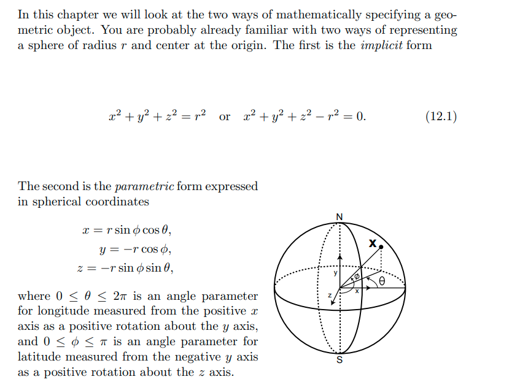
- implicit的形式无法直接通过其生成点，但是一般可以通过test来判断点在object内还是object外，对于ray-tracing非常友好
  - 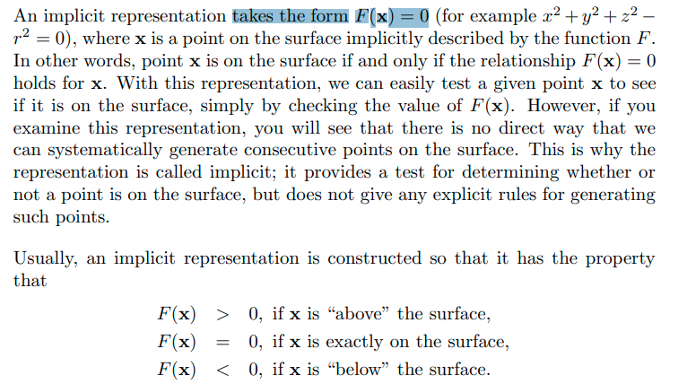
- parametric的形式可以直接通过其生成surface上的点，对于OpenGL等方法很有帮助
  - 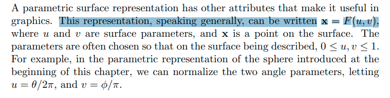

</details>

## 形状(geometry) 与 拓扑(topology)

<details markdown="1">
  <summary markdown="0">Click to expand</summary>

- 如果用mesh的数据结构来理解拓扑：
  - 同形状代表相同的顶点位置和连接关系；同拓扑代表相同的顶点连接关系
  - 若顶点之间的连接关系不变，可以通过顶点位移变化出的几个形状，互相之间是同拓扑的
    - 如甜甜圈和咖啡杯
  - 拓扑不同的形状，只要顶点之间的连接关系保持不变，怎么位移顶点都无法得到
  - 当然，上述的“位移顶点位置”是一个粗糙的描述，具体在形变时是要符合一定规则的，即【<u>光滑同胚/微分同胚</u>】 [bilibili视频：[斯梅尔悖论：内翻球面和外翻球面是微分同胚的](https://www.bilibili.com/video/BV1k54y1R7J5) ]
</details>

## `manifold`流形，`chart`卡(坐标卡)，`atlas`图册
<details markdown="1">
  <summary markdown="0">Click to expand</summary>

- `homeomorphism`同胚
  - 同胚是两个`topological space`拓扑空间之间的函数
  - a function $$ f: X \rightarrow Y $$ between two topological spaces is a homeomorphism if:
    - $$ f $$ is a `bijection`   (i.e. `one-to-one` and `onto`)
      <br>$$ f $$是一个双射，i.e.单射且满射
    - $$ f $$ is a continuous function
    - the inverse function $$ f^{-1} $$ is continuous
  - e.g. 咖啡杯和甜甜圈这两个拓扑空间同胚
- `manifold`流形， `chart`坐标卡，`parameterization`参数化
  - 流形是一个拓扑空间
  - `2-manifold`(`two-dimensional manifold`)二维流形的定义：
    - a subset $$ \mathcal{S} $$ of $$ \mathbb{R}^3 $$ is a 2-manifold if
      - for every point $$ \boldsymbol{p} \in \mathcal{S} $$
        <br>there is an open set $$ V $$ in $$ \mathbb{R}^2 $$ and an open set $$ W $$ in $$ \mathbb{R}^3 $$ containing $$ \boldsymbol{p} $$ <br> such that $$ U=\mathcal{S} \cap W $$ is homeomorphic to $$ V $$
        <br>对于 $$ \mathcal{S} $$中的任意一个点 $$ \boldsymbol{p} $$ ，
        <br>都存在$$ {[\mathbb{R}^2中的一个开集V]}_{欧式空间中的一个开子集} $$  和$$ {[\mathbb{R}^3中的包含点\boldsymbol{p}的一个开集W}] $$ <br>
        使得$$ {[\mathcal{S}和W的交集U]}_{\mathcal{S}的一个包含点\boldsymbol{p}的开子集} $$与$$ V_{欧式空间的一个开子集} $$同胚
      - 这个同胚记为$$ \varphi: U \rightarrow V $$，有序对 $$ (U,\varphi) $$ 叫做包含$$ p $$的坐标卡
  - 人话
    - $$ S $$的一个开子集和欧式空间的一个开子集同胚，那么$$ S $$就是一个流形
    - 从$$ S $$的一个开子集到欧式空间的开子集的同胚叫做`chart`坐标卡
    - 坐标卡的逆(从低维欧式空间的开子集 到 $$ S $$的一个开子集的同胚)叫做`parameterization`参数化
  - `manifold`理解：局部区域线性，与(低维)欧式空间拓扑同胚
  - “自由度”的理解：<br>一个m维空间的中的曲线/曲面有n个自由度，其实严格数学定义指的是这个曲面/曲线是一个n维流形，与某一个n维欧式空间(局部)同胚
- `chart`卡/坐标卡
  - 坐标卡是一个同胚，一个函数，一个映射。
  - A `chart` for a `topological space` *M* is a `homeomorphism` $$ \varphi $$ from an open subset *U* of *M* to an open subset of a Euclidean space.
    <br>一个拓扑空间的坐标卡，就是这个拓扑空间的一个开子集到一个欧式空间的开子集的同胚
  - the chart is traditionally recorded as the ordered pair $$ (U,\varphi) $$ <br>坐标卡一般用有序对$$ (U,\varphi) $$表示
- `parameterization`参数化
  - 参数化是一个同胚，一个函数，一个映射
  - `chart`坐标卡的逆映射就是参数化：从一个欧式空间的开子集到拓扑空间的开子集的同胚
  - 举例：
    - NeRF++中，显式手动建立了一种从欧式空间到球面坐标(4维，x,y,z定义方向，r定义球内球外)的映射，其本质就是一个从3维欧式空间到一个4维拓扑空间的同胚，一种参数化
    - AtlasNet中，隐式地学出了一种从2维单位均匀分布到空间中一个物体表面局部patch的坐标的映射，其本质就是一个从2维欧式空间到一个3维拓扑空间(3维中的一个曲面)的同胚，一种参数化
    - 在代数几何/计算机视觉中，一个平面曲线的参数化，本质就是从一个1维欧式空间(参数的集合)到一个2维拓扑空间的映射；一个空间曲面的参数化，本质就是从一个2维欧式空间(参数的集合)到一个3维拓扑空间的映射；都是同胚，都是参数化
- `image`像
  - 像是一个点集。
  - 设$$ f $$是一个从定义域$$ X $$到值域$$ Y $$的一个函数
  - image of an element
    If *x* is a member of *X*, then the image of *x* under *f*, denoted *f*(*x*), is the value of *f* when applied to *x.*
  - image of a subset
    the image of subset $$ A \subseteq X $$ under *f*, denoted $$ f[A] $$ is the subset of *Y* which can be defined as:
    <br>$$ f[A] = \{f(x) \vert x \in A\} $$
    <br>when there is no risk of confusion, $$ f[A] $$ is simply written as $$ f(A) $$
  - `inverse image / preimage`原像：
    <br>the preimage or inverse image of set $$ B \subseteq Y $$ under *f* , denoted by $$ f^{-1}[B] $$, is the subset of *X* defined by<br>
    $$ f^{-1}[B]=\{x\in X \vert f(x) \in B\} $$
- `atlas`图册
  - 图册是一族坐标卡，一族同胚，一族函数，一族映射
  - a index family $$ \{(U_\alpha,\varphi_{\alpha}):\alpha \in I \} $$ of charts on *M* which `covers` *M* (that is, $$ \cup_{\alpha \in I} U_{\alpha}=M $$)
  - 流形*M*上的一个图册是：
    一族*M*上的卡$$ \mathcal{A}=\{(U_{\alpha}, \varphi_{\alpha})\} $$ ，使得定义域盖住了整个*M* 
- `disk-topology`圆盘拓扑
  - `disk`, also spelled as `disc`
    - the region in a plane bounded by a circle
    - 在cartesian coordinates下的：`open disk`<br>$$ D=\{(x,y)\in \mathbb{R}^2: (x-a)^2+(y-b)^2<R^2\} $$
    - `closed disk`<br>$$ D=\{(x,y)\in \mathbb{R}^2: (x-a)^2+(y-b)^2 \leq R^2\} $$
  - a surface **homeomorphic** to a disc in a plane

</details>

## algorithms

### marching cubes [[explain]](http://www.cs.carleton.edu/cs_comps/0405/shape/marching_cubes.html)

### losses

<details markdown="1">
  <summary markdown="0">Click to expand</summary>

- chamfer loss / `chamfer distance` (CD)

|                                                              |                                                              |
| ------------------------------------------------------------ | ------------------------------------------------------------ |
| 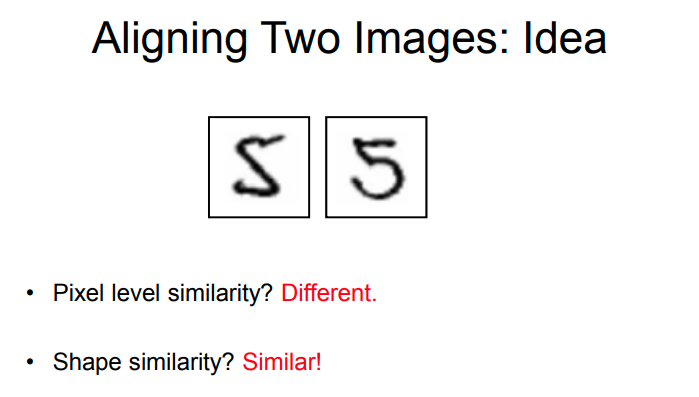 | 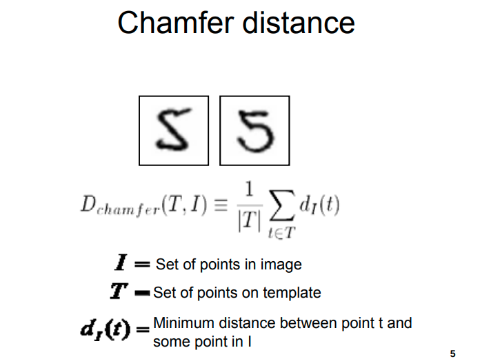 |

 - `Earth Mover Distance` (EMD)
 - 

</details>

## implicit form / implicit field 与 parametric form 之间的转换

<details markdown="1">
  <summary markdown="0">Click to expand</summary>

 - `affine space `仿射空间
 - `projective space` 射影空间
     - 射影空间是齐次坐标系
 - `multiplicity` 重数
 - `rational function` 有理函数（多项式加减乘除，只在有限个点没有定义）
 - `monoid`, `monoidal` 幺半群 / 单位半群 / 具幺半群 / 独异点
    - **幺半群**是一个带有二元运算 *: *M* × *M* → *M* 的集合 *M* ，其符合下列公理：
       - 结合律：对任何在 *M* 内的*a*、*b*、*c* ， (*a*\**b*)\**c* = *a*\*(*b*\**c*) 。
       - 单位元：存在一在 *M* 内的元素*e*，使得任一于 *M* 内的 *a* 都会符合 *a*\**e* = *e*\**a* = *a* 。
    - 通常也会多加上另一个公理：
       - 封闭性：对任何在 *M* 内的 *a* 、 *b* ， *a***b* 也会在 *M* 内。
       - 但这不是必要的，因为在二元运算中即内含了此一公理。
    - 幺半群除了没有[逆元素](https://zh.wikipedia.org/wiki/逆元素)之外，满足其他所有[群](https://zh.wikipedia.org/wiki/群)的公理。因此，一个带有逆元素的幺半群和群是一样的。
- `monoidal surfaces` 独异点曲面
    - an algebraic(polynomial) surface $$ f(x,y,z)=0 $$ of degree _n_ that has an $$ (n-1)-fold $$ point (a point of multiplicity n-1)<br>一个有n-1重点的n次代数曲面(线)即为一个monoidal curve
    - monoidal surfaces include:
       - quadrics 二次曲面
       - cubic surface with a double point 有二重点的三次曲面
       - quartic surface with a triple point 有三重点的四次曲面
       - *etc.*
 - `parameterization`: implicit -> parametric
     - ==本质==
         - 这里的参数化，和拓扑学中的参数化，是一回事：从一个欧式空间到一个拓扑空间的同胚(映射)
    - curve
       - *Noether's theorem*<br> A plane algebraic curve f(x,y)=0 possesses a rational paramtric form iff f has genus 0
    - surface
       - 没有已知的通用工具来判断一个给定的implicit surface是否可以被参数化，以及if so, how
    - monoidal curves/ surfaces can be parameterized in a simple manner
    - 参数化时常用方式：parameterization using a `pencil` of lines
       - `pencil`
          - in [geometry](https://en.wikipedia.org/wiki/Geometry), a **pencil** is a family of geometric objects with a common property
          - a *pencil of lines* through a point *p* is a set of lines each containing *p*
       - `Bezout's Theorem` 贝组定理
          - Let $$ \mathcal{C} $$ and $$ \mathcal{D} $$ be projective plane curves without common components and degrees n and m, respectively. Then <br>$$ n \cdot m = \underset{P \in \mathcal{C} \cap \mathcal{D}}{\sum} mult_P(\mathcal{C},\mathcal{D}) $$
          - 即：在考虑重数设定的前提下，两个分别次数为n和m的仿射空间代数曲线(也可以是射影空间)，二者要么有共同项，要么没有共同项且相交mn次(相交点的重数和为mn)
       - 因此，对于monoidal curves/surfaces来说，只要让a pencil of lines共同经过那个(n-1)重点，则这些直线一定与曲线/曲面还剩一个交点，如此便可实现参数化

| 让直线束经过二次曲线的一个"一重点"来参数化                   | 让直线束经过三次曲线的一个二重点来参数化                     |
| ------------------------------------------------------------ | ------------------------------------------------------------ |
| 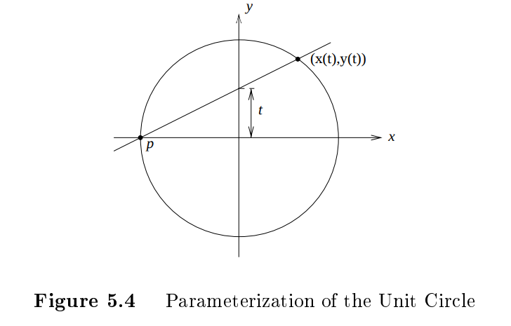 | 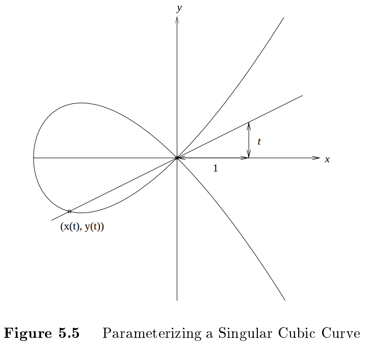 |

 - a `rational parameterization` of a surface in affine (x,y,z)-space corresponds to a `polynomial parameterization` of the same surface  in `projective (w,x,y,z)-space`<br>一个曲面在(x,y,z)-仿射空间的有理参数化 对应 同样曲面在(w,x,y,z)-射影空间的多项式参数化
 - `implicitization`: parametric -> implicit
    - all curves and surfaces with a rational parametric form can be converted to implicit form
    - elimination algorithm, resultant, *etc.*

</details>

# learning parametric surface

- keyword
  - neural parametric surface
  - parametric surface generation/generative
- overview
   - 用一个参数方程$$ [x(s,t),y(s,t),z(s,t)] $$表达一个曲面
   - 可以用显式的手动构建或者隐式的神经网络来构建这个从s,t到x,y,z的映射关系

## explicit shape templates + deformation

---

**`"Learning Category-Specific Mesh Reconstruction from Image Collections"`**  
**[** `ECCV2018` **]** **[[paper]](https://arxiv.org/pdf/1803.07549.pdf)** **[[web]](https://akanazawa.github.io/cmr/)** **[[code]](https://github.com/akanazawa/cmr)** **[** :mortar_board: `UCB` **]**   
**[**  `Angjoo Kanazawa`, `Shubham Tulsiani`, `Alexei A. Efros`, `Jitendra Malik`  **]**  
**[** _`category-specific canonical shape template`_ **]**  

<details markdown="1">
  <summary markdown="0">Click to expand</summary>

- **Motivation**
  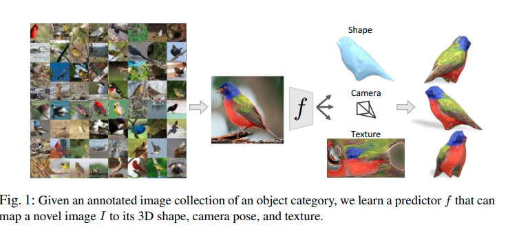
- **Overview**
  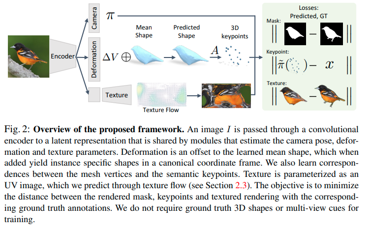
  - 一张图片encode到一个latent space, 被三个模块共享
  - shape predictor，学到的是从mean shape出发的顶点的位移改变量
  - texture predictor，学到的是从输入图像的texture flow
  - camera predictor，学到的是canonical space下的camera pose
- deformation predictor事实上学到的是从一个learned mean shape的变形
  texture使用标准UV映射定义
- mesh定义在canonical frame下
    mean shape和sphere有相同的geometry
  - 相同的顶点连接性，相当于fixed topology，拓扑是固定的
    - 思考甜甜圈和咖啡杯的拓扑是一样的：通过顶点移位变形可以变形过去
    - a fixed and pre-determined mesh connectivity 连接性是固定的
  - 所谓shape predictor，其实是预测固定个数的vertices的位置改变<br>
    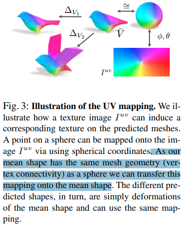
  - 我们可以从uv图的坐标映射到球面坐标，再映射到mean shape上的坐标，再通过shape 变形（顶点移位）映射到当前shape上的顶点坐标
- texture predictor 事实上学到的是从单张图片出发的texture flow
  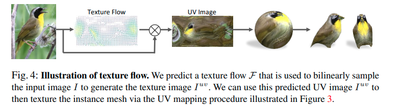

</details>

---

**`"Learning Shape Templates with Structured Implicit Functions"`**  
**[** `ICCV2019` **]** **[[paper]](https://arxiv.org/pdf/1904.06447.pdf)**  **[** :mortar_board: `Princeton` **]** **[** :office: `Google` **]**  
**[**  `Kyle Genova`, `Forrester Cole`, `Daniel Vlasic`, `Aaron Sarna`,  `William T. Freeman`, `Thomas Funkhouser` **]**  
**[** _`general canonical shape template`_ **]**  

learning generalized templates comprised of elements

<details markdown="1">
  <summary markdown="0">Click to expand</summary>

- **Motivation**
  - 给这类从canonical space下的shape template学出物体shape的方法，提供一种更通用于各种类别的shape template 学习方法
  - 由于现实世界的形状和拓扑变化丰富，过去的_<u>这类</u>_方法一般用a library of handmade templates
  - 本篇使用了一种基于若干个local shape elements的组合来构成shape template；<br>
    每个element是一个隐式的surface representation
    - 每个element可以当做一个高斯椭球形状
    - 这样，不同的elements位置、扁圆、大小组合，就可以组合出==<u>不同形状、不同拓扑</u>==的shape template
  - 使用10，25，100个不同的elements训练的效果<br>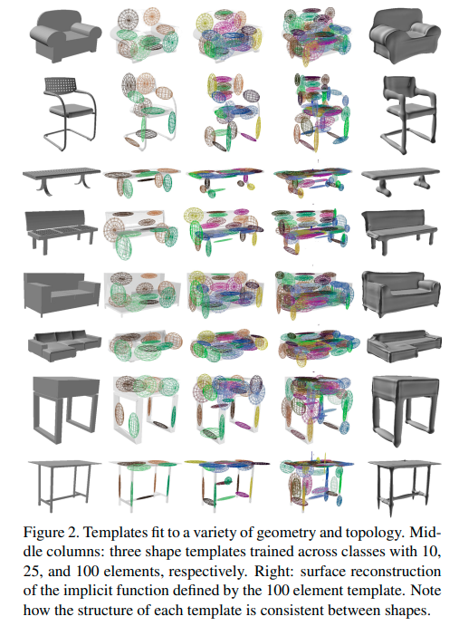
- 隐式的shape表征：
  - 假定每一个input shape都可以建模为一个watertight surface，由一个函数的 $$ \mathcal{l} $$ level set描述（l-等值面集）；
  - 这个函数可以由N个local elements构成
  - 每个elements是一个 _scaled axis-aligned anisotropic 3D Gaussians_ 
    <br>由参数$$ \theta_i $$描述，$$ \theta_i $$包含$$ c_i, p_i \in \mathbb{R}^3, r_i \in \mathbb{R}^3 $$
    <br>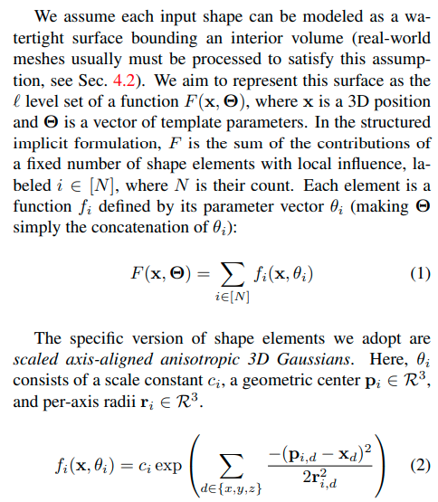

</details>

---

**`"Deep Mesh Reconstruction from Single RGB Images via Topology Modification Networks"`**  
**[** `CVPR2019` **]** **[[paper]](https://arxiv.org/pdf/1909.00321.pdf)**  **[** :mortar_board: `CUHK(Shenzhen)`, `USC` **]**   
**[**  `Junyi Pan`, `Xiaoguang Han`, `Weikai Chen`, `Jiapeng Tang`, `Kui Jia`  **]**  
**[** _`topology modification`_ **]**  

<details markdown="1">
  <summary markdown="0">Click to expand</summary>

- **Motivation**
  - <br>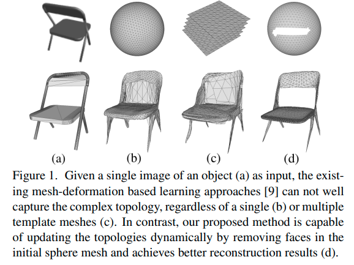
  - 优化的时候，可以alternates between shape deformation和topology modification
- **overview**
  - topology modification
    - 通过动态地修改 faces-to-vertices关系来实现
    - 学一个per face error estimation network
    - 通过去掉那些deviate significantly的face来更新topology structure
- 效果
  - 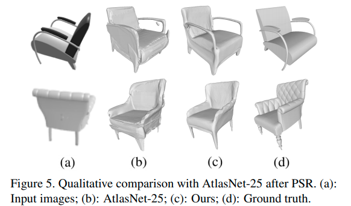
  - 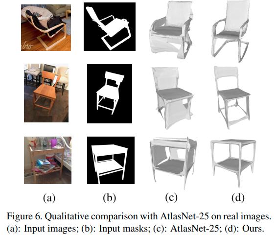

</details>

## continuous patches

---

**`"AtlasNet: A Papier-Mâché Approach to Learning 3D Surface Generation"`**  
**[** `CVPR2018` **]** **[[paper]](https://arxiv.org/pdf/1802.05384.pdf)** **[[web]](http://imagine.enpc.fr/~groueixt/atlasnet/)** **[[code]](https://github.com/ThibaultGROUEIX/AtlasNet)** **[[code-easy-to-understand]](https://github.com/ThibaultGROUEIX/AtlasNet/tree/V2.2)** **[** :mortar_board: `University` **]** **[** :office: `Adobe` **]**  
**[**  `Thibault Groueix`  **]**  
**[** _`continous 2D patches`, `learning 2-manifold parameterization`, `2-manifold generation`_ **]**  

<details markdown="1">
  <summary markdown="0">Click to expand</summary>

- 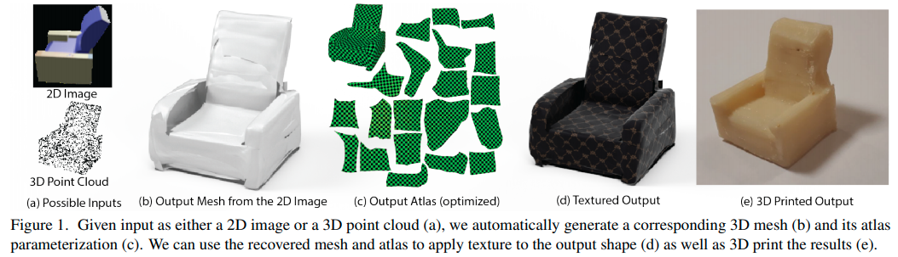
- **Motivation**
  - represents a surface as a collection of parametric surface elements
    <br>把一个表面表征为一组parametric surface元素的集合
  - 学到的一族从单位方到局部 2-流形的映射，非常类似一个surface 的 atlas 图册
  - 每一个3D点最终都可以得到一个2D UV值
- **overview**
  - 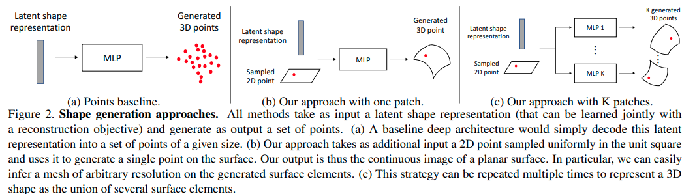
  - pointcloud基线，是把一个latent shape code输出为一组点
  - 本篇方法，额外输入一个从均匀单位方内采样的2D坐标点，用其来产生surface上的一个single point
    - 从点云/数据中学出这种`2-manifold`（i.e. [two-dimensional manifolds](https://www2.cs.duke.edu/courses/fall06/cps296.1/Lectures/sec-II-1.pdf)，二维流形）的parameterization
    - 属于parametric approaches 分支
    - ==**<u>这里本质上就是一个从二维均匀分布到空间二维流形分布的映射，condition on一个shape code</u>**==
  - 很容易扩展多次，来把一个3D shape表征为几个surface 元素的联合
- 局部参数化表面的生成 locally parameterized surface generation
  - 把surface看做一个广义的2-manifold（允许self-intersection & disjoint sets），考虑局部的参数化<br>
    consider a `2-manifold` $$ \mathcal{S} $$, a point $$ \boldsymbol{p} \in \mathcal{S} $$, a `parameterization` $$ \varphi $$ of $$ \mathcal{S} $$ in a local neighborhood of $$ \boldsymbol{p} $$
  - 假定这个局部参数化就是从单位方 $$ ]0,1[^2 $$ 到2-manifold $$ \mathcal{S}_{\theta} $$的映射 $$ \varphi_{\theta}(x) $$ : $$ \mathcal{S}_\theta=\varphi_{\theta}(]0,1[^2) $$
     <br>让$$ \mathcal{S}_{\theta} $$去估计/近似局部2-manifold $$ S_{loc} $$
  - i.e.寻找 参数$$ \theta $$来最小化目标函数$$ \underset{\theta}{\min}   \mathcal{L}(\mathcal{S}_\theta, \mathcal{S}_{loc})+\lambda\mathcal{R}(\theta) $$
    <br>上式的$$ \mathcal{L} $$是两个2-manifold之间的loss，$$ \mathcal{R} $$是参数$$ \theta $$的正则化项；
    <br>实践中，计算的不是两个2-manifold之间的loss，<u>而是这两个2-manifold采样出的点集的chamfer 和 earth-mover距离</u>
  - 证明了MLP+ReLU就可以产生2-manifolds
  - 证明了MLP+ReLU产生的2-manifolds can be learned to 很好地近似 target 2-manifolds
    <br>用了universal representation theorum：<br>
    Approximation capabilities of multilayer feedforward networks. *Neural Networks*, 1991
- related work:  learning representations for 2-manifolds
  - polygon mesh
  - 建立一套3D shape和2D domain之间的连接是几何处理的一个存在已久的问题，它的应用有：texture mapping, re-meshing, shape correspondance
  - 过去的方法需要input data就是parameterized；本篇直接从点云中学出这种parameterization

</details>

---

**`"Deep Geometric Prior for Surface Reconstruction"`**  
**[** `CVPR2019` **]** **[[paper]](https://arxiv.org/pdf/1811.10943.pdf)** **[[code]](https://github.com/fwilliams/deep-geometric-prior)**  **[** :mortar_board: `New York University` **]**   
**[**  `Francis Williams`, `Teseo Schneider`, `Claudio Silva`, `Denis Zorin`, `Joan Bruna`, `Daniele Panozzo`  **]**  
**[** _`chart representation`, `auto-decoder`_ **]**  

<details markdown="1">
  <summary markdown="0">Click to expand</summary>

- **Motivation**
  - 首先把输入点云分成若干个重叠的部分，然后用MLP流形学习每个部分；
  - 每个local流形学习用`2-Wasserstein loss` / `EMD loss`；<br>并在所有流形之间保证consistency
  - 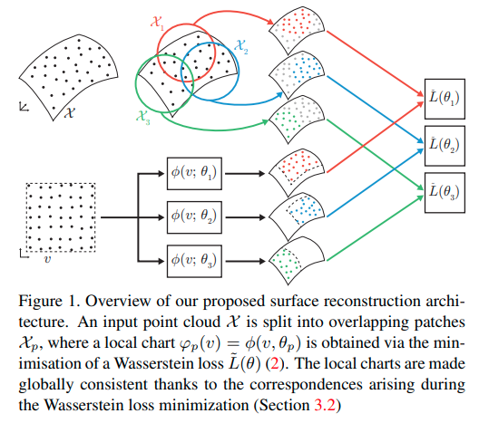
- **results**
  - 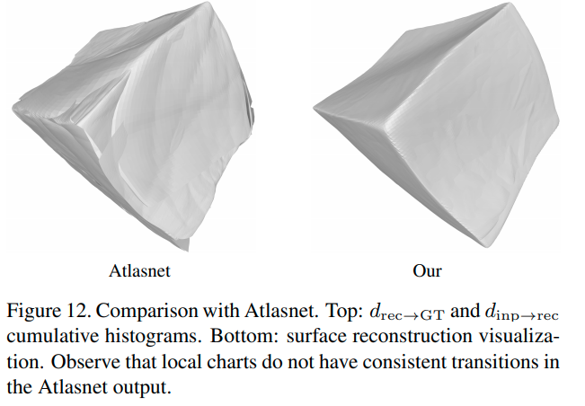

</details>

---

**`"Pix2Surf: Learning Parametric 3D Surface Models of Objects from Images"`**  
**[** `ECCV2020` **]** **[[paper]](https://arxiv.org/pdf/2008.07760.pdf)** **[[supp]](https://geometry.stanford.edu/projects/pix2surf/pub/pix2surf_supp.pdf)** **[[web]](https://geometry.stanford.edu/projects/pix2surf/)** **[[code(trained)]](https://github.com/JiahuiLei/Pix2Surf)** **[** :mortar_board: `Zhejiang University`, `Stanford`, `UCL` **]** **[** :office: `Adobe` **]**  
**[**  `Jiahui Lei`, `Srinath Sridhar`, `Niloy Mitra`, `Leonidas J. Guibas`  **]**  
**[** _`parametric 3D shape/parameterization`, `3D reconstruction`, `multi-view`, `single-view`, `surface reconstruction in NOCS`_ **]**  

<details markdown="1">
  <summary markdown="0">Click to expand</summary>

- **Result**
  - 评价：可以看到学出来的曲面可以不是闭合的
  - 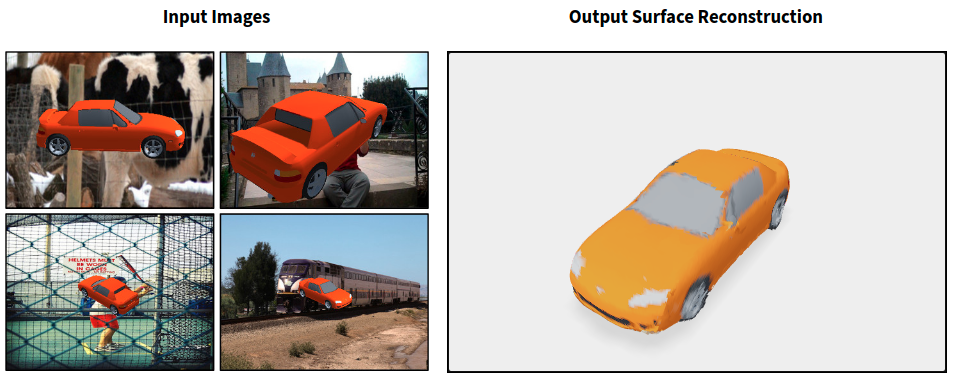
    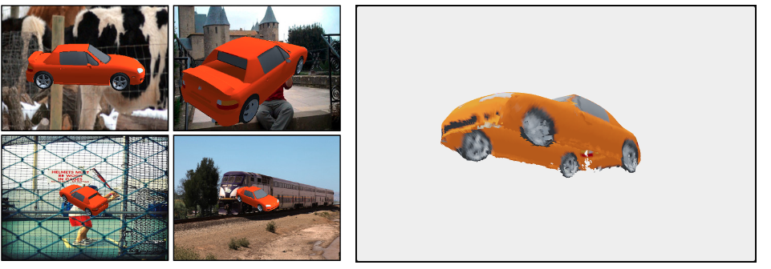
- **Motivation**
  - learning to generate 3D parametric surface representations for novel object instances, as seen from one or more views
  - 使用2D patch来作为UV parameterization，处理多个non-adjacent views，并且建立2D pixels和3D surface points之间的correspondence
  - 那些用implicit functions表达的surface，想要得到显式的表面，需要昂贵的后处理步骤：如Marching Cubes；本文直接学习生成显式的表面
- **主要贡献**
  - high-quality parametric surfaces 遵循multi view一致性
  - 生成的3D表面保留了精确的图像像素到3D表面点的correspondance，使得可以lift texture information去reconstruct 带有丰富集合与外观的 shapes
- **引用的directly reconstruct a parametric representation of a shape's surface**
  - class-specific templates  **<u>(canonical template / mean shape in canonical space)</u>**
    <br>逐个类别手动设计的shape template
    - [ECCV2018] Learning category-specific mesh reconstruction from image collections. 
    - [ICCV2019] Canonical surface mapping via geometric cycle consistency
  - general structured templates
    <br>适用于各种类别的通用shape template学习方法（应对不同的形状、拓扑）
    - [ICCV2019] Learning shape templates with structured implicit functions.
  - more generic surface representations
    - meshes deform
      - [ECCV2018] Pixel2mesh: Generating 3d mesh models from single rgb images.
      - [ICCV2019] Pixel2mesh++: Multi-view 3d mesh generation via deformation
      - [CVPR2019] 3DN: 3d deformation network.
    - differentiable mesh renderer + image supervision
      - [CVPR2018] Neural 3d mesh renderer
      - [2019]  Soft rasterizer: A differentiable renderer for image-based 3d reasoning
      - [2019] Pix2vex: Image-togeometry reconstruction using a smooth differentiable renderer.
      - [CVPR2019] Learning view priors for single-view 3d reconstruction.
    - ==continuous 2D patches== 本篇类似：使用2D patch来作为UV parameterization
      - [CVPR2018] Atlasnet: A papier-mâché approach to learning 3d surface generation. 
      - AtlasNet for video clip <br>[CVPR2019] Photometric mesh optimization for video-aligned 3d object reconstruction.
      - introduce topology modification to atlasnet <br>[ICCV2019] Deep mesh reconstruction from single rgb images via topology modification networks
- **preliminaries**
  - NOCS
    - 可以预测出一张图片的nocs map和mask
  - surface parameterization
    - 表面的UV参数化即一个`chart`
    - 用一组全连接网络学习多个`chart`
- overview
  - ==注意==：不同于atlas net，uv不是来自于均匀采样，而是来自于一个learned network，uv predictor<br>所以是先预测出图像每个像素的uv值，再把图像上属于这个物体的uv值集合和图像的feature 拼接一起来 输出 三维点集合(二维流形的三维点坐标集)<br>
  - ```mermaid
    graph LR
    	img[image coordinate] -.per index prediction.-> uv[uv value] --> MLP
    	image --> z[global latent code z] --> MLP
    	MLP --> 3d[3D surface coordinate]
    ```
  - <br>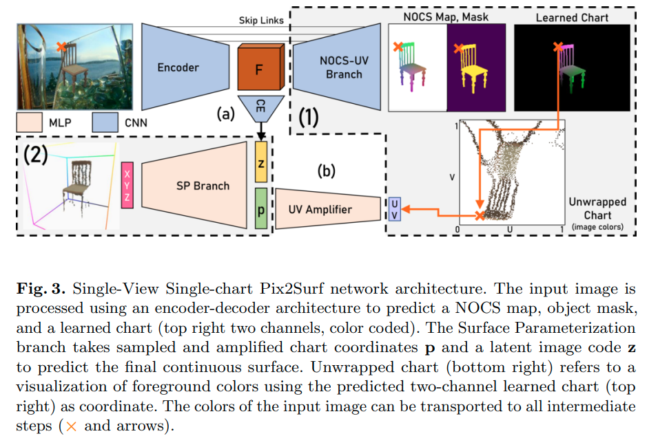
- single view single chart pix2surf
  - NOCS-UV branch
    - 在过去的NOCS输出上额外加两个channel，输出uv值
    - uv不是均匀采样来的，而是直接从图像预测出一张2-channel uv image <br>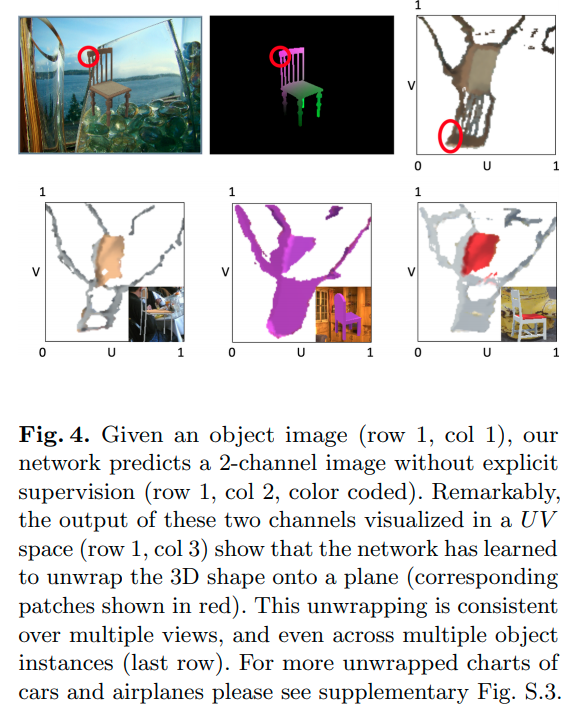
    - 发现可以emergence of a chart，并且这个chart几乎已经multi view consistent，multi object consistent
      - 即网络可以自己学出来如何把一个物体shape unrap到一个flat 空间
    - code-extractor 一个小CNN
      - 单张图片输入，输出一个global latent code z
    - UV amplifier
      - 因为UV坐标只有2维，而global latent code z维度很大，这两个信息不平衡
      - 所以就是用一组MLP先把UV升维
  - SP(surface parameterization) branch
    - 类似atlas net，以升维后的UV和global latent code的拼接为输入，输出三维点坐标
    - 与atlas net的不同：
      - uv升维了
      - 有一个learned chart，建立起图像坐标和3D surface坐标的直接相关
      - uv不是来自于均匀采样，而是从一个网络学出来的（即上面的NOCS-UV branch）
    - 输出的三维点坐标位于NOCS空间
  - loss / train
    - NOCS map的真值
    - 3D surface point的真值（从shapenet 3d model直接得到）
    - 其余都是端到端的
- multi view atlas pix2surf
  - 不同view的latent code取max pooling，max pooled code和该view的code concat在一起
  - 从一个view的pixel的NOCS map的真值，找到这个真值在另一个view下的绝对对应pixel位置<br>最小化这两个pixel预测出的3D 点距离，即为所定义的multi view consistency loss<br>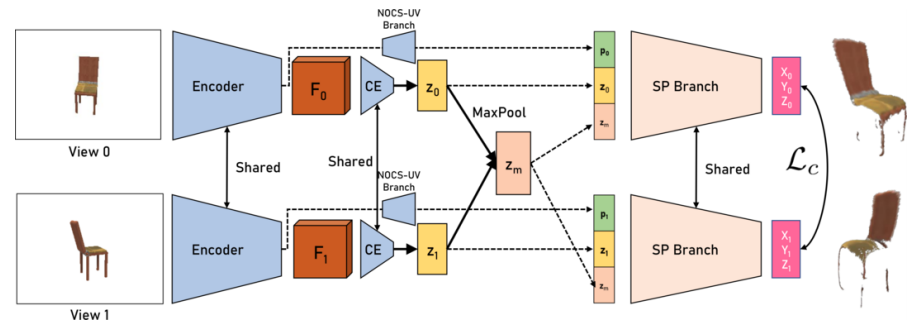

</details>

---

**`"Meshlet Priors for 3D Mesh Reconstruction"`**  
**[** `CVPR2020` **]** **[[paper]](https://arxiv.org/pdf/2001.01744.pdf)** **[[supp]](https://openaccess.thecvf.com/content_CVPR_2020/supplemental/Badki_Meshlet_Priors_for_CVPR_2020_supplemental.pdf)** **[[code]](https://github.com/NVlabs/meshlets)**   **[** :mortar_board: `UCSB` **]** **[** :office: `NVIDIA` **]**  
**[**  `Abhishek Badki`, `Orazio Gallo`, `Jan Kautz`, `Pradeep Sen`  **]**  
**[** _`local shape prior`, `geodesic parameterization`, `VAE`_ **]**  

<details markdown="1">
  <summary markdown="0">Click to expand</summary>

- **Motivation**
  - 输入点云，输出mesh
  - 过去的学习shape的方法，在学习先验时有两种：
    - object级别的先验，没有和pose解耦；
    - smooth regularizer先验，会损失local detail
  - 本篇想学习的是那些处于canonical pose下的local natural meshlets，用local natural meshlets，这种meshlets在不同物体、不同类别之间完全是shared，然后用这样纯粹的局部先验来拼出一个完整mesh

|                                                              |                                                              |
| ------------------------------------------------------------ | ------------------------------------------------------------ |
| 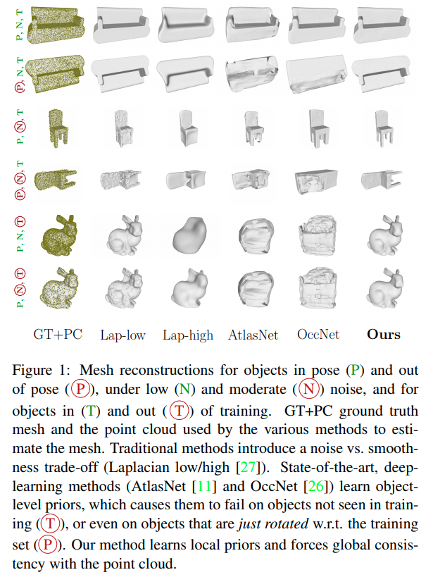 | P指的是测试时的物体在数据集物体pose分布内，红P指不在数据集pose分布内<br>N指的是低噪声，红N指moderate noise<br>T指训练集见过的物体类别，T指训练集没有见过的物体类别<br>可以看到，本篇重点强调学出那些和pose解耦了的局部的meshlets，用这些meshlets来拼出完整mesh |

 - **geodesic parameterization**
    - *Geodesic polar coordinates on polygonal meshes.* 
    - 把一个顶点和周围的点映射到这个顶点的切平面的坐标上；然后把切平面通过变换变换到canonical pose（即顶点位移到坐标原点，切平面的法向量即z轴，切平面的u,v轴和x,y轴重合）
    - 这样，可以实现pose解耦，学到那些各种各样的局部的meshlets
    - 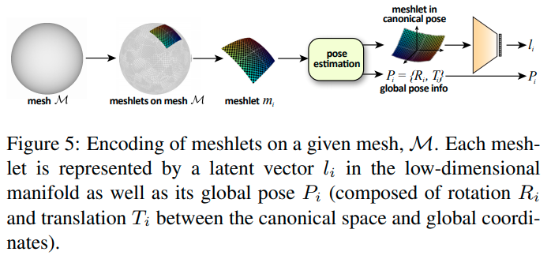
 - **VAE**
    - 用VAE把各种meshlets压缩到一个latent space
    - 然后应用它fit一个点云集合的时候，首先用encoder提取一个初始的latent code，然后auto-decoder来更新几步latent code
    - 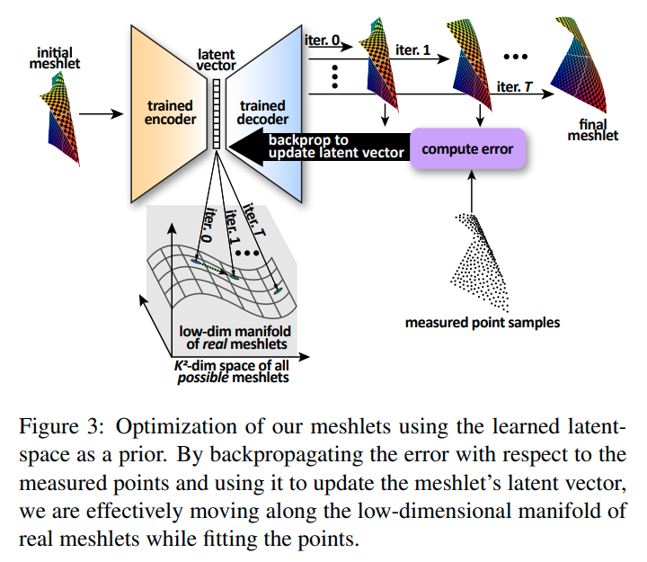
 - **overall optimization**
    - 首先随便初始化一个rough mesh，从这个rough mesh提取meshlets，保证每个vertex至少被3个meshlets cover
       - 注意，这样训练时就有两个量要迭代优化更新：一个是mesh，一个是一组meshlets；
       - 其中，每个meshlets由顶点和形状code构成
    - 迭代：更新每一个局部的local shape
       - 用point cloud和meshlets“拼成的mesh”的loss来更新每一个meshlet的形状
    - 迭代：再让local shape形成global consistency
       - 最小化更新后的meshlets的形状和“拼成的mesh”的误差
       - 首先固定meshlets的形状code，更新mesh顶点
       - 然后固定mesh顶点，更新meshlet的形状code
    - 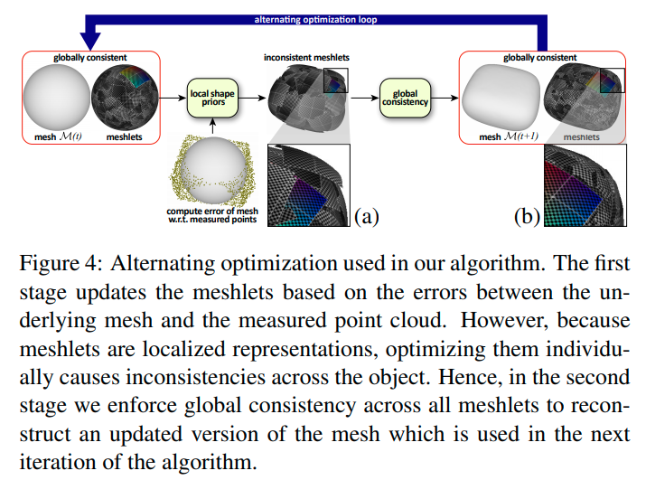

</details>

---

**`"Shape Reconstruction by Learning Differentiable Surface Representations"`**  
**[** `CVPR2020` **]** **[[paper]](https://arxiv.org/pdf/1911.11227)** **[[code]](https://github.com/bednarikjan/differential_surface_representation)** **[[video]](https://www.youtube.com/watch?v=6xEIDvCk1wA)** **[** :mortar_board: `EPFL` **]**   
**[**  `Jan Bednarik`, `Shaifali Parashar`, `Erhan Gundogdu`, `Mathieu Salzmann`, `Pascal Fua`  **]**  
**[** _`patch`, `control over patches`, `overlap`, `collapse`, `differential surface properties`_ **]**  

<details markdown="1">
  <summary markdown="0">Click to expand</summary>

- **Motivation**
  - 目前有一些学习an ensumble of Parametric表征的方法
    - 但是这些方法并没有控制表面patch的变形，因此并不能阻止patches彼此重叠或者折叠成一个点、一条线
    - 这种情况下，计算表面法向量就会变得困难、不可靠
  - 本篇提出 在训练时，开发深度神经网络的天生的可微性
    - 来利用表面的微分属性去阻止patch折叠、显著减少互相重叠
    - 并且这让我们可以可靠地计算表面法向量、曲率等
  - 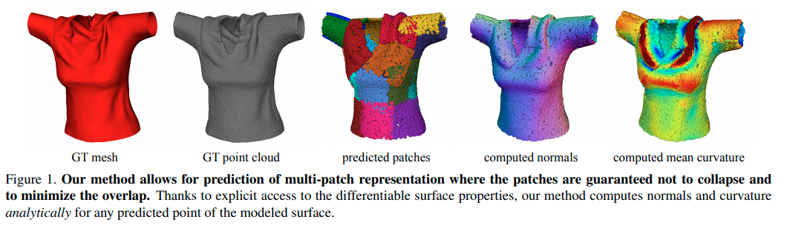
- **related works**: 在训练时使用differential surface properties
  - *Learning to Reconstruct Texture-Less Deformable Surfaces. 3DV2018*
  - *Marr Revisited: 2D-3D Model Alignment via Surface Normal Prediction. CVPR2016*
  - *A Two-Stream Network for Fast and Accurate 3D Cloth Draping. ICCV2019*
- **overview**
  - 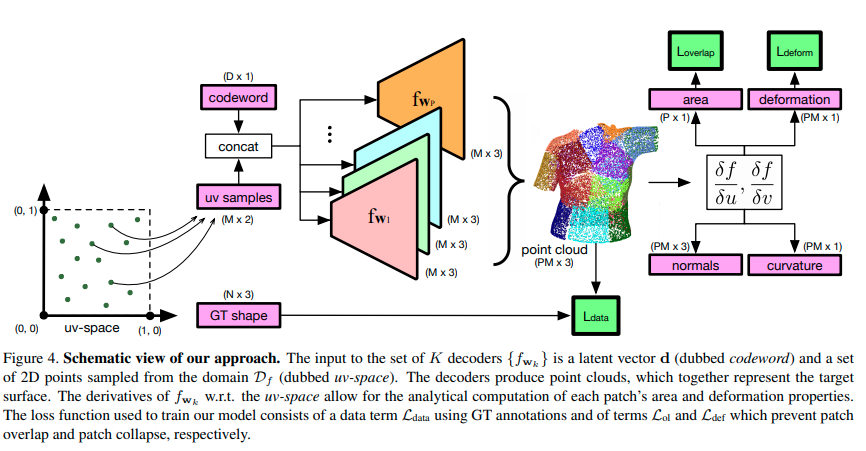
- **results**
  - 主要对比基线就是atlasNet
  - Pointcloud Autoencoding (PCAE)<br>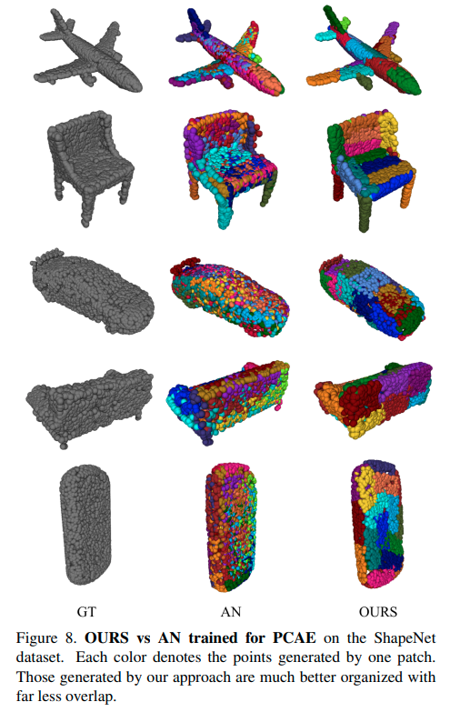
  - single view reconstruction (SVR) 单目重建<br>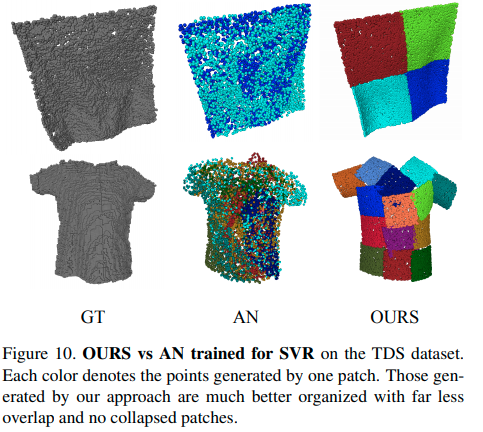

</details>

---

**`"Better Patch Stitching for Parametric Surface Reconstruction"`**  
**[** `2020` **]** **[[paper]](https://arxiv.org/pdf/2010.07021.pdf)** **[** :mortar_board: `EPFL` **]**   
**[**  `Zhantao Deng`, `Jan Bednařík`, `Mathieu Salzmann`, `Pascal Fua`  **]**  
**[** _`patch stitching`, `atlas`, `learning`_ **]**  

<details markdown="1">
  <summary markdown="0">Click to expand</summary>

- **Motivation**
  - 对目前的multiple patch based parametric surface representations（atlas），改进patches的`global consistency`（即防止**<u>孔洞</u>**和多个patch不正确**<u>交叉</u>**"jagged/带**<u>锯齿</u>**的"的情况）
  - 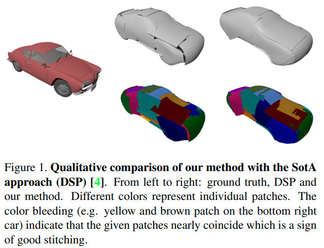
  - 典型的缝合问题（1D表示）<br>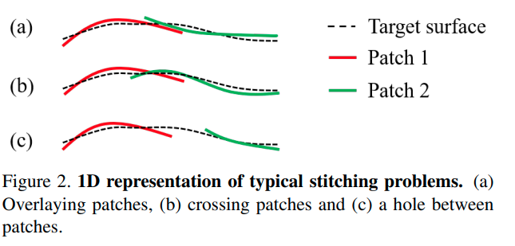
- **Related works：patch-wise representations**
  - FoldingNet *Foldingnet: Point Cloud Auto-Encoder via Deep Grid Deformation.CVPR2018*<br>第一个基于深度神经网络的工作：学到一个参数化的函数来在3D空间中嵌入一个2D流形
  - 后面的工作shifted to ensembles of such learned functions来做patch-wise表征：
    - learning (encoder)
      - *Atlasnet: A papier-mâché approach to learning 3d surface generation. CVPR2018*
      - *Learning elementary structures for 3d shape generation and matching. NeurIPS2019*
      - *Shape reconstruction by learning differentiable surface representations. CVPR2020* 这是作者的前作，用正则化来减轻表面的扭曲、重叠
      - *Tearingnet: Point cloud autoencoder to learn topology-friendly representations. arXiv, 2020.*
    - optimization (auto-decoder)
      - *Deep geometric prior for surface reconstruction. CVPR2019*
      - *Meshlet priors for 3d mesh reconstruction. CVPR2020*
    - 2D output domain
      - *Deep parametric shape predictions using distance fields. CVPR2020*
    - 因为连续的patch可以以任意精度采样，因此在拟合的时候可以有很高的精度
    - 目前方法的主要缺陷
      - 学到的表面高度扭曲、大规模重叠；只能通过适当的regularization正则化来减轻（即作者前一篇工作*Shape reconstruction by learning differentiable surface representations*）
      - 更紧急的问题：individual patches的放置时的global inconsistency，导致surface artifacts，比如孔洞，或者一些多个patch不正确交叉的区域
        - 这个问题在meshlet和*Deep geometric prior for surface reconstruction.* 两篇里有一定程度攻击，但是只在optimization settings，很缓慢，并且在test time还需要几何观测（如带噪声的点云）；
      - 本篇主要基于learning-based (带encoder) 前作，利用它的低扭曲、低重叠属性，改进patches的global consistency

</details>

# learning implicit surface: implicit fields/implicit functions

- overview
   - 既然可以用一个隐函数$$ f(x,y,z)=0 $$表达一个隐曲面<br>
   - 那当然可以先用$$ 某种神经网络_{一般是MLP+ReLU} $$去拟合构建一个空间数量值函数$$ f(x,y,z)_{数量值一般物理意义为占用概率/与表面距离/表面内外等} $$ ，然后训练这个神经网络
   - 训练好以后，如果需要从这个隐函数中提取mesh，一般就用marching cubes类方法空间采样

## sample based methods to extract explicit surface

---

**`<IM-Net> "Learning Implicit Fields for Generative Shape Modeling"`**  
**[** `CVPR2019` **]** **[[paper]](https://openaccess.thecvf.com/content_CVPR_2019/papers/Chen_Learning_Implicit_Fields_for_Generative_Shape_Modeling_CVPR_2019_paper.pdf)** **[[web]](https://www.sfu.ca/~zhiqinc/imgan/Readme.html)** **[[code]](https://github.com/czq142857/implicit-decoder)** **[[code-improve]](https://github.com/czq142857/IM-NET)**  **[[code-pytorch]](https://github.com/czq142857/IM-NET-pytorch)** **[** :mortar_board: `SFU` **]**   
**[**  `Zhiqin Chen`, `Hao Zhang`  **]**  
**[** _`implicit shape representation`, `inside-outside indicator`_ **]**  

<details markdown="1">
  <summary markdown="0">Click to expand</summary>

- **Motivation**
  - inside / outside indicator
  - 其实是一种类别级别的连续函数隐式的shape表征，类似occupancy networks；
    <br>输入code + one point 坐标，输出在shape 内/外；（类似SDF）
  - 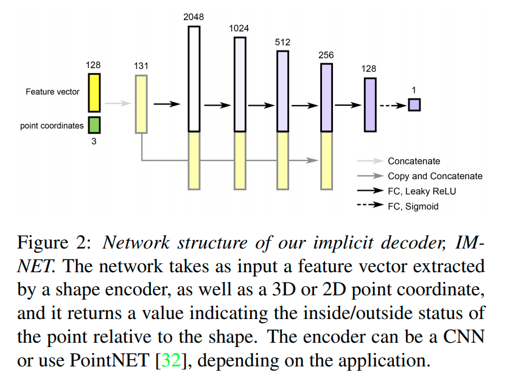

</details>

---

**`"Occupancy Networks: Learning 3D Reconstruction in Function Space"`**  
**[** `CVPR2019` **]** **[[paper]](https://openaccess.thecvf.com/content_CVPR_2019/papers/Mescheder_Occupancy_Networks_Learning_3D_Reconstruction_in_Function_Space_CVPR_2019_paper.pdf)** **[[code]](https://github.com/autonomousvision/occupancy_networks)** **[** :mortar_board: `MPI`, `University of Tubingen` **]** **[** :office: `Google AI Berlin` **]**  
**[**  `Lars Mescheder`， `Andreas Geiger`  **]**  
**[** _`continuous function occupancy`, `multi-resolution isosurface extraction`, `marching cubes`_ **]**  

<details markdown="1">
  <summary markdown="0">Click to expand</summary>

- **Motivation**
  - 用一个隐式函数来表达占用概率，从而可以实现任意分辨率的表达<br>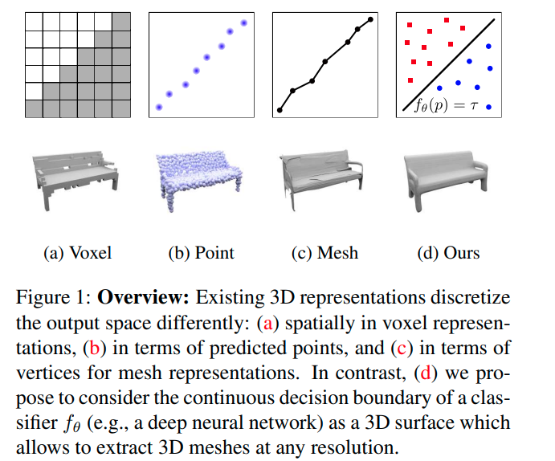
- **主要框架**
  - **多分辨率等值面提取技术** [Multiresolution IsoSurface Extraction (MISE)]<br>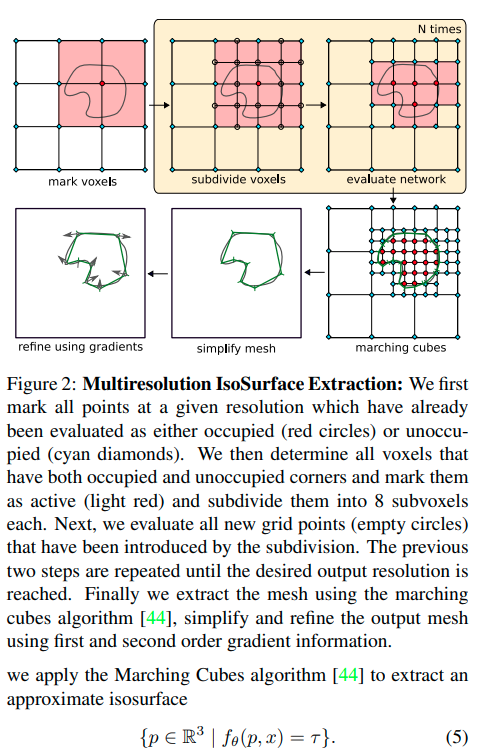

</details>

---

**`"Convolutional Occupancy Networks"`**  
**[** `ECCV2020` **]** **[[paper]](https://arxiv.org/pdf/2003.04618.pdf)** **[[code]](https://github.com/autonomousvision/convolutional_occupancy_networks)** **[** :mortar_board: `ETH`, `MPI`, `University of Tubingen` **]** **[** :office: `Amazon`, `Microsoft` **]**  
**[**  `Songyou Peng`, `Michael Niemeyer`, `Lars Mescheder`, `Marc Pollefeys`, `Andreas Geiger`  **]**  
**[** _`Occupancy Networks`_ **]**  

<details markdown="1">
  <summary markdown="0">Click to expand</summary>

- **Motivation**
  - 从Occupancy Network的continuous feature function到voxelized features + 3D conv<br>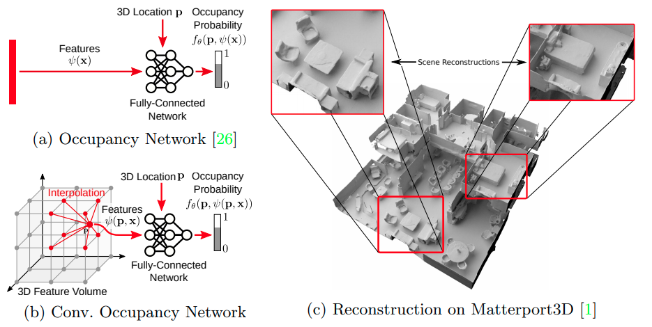

</details>

---

**`"Dynamic Plane Convolutional Occupancy Networks"`**  
**[** `WACV2021` **]** **[[paper]](https://arxiv.org/pdf/2011.05813.pdf)** **[[code]](https://github.com/dsvilarkovic/dynamic_plane_convolutional_onet)** **[** :mortar_board: `MPI`, `ETH` **]**   
**[**  `Stefan Lionar`, `Daniil Emtsev`, `Dusan Svilarkovic`, `Songyou Peng`  **]**  
**[** _`3D reconstruction`, `occupancy networks`_ **]**  

<details markdown="1">
  <summary markdown="0">Click to expand</summary>

- **Motivation**
  - occupancy networks是continuous function；<br>convolutional occupancy networks是voxelized features；<br>本篇是动态平面组上的features
  - 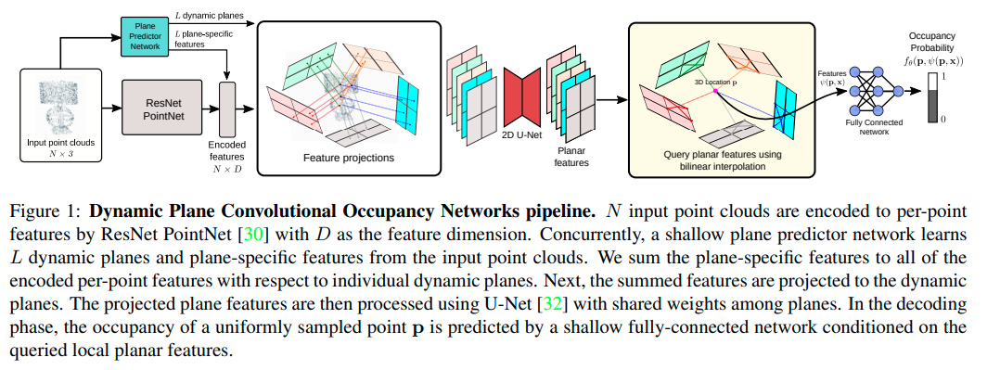

</details>

---

**`"DeepSDF: Learning Continuous Signed Distance Functions for Shape Representation"`**  
**[** `CVPR2019` **]** **[[paper]](https://arxiv.org/pdf/1901.05103.pdf)** **[[code]](https://github.com/facebookresearch/DeepSDF)** **[** :mortar_board: `UW`, `MIT` **]** **[** :office: `Faceboook reality labs` **]**  
**[**  `Jeong Joon Park`, `Peter Florence`, `Julian Straub`, `Richard Newcombe`, `Steven Lovegrove`  **]**  
**[** _`SDF`_ **]**  

<details markdown="1">
  <summary markdown="0">Click to expand</summary>

- **Motivation**
  - SDF是CG领域又一个形状的表征；本篇是first to use deep SDF functions to model shapes
  - 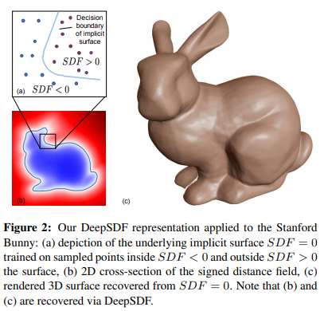
  - 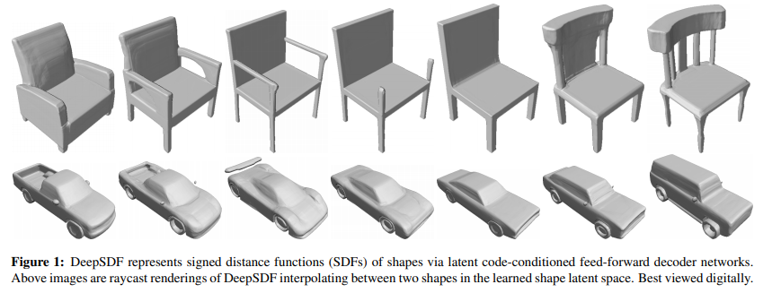
- **overview**
  - 单个形状用单个SDF网络，一个category用code conditioned<br>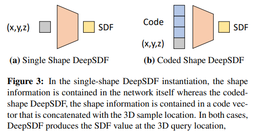
  - 使用auto-decoder<br>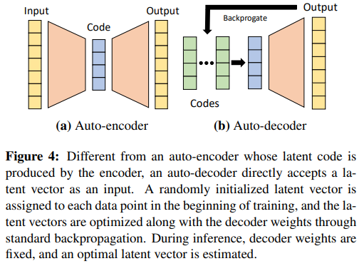

</details>


---

**`"DISN: Deep Implicit Surface Network for High-quality Single-view 3D Reconstruction"`**  
**[** `NeurIPS2019` **]** **[[paper]](https://arxiv.org/pdf/1905.10711.pdf)** **[[code]](https://github.com/laughtervv/DISN)** **[** :mortar_board: `University of Southern California` **]** **[** :office: `Adobe` **]**  
**[**  `Weiyue Wang`, `Qiangeng Xu`, `Duygu Ceylan`, `Radomir Mech`, `Ulrich Neumann`  **]**  
**[** _`SDF`, `single-view`, `encoder`_ **]**  

<details markdown="1">
  <summary markdown="0">Click to expand</summary>

- **review**
  - 训练时是有3D shape 的SDF的真值数据的；图像feature只是提供一个辅助的code输入而已
- **Motivation**
  - 希望学到的shape，不仅全局特征好，还想有局部fine grained details 细粒度细节
- **overview**
  - 同时用global features和local features来infer SDF<br>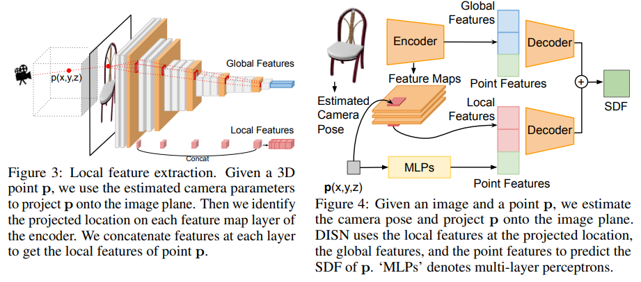

</details>

---

**`"SAL: Sign agnostic learning of shapes from raw data."`**  
**[** `CVPR2020` **]** **[[paper]](https://arxiv.org/pdf/1911.10414.pdf)** **[[code]](https://github.com/matanatz/SAL)** **[** :mortar_board: `Weizmann Institute of Science` **]**   
**[**  `Matan Atzmon`, `Yaron Lipman`  **]**  
**[** _`sign agnostic`_ **]**  

<details markdown="1">
  <summary markdown="0">Click to expand</summary>

- **Motivation**

</details>

---

**`"BSP-Net: Generating Compact Meshes via Binary Space Partitioning"`**  
**[** `CVPR2020(Oral)` **]** **[[paper]](https://openaccess.thecvf.com/content_CVPR_2020/papers/Chen_BSP-Net_Generating_Compact_Meshes_via_Binary_Space_Partitioning_CVPR_2020_paper.pdf)** **[[code(tf)]](https://github.com/czq142857/BSP-NET-original)** **[[code(pytorch)]](https://github.com/czq142857/BSP-NET-pytorch)** **[[web]](https://bsp-net.github.io/)**  **[** :mortar_board: `SFU` **]** **[** :office: `Google` **]**  
**[**  `Zhiqin Chen`, `Andrea Tagliasacchi`, `Hao Zhang`  **]**  
**[** _`low-poly`, `convex composition`, `category-shape correspondence`,  `part correpondence`, `inside-outside indicator`_ **]**  

<details markdown="1">
  <summary markdown="0">Click to expand</summary>

- **review**
  - IM-Net同作的续作
  - 效果很好；但是对于thin-structure表现不佳
- **Motivation**
  - take inspiration from binary space partitions，学到更`compact` / 紧致 / low-poly的mesh表征 <br>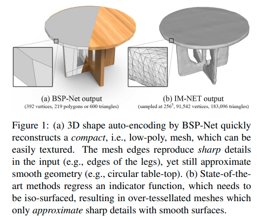
- **overview**
  - 依旧是输入point坐标 + shape code condition，输出inside / outside；
  - 不同之处在于构造的内部模型是`n`个平面方程，靠`n`个这样的binary space partition的组合来表征shape
  - 靠binary partition的组合来表达shape的示意图：<br>首先组合出一个个的`convex`凸包，再组合成 whole shape
    - 其实做的事情本质上类似于把MLP+ReLU的空间线性划分过程显式化，不过这里的convex的概念值得思考

| 示意图                                                       | 网络结构                                                     |
| ------------------------------------------------------------ | ------------------------------------------------------------ |
| 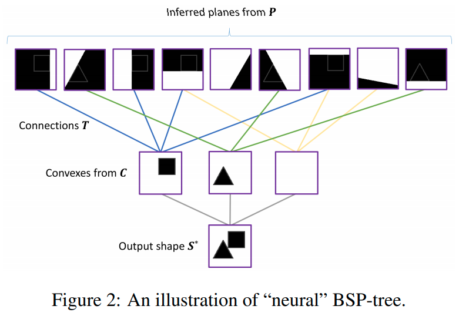 | 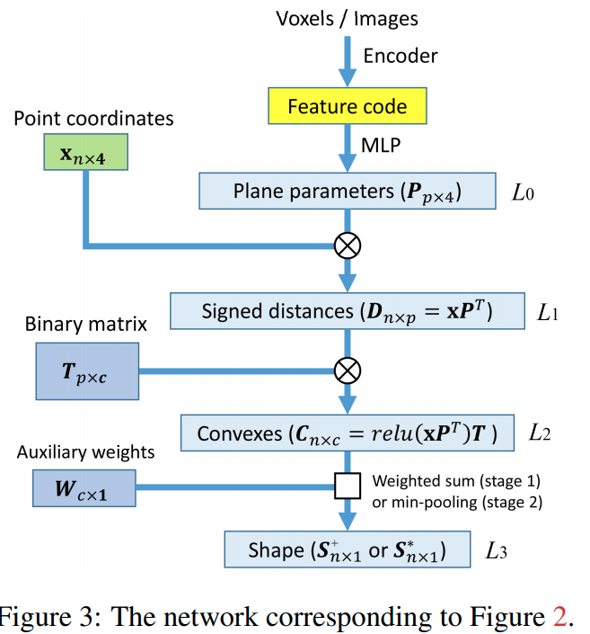 |

 - **few shot segmentation**
   -  因为同category的shape的convex组合之间已经建立起了`correspondence`，只需要手动给几个shape标一下convex id对应的part label，就可以利用correspondence获得其他同category shape的标注<br>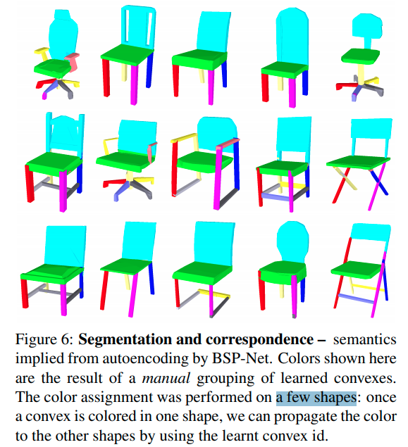
 - **results**
    - 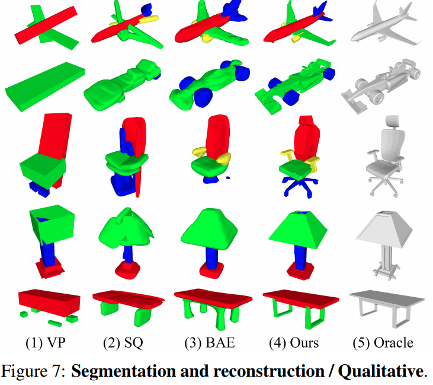
    - 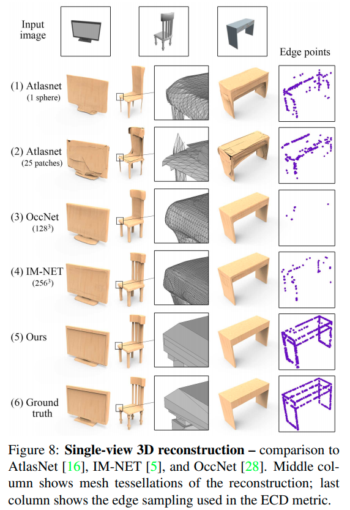

</details>

---

**`"CvxNet: Learnable Convex Decomposition"`**  
**[** `CVPR2020` **]** **[[paper]](https://openaccess.thecvf.com/content_CVPR_2020/papers/Deng_CvxNet_Learnable_Convex_Decomposition_CVPR_2020_paper.pdf)** **[[code(tf-graphics official repo)]](https://github.com/tensorflow/graphics/tree/master/tensorflow_graphics/projects/cvxnet)** **[[web]](https://cvxnet.github.io/)**  **[** :office: `Google` **]**  
**[**  `Boyang Deng`, `Kyle Genova`, `Soroosh Yazdani`, `Sofien Bouaziz`, `Geoffrey Hinton`, `Andrea Tagliasacchi`  **]**  
**[** _`convex composition`, `inside-outside indicator`_ **]**  

<details markdown="1">
  <summary markdown="0">Click to expand</summary>

- **review**
  - 和BSP-Net的概念很像；用一个个由平面包围出的`convex`定义surface；输入是点坐标，输出是 `inside/outside indicator`
  - [ ] 和BSP-Net的区别是这里是softmax？
- **Motivation**
  - from hyperplanes to occupancy<br>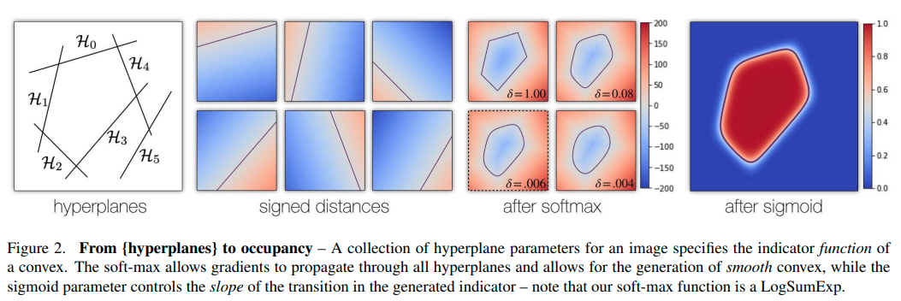
  - 

</details>

---

**`"Neural-Pull: Learning Signed Distance Functions from Point Clouds by Learning to Pull Space onto Surfaces"`**  
**[** `2020` **]** **[[paper]](https://arxiv.org/pdf/2011.13495.pdf)** **[[code]](https://www.github.com)** **[[web]](abc.efg)** **[** :mortar_board: `Tsinghua`, , `University of Maryland` **]**   
**[**  `Baorui Ma`, `Zhizhong Han`, `Yu-Shen Liu`, `Matthias Zwicker`  **]**  
**[** _`reconstructing surfaces from 3D pointcloud`, `surface reconstruction`_ **]**  

<details markdown="1">
  <summary markdown="0">Click to expand</summary>

- **Motivation**
  - 训练一个神经网络去把query 3D locations "拉" 到他们在表面上的最近邻居；<br>拉的操作，方向是query locations处的网络梯度，步长是query locations处的网络SDF值，这两个都是从网络自身计算出来的<br>
  - 让我们可以同时更新sdf值和梯度
  - 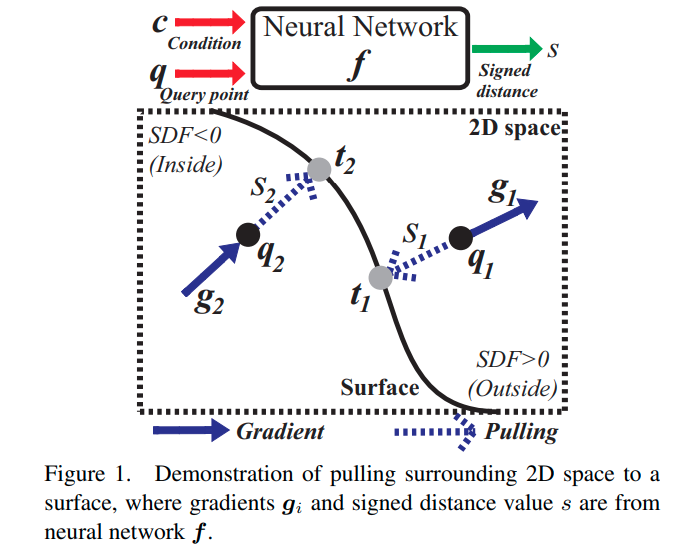
- **overview**
  - loss functions直接从GT点云本身定义，而不是利用GT SDF作回归；<br>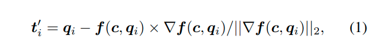<br>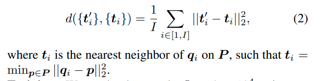

</details>

---

**`"DUDE: Deep Unsigned Distance Embeddings for Hi-Fidelity Representation of Complex 3D Surfaces"`**  
**[** `2021` **]** **[[paper]](https://abc.efg)** **[[code]](https://www.github.com)** **[** :mortar_board: `CMU` **]** **[** :office: `Verisk Analytics` **]**  
**[**  `Rahul Venkatesh`, `Sarthak Sharma`, `Aurobrata Ghosh`, `Laszlo Jeni`, `Maneesh Singh`  **]**  
**[** _`unsigned distance field`, `normal vector field`, `open topogoly surfaces`_ **]**  

<details markdown="1">
  <summary markdown="0">Click to expand</summary>

- **Motivation**
  - 现有的隐式表面deep networks方法只能表征拓扑上闭合的形状；<br>并且结果是，训练时候经常需要clean watertight meshes
  - 本篇提出无符号的距离嵌入减轻了上述问题
    - 利用`unsigned distance field (uDF)`无符号距离场来表达对表面的接近程度
    - 利用`normal vector field (nVF)`法向量场来表达表面朝向
    - uDF + nVF 可以表达任意开/闭拓扑的high fidelity形状
    - 可以从带噪声的triangle soups学习，不需要watertight mehses
    - 并且额外提供了学到的表征提取、渲染等值面的新方法
  - 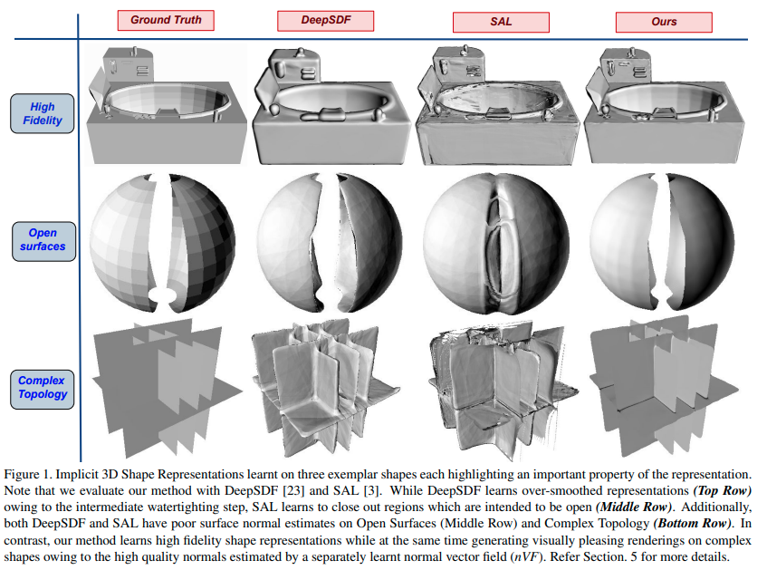
- **overview**
  - uDF+nVF<br>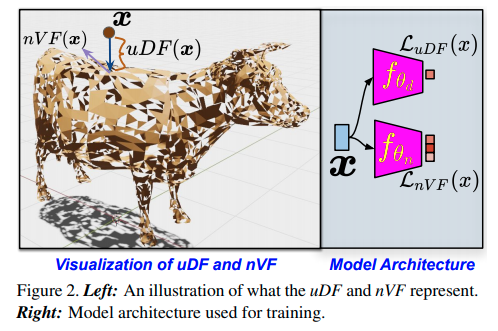

</details>

---

**`"Deformed Implicit Field: Modeling 3D Shapes with Learned Dense Correspondence"`**  
**[** `2021` **]** **[[paper+supp]](https://arxiv.org/pdf/2011.13650.pdf)** **[[code]](https://github.com/microsoft/DIF-Net)** **[** :office: `MSRA` **]** **[** :mortar_board: `Tsinghua` **]**   
**[**  `Yu Deng`, `Jiaolong Yang`, `Xin Tong`  **]**  
**[** _`3D deformation field`, `template field`, `category shape correspondence`_ **]**  

<details markdown="1">
  <summary markdown="0">Click to expand</summary>

- **Motivation**
  - 把每个具体instance shape表达为一个template的shape的deformation
  - 用deformation field建立起 **`<u>shape correspondence</u>`**，这样就可以做texture transfer、label transfer等
  - 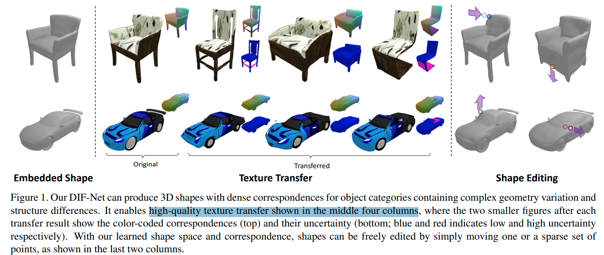
- **overview**
  - 用一个超网络从code预测DeformNet $$ D $$的参数；<br>然后在空间中的每一处，从同一个template SDF，DeformNet $$ D $$产生位置修正$$ v $$与标量距离修正$$ \Delta s $$，总共4维输出<br>即最终的$$ p $$点处的SDF值为：$$ s=T(p+v)+\Delta s=T(p+D^v_{\omega}(p))+D^{\Delta s}_{\omega}(p) $$<br>注意变形向量$$v$$其实反映的是从shape instance场 到 template 场所需的变形向量<br>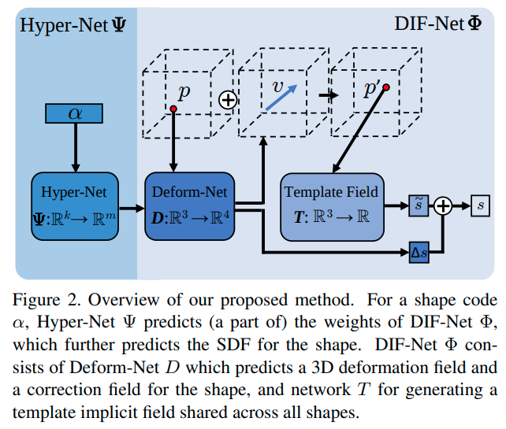
- **losses**
  - SDF loss
    - 被训练的量：变形场超网络$$\Psi$$，SDF输出场$$\Phi$$，模板场$$T$$，learned latent codes $$\{\alpha_j\}$$；$$\Psi_i(p)$$代表predicted SDF值$$\Phi_{\Psi(\alpha_i)}(p)$$，$$\Omega$$代表3D空间，$$\mathcal{S}_i$$ 代表形状表面
      - $$\Phi_{\Psi(\alpha)}(p)=T(p+D_{\Psi(\alpha)}^v(p)) + D_{\Psi(\alpha)}^{\Delta s}(p)$$
    - $$L_{sdf}=\underset {i}{\sum} \left( $1 + $2 + $3 + $4 \right)$$
      - $$\underset {p \in \Omega}{\sum} \lvert \Phi_i(p)-\overline{s}\rvert$$ 代表预测SDF和正确SDF的误差
      - $$\underset{p\in \mathcal{S}_i}{\sum} (1-\langle \nabla\Phi_i(p), \overline{n} \rangle)$$ 代表预测法向量和正确法向量的误差（角度误差，用夹角余弦应接近1来表达）
      - $$\underset{p\in\Omega}{\sum} \lvert \Vert \nabla\Phi_i(p) \rVert_2 - 1 \rvert$$ 代表预测法向量的模应该是1 （因为是SDF）
      - $$\underset{p\in\Omega \backslash \mathcal{S}_i}{\sum} \rho(\Phi_i(p)), \;where \; \rho(s)=\exp(-\delta \cdot \lvert s \rvert), \delta \gg 1 $$ 代表对 **SDF值靠近0** 的 **非表面** 点的惩罚；
        - $$\delta \gg 1$$就代表只有靠近0的时候这项loss才有值
          - [ ] Q: 类似一种负的L0-norm ？
        - 详见 *(SIREN) Implicit neural representations with periodic activation functions. NeurIPS2020* 论文
  - 正则化
    - regularization loss to constrain the learned latent codes: $$L_{reg}=\underset{i}{\sum} \lVert \alpha_i \rVert_2^2$$
    - 可以用一些其他更强的正则化，比如VAE训练时用的 最小化latent code后验分布和高斯分布的KL散度
  - normal consistency prior 法向量一致性先验
    - 考虑到表面点和语义 高度关联：e.g. （在canonical space假设下）车顶总是指向天空，左车门总是指向左侧
    - 因此，让相关的点的法向量互相一致
      - 鼓励 模板场中的点处的法向量 和 **所有给定shape instance** 中的相关点 处的法向量 一致
      - $$L_{normal}=\underset{i}{\sum} \underset{p\in\mathcal{S}_i}{\sum} \left( 1 - \langle \nabla T(p+D_{\omega_i}^v (p)), \overline{n} \rangle \right)$$
      - 即让模板场中的 对应位置p的点 和 真值法向量保持一致
      - ~~如果没有标量修正场，模板场对应位置p的点处的法向量就是 最终输出场的法向量，和$$L_{sdf}$$的第2项一样~~
        - [ ] Q: 以下为笔者猜想。有待代码检查验证。
        - 变形后的形状shape instance场中的点坐标是$$p$$，模板场中的 **相关** 点坐标是 $$p+D_{\omega_i}^v (p)$$
        - **相关** 点处的法向量 其实是$$\nabla_{p+D_{\omega_i}^v (p)} T(p+D_{\omega_i}^v (p))$$，而非$$\nabla_p T(p+D_{\omega_i}^v (p))$$
        - $$L_{sdf}$$第2项是$$\nabla_p\Phi_i(p)=\nabla_p \left( \quad T(p+D_{\omega_i}^v (p)) \; (+D_{\omega_i}^{\Delta s}(p)) \quad \right)$$
        - 即其主要是强调 模板场 和 变形后的形状实例场 中 相关点处的 两个场的法向量保持一致性
        - 其实应该是$$\nabla_{p+D_{\omega_i}^v (p)} T(p+D_{\omega_i}^v (p))$$和$$\nabla_p\Phi_i(p)$$的夹角，而不是和$$\overline{n}$$的夹角；<br>只不过$$\nabla_p\Phi_i(p)$$就是$$\overline{n}$$的近似，所以用$$\overline{n}$$也可
  - deformation smoothness prior 变形平滑先验
    - 鼓励平滑的变形、防止巨大的形状扭曲，引入一个对变形场的平滑loss
    - $$L_{smooth}=\underset{i}{\sum} \underset{p\in\Omega}{\sum} \underset{d\in{X,Y,Z}}{\sum} \lVert \nabla D_{\omega_i}^v \vert_d (p) \rVert_2$$ 惩罚X,Y,Z方向的空间梯度
  - minimal correction prior
    - 鼓励形状表征主要是通过 形变场，而不是通过标量修正
    - $$L_c=\underset{i}{\sum} \underset{p\in\Omega}{\sum} \lvert D_{\omega_i}^{\Delta s}(p) \rvert$$ 惩罚标量修正L1大小
  - $$\underset{\{\alpha_j\}, \Psi, T }{\arg\min} L_{sdf} + w_1 L_{normal}+w_2 L_{smooth}+w_3 L_c + w_4 L_{reg}$$，<br>$$L_{sdf}$$中的4项：3e3, 1e2, 5e1, 5e2<br>$$w_1=1{\rm e}2, w_2=\{1,2,5\}, w_3=\{1{\rm e}2, 5{\rm e}1\}, w_4 = 1{\rm e}2$$
- **相关性 uncertainty measurement**
  - 两个物体$$\mathcal{O}_i$$和 $$\mathcal{O}_j$$之间的 `相关性` 可以通过在 `template space`中进行 **`最近邻搜索`** 来建立；
  - 假设物体$$\mathcal{O}_i$$（表面）上一点$$p_i$$，通过最近邻搜索找到了点$$p_i$$在物体$$\mathcal{O}_j$$上`相关`的（表面上的）一点$$p_j$$
    - 那么二者之间相关性的不确定性可以通过一个simple yet surprisingly-effective的uncertainty metric评估：
    - $$u(p_i,p_j)=1-\exp(-\gamma \lVert (p_i+v_i) - (p_j+v_j) \rVert_2^2)$$
      - 其中$$v_i=D_{\omega_i}^v(p_i)$$ 是点上的变形向量；是从 shape instance space到 template space的$$\Delta$$
      - $$\lVert (p_i+v_i) - (p_j+v_j) \rVert_2$$其实就是这对相关点$$p_i$$和$$p_j$$在template space下的距离
    - 不确定性大的区域 comform well to 形状之间的 `structure discrepancy` 结构不符<br>下图展示的是形状A（表面）上的点，在形状B（表面）上找到的相关的点的不确定性；红色高不确定性，蓝色低不确定性<br>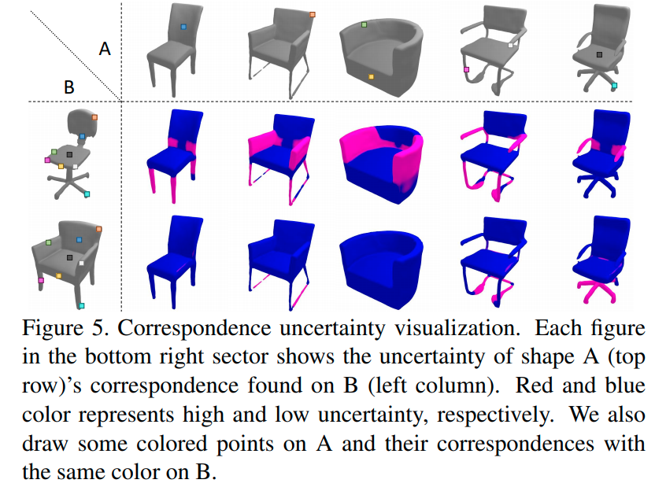
- **results**
  - texture transfer <br>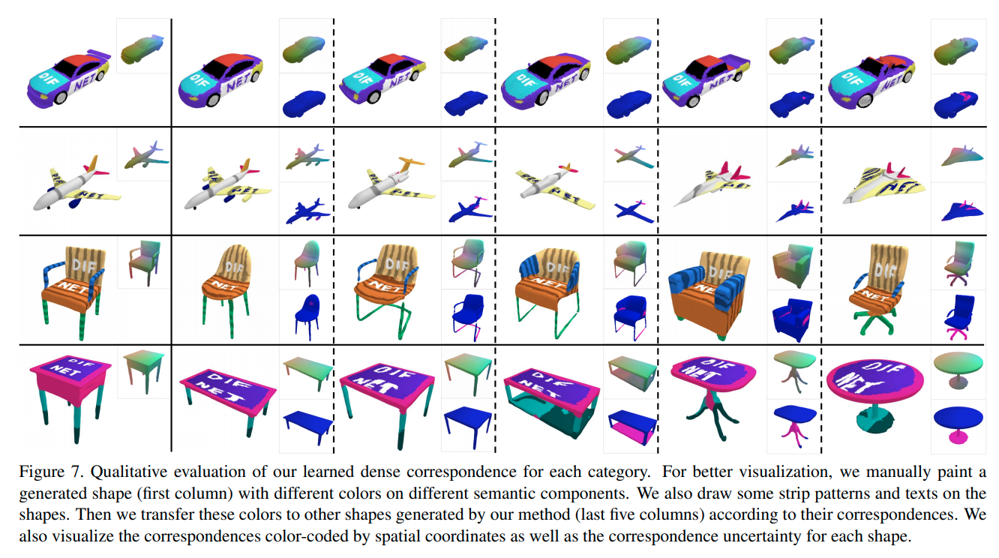<br>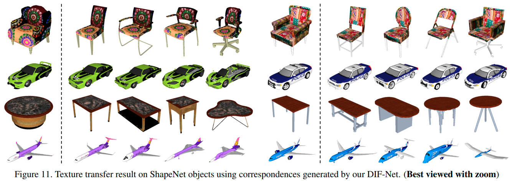
  - label transfer：可以看到对于 椅子把 这种时有时无的结构也可以handle<br>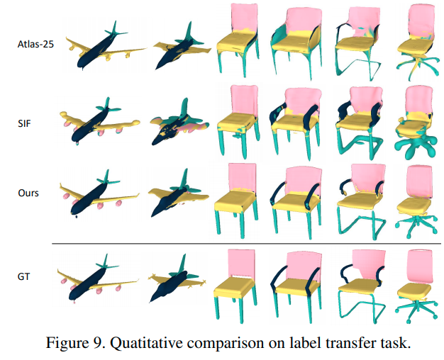
- **Ablation study / discussions**
  - 单纯的位置修正就已经可以构成变形场；但是本篇发现，仅仅位置修正不够，加入标量修正可以：
    - 加入标量修正对生成所需shape有帮助
      - 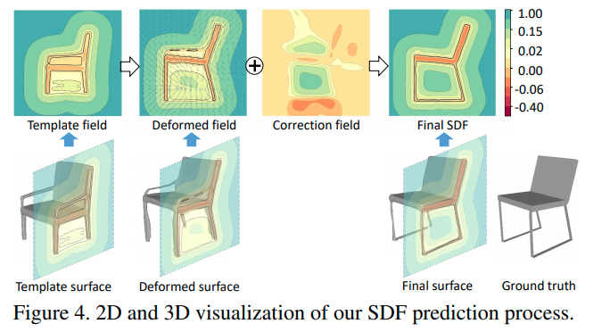
    - 实验发现 **<u>加入标量修正对于学习高质量的相关性也很重要</u>**
      - [ ] Q: why ? <br>试图解释：标量修正可以控制形状的一部分 特征： `膨胀`？`结构/拓扑改变`？，从而更容易学到简单、plausible的对应关系？
        - [ ] Q: 类似CGAN中，用一个随机噪声z控制一些`"不想要"`的特征？
        - [ ] Q: 除了标量修正这种控制`"额外"`/`"不想要"`的特征的方式以外，可否设法引入其他方式控制其他`"不想要"`的特征？
  - template implicit field ≠ template shape
    - template implicit field并不是template shape；甚至都不是valid SDF
    - instead，template implicit field 捕捉的是 **一个category中不同物体的shape `结构`** 
    - 在实验中，发现如果loss不合适的情况下，template implicit field **`degenerates` to a <u>valid shape SDF</u>** representing a certain shape, 导致重建的 **精确度下降**、**相关性降低**
  - 几个training loss对结果的影响<br>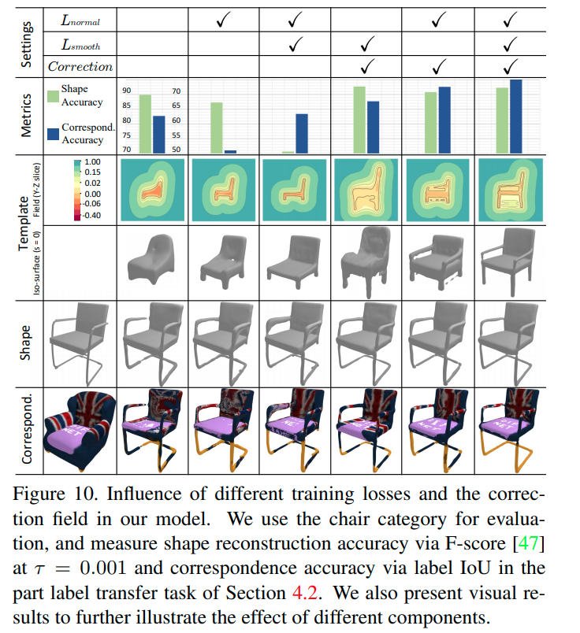
- **implementation details**
  - 网络结构<br>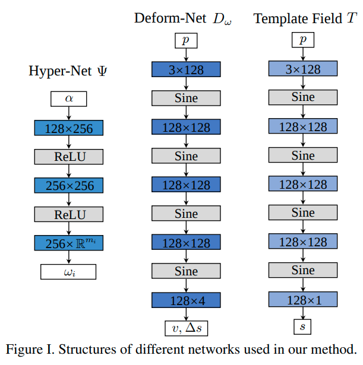

</details>

---

**`"Deep Implicit Templates for 3D Shape Representation"`**  
**[** `2020` **]** **[[paper]](https://arxiv.org/pdf/2011.14565.pdf)** **[[web]](http://www.liuyebin.com/dit/dit.html)** **[[supp_video]](http://www.liuyebin.com/dit/assets/supp_vid.mp4)** **[[code]](https://github.com/ZhengZerong/DeepImplicitTemplates)**  **[** :mortar_board: `Tsinghua` **]**   
**[**  `Zerong Zheng`, `Tao Yu`, `Qionghai Dai`, [`Yebin Liu`](http://www.liuyebin.com/)  **]**  
**[** _`spatial warping LSTM`, `category shape correpondence`_ **]**  

<details markdown="1">
  <summary markdown="0">Click to expand</summary>

- **review**
  - 这种变形场类方法，最大的问题应该在于当 层级结构 / 拓扑 发生大的改变时，这种很大程度由位置决定的对应关系是否无法准确反应结构上的变化，从而导致degenerates的行为
  - 和 *deformed implicit field* 思路很像，那篇也是清华的
    - deformed implicit field 除了位置修正外还有$$\Delta s$$修正；本篇只有位置修正
    - deformed implicit field 是一个超参数网络，从code得到位置修正、$$\Delta S$$修正的网络 **<u>参数</u>**；本篇是一个LSTM，输入code+p输出位置修正
  - 因为有很多谨慎的设计（1. 使用LSTM warp而不是MLP warp 2.对canonical的正则化 3. 对空间扭曲的正则化），从transfer的效果上看要比deformed implicit field好一些？

| 本篇：Deep Implicit Templates for 3D Shape Representation的transfer效果 | deformed implicit field的transfer效果                        |
| ------------------------------------------------------------ | ------------------------------------------------------------ |
| 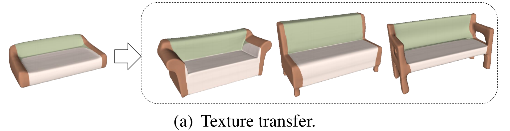 | 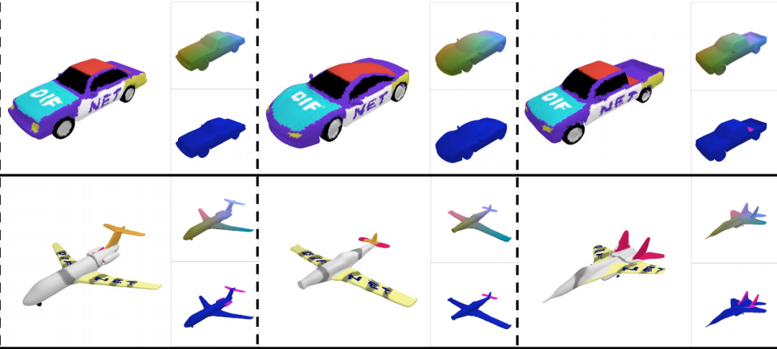 |
| keypoint detection PCK accuracy<br>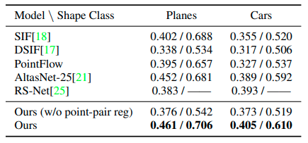 | label transfer IOU banchmark<br>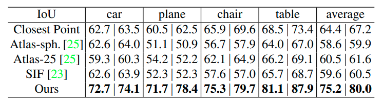 |


- **Motivation**
  - 把一个具体shape表征为 `conditional deformations` of a `template`，建立起 category level 的dense correspondence<br>注意是 **<u>conditional</u>** deformations，相当与Deformed NeRF那篇，有一个deformation code <br>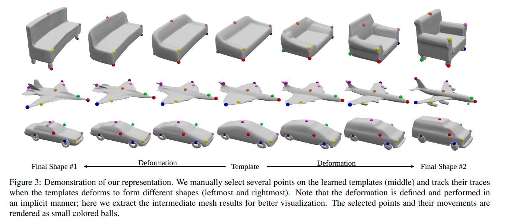
  - 把一个条件空间变换 分解为 若干个仿射变换
  - training loss经过谨慎设计，无监督地保证重建的精度 + plausible template
- **overview**
  - 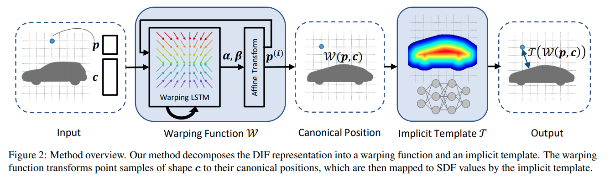
  - 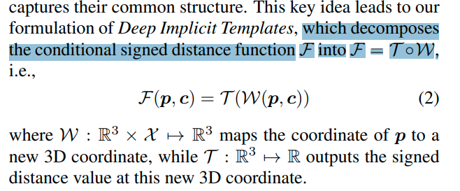
  - warping函数把首先把一个点p映射到一个`canonical position` ，然后在模板SDF中query这个canonical position来获取SDF值
  - 照搬原DeepSDF训练是不行的：尤其容易学出一个过分简单的template和过拟合到一个复杂的transformer（这里译作变换器更合适），最终带来不准确的correspondence
  - 目标：
    - 一个最优的template，能够表达一组物体的公共结构
    - together with a 空间变换器，能够建立精确的稠密的相关性
    - 学到的模型应保留DeepSDF的表达能力和泛化能力，因此支持mesh补间和形状补完
- **spatial warping LSTM**
  - 实践发现用MLP来表达warping function不太合适：
    - [ ] Q: 考虑理论上的原因
    - MLP和LSTM作warping的对比：warping的补间<br>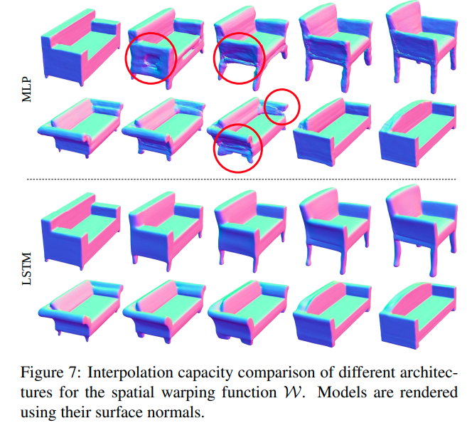
  - 把一个点的空间变换表示为多步仿射变换：
    - $$ (\alpha^{(i)},\beta^{(i)},\phi^{(i)},\psi^{i})={\rm LSTMCell}(c,p^{(i-1)},\phi^{(i-1)},\psi^{(i-1)}) $$
    - 其中$$ \phi $$和$$ \psi $$是输出和cell state，$$ \alpha $$和$$ \beta $$是仿射变换的参数，角标$$ (i) $$代表迭代的*i*-th step
    - 点$$ p $$的更新：$$ p^{(i)}=p^{(i-1)}+(\alpha^{(i)} p^{(i-1)}+\beta^{(i)}) $$
    - 迭代重复S=8次，得到最终的warping的输出
  - 训练loss
    - **reconstruction loss**
      - 因为warping函数是迭代的，从 `Curriculum deepsdf, Yueqi Duan et al.2020`得到启发，用progressive reconstruction loss
      - 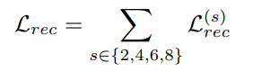
    - **regularization loss**
      - <u>point-wise regularization</u> 
        - 认为所有meshes都normlized 到一个`单位球`，并和`canonical pose`对齐
        - 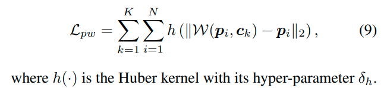
        - [Huber kernel](https://en.wikipedia.org/wiki/Huber_loss)
      - <u>point pair regularization</u> 对空间扭曲程度的限制
        - 尽管deform时空间扭曲是不可避免的，极端的空间扭曲还是可以避免的
        - 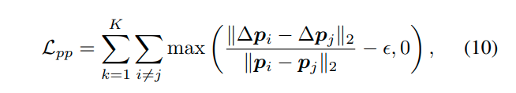
        - 其中，$$ \Delta p=T(p,c)-p $$是点p的position shift，<br>$$ \epsilon = 0.5  $$是控制扭曲容忍度的参数，对于防止shape collapse（形状崩塌，指学到过于简单的shape template）很关键
        - 下图是在有无此loss的情况下学到的template；<br>可见，如果没有point pair regularization，会学到过于简单的template<br>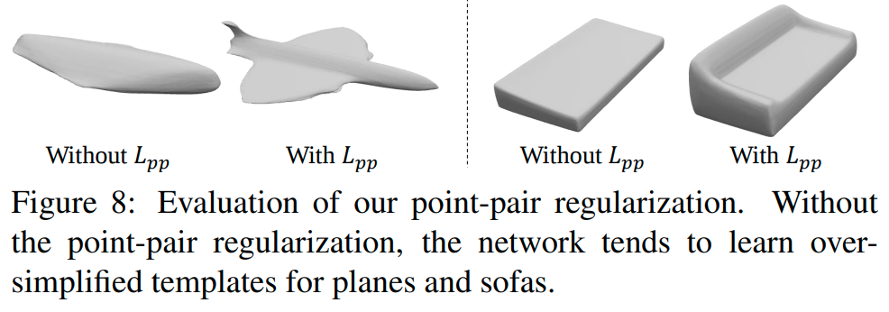
- **results**
  - 形状补间的效果：<br>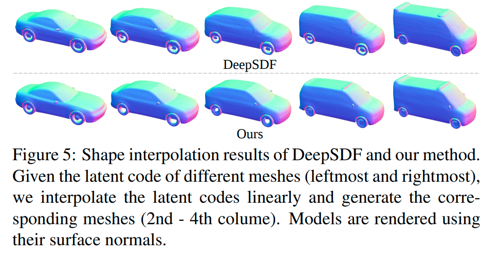
  - 因为已经建立起了shape correspondense，可以做关键点检测的迁移<br>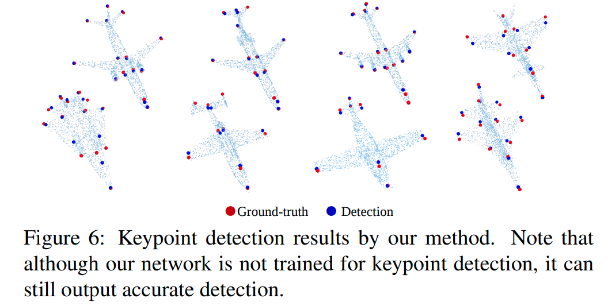
  - 应用：texture transfer，等<br>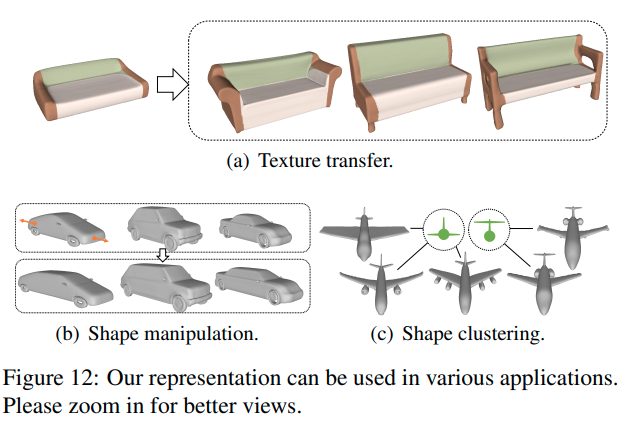

</details>

---

**`"Learning to Infer Implicit Surfaces without 3D Supervision"`**  
**[** `NeuIPS2019` **]** **[[paper]](https://papers.nips.cc/paper/2019/file/bdf3fd65c81469f9b74cedd497f2f9ce-Paper.pdf)**  **[** :mortar_board: `University of Southern California` **]**   
**[**  `Shichen Liu`, `Shunsuke Saito`, `Weikai Chen`, `Hao Li`  **]**  
**[** _`ray casting`_ **]**  

<details markdown="1">
  <summary markdown="0">Click to expand</summary>

- **Motivation**
  - 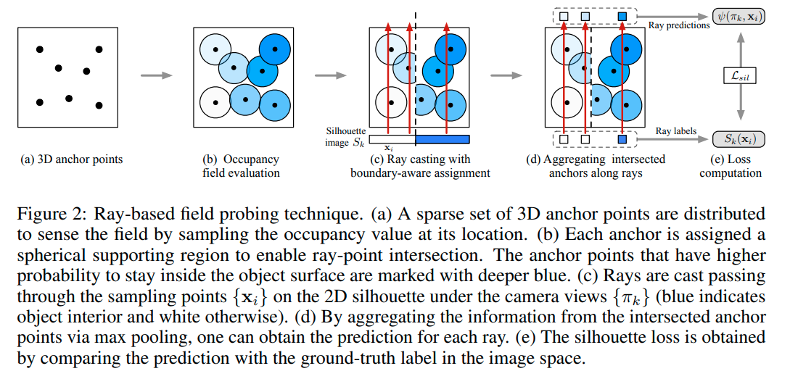
  - implicit occupancy field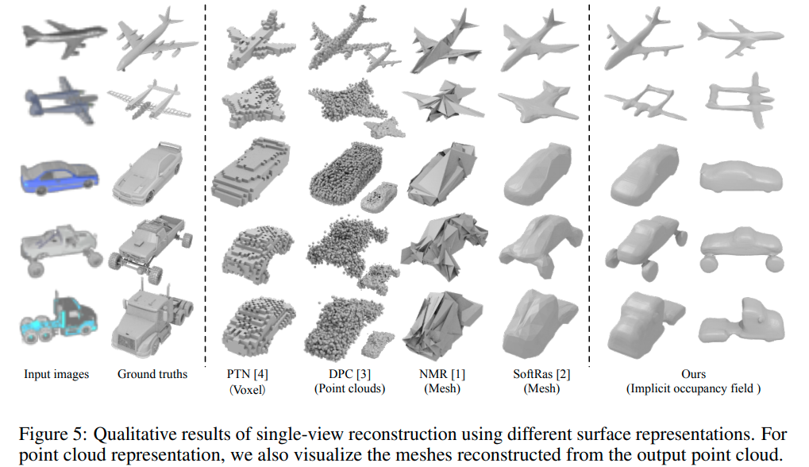

</details>

---

**`<IGR> "Implicit Geometric Regularization for Learning Shapes"`**  
**[** `ICML2020` **]** **[[paper]](https://arxiv.org/pdf/2002.10099.pdf)** **[[code]](https://github.com/amosgropp/IGR)** **[[video]](https://youtu.be/6cOvBGBQF9g)** **[** :mortar_board: `Weizmann Institute of Science` **]**   
**[**  `Amos Gropp`, `Lior Yariv`, `Niv Haim`, `Matan Atzmon`, `Yaron Lipman`  **]**  
**[** _`SDF`, `Implicit geometrical regularization`_ **]**  

<details markdown="1">
  <summary markdown="0">Click to expand</summary>

- **Motivation**
  - 从raw 点云中直接学习DeepSDF，在with or without 法向量数据的情况下
  - 用隐式的shape先验，就可以获得plausible solutions<br>其实就是简单的loss函数，鼓励输入点云处的函数值为0，鼓励空间散布的点的梯度是单位模梯度<br>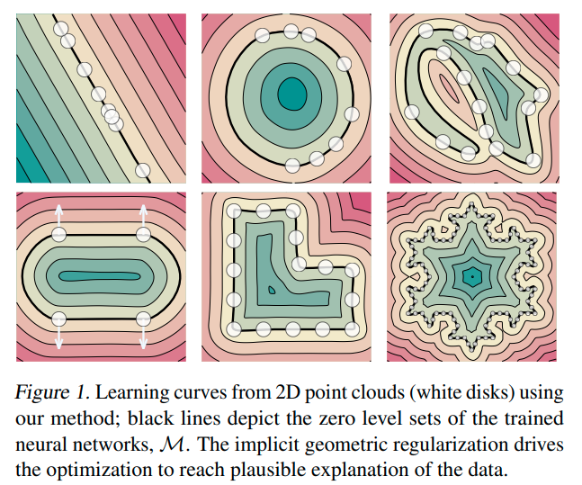
- **overview**
  - given raw input pointcloud $$ \mathcal{X}=\{x_i\}_{i\in I} \subset \mathbb{R}^3 $$,  <u>**with or without normal**</u> data $$ \mathcal{N}=\{n_i\}_{i\in I} \subset \mathbb{R}^3 $$，从中学出一个 **<u>plausible</u>** 的surface $$ \mathcal{M} $$
  - 学SDF时的常规loss：<br>有数据处函数值为0，法向量为真值；<br>(无数据处)空间分布的点法向量2-norm为1<br>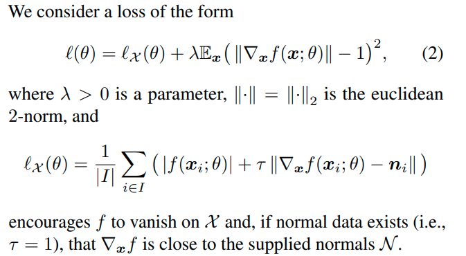
  - 然而只有上述loss存在问题
    - 首先，不能保证学到的是SDF
    - 其次，即使能学到SDF，也不能保证学到的是一个 **<u>plausible one</u>**
  - 本篇通过理论证明，如果对上述loss使用梯度下降算法，，就可以避免bad critical solutions
    - 是从平面的线性问题考虑的，把这种属性叫做 **<u>plane reduction</u>** <br>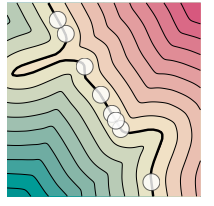

</details>

---

**`"MeshSDF: Differentiable Iso-Surface Extraction"`**  
**[** `NeurIPS2020` **]** **[[paper]](https://arxiv.org/pdf/2006.03997.pdf)** **[[code]](https://github.com/cvlab-epfl/MeshSDF)** **[** :mortar_board: `EPFL` **]** **[** :office: `Neuralconcept`, `Intel` **]**  
**[**  `Edoardo Remelli`, `Pascal Fua`   **]**  
**[** _`differentiable iso-surface extraction`, `marching cubes`, `SDF`_  **]**  

[differentiable iso-surface extraction]

<details markdown="1">
  <summary markdown="0">Click to expand</summary>

- **review**
  - 和DVR思路类似，首先手动推导出表面点坐标对网络参数的梯度，实际计算时就可以先用采样-based方法得出点坐标，再代入手动推导出的梯度式子构成完整的反向传播链路
  - 手动推导表面点坐标对网络参数的梯度过程中，用到了SDF的特殊性质（某一点函数值的梯度就是该点的法向量），不适用于一般性implicit occupancy field

</details>


---

**`"PatchNets: Patch-Based Generalizable Deep Implicit 3D Shape Representations"`**  
**[** `ECCV2020` **]** **[[paper]](https://arxiv.org/pdf/2008.01639.pdf)**  **[[slice]](http://gvv.mpi-inf.mpg.de/projects/PatchNets/data/patchnets_slides.pdf)** **[** :mortar_board: `MPI` **]** **[** :office: `facebook` **]**  
**[**  `Edgar Tretschk`, `Ayush Tewari`, `Vladislav Golyanik`, `Michael Zollhöfer`, `Carsten Stoll`, `Christian Theobalt`  **]**  
**[** _`implicit functions`, `patch-based surface representation`, `SDF`_ **]**  

<details markdown="1">
  <summary markdown="0">Click to expand</summary>


- **Motivation**
  - mid-level patch-based SDF
  - 因为在patch层次，不同类别的物体有相似性，用上这种相似性就可以做更泛化的模型
  - 在一个canonical space下学到这些patch-based representation
  - 从ShapeNet的一个类别学出来的representation，可以用于表征任何一个其他类别的非常细节的shapes；并且可以用更少的shape来训练
  - 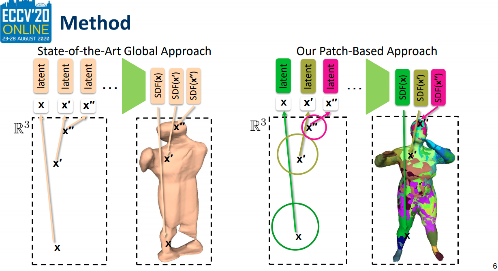
- **Overview**
  - auto-decoder
  - losses：重建loss和patch extrinsics的guidance loss，还有regularization
- **extrinsic loss**
  - 这个loss保证所有的patch都对surface有贡献，并且处于caonical space
  - 第*i*个物体的patch extrinsics: $$ \boldsymbol{e}_i=[\boldsymbol{e}_{i,0},\boldsymbol{e}_{i,1},\ldots,\boldsymbol{e}_{i,N_P-1}] $$
  - $$ \mathcal{L}_{ext}(\boldsymbol{e}_i) = \mathcal{L}_{sur}(\boldsymbol{e}_i) + \mathcal{L}_{cov}(\boldsymbol{e}_i) + \mathcal{L}_{rot}(\boldsymbol{e}_i) + \mathcal{L}_{scl}(\boldsymbol{e}_i) + \mathcal{L}_{var}(\boldsymbol{e}_i)  $$
  - $$ \mathcal{L}_{sur}(\boldsymbol{e}_i) $$ 保证每个patch都离surface很近
    - $$ \underset{逐patch}{\max}[surface上的所有点到该patch距离的最小值] $$ 
  - $$ \mathcal{L}_{cov}(\boldsymbol{e}_i) $$ symmetric coverage loss，鼓励surface上的每个点都至少被一个patch涵盖
  - $$ \mathcal{L}_{rot}(\boldsymbol{e}_i) $$ 把patches和surface normals对齐
  - $$ \mathcal{L}_{scl}(\boldsymbol{e}_i) $$ 鼓励patches to be reasonably small，防止不同patch之间显著的重叠
  - $$ \mathcal{L}_{var}(\boldsymbol{e}_i) $$ 鼓励所有patch大小相似
- **result**
  - 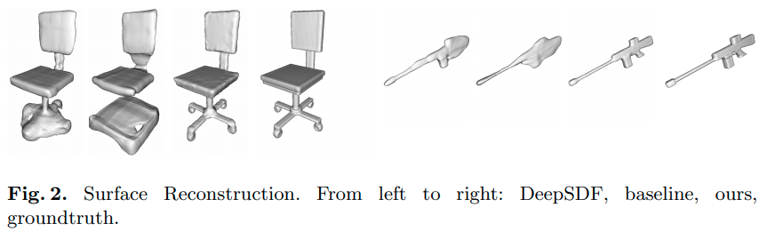
  - 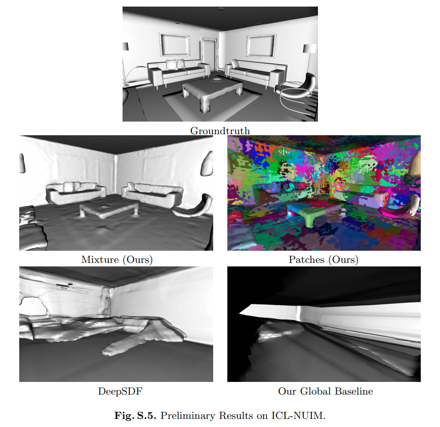

</details>

---

**`<OverfitSDF> "Overfit Neural Networks as a Compact Shape Representation"`**  
**[** `2020` **]** **[[paper]](https://arxiv.org/pdf/2009.09808.pdf)** **[[code]](https://github.com/nathanrgodwin/overfit-shapes)** **[** :mortar_board: `University of Toronto`, `McGill University` **]**   
**[**  `Thomas Davies`, `Derek Nowrouzezahrai`, `Alec Jacobson`  **]**  
**[** _`compact representation`_ **]**  

<details markdown="1">
  <summary markdown="0">Click to expand</summary>

- **Motivation**
  - 现在的DeepSDF倾向于做category类别的泛化/生成；
  - 本篇主要提出其实overfit到一个具体的shape的SDF可以作为mesh的一种更`compact`紧致的表征，而且相比于显式地mesh更省空间
  - 同时，做了很多具体shape optimization的优化，比如采样时基于重要度采样，一些biased points，等
  - 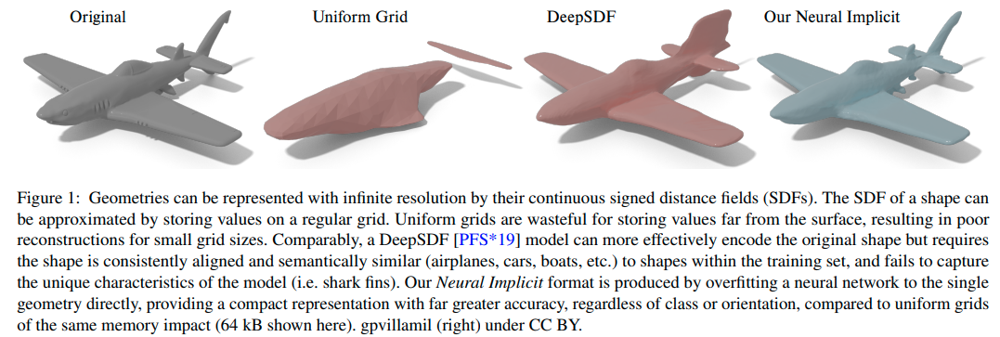

</details>

## initialization / priors for auto-decoders

---

**`"MetaSDF: Meta-learning Signed Distance Functions"`**  
**[** `NeurIPS2020` **]** **[[paper]](https://arxiv.org/pdf/2006.09662.pdf)** **[[code]](https://github.com/vsitzmann/metasdf)** **[** :mortar_board: `Stanford` **]** **[** :office: `Google` **]**  
**[**  `Vincent Sitzmann`, `Eric R. Chan`, `Richard Tucker`, `Noah Snavely`, `Gordon Wetzstein`  **]**  
**[** _`meta-learning`, `SDF`_ **]**  

<details markdown="1">
  <summary markdown="0">Click to expand</summary>


- **Review**
  - DeepSDF / deep implicit field类方法往往都喜欢用auto-decoder，因为set-encoder有欠拟合的问题
  - auto-decoder 在测试时也需要infer，需要很多步迭代，infer一次比较耗时<br>因此用meta-learning（MAML类）找出一个合适的auto-decoder优化的初值code<br>这样在测试时infer就只需要少量步数的迭代就可以得到很好的效果
  - 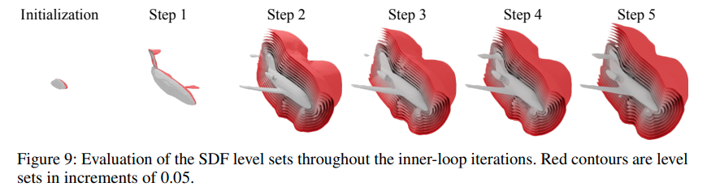

</details>

---

**`"Learned Initializations for Optimizing Coordinate-Based Neural Representations"`**  
**[** `2021` **]** **[[paper]](https://arxiv.org/pdf/2012.02189.pdf)**  **[** :mortar_board: `UCB` **]** **[** :office: `Google` **]**  
**[**  `Matthew Tancik`, `Ben Mildenhall`, `Terrance Wang`, `Divi Schmidt`, `Pratul P. Srinivasan`, `Jonathan T. Barron`, `Ren Ng`  **]**  
**[** _`meta-learning`_ **]**  

<details markdown="1">
  <summary markdown="0">Click to expand</summary>

- **Motivation**
  - 对于coordinate-based neural representations在auto-decoder时，用meta-learned 的initialization
  - 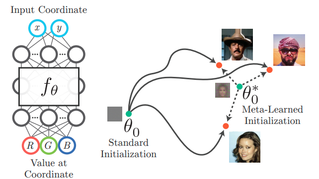
  - 与MetaSDF的差别：进一步拓展到更多种类的neural coordinate-based signals，并且把the power of using initial weight settings开发为一种先验信息

</details>

---

**`"Deep Optimized Priors for 3D Shape Modeling and Reconstruction"`**  
**[** `2021` **]** **[[paper]](https://arxiv.org/pdf/2012.07241.pdf)**  **[** :mortar_board: `南方科技大学`, **]** **[** :office: `Tencent America` **]**  
**[**  `Mingyue Yang`, `Yuxin Wen`, `Weikai Chen`, `Yongwei Chen`, `Kui Jia贾奎`  **]**  
**[** _`better shape priors`_ **]**  

<details markdown="1">
  <summary markdown="0">Click to expand</summary>

- **Motivation**
  - 现有的很多方法test time都是从fixed trained priors
  - 本篇提出在training以后，仍然从physical measurements进一步最优化learned prior

</details>

---

**`"Iso-Points: Optimizing Neural Implicit Surfaces with Hybrid Representations"`**  
**[** `2020` **]** **[[paper]](https://arxiv.org/pdf/2012.06434.pdf)** **[[web]](https://yifita.github.io/project/neural-shape/)** **[** :mortar_board: `ETH`, `cambridge` **]**   
**[**  `Wang Yifan`, `Shihao Wu`, `Cengiz Oztireli`, `Olga Sorkine-Hornung`  **]**  
**[** _`iso-points`, `hybrid representation`, `SDF`_ **]**  

<details markdown="1">
  <summary markdown="0">Click to expand</summary>

- **Motivation**
  - 目前这些输入点云deep implicit field学surface的方法，optimizing时，精确、鲁棒的重建仍然非常有挑战性
  - 本篇提出用等值面上的点作为一个额外的显式表征；被计算、更新on-the-fly，有效提高收敛率和最终质量
- **overview**
  - 目标：给定一个neural implicit function $$ f_t(\boldsymbol{\rm p};\theta_t) $$ at *t*-th iteration，efficiently generate and utilize 一组`稠密的、均匀分布的iso-points` (points at zero level set)
    - 这组iso-points可以用于
      - 改进training data的sampling
      - 提供最优化时的regularization
- **iso-surface sampling**：如何得到iso-surface上均匀分布的点
  - 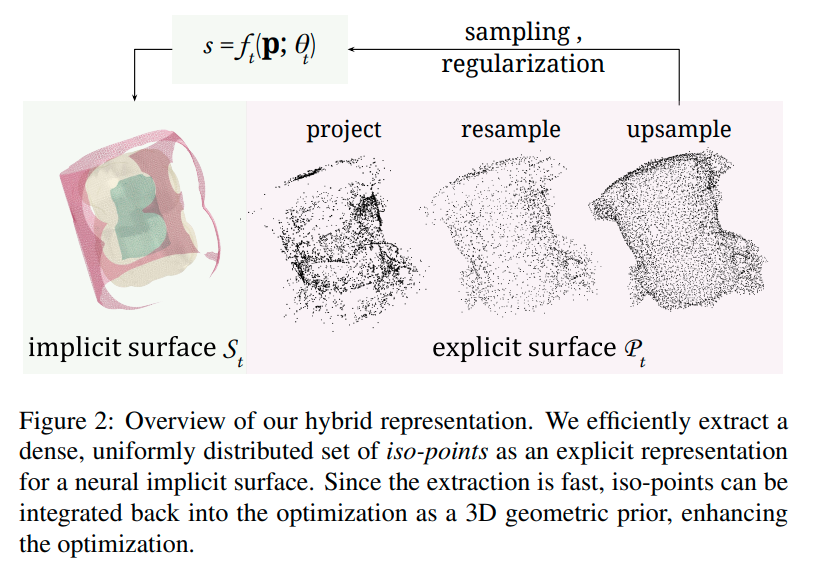
  - **projection**：projecing a point onto the iso-surface 可以被视作 在一个给定点用牛顿法估计一个方程的根
    - 考虑这里和贾奎那篇analytic marching算法初始找到表面上一个点的思路是很像的
    - 给定隐函数$$ f(\boldsymbol{\rm p}): \mathbb{R}^3\rightarrow \mathbb{R} $$，初始点$$ \boldsymbol{\rm q}_0\in\mathbb{R}^3 $$<br>牛顿法求根：$$ \boldsymbol{\rm q}_{k+1}=\boldsymbol{\rm q}_{k}-J_f(\boldsymbol{\rm q}_k)^+ f(\boldsymbol{\rm q}_k) $$, where $$ J_f(\boldsymbol{\rm q}_k)^+ $$是Jacobian的Moore-Penrose 伪逆
    - $$ J_f $$是一个row 3-vector，所以$$ J_f(\boldsymbol{\rm q}_k)^+ = \frac {J_f^{\top}(\boldsymbol{\rm q}_k)} {\lVert J_f(\boldsymbol{\rm q}_k) \rVert^2} $$, where $$ J_f(\boldsymbol{\rm q}_k) $$ 可以直接通过反向传播计算
    - 不过，由于一些同时代的工作常采用sine activation functions或者positional encoding，SDF噪声很大，梯度高度non-smooth，直接使用牛顿法会导致overshooting和oscillation
    - 当然可以用一些更精致的line search算法，不过这里直接用简单的clipping操作
    - 点$$ \mathcal{Q}_t $$集合的初始化：刚开始就用一个unit sphere shape初始化，后面用$$ \mathcal{Q}_{t-1} $$初始化
    - 最大10个牛顿迭代，停止阈值从$$ 10^{-4} $$逐渐缩小到$$ 10^{-5} $$
  - **uniform resampling**
    - 迭代地把点从high-density regions移开
    - 这步和f没有关系了，移开的方向都是由邻居点定义的
  - **upsampling**
    - 基于 `EAR` (edge-aware resampling)
      - *Edge-aware point set resampling, SIGGRAPH Asia 2013*
- **results**

  - 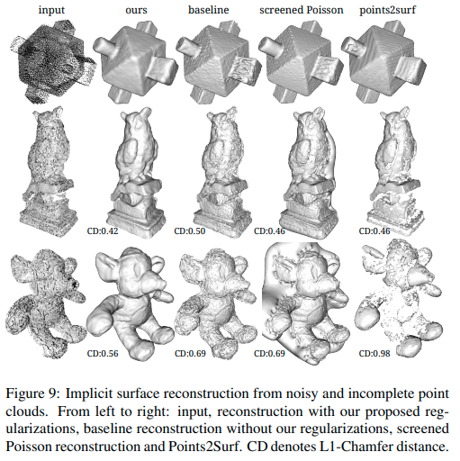

</details>

## differentiable renderer

 - keyword
    - DIST and its citations

---

**`<DVR> "Differentiable Volumetric Rendering: Learning Implicit 3D Representations without 3D Supervision"`**  
**[** `CVPR2020` **]** **[[paper]](https://arxiv.org/pdf/1912.07372.pdf)** **[[code]](https://github.com/autonomousvision/differentiable_volumetric_rendering)** **[** :mortar_board: `MPI`, `University of Tubingen` **]**   
**[** `Michael Niemeyer`, `Andreas Geiger` **]**  
**[**  _`differentiable volumetric rendering`, `ray casting`_ **]**  

<details markdown="1">
  <summary markdown="0">Click to expand</summary>

- **review**
  - 思路：首先手动推导出每个camera ray和隐表面交点的点坐标对网络参数的梯度，在实际计算时，就可以先在camera ray上采样得出交点坐标(类似二分法)，然后代入所手动推导出的式子构成完整的反向传播链路

</details>

---

**`"DIST: Rendering Deep Implicit Signed Distance Function with Differentiable Sphere Tracing"`**  
**[** `CVPR2020` **]** **[[paper]](https://openaccess.thecvf.com/content_CVPR_2020/papers/Liu_DIST_Rendering_Deep_Implicit_Signed_Distance_Function_With_Differentiable_Sphere_CVPR_2020_paper.pdf)** **[[code]](https://github.com/B1ueber2y/DIST-Renderer)** **[[web]](http://b1ueber2y.me/projects/DIST-Renderer/)** **[** :mortar_board: `ETH`, `Tsinghua University`, `Peking University`, `MPI` **]** **[** :office: `Google`, `Peng Cheng Laboratory` **]**  
**[**  `Shaohui Liu`, `Yinda Zhang`, `Songyou Peng`, `Boxin Shi`, `Marc Pollefeys`, `Zhaopeng Cui`  **]**  
**[** _`SDF`, `differentiable renderer`, `sphere tracing`_ **]**  

<details markdown="1">
  <summary markdown="0">Click to expand</summary>

- 需要silhouette真值
- **Motivation**
  - 给SDF加上一个differentiable renderer，来为inverse graphics models和deep implicit surface field建设桥梁
  - solving vision problem as inverse graphics process is one of the foundamental approaches, where the solution is the visual structure that best explains given observations 把视觉问题看做逆向图形学过程来解决；寻找能最好地解释给定观测的视觉结构
    - 3D geometry理解 领域：很早就被使用(1974, 1999, etc.)
    - 常常需要一个高效的renderer来从从一个optimizable 的3D结构 精确地simulate这些观测(e.g. depth maps)，同时需要是可微的，来反向传播局部观测的误差
    - (first) a differentiable renderer for learning-based SDF
  - 用一个可微分的renderer来把learning-based SDF可微分地渲染为 depth image, surface normal, silhouettes，从任意相机viewpoints
  - 应用：可用于infer 3D shape from various inputs, e.g. multi-view images and single depth image
- 方法
  - 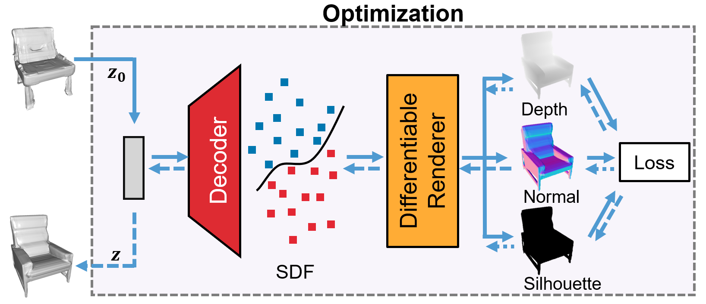
  - [auto-decoder] 给定一个已经pre-trained generative model, e.g. DeepSDF, 通过在latent code space 寻找能产生和给定观测最一致的3D shape
- [sphere tracing] 使用一个类似sphere tracing的框架来做可微分的渲染
  - 直接应用sphere tracing因为需要对network做反复的query并且在反向传播时产生递归的计算图（笔者注：就像SRN那样），计算费时、费内存；所以需要对前向传播和反向传播过程都要做出优化
  - sphere-traced results (i.e. camera ray上的距离)，可以用于产生各种输出，如<u>深度图</u>、<u>表面法向量</u>、<u>轮廓</u>等，因此可以用loss来方便地形成端到端的manner
  - 前向通路
- 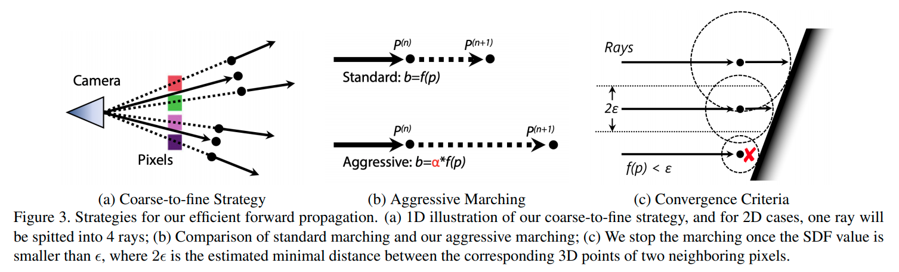
    - 用一种coarse-to-fine的方法来save computation at initial steps
      - 考虑到在sphere tracing的前面几步，不同pixel的ray都非常接近
      - 从图像的1/4分辨率开始tracing，然后每3步以后把每个像素分成4份
      - 在6步后，full resolution下的每个像素都有一个对应的ray，一直marching直到收敛
    - 一个aggresive 策略来加速ray marching
      - marching步长是$$ \alpha=1.5 $$倍的queried SDF value
      - 在距离表面很远的时候更快地朝表面march
      - 在ill-posed情况下能加速收敛（当表面法向量和ray direction的夹角很小时）
        - [ ] what?
      - ray可以射穿表面，能够采样到表面内部(SDF<0)；对表面的两侧都可以应用supervision
    - dynamic synchronized inference
    - 一个safe convergence criteria来防止不必要的网络query，同时保留分辨率
- 反向传播
    - 用SDF的梯度的近似值，对训练影响不大，但是显著减少计算和内存占用
- **评价：文中出现了非常多技术细节的详细解释，值得一读**
  - sphere tracing<br>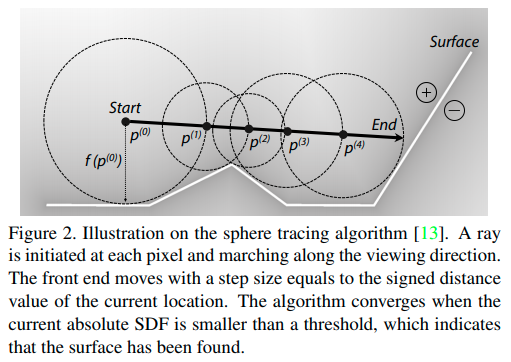
  - 训练一个神经网络，同时为每个3D location 预测signed distance 和color
- **实验**
  - 收敛速度<br>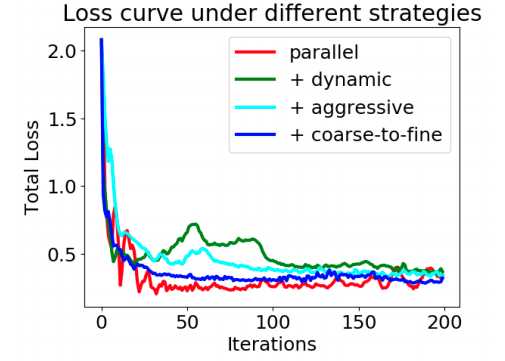
  - **Texture Re-rendering**<br>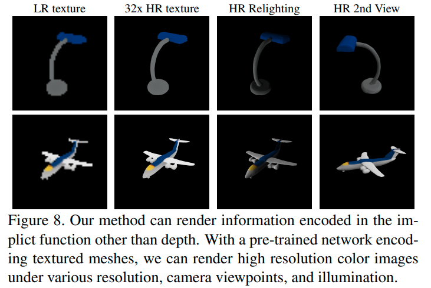
  - **Shape Completion from Sparse Depths**<br>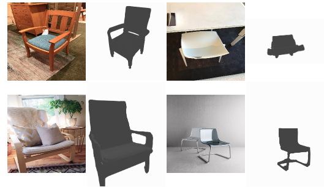
  - **Shape Completion over Different Sparsity**<br>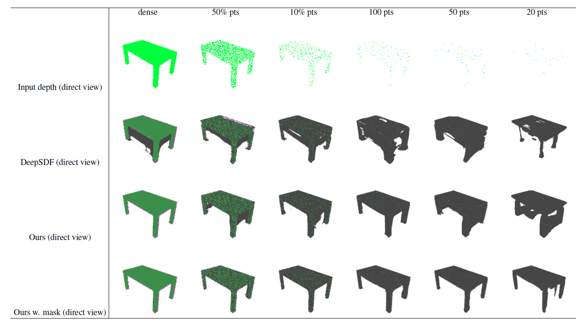
  - **Inverse Optimization over Camera Extrinsics**<br>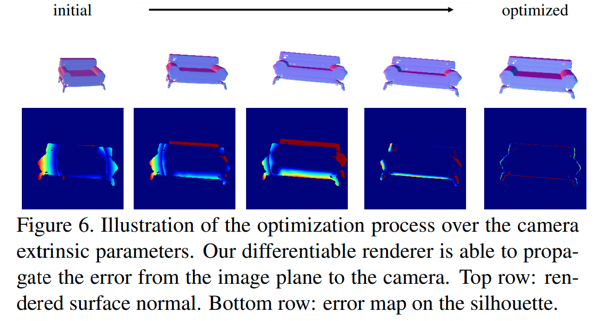
  - **Multi-view Reconstruction from Video Sequences 从多视角视频序列重建**<br>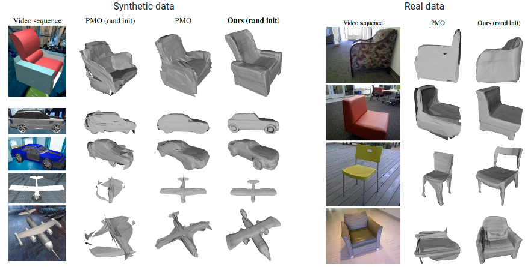

</details>

---

**`"SDF-SRN: Learning Signed Distance 3D Object Reconstruction from Static Images"`**  
**[** `NeurIPS2020` **]** **[[paper]](https://papers.nips.cc/paper/2020/file/83fa5a432ae55c253d0e60dbfa716723-Paper.pdf)** **[[code]](https://github.com/chenhsuanlin/signed-distance-SRN)** **[[web]](https://chenhsuanlin.bitbucket.io/signed-distance-SRN/)** **[** :mortar_board: `CMU` **]**   
**[**  `Chen-Hsuan Lin`, `Chaoyang Wang`, `Simon Lucey`  **]**  
**[** _`single-view`_ **]**  

<details markdown="1">
  <summary markdown="0">Click to expand</summary>

- 训练时需要single view silhouette
- **Motivation**
  - 单视角3D物体重建，过去的方法往往都有3D形状真值
  - 最近的方法可以没有3D监督信号，但是还是需要训练时多视角的对同个instance的silhouettes标注；因此大多只能应对合成数据集
  - 本篇提出SDF-SRN，只需要单视角图片(只在训练时+silhouette)输入<br>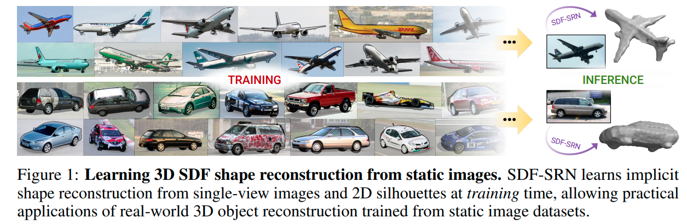
- **overview**
  - single-view一般需要encoder<br>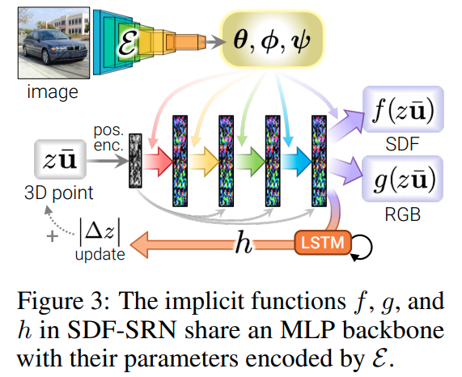
- **Results** 
  - 学出的形状奇奇怪怪；不过总归是纯图片输入，而且只有训练时需要silhouette<br>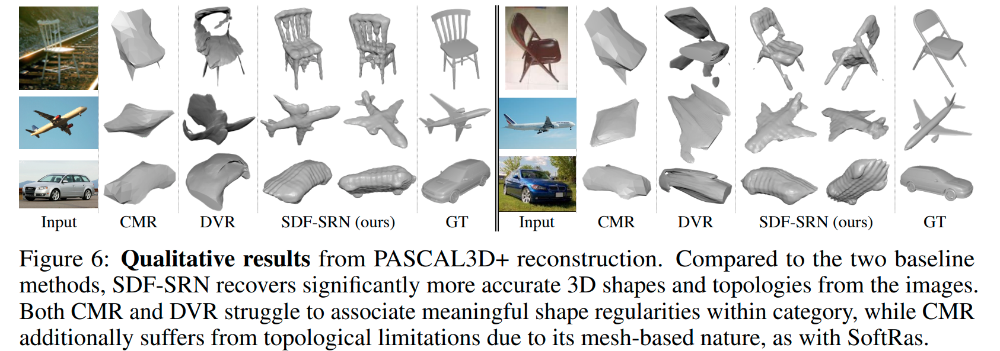
  - 颜色重建的质量也一般<br>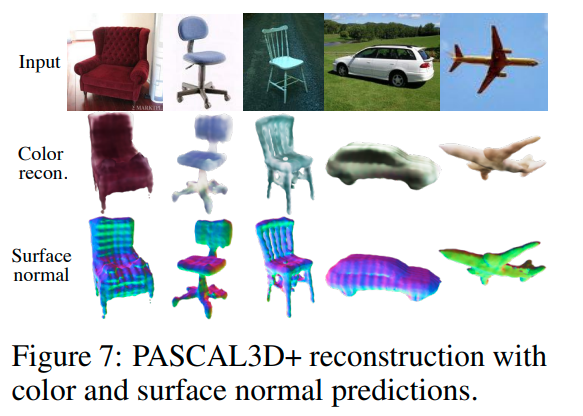

</details>

---

**`"SDFDiff: Differentiable Rendering of Signed Distance Fields for 3D Shape Optimization"`**  
**[** `CVPR2020(Oral)` **]** **[[paper]](https://arxiv.org/pdf/1912.07109.pdf)** **[[code]](https://github.com/YueJiang-nj/CVPR2020-SDFDiff)** **[** :mortar_board: `University of Maryland` **]**   
**[**  `Yue Jiang`, `Dantong Ji`, `Zhizhong Han`, `Matthias Zwicker`  **]**  
**[** _`SDF`, `differentiable rendering`, `multi-view`, `single-view`, `multi-resolution strategy`_ **]**  

<details markdown="1">
  <summary markdown="0">Click to expand</summary>

- 需要分割好的多视角图片
- **Motivation**
  - **`<u>image-based shape optimization</u>`** using differentiable rendering of 3D shapes represented by SDF
    - SDF作为形状表征的优势：可以表征具有任意拓扑的形状，并且可以保证watertight
- **Overview**
  - learn SDF on a `3D grid`
  - perform ray-casting via `sphere tracing`
- **differentiable renderer**
  - 学到的是voxelized SDF，然后通过linear interpolation获取任意连续位置处的SDF
  - 给定像素值的导数只与interpolation时的8个邻居体素有关
    - 或者说，sphere tracing本身不需要是可微分的
    - 只需要 local 8个邻居的 local 计算需要可微分
- **energy function & losses**
  - 从geometry相机位置等$$ \Theta $$，可以render出image$$ I $$：$$ I=R(\Theta) $$<br>inverse rendering就是$$ \Theta=R^{-1}(I) $$<br>但是inverse rendering并不直接可逆，因此把问题建模为`energy minimization problem`能量最小问题<br>$$ \Theta^*=\underset{\Theta}{\arg\min} \mathcal{L}_{img}(R(\Theta),I) $$
  - 重点在于一个differentiable renderer：本篇强调shape。输入camera pose和shape，输出渲染图像
  - $$ \mathcal{L}_{img} $$衡量render图像和$$ I $$的差别
  - $$ \mathcal{L}_{reg} $$ 正则化项，保证$$ \Theta $$是一个valid signed distance field（i.e. 梯度是单位向量）<br>实践中，是用$\Delta$近似的梯度
- single view：从图像encode到一个voxelized 稀疏SDF，经过一些3D卷积refinement，经过differentiable renderer到image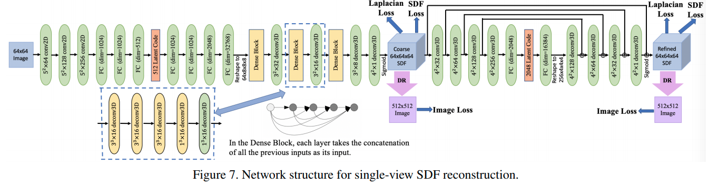
- multi view：就用auto-decoder直接训练
- **results**
  - single view<br>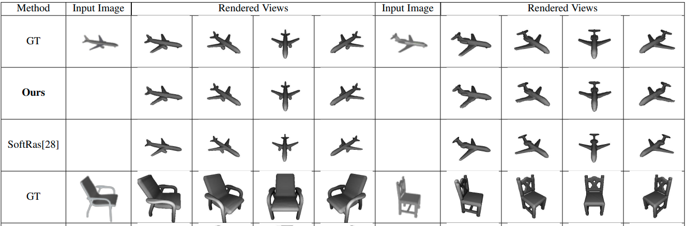

</details>

---

**`"Multiview Neural Surface Reconstruction by Disentangling Geometry and Appearance"`**  
**[** `NeurIPS2020` **]** **[[paper]](https://proceedings.neurips.cc/paper/2020/file/1a77befc3b608d6ed363567685f70e1e-Paper.pdf)** **[[code]](https://github.com/lioryariv/idr)** **[** :mortar_board: `Weizmann Institute of Science` **]**   
**[**  `Lior Yariv`, `Yoni Kasten`, `Dror Moran`, `Meirav Galun`, `Matan Atzmon`, `Ronen Basri`, `Yaron Lipman`  **]**  
**[** _`multi-view`, `unposed images`, `single masked object image`, `SDF`_ **]**  

<details markdown="1">
  <summary markdown="0">Click to expand</summary>

- 训练需要multi view分割好的unposed images，不一定需要相机pose
- IDR=implicit differentiable renderer
- **Motivation**
  - SDF的differentiable renderer，用于从multi view image重建3D表面，在`未知相机参数`的情况下
  - DVR和本篇很像，但是DVR不能处理泛化的外观，并且不能处理未知的、大噪声的相机位置
  - SDF的优势
    - 可以高效地用sphere tracing来做ray casting
    - 平滑的、真实的表面
  - 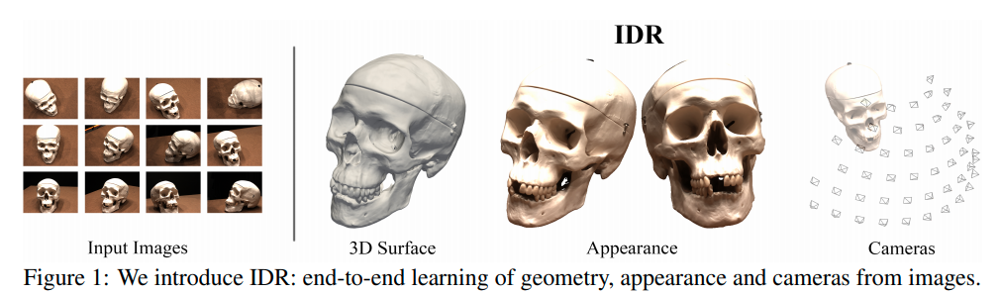
- **review**
  - 有一点SDF与NeRF结合的味道，因为其颜色是从坐标位置、几何参数、观测方向共同得来的
  - 公式推导比较细致，因为值除了对几何参数有导数表达式外，还对相机参数有导数表达式
  - 重点比较对象是DVR
- **Overview**
  - 把3D surface表达为一个deep implicit field $$ f $$ 的zero level set<br>$$ \mathcal{S}_{\theta}=\{ \boldsymbol{x}\in\mathbb{R}^3 \vert f(\boldsymbol{x},\theta)=0 \} $$
    - 为了avoid everywhere 0 solution，$$ f $$ 一般都会regularized，比如SDF的regularization；本篇用了 `implicit geometric regularization`(IGR) 
  - **<u>三个未知量（也是被优化的量）</u>**：`geometry`几何$$ \theta\in\mathbb{R}^m $$，`appearance`外观$$ \gamma\in\mathbb{R}^n $$，`cameras`相机参数$$ \tau\in\mathbb{R}^k $$
    - 注意本篇中的相机参数也是一个未知量、被优化的值，因此所有值除了需要对几何参数$$ \theta $$有导数表达式外，还需要对相机参数$$ \tau $$（i.e.相机中心点$$ \boldsymbol{c} $$和view direction $$ \boldsymbol{v} $$）有导数表达式
  - 把一个像素处的颜色/radiance建模为一个射线交点坐标$$ \boldsymbol{\hat x}_p $$、表面法向量$$ \boldsymbol{\hat n}_p $$、view direction$$ \boldsymbol{\hat v}_p $$、几何参数$$ \boldsymbol{\hat z}_p $$、外观参数$$ \gamma $$的映射<br>$$ L_p(\theta,\gamma,\tau)=M(\boldsymbol{\hat x}_p, \boldsymbol{\hat n}_p, \boldsymbol{\hat z}_p, \boldsymbol{\hat v}_p;\gamma) $$
    - 某种程度上像NeRF
    - 射线交点坐标、表面法向量、几何参数、view direction 与几何$$ \theta $$、相机参数$$ \tau $$有关，因为$$ \boldsymbol{\hat x}_p=\boldsymbol{\hat x}_p(\theta,\tau) $$
    - M是又一个MLP
  - losses
    - RGB loss，是L1-Norm，逐像素
    - MASK loss，在render的时候就可以render出一个近似的可微分的mask，于是这里可以直接cross-entropy loss，逐像素
    - reg loss，Eikonal regularization，保证是个SDF，即网络梯度模为1；bbox中均匀采点
      - $$ {\rm loss}_E(\theta)=\mathbb{E}_{\boldsymbol{x}}(\lVert \nabla_{\boldsymbol{x}}f(\boldsymbol{x};\theta) \rVert -1)^2 $$, where $$ \boldsymbol{x} $$在scene的一个bbox中均匀分布
- **Differentiable intersections of view directions and geometry**
  - 假设交叉点坐标表示为$$ \boldsymbol{\hat x}_(\theta,\tau)=\boldsymbol{c}+t(\theta,\boldsymbol{c},\boldsymbol{v})\boldsymbol{v} $$，关键是t这个标量值是$$ \theta $$, 相机中心点位置$$ \boldsymbol{c} $$, 观测方向$$ \boldsymbol{v} $$的函数
  - $$ \boldsymbol{\hat x}_p(\theta,\tau)=\boldsymbol{c}+t_0\boldsymbol{v} - \frac {\boldsymbol{v}}{\nabla_x f(\boldsymbol{x}_0;\theta_0) \cdot \boldsymbol{v}_0} f(\boldsymbol{c}+t_0\boldsymbol{v};\theta) $$
    - 并且 `is exact in value and first derivatives of` $$ \theta $$和$$ \tau $$ at $$ \theta=\theta_0, \tau=\tau_0 $$
    - [ ] what?
  - 用隐函数微分；
  - SDF在一点的法向量就是其梯度，是因为梯度的模就是1
- **approximation of the surface light field**
- **masked rendering**
  - ==[*]== 在render的时候额外render出一个`可微分`的`近似binary`的mask
- **results**
  - 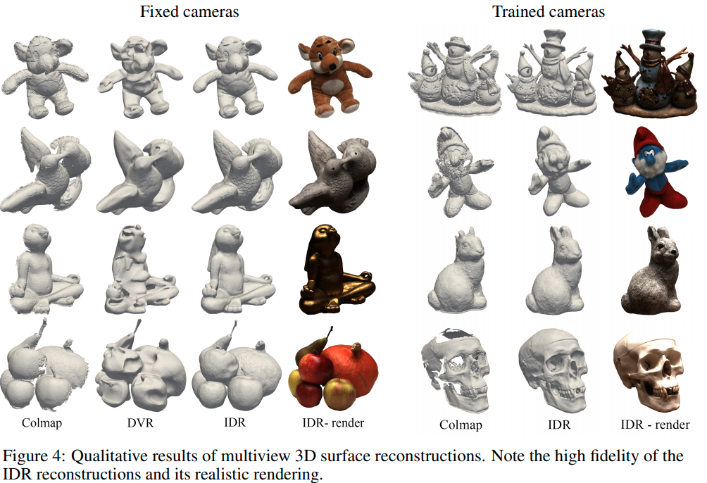
  - 可以做外观transfer <br>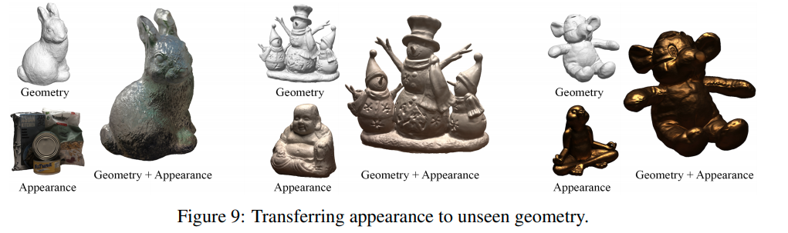

</details>


## compositional / multi object scene

---

**`"Semi-Supervised Learning of Multi-Object 3D Scene Representations"`**  
**[** `ICLR2021` **]** **[[paper]](https://openreview.net/pdf?id=GwjkaD3g-V1)** **[[code]](https://www.github.com)** **[** :mortar_board: `University` **]** **[** :office: `company` **]**  
**[**  `xxxx`  **]**  
**[** _`recurrent encoder`, `SDF`, `differentiable renderer`_ **]**  

<details markdown="1">
  <summary markdown="0">Click to expand</summary>

- **Motivation**
  - 把场景表征为多个物体
  - 输入input RGB image，通过一个recurrent encoder，回归出每个物体的shape, pose, texture；shape通过SDF表征
  - 半监督体现在训练时候用的是RGB-D，测试时候只需要RGB
  - single view见所有物体；物体个数是已知的<br>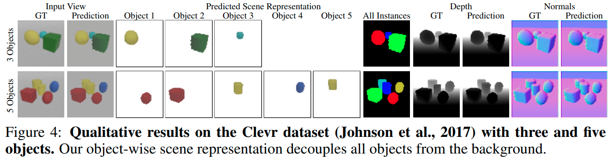
- **review**
  - 只用了clevrn类数据集，而且甚至还是简单的低分辨率渲染，实验比较简单
- **Overview**
  - 首先从example shapes有监督地训练SDF（的decoder）；
  - 然后自监督地通过RGB-D训练differentiable renderer和recurrent encoder
  - [ ] recurrent真的能这样设计吗？<br>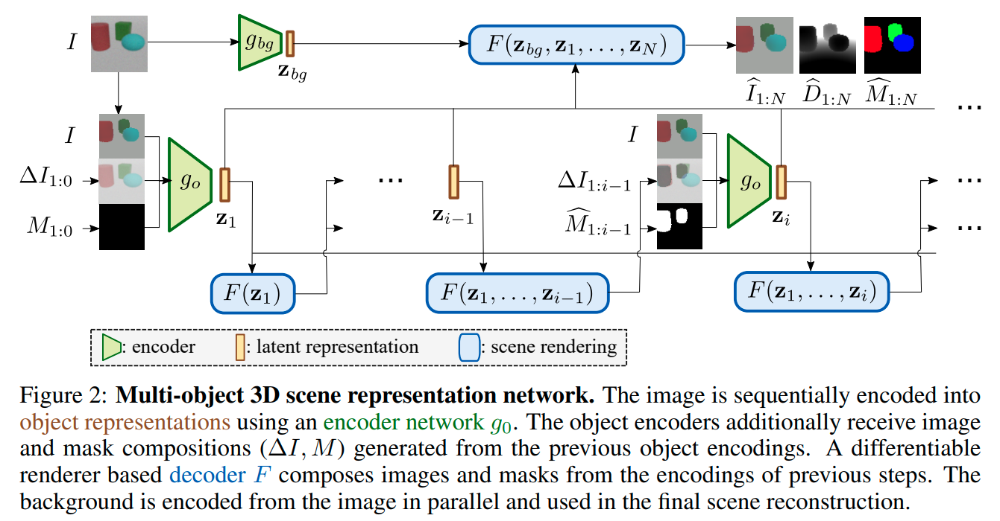
  - 可以看到recurrent的主要目的是迭代、逐个地得出object的code，倒是和之前*Multi-object representation learning with iterative variational inference.*那篇有些像<br>每个物体输出深度估计，图像估计，与occulusion mask<br>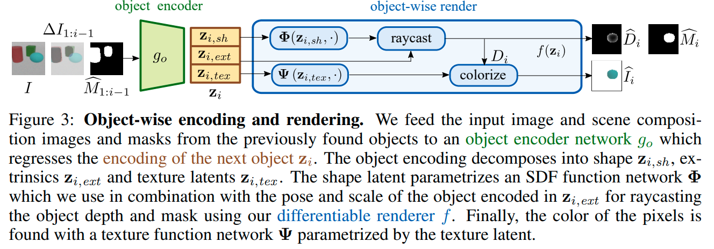
- **results**
  - 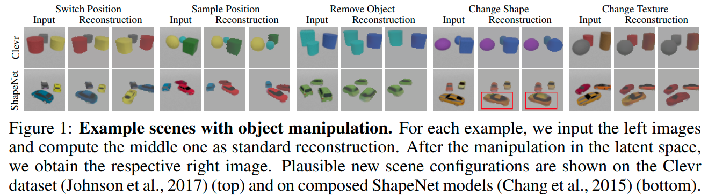

</details>

## analytic exact solution

---

**`"Analytic Marching: An Analytic Meshing Solution from Deep Implicit Surface Networks"`**  
**[** `ICML2020` **]** **[[paper]](http://proceedings.mlr.press/v119/lei20a/lei20a.pdf)** **[[supp]](http://proceedings.mlr.press/v119/lei20a/lei20a-supp.pdf)** **[[slice]](https://slides.games-cn.org/pdf/Games2020148JiabaoLei.pdf)** **[** :mortar_board: `南方科技大学` **]** **[** :office: [`琶洲实验室`](https://www.pazhoulab.com/) **]**  
**[**  `Jiabao Lei`, `Kui Jia贾奎`  **]**  
**[** _`learning surface mesh via implicit field functions`, `MLP analytic solution`_ **]**  

<details markdown="1">
  <summary markdown="0">Click to expand</summary>

- **Motivation**
  - deep learning领域出现了很多研究，surface 的implicit functions用MLP+ReLU实现
  - 为了实现meshing **<u>(exactly recover meshes)</u>** from **<u>learned</u>** implicit functions (MLP+ReLU)
    - 现有的方法采用的事实上都是标准的marching cubes采样算法；虽然效果还行，但是损失了学到的MLP的精确度，due to 离散化的本质
    - 基于ReLU-based MLP 把input空间分为很多线性区域的事实，本篇把这些区域识别为analytic cells与analytic faces，与implicit function的零值等值面有关
    - 推导了这些identified analytic faces在什么理论条件下可以保证形成一个闭合的、piecewise的planar surface
    - 基于本篇的这些理论推导，提出了一个可并行化的算法，在这些analytic cells上做marching，来==**<u>exactly recover</u>**==这些由learned MLP学出来的mesh
- **overview**
  - 算法的初始：先用SGD $$ \underset {\boldsymbol{x}\in\mathbb{R}^3}{\min} \lvert F(\boldsymbol{x}) \rvert $$ 找到表面上的一个点
  - 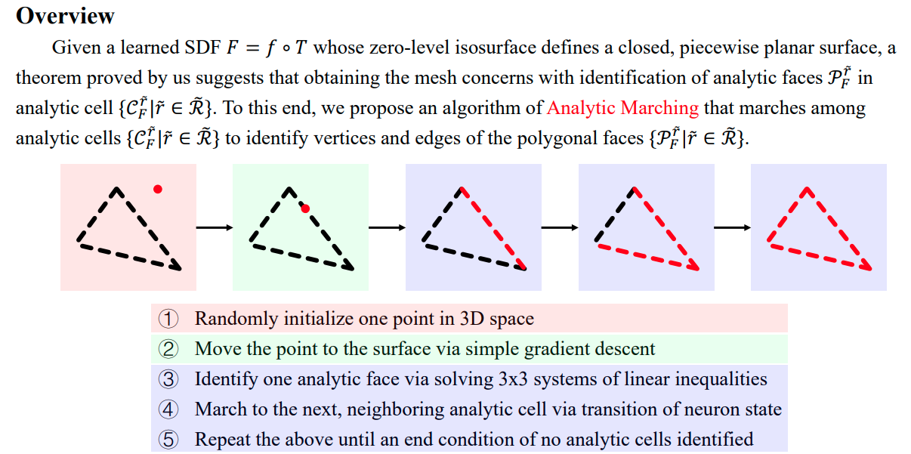
- **效果**：解析解就是降维打击。精确度无限(exact 解) + CPU跑都比别人GPU跑快十几倍
  - 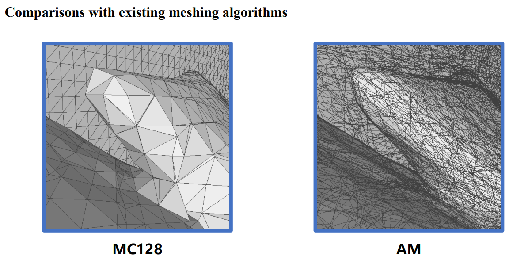
  - 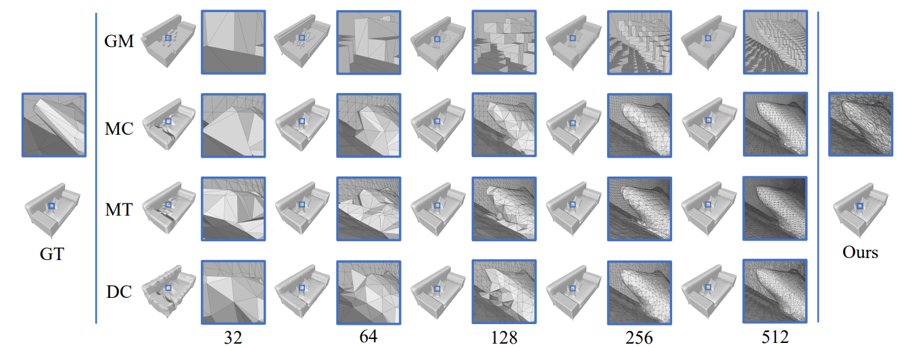
  - 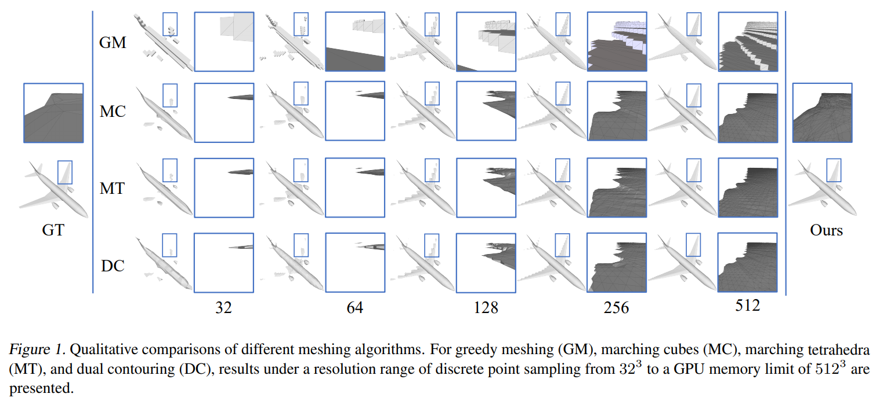
  - 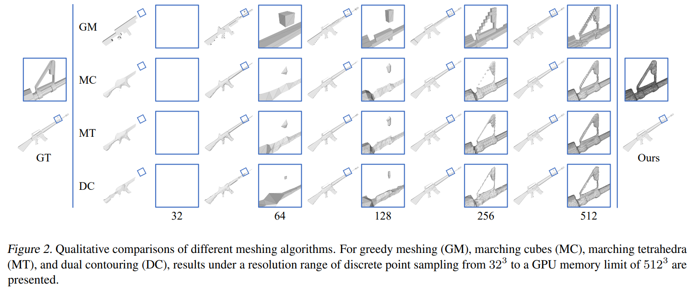

</details>

# learning parameterization / implicitization

# others

---

**`"SkeletonNet: A Topology-Preserving Solution for Learning Mesh Reconstruction of Object Surfaces from RGB Images"`**  
**[** `TPAMI2020` **]** **[[paper]](https://arxiv.org/pdf/2008.05742)** **[[code]](https://github.com/tangjiapeng/SkeletonNet)** **[** :mortar_board: `南方科技大学`, `CUHK` **]** **[** :office: `Microsoft Research Asia` **]**  
**[**  `Jiapeng Tang`, `Xiaoguang Han`, `Mingkui Tan`, `Xin Tong`, `Kui Jia`  **]**  
**[** _`skeleton`, `topology preserving`, `GCN`, `implicit surface`_ **]**  

<details markdown="1">
  <summary markdown="0">Click to expand</summary>

- **Motivation**
  - 学习shape时保留本身的拓扑结构：先学skeleton，再从skeleton推shape
- **overview**
  - (skeleton-GCN) skeleton-based graph convolutional neural network
  - (skeleton-DISN) skeleton-regularized deep implicit surface network
    - 主要基于*Disn:Deep implicit surface network for high-quality single-view 3d reconstruction*，加入skeleton正则项
- **效果**
  - 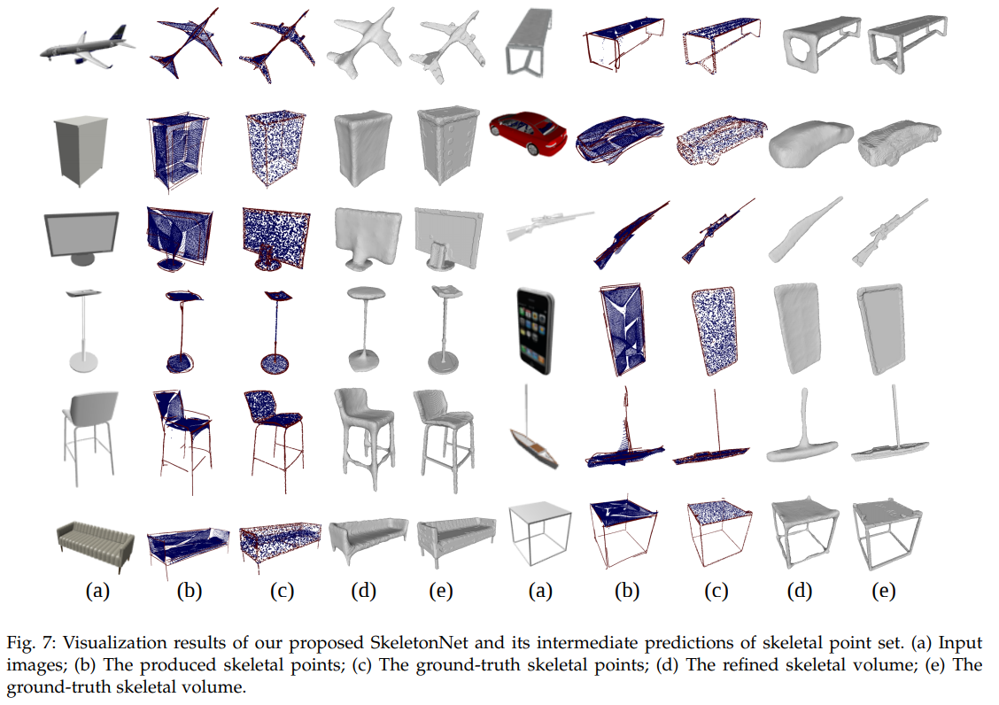

</details>

---

**`"NodeSLAM: Neural Object Descriptors for Multi-View Shape Reconstruction"`**  
**[** `2020` **]** **[[paper]](https://arxiv.org/pdf/2004.04485.pdf)** **[[web]](https://edgarsucar.github.io/NodeSLAM/)** **[** :mortar_board: `ICL` **]** **[** :office: `Dyson Robotic Lab` **]**  
**[**  `Edgar Sucar`, `Kentaro Wada`, `Andrew Davison`  **]**  
**[** _`differential rendering engine`, `VAE`, `multi-class learned object descriptor`_ **]**  

<details markdown="1">
  <summary markdown="0">Click to expand</summary>

- **Motivation**
  - 用的是voxelized occupancy表征
  - shape and pose reference
  - 需要depth + masked image输入；相当于pose未知情况下的object SLAM，object voxelized representation是descriptor
  - 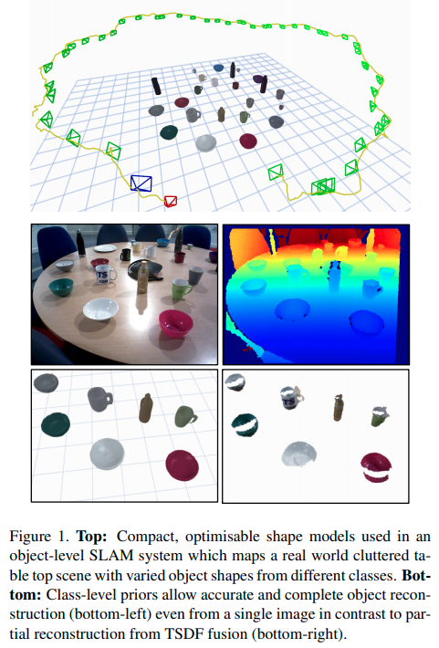

</details>