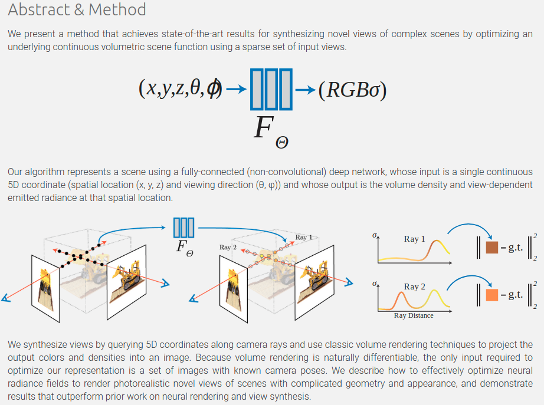
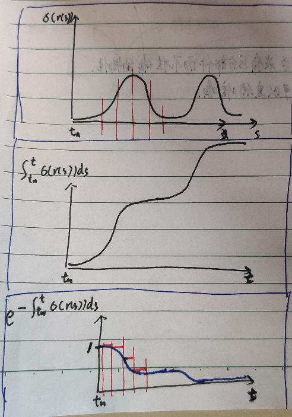

* TOC
{:toc} 

---

## resources
- [[blog] NeRF Explosion 2020](https://dellaert.github.io/NeRF/)

- 对于neural volume rendering能够取得如此巨大成功(i.e. high fidelity details, easy and fast to converge)的一个possible explanation
  - from *Neural Volumes: Learning Dynamic Renderable Volumes from Images*
  - > [We] propose using a volumetric representation consisting of opacity and color at each position in 3D space, where rendering is realized through integral projection. During optimization, this semi-transparent representation of geometry <u>**disperses gradient information along the ray of integration**, effectively widening the basin of convergence, enabling the discovery of good solutions</u>.

## Neural Volume Rendering

---

**`"NeRF: Representing Scenes as Neural Radiance Fields for View Synthesis"`**  
**[** `ECCV2020(Oral)` **]** **[[web]](https://www.matthewtancik.com/nerf)** **[[paper]](https://arxiv.org/pdf/2003.08934.pdf)** **[[code(tf)]](https://github.com/bmild/nerf)** **[[code(pytorch)]](https://github.com/yenchenlin/nerf-pytorch)** **[[code(pytorch)(re-implement)]](https://github.com/krrish94/nerf-pytorch)** **[** :mortar_board: `UCB`, `UCSD` **]** **[** :office: `Google` **]**  
**[**  `Ben Mildenhall`, `Pratul P. Srinivasan`, `Matthew Tancik`, `Jonathan T. Barron`, `Ravi Ramamoorthi`, `Ren Ng`  **]**  
**[** _`NeRF`_ **]**  

  
Click to expand

- **Motivation**
  - 
- **Review**
  - 颜色值由ray上的积分函数构成：
    - $$ C(r)=\int_{t_n}^{t_f} T(t) \; \cdot \; \sigma(r(t)) \; \cdot \; c(r(t),d) \quad {\rm d}t $$
      - 从near平面积分到far平面
    - 其中，$$T(t)=\exp(-\int_{t_n}^t \sigma(r(s))) \; {\rm d}s$$
      - 注意，这里是从near平面开始，累积$$\sigma$$积分的负数的指数；这意味着，如果已经经过了一些$$\sigma$$值很大的值，ray后的点累积值也会很大，T(t) 值就会很小了
      - 这里一定程度上已经cover了遮挡的情况
      - 

---

**`"Neural Volumes: Learning Dynamic Renderable Volumes from Images"`**  
**[** `0000` **]** **[[paper]]** **[[code]]** **[** :mortar_board: `University` **]** **[** :office: `company` **]**  
**[**  `xxxx`  **]**  
**[** _`abcd`_ **]**  

  
Click to expand

- **Motivation**

## performance / timing

 - Learned Initializations for Optimizing Coordinate-Based Neural Representations

---

**`"DeRF: Decomposed Radiance Fields"`**  
**[** `arXiv2020` **]** **[[paper]](https://arxiv.org/pdf/2011.12490.pdf)** **[[code]]** **[[web]](https://ubc-vision.github.io/derf/)** **[** :mortar_board: `University`, `SFU`, `University of Toronto` **]** **[** :office: `Google` **]**  
**[**  `Daniel Rebain`, `Wei Jiang`, `Soroosh Yazdani`, `Ke Li`, `Kwang Moo Yi`, `Andrea Tagliasacchi`  **]**  
**[** _`voronoi space decomposition`_ **]**  

  
Click to expand

- **Motivation**
  - 对于NeRF这种研究，在提高网络深度、大小时，有diminishing returns（减小的回报）
  - 因此，instead of 提高单个网络深度、大小，本篇把空间分成几个voronoi cell，对应几个NeRF，来学习
    - 因为是空间分区的network，因此无论分多少部分，Infer时间是几乎不变的
    - voronoi空间分解非常合适，因为被证明与Painter's Algorithm 兼容，可以高效GPU渲染
    - 对于现实世界场景，在相同的渲染质量情况下，比NeRF高效3倍以上
- **Overview**
  - 

---

**`"Neural Sparse Voxel Fields"`**  
**[** `NeurIPS2020` **]** **[[paper]](https://proceedings.neurips.cc/paper/2020/file/b4b758962f17808746e9bb832a6fa4b8-Paper.pdf)** **[[code]]** **[** :mortar_board: `MPI`, `NUS` **]** **[** :office: `Facebook` **]**  
**[**  `Lingjie Liu`, `Jiatao Gu`, `Kyaw Zaw Lin`, `Tat-Seng Chua`, `Christian Theobalt`  **]**  
**[** _`NeRF`, `octree voxels fields`_ **]**  

  
Click to expand

- **review**
  - 兼顾精度、速度？
  - 既然是利用形状/点云信息，加快query时的速度，那可否利用SDF？
    - 这种加速，相当于额外存储一下空间中哪些位置占用低
- **Motivation**
  - 现有的方法，由于网络容量/寻找和scene geometry的精确intersection有困难，目前的很多方法都是blurry results
  - 提出一种新的表征，**<u>用octree结构的voxels来each 存local feature</u>**  这样在采样时就可以跳过无关的voxels，比NeRF快10倍 
  - 至于每个pixel的feature，渲染结构与NeRF类似 
- **Overview**
  - self-pruning  把占用小于阈值的网格直接剪枝掉 
  - 一个voxel上的feature有顶点补间得来 
- **results**
  - 
  - 因为用的是显式的sparse voxel 表征，可以轻松用于scene composition
    - 
  - 还可以在 `ScanNet` 上直接进行尝试：首先用注册后的深度图提取点云 
  - 还可以做scene editing：因为用的是显式的voxel
    - 

---

**`"AutoInt: Automatic Integration for Fast Neural Volume Rendering"`**  
**[** `arXiv2020` **]** **[[paper]](https://arxiv.org/pdf/2012.01714.pdf)**  **[** :mortar_board: `Stanford` **]**   
**[**  `David B. Lindell`, `Julien N. P. Martel`, `Gordon Wetzstein`  **]**  
**[** _`AutoInt`_ **]**  

  
Click to expand

- **Motivation**
  - 初版NeRF需要离散采样数值积分，计算非常费时：millions of rays，每个ray上hundreds of forward passes，用蒙特卡洛采样来近似积分
  - 本文用了一种快速自动积分的算法，应对这种对一个隐式神经场的积分
    - training: grad net来表征多视角图片
    - testing: integral net来迅速evaluate per-ray integrals
    - 
- **overview**
  - 把grad network的parameters **reassembled** to form integral networks
  - 用一个sampling network 预测ray上的piecewise sections的位置，用于计算定积分
  - 
- neural volumetric rendering
  - automatic integration支持高效地用closed-form solution来evaluate 定积分
  - 不过volume rendering不能直接应用AutoInt，因为包含嵌套的积分：ray上的radiance加权 **<u>累积transmittance</u>** 以后的积分
  - 因此，把这个积分近似为piecewise sections来用AutoInt高效地积分
  - 将
    - $$ \boldsymbol{\rm C}(\boldsymbol{\rm r})=\int_{t_n}^{t_f} T(t) \; \cdot \; \sigma(\boldsymbol{\rm r}(t)) \; \cdot \; c(\boldsymbol{\rm r}(t),\boldsymbol{\rm d}) \quad {\rm d}t $$
    - $$ T(t)=\exp(-\int_{t_n}^t \sigma(\boldsymbol{\rm r}(s))) \; {\rm d}s $$
  - 近似为
    - $$ \tilde{\boldsymbol{\rm C}}(\boldsymbol{\rm r})=\sum_{i=1}^N \overline{\sigma}_i \overline{\boldsymbol{\rm c}}_i \overline{T}_i, \qquad \overline{T}_i=\exp(-\sum_{j=1}^{i-1}\overline{\sigma}_j) $$
    - 其中$$\overline{\sigma}_i=\delta_i^{-1}\int_{t_i-1}^{t_i}\sigma(t)\;{\rm d}t, \qquad \overline{\boldsymbol{\rm c}}_i = \delta_i^{-1} \int_{t_i-1}^{t_i}\boldsymbol{\rm c}(t)\;{\rm d}t$$
      - 每段的$$\overline{\sigma}_i$$由这段上的$$\sigma(t)$$积分求出，每段的$$\overline{\boldsymbol{\rm c}}_i$$由这段上的$$\boldsymbol{\rm c}(t)$$积分求出
        - 这里用AutoInt近似
      - 解释$$\overline{T}_i=\exp(-\sum_{j=1}^{i-1}\overline{\sigma}_j)$$：每段的累积transimittance$$T(t)$$则由这段之前的那些段的累加$$\overline{\sigma}_i$$的负指数幂近似
        - 这里是真正的数值近似，把一段上的所有T(t)都用这段起始的T(t)近似
        - 
  - 由于目前的autoint是两阶段的，训练很慢；本篇用了一个pytorch custom implementation of AutoDiff

---

**`"NeRF++: Analyzing and Improving Neural Radiance Fields`**  
**[** `arXiv2020` **]** **[[paper]](https://arxiv.org/pdf/2010.07492.pdf)** **[[code]](https://github.com/Kai-46/nerfplusplus)** **[** :mortar_board: `Cornell Tech` **]** **[** :office: `Intel` **]**  
**[**  `Kai Zhang`, `Gernot Riegler`, `Noah Snavely`, `Vladlen Koltun`  **]**  
**[** _`abcd`_ **]**  

  
Click to expand

|  |  |
| --------------------------------------- | ------------------------------------------------- |
|                                         |                                                   |

- **Motivation**
  - 面对unbounded scenes时，用一种球内 / 球外$$\frac {1}{r}$$的参数化来更好的处理foreground / background

## generative / category / GAN

---

**`"GRAF: Generative Radiance Fields for 3D-Aware Image Synthesis"`**  
**[** `NeurIPS2020` **]** **[[paper]](http://www.cvlibs.net/publications/Schwarz2020NEURIPS.pdf)** **[[supp]](http://www.cvlibs.net/publications/Schwarz2020NEURIPS_supplementary.pdf)** **[[code]](https://github.com/autonomousvision/graf)** **[[web]](https://autonomousvision.github.io/graf/)** **[** :mortar_board: `MPI` **]**   
**[**  `Katja Schwarz`, `Yiyi Liao`, `Michael Niemeyer`, `Andreas Geiger`  **]**  
**[** _`abcd`_ **]**  

  
Click to expand

- _**Motivation**_
  - 
  - > While 2D generative adversarial networks have enabled high-resolution image synthesis, they largely lack an understanding of the 3D world and the image formation process. 
    >
    > Thus, they do not provide precise control over camera viewpoint or object pose.
    >
    > **因为2D GAN缺少对3D世界的理解；缺少图像生成过程的理解，所以不能提供对于camera viewpoint和物体pose的精确控制**。
  - 使用连续表征neural radiance filed
    - 从location x, view direction d映射到color c 和 体素密度$$\sigma$$
  - 数据集使用unposed RGB images

---

**`"pi-GAN: Periodic Implicit Generative Adversarial Networks for 3D-Aware Image Synthesis"`**  
**[** `arXiv2020` **]** **[[paper(compressed)]](https://marcoamonteiro.github.io/pi-GAN-website/pdf/compressed_paper.pdf)** **[[paper]](https://arxiv.org/pdf/2012.00926.pdf)** **[[code]]** **[[web]](https://marcoamonteiro.github.io/pi-GAN-website/)** **[** :mortar_board: `Stanford` **]**   
**[**  `Eric R. Chan`, `Marco Monteiro`, `Petr Kellnhofer`, `Jiajun Wu`, `Gordon Wetzstein`  **]**  
**[** _`SIREN-style`_ **]**  

  
Click to expand

- **Motivation**
  - StyleGAN类似的noise输入方式 + SIREN的周期性激活函数
  - 
- **losses**
  - discriminator
    - simple ProgressiveGA-like convolutional discriminator; 
- **results**
  - 

## dynamic / deform

---

**`(nerfies) "Deformable Neural Radiance Fields"`**  
**[** `arXiv2020` **]** **[[paper]](https://arxiv.org/pdf/2011.12948.pdf)** **[[code]]** **[[web]](https://nerfies.github.io/)** **[** :mortar_board: `University of Washington` **]** **[** :office: `Google` **]**  
**[**  `Keunhong Park`, `Utkarsh Sinha`, `Jonathan T. Barron`, `Sofien Bouaziz`, `Dan B Goldman`, `Steven M. Seitz`, `Ricardo Martin-Brualla`  **]**  
**[** _`deformable NeRF`_ **]**  

  
Click to expand

- **Motivation**
  - 为NeRF采集的图片中的物体可以变形
- **Overview**
  - 首先从observation space加上一个变形latent code映射到canonical space，然后再canonical space下进行NeRF的操作
  - 这样通过变形latent code就可以捕捉到物体的变形 
- Elastic Regularization 弹性正则化
  - 由于deformation field 引入了额外的ambiguities，导致`under-constrained optimization`欠约束最优化问题，带来不好的结果和artifacts 需要引入先验
  - 
  - 在几何处理和图形学仿真领域，建模非刚体变形时，常常使用弹性能量`elastic enegies` 来建模local deformations from a rigid motion；在视觉领域也有利用`elastic energy`来重建、tracking非刚体的场景和物体；因此使用类似概念
  - 对本篇的deformation field T来说，一个点$$\boldsymbol{\rm x}$$处的mapping(从observation frame到canonical frame)的`Jacobian` $$\boldsymbol{\rm J}_T(\boldsymbol{\rm x})$$描述了这个点处的mapping的`best linear approximation`
  - $$L_{\text{elastic}} = \| \log \boldsymbol{\Sigma} - \log \boldsymbol{\rm I} \|_F^2=\|\log \boldsymbol{\Sigma}\|_F^2$$
    - 其中，考虑把$$\boldsymbol{\rm J}_T$$进行`singular value decomposition` [奇异值分解](https://en.wikipedia.org/wiki/Singular_value_decomposition)：$$\boldsymbol{\rm J}_T=\boldsymbol{\rm U}\boldsymbol{\rm \Sigma}\boldsymbol{\rm V}^T$$
    - 则$$\boldsymbol{\Sigma}$$即为变形的主拉伸；
    - 选择$$\log{\boldsymbol{\Sigma}}$$矩阵对数是因为对于相同比例的 `contraction`和 `expansion` 有相同的weight
    - 这里就是惩罚变形的拉伸部分、非刚性形变部分，鼓励局部是刚性形变

---

**`"D-NeRF: Neural Radiance Fields for Dynamic Scenes"`**  
**[** `arXiv2020` **]** **[[paper]](https://arxiv.org/pdf/2011.13961.pdf)** **[[code]]** **[[web]](https://www.albertpumarola.com/research/D-NeRF/index.html)** **[** :mortar_board: `University` **]** **[** :office: `company` **]**  
**[**  `Albert Pumarola`, `Enric Corona`, `Gerard Pons-Moll`, `Francesc Moreno-Noguer`  **]**  
**[** _`abcd`_ **]**  

  
Click to expand

- **Motivation**

---

**`<NSFF>"Neural Scene Flow Fields for Space-Time View Synthesis of Dynamic Scenes"`**  
**[** `arXiv2020` **]** **[[paper]](https://arxiv.org/pdf/2011.13084)** **[[supp]](http://www.cs.cornell.edu/~zl548/NSFF/NSFF_supp.pdf)** **[[code]]** **[[web]](http://www.cs.cornell.edu/~zl548/NSFF/)** **[** :mortar_board: `Cornell Tech`,  **]** **[** :office: `Adobe` **]**  
**[**  `Zhengqi Li`, `Simon Niklaus`, `Noah Snavely`, `Oliver Wang`  **]**  
**[** _`abcd`_ **]**  

  
Click to expand

- **Motivation**

---

**`<video-nerf>"Space-time Neural Irradiance Fields for Free-Viewpoint Video"`**  
**[** `arXiv2020` **]** **[[paper]](https://arxiv.org/pdf/2011.12950.pdf)** **[[code]]** **[[web]](https://video-nerf.github.io/)** **[** :mortar_board: `Cornell Tech`, `Virginia Tech` **]** **[** :office: `Facebook` **]**  
**[**  `Wenqi Xian`, `Jia-Bin Huang`, `Johannes Kopf`, `Changil Kim`  **]**  
**[** _`abcd`_ **]**  

  
Click to expand

- **Motivation**

---

**`<nerflow>"Neural Radiance Flow for 4D View Synthesis and Video Processing"`**  
**[** `arXiv2020` **]** **[[paper]](https://arxiv.org/pdf/2012.09790.pdf)** **[[code]]** **[[web]](https://yilundu.github.io/nerflow/)** **[** :mortar_board: `MIT`, `Stanford` **]**   
**[**  `Yilun Du`, `Yinan Zhang`, `Hong-Xing Yu`, `Joshua B. Tenenbaum`, `Jiajun Wu`  **]**  
**[** _`abcd`_ **]**  

  
Click to expand

- **Motivation**

---

**`<NR-NeRF> "Non-Rigid Neural Radiance Fields: Reconstruction and Novel View Synthesis of a Deforming Scene from Monocular Video"`**  
**[** `arXiv2020` **]** **[[paper]](https://arxiv.org/pdf/2012.12247.pdf)** **[[code]](https://github.com/facebookresearch/nonrigid_nerf)** **[[web]](https://gvv.mpi-inf.mpg.de/projects/nonrigid_nerf/)** **[** :mortar_board: `MPI`**]** **[** :office: `Facebook` **]**  
**[**  `Edgar Tretschk`, `Ayush Tewari`, `Vladislav Golyanik`, `Michael Zollhöfer`, `Christoph Lassner`, `Christian Theobalt`  **]**  
**[** _`rigidity score`, `divergence loss`, `dynamic/deforming scenes decoupling`, `canonical NeRF volume`, `spatial deformation`_ **]**  

  
Click to expand

- 贡献/结论：
  - 消费者级的相机就足够合成简单、短时场景的让人信服的bullet-time videos ；单目视频的free viewpoint rendering，将场景解耦为静态表征和变形
  - 表征允许视野、时间之间的相关性估计
  - 提供场景中每个点的`rigidity score`刚性评分；一个rigidity network来吧场景分为非刚体前景和刚体背景，没有直接监督信号；是一种空间场中的连续加权和，不是显著的离散划分
- **Motivation**
  - 用非刚体（**可形变的**）**nerf**来表征一个包含**动态可变物体**的**视频** 通过ray bending来重建一个一般的非刚体场景的NeRF
  - 输入一张正在变形的物体的RGB图片，学到它的**几何**和**外观**表征，并且可以重建任何timestep下的novel camera view下的物体图片
  - task：`free viewpoint rendering`自由视野渲染，针对`dynamic scenes`动态场景（随时间变化的场景）
    - 过去需要多视角的captures，但是这样的多视角方案是昂贵的、繁琐的
    - 希望用户只用消费者级的相机，monocular
    - 方法不仅适用于现在拍的视频，还适用于过去久远以前拍的视频，制造`immersive`更有沉浸感的体验
  - `monocular video for dynamic/deforming scenes`是一个严重`under-constrained`欠约束问题
    - 过去的方法限制在单物体类别，如人体
    - 过去的方法只重建非刚性物体的`geometry`形状/几何，不关注外观
  - 
- **overview**
  - 
  - 并没有显式的cover时间信息
  - 把非刚体场景表征为两个components的组合，并且在观测上一起训练；整个方法都是自监督/无监督的
    - 一个canonical NeRF volume，表达几何与外观
      - 没有直接supervised，是场景的static表征
    - 场景的变形
      - 使用估计的场景变形把canonical NeRF volume变形到每张图片
      - :pushpin: 由于场景的**`vometric nature`**，本篇选择的是`space deformations`，而不是mesh-based的方法的`surface deformations`表面变形
        - 变形的是entire space，和camera view无关；因此可以做novel view synthesis
      - :pushpin: 场景变形表征为ray bending；是互补的路线，instead of 从canonical volume变形到直线camera ray上，本篇是从camera ray上的点变形到canonical volume中
        - 笔者评价：前面两点和DIF, DIT两篇论文的设定都十分类似
        - ray bending 用MLP参数化
          - 输入射线上的点坐标；输入**每张图片(per-time-step)**的一个latent code
          - 变形code是每帧一个code
      - 从视频场景的几何中解耦变形是一种under-constrained问题；
        - 在canonical volume中的每一个点分配一个刚性评分；使得变形不影响场景的静态区域
          - 这个同样也是联合训练，没有直接监督信号
        - 引入sparsity regularizer作为软约束
          - 加权了；主要鼓励在visible, occupied regions的sparsity
        - 引入local shape preserving regularizer，试图保留变形场景的局部volume，通过最小化变形的`divergence`散度
          - 加权了；hidden regions则被散度正则化约束
  - NeRF：去掉了view-depend 效应的NeRF
- **deformation model 变形的模型**：ray bending / space warping
  - 回归空间中一点在变形code condition下的offset：即，是`displacement vector field`估计的是位移向量场函数
    - $$(c,o)=v(x+b(x,l_i))$$，其中$$b(x,l_i)$$是变形后的在canonical space下的坐标，$$l_i$$是变形code，$$v$$是canonical NeRF函数
    - 把每条直线$$\overline{r}$$变形后的版本表示为$$\tilde{\rm r}_{l_i}(j)=\overline{\rm r}(j)+b(\overline{\rm r}(j), l_i)$$
  - `rigidity network` 刚性网络
    - 实践中发现场景的刚性部分没有被充足地约束；
    - 将$$b(x,l_i)$$表达为一个raw offset + rigidity mask：$$b(x,l_i)=r(x)b'(x,l_i)$$
    - 想要防止在场景中的刚性区域也变形，因此这些地方刚性mask $$r(x)=0$$，而在非刚性区域$$r(x)\gt 0$$
    - 这使得b能够更专注于场景中的非刚性区域
    - :pushpin:笔者评价：
      - 这里的思路和DIF论文中的位置改变函数和标量场改变函数有些类似；整个场景并不都有变形，在DIF中的情况是物体有时候会有`structure discrepancy`在结构上的不同、无法用变形建模，而在本篇中的情况是整个空间区域中只有一部分是非刚体；
      - 思路都是类似的，instead of 直接对整个场景变形，多用一个量来反馈一些其他的非变形的信息
    - 这个rigidity network同canonical nerf、变形code变形网络一起，都是jointly learned
- **losses**
  - 考虑单个时间步 $$i$$ ，单条直线ray $$\overline{\rm r}$$  射线上在<u>均匀采样</u>的$$j \in [j_n, j_f]$$处的`coarse ray points` $$\overline{C}=\{ \overline{\rm r}(j) \}_{j\in C}$$ 射线上在`importance sampling`<u>重要度采样</u>的 $$j$$ 处的`fine ray points` $$\overline{F}=\{\overline{\rm r}(j) \}_{j \in F}$$  对于一个隐变形code $$l$$，弯曲后的射线 $$\tilde{\rm r}_l$$ 给出 $$\tilde{C}=\{ \tilde{\rm r}(j) \}_{j \in C}$$ 与 $$\tilde{F}=\{\tilde{\rm r}(j) \}_{j \in F}$$
    - :pushpin: 既用均匀采样的coarse points，也用重要度采样的fine points
  - **reconstruction loss** 重建loss
    - $$L_{data}=\lVert c_{c}(\tilde{C}) - \hat{c}({\rm r}) \rVert_2^2 + \lVert c_f(\tilde{C} \cup \tilde{F}) - \hat{c}({\rm r}) \rVert_2^2$$
      - 其中 $$\hat{c}({\rm r})$$是颜色真值
  - **offset loss** 通过sparsity loss约束变形的Offset：希望Offset场在空间中是稀疏的
    - 希望空气是`compressible`可压缩的、不阻碍最优化过程，对每个点用其`occupancy`占用度加权
    - 然而，这还是会对hidden ray points加很大的权；导致渲染novel views时存在严重的artifacts；因此额外用`visibility`可见性加权
    - $$L_{offsets}=\frac{1}{\lvert C \rvert} \underset{j\in C}{\sum}w_j \cdot \left(   \Vert b'(\overline{\rm r}(j),l) \rVert_2 \; + \; \omega_{\rm rigidity}r(\overline{\rm r}(j)) \right)$$
      - 注意，罗马体的 $$\rm r$$ 代表射线，$$\overline{\rm r}(j)$$是直线ray上的一点，斜体的 $$r$$ 代表rigidity network
      - 每个点都用visibility、occupancy加权：$$w_j=V(j) \cdot o(\tilde{\rm r}(j))$$；:warning:并不会对$$w_j$$反向传播
      - 这个Loss有两个优势：
        - 梯度和offset的大小无关，或大或小的offsets/motions被同等对待；不像L2 loss那样
          - [x] Q: what?
            - A: 代码中是 `torch.norm(offsets, dim=-1)`； 即`Frobenius Norm`(matrix) / `L2-norm`(vector)； $$\lVert \boldsymbol{\rm A} \rVert_{F}=\sqrt{\sum_{i=1}^m \sum_{j=1}^n \lvert a_{ij} \rvert^2}$$   or   $$\left(\sum_{k=1}^n x_k^2 \right)^{1/2}$$ L2-norm的梯度为：$$\nabla \|x\| = \frac{x}{\|x\|}$$；梯度大小和x向量的模大小无关
            - A: 而L2-loss是 $$\text{loss}=\sum_{k=1}^n x_k^2$$
        - 作用相当于一个L2 loss，它鼓励的是offsets field中的稀疏性，适应本篇提到的场景
  - **divergence loss** 散度loss
    - offsets loss只约束可见区域，因此引入一个额外的散度正则化来约束`hidden`不可见区域
    - inpired by: CG领域中local, `isometric`等距/等测度 的形状保留方法，比如对表面的as-rigid-as-possible正则化或者volume preservation方法，**本篇寻求在变形后仍然保留局部的shape**
    - [`Helmholtz decomposition`亥姆霍兹分解](https://en.wikipedia.org/wiki/Helmholtz_decomposition) 可以把任何二阶可微分的向量场分解为 一个没有旋转(无旋度)的向量场 和 没有散度的向量场的加和；
      - [x] Q: what?
    - 因此，通过惩罚散度，就可以鼓励向量场尽可能主要由平动和旋转和构成，有效地保留volume
    - $$L_{divergence}=\frac{1}{\lvert C \rvert} \underset{j\in C}{\sum} w'_j \cdot \lvert {\rm div}(b(\overline{\rm r}(j), l)) \rvert$$
      - 其中 $$w'_j=o(\tilde{\rm r}(j))$$ 不被反向传播，$$\rm div$$ 代表 $$b$$ 相对于位置 $$\overline{\rm r}(j)$$ 处的散度
  - **view dependence**
    - 如果要考虑对 view 方向的依赖性的话，需要考虑 view 方向的变形
    - 有两种计算方法：
      - slower and exact
        - $$\nabla_j \tilde{\rm r}(j)=\frac{\partial \tilde{\rm r}(j)}{\partial \overline{\rm r}(j)} \cdot \frac{\partial \overline{\rm r}(j)}{\partial j} = J \cdot d$$
        - 其中$$J$$是$$3 \times 3$$的雅克比矩阵，$$d$$是直线射线的方向
        - 通过3个方向传播来计算$$J$$，比较耗时
      - faster and approximate
        - 通过有限差分来近似弯曲后的ray的方向
- **results**
  - 

## compositional

---

:pushpin:**`"GIRAFFE: Representing Scenes as Compositional Generative Neural Feature Fields"`**  
**[** `arXiv2020` **]** **[[paper]](https://arxiv.org/pdf/2011.12100)** **[[code]]** **[[web]]** **[** :mortar_board: `MPI`, `University of Tübingen` **]**   
**[**  `Michael Niemeyer`, `Andreas Geiger`  **]**  
**[** _`abcd`_ **]**  

  
Click to expand

- **review**
  - 用neural rendering "避开"了多物体lighting的显式建模
- **Motivation**
- **overview**
  - 

---

**`<OSF>"Object-Centric Neural Scene Rendering"`**  
**[** `arXiv2020` **]** **[[paper]](https://arxiv.org/pdf/2012.08503.pdf)** **[[code]]** **[[web]](https://shellguo.com/osf/)** **[** :mortar_board: `Stanford` **]** **[** :office: `Google` **]**  
**[**  `Michelle Guo`, `Alireza Fathi`, `Jiajun Wu`, `Thomas Funkhouser`  **]**  
**[** _`object-centric neural scattering functions`_ **]**  

  
Click to expand

- **review**
  - 相比于组成式，其实更关注多物体之间的Lighting
  - 物体pose都是真值
- **Motivation**
  - 
  - **OSF**(object-centric neural scattering functions) models per-object light transport
  - modeling dynamic scene：物体在移动/有无，光源在移动
- **Review**
  - 相比于GIRAFFE，把多物体的光照、反射等处理地很好了；GIRAFFE是用neural rendering逃避了显式地建模光照和多物体透射反射，这篇文章直面难题，类似Neural Reflectance Field
  - 看上去物体位置、id都是真值，重点主要是建模好多物体的光照
- **Overview**
  - 数据集
    - furniture-single
    - furniture-random 25个动态的场景，每个包含多个物体的随机layout
    - furniture-realisitc
  - 
  - 
  - 
- :pushpin: **Ray Sampling**
  - 

---

**`"Neural Scene Graphs for Dynamic Scenes"`**  
**[** `arXiv2020` **]** **[[paper]](https://arxiv.org/pdf/2011.10379.pdf)** **[[code]]** **[** :mortar_board: `TUM`, `Princeton University` **]** **[** :office: `Algolux` **]**  
**[**  `Julian Ost`, `Fahim Mannan`, `Nils Thuerey`, `Julian Knodt`, `Felix Heide`  **]**  
**[** _`dynamic scenes`, `motion-clue`_ **]**  

  
Click to expand

- **Motivation**
  - 主要是为了model dynamic scenes；graph是显式的graph
  - 虽然是compositional的工作，但是是用到了motion clue的那种
  - 

##  encoder

---

**`"GRF: LEARNING A GENERAL RADIANCE FIELD FOR 3D SCENE REPRESENTATION AND RENDERING"`**  
**[** `ICLR2021` **]** **[[paper]](https://arxiv.org/pdf/2010.04595.pdf)** **[[code]](https://github.com/alextrevithick/GRF)** **[** :mortar_board: `Oxford` **]** **[** :office: `company` **]**  
**[**  `Alex Trevithick`, `Bo Yang`  **]**  
**[** _`encoder-decoder`_ **]**  

  
Click to expand

- **Motivation**
  - NeRF + encoder-decoder结构
  - 用一个 **<u>single forward pass</u>** infer出novel scene representations
    - encoder输入：2D images + camera poses + intrinsics
    - encoder输出：neural radiance fieilds
- 主要做法
  - 为每一个light ray (pixel) 提取general features
  - 把features重投影到query 3D point p上
  - 然后从p的feature infer出RGB和volume density
  - **关键在于**：对于任意同一个点，从不同的角度看来的feature是始终一样的，因此不同view的这个点渲染出的RGB和volume density也会保持一致
- 构成：四个部件，连接起来，端到端的训练
  - 对每一个2D pixel的feature extractor
  - 一个reprojector，从2D feature到3D空间
    - 做了一个简单的假设：<u>一个像素的feature，是对这个ray上的每一个点的描述</u>
    - 所以就是把一个query 3D point重投影到每一个输入view上，来从每一个输入view对应点的2D feature得到这个3D point的feature
    - 如果重投影的点落在图像内，那就选最近邻的像素的feature
    - 如果在图像外，就给一个零向量
  - 一个aggregator，得到一个3D点的general features
    - 这里的挑战性在于：Input images的长度是可变的，并且没有顺序；因此，通过reprojector获取到的2D features也是没有顺序、任意尺寸的
    - 因此把这里定义为一个注意力聚集过程
  - 一个neural renderer，来infer出那个点的外观和几何

---

**`"pixelNeRF: Neural Radiance Fields from One or Few Images"`**  
**[** `arXiv2020` **]** **[[paper]](https://arxiv.org/pdf/2012.02190.pdf)** **[[web]](https://alexyu.net/pixelnerf/)** **[** :mortar_board: `UCB` **]**  
**[**  `Alex Yu`, `Vickie Ye`, `Matthew Tancik`, `Angjoo Kanazawa` **]**  
**[** _`scene prior/category`, `CNN encoder`_ **]**  

  
Click to expand

- **评价**
  - 和GRF思路类似；每个点除了空间坐标以外，还额外condition一个feature，这个feature来自于把这个点重投影到input view之后索引出的input view feature space下的feature
  - 作者评价的与GRF的区别
    - 本篇在view下操作，而不像GRF那样在canonical space下操作，因此本文方法可以适用于更一般的设定；
    - 本文方法的效果更好（笔者注：从web 视频来看，在少量view输入合成任务下的效果非常好）
- **Motivation**
  - image-conditioned NeRF
    - >  To overcome the NeRF representation’s inability to share knowledge between scene
    - 为了克服NeRF这样的表达不能在scene与scene之间保留/共享知识的问题（NeRF每次都要train from scratch）
    - condition a NeRF on spatial image features
  - 在训练时不需要一个一致的标准正视图坐标系
 - **Main components**
   - 全卷积图像encoder E
     - 把输入图像encode进入一个pixel aligned 特征grid
   - NeRF 网络 f
     - 给定一个空间位置、encoded feature（位于重投影后的在图片上的坐标）
     - 输出color + density
   - 
- multi-view aggregation 方式：
  - 
  - 在任意一个query point，对任意一个view，把query point $$\boldsymbol{\rm x}, \boldsymbol{\rm d}$$ **<u>变换到input view space下</u>**  $$`\boldsymbol{\rm x}^{(i)}=\boldsymbol{\rm P}^{(i)}\boldsymbol{\rm x}`,\quad \boldsymbol{\rm d}^{(i)}=\boldsymbol{\rm R}^{(i)}\boldsymbol{\rm d}$$
  - 在任意一个query point，对任意一个view，从投影后的图像位置的feature + position embedding + view direction embedding 计算中间变量 $$\boldsymbol{\rm V}^{(i)}=f_1(\gamma(\boldsymbol{\rm x}^{(i)}), \boldsymbol{\rm d}^{(i)};\boldsymbol{\rm W}(\pi(\boldsymbol{\rm x}^{(i)})))$$
  - 在任意一个query point，对于所有view，把所有中间变量过average pooling layer $$\psi$$后再过一个网络渲染出$$(\sigma, \boldsymbol{\rm c})$$ $$(\sigma, \boldsymbol{\rm c})=f_2(\psi(\boldsymbol{\rm V}^{(1)},\ldots,\boldsymbol{\rm V}^{(n)}))$$
  - single view就是直接$$(\sigma, \boldsymbol{\rm c})=f(\gamma(\boldsymbol{\rm x}),\boldsymbol{\rm d};\boldsymbol{\rm W}(\pi(\boldsymbol{\rm x})))$$

## relighting

---

**`"NeRF in the Wild: Neural Radiance Fields for Unconstrained Photo Collections"`**  
**[** `0000` **]** **[[paper]](https://arxiv.org/pdf/2008.02268)** **[[web]](https://nerf-w.github.io/)**  **[** :office: `Google` **]**  
**[**  `Ricardo Martin-Brualla`, `Noha Radwan`, `Mehdi S. M. Sajjadi`, `Jonathan T. Barron`, `Alexey Dosovitskiy`, `Daniel Duckworth`  **]**  
**[** _`abcd`_ **]**  

  
Click to expand

- **Motivation**

---

**`"Neural Reflectance Fields for Appearance Acquisition"`**  
**[** `0000` **]** **[[paper]](https://arxiv.org/pdf/2008.03824.pdf)** **[[code]]** **[** :mortar_board: `UCSD`, `UCB` **]** **[** :office: `Adobe` **]**  
**[**  `Sai Bi`, `Zexiang Xu`, `Pratul Srinivasan`, `Ben Mildenhall`, `Kalyan Sunkavalli`, `Miloš Hašan`, `Yannick Hold-Geoffroy`, `David Kriegman`, `Ravi Ramamoorthi`  **]**  
**[** _`abcd`_ **]**  

  
Click to expand

- **Motivation**

---

**`"NeRV: Neural Reflectance and Visibility Fields for Relighting and View Synthesis"`**  
**[** `arXiv2020` **]** **[[paper]](https://arxiv.org/pdf/2012.03927.pdf)** **[[code]]** **[[web]](https://people.eecs.berkeley.edu/~pratul/nerv/)** **[** :mortar_board: `UCB`, `MIT` **]** **[** :office: `Google` **]**  
**[**  `Pratul P. Srinivasan`, `Boyang Deng`, `Xiuming Zhang`, `Matthew Tancik`, `Ben Mildenhall`, `Jonathan T. Barron`  **]**  
**[** _`abcd`_ **]**  

  
Click to expand

- **Motivation**

---

**`"NeRD: Neural Reflectance Decomposition from Image Collections"`**  
**[** `arXiv2020` **]** **[[paper]](https://arxiv.org/pdf/2012.03918.pdf)** **[[code]](https://github.com/cgtuebingen/NeRD-Neural-Reflectance-Decomposition)** **[[web]](https://markboss.me/publication/2021-nerd/)** **[** :mortar_board: `University of Tübingen ` **]** **[** :office: `Google` **]**  
**[**  `Mark Boss`, `Raphael Braun`, `Varun Jampani`, `Jonathan T. Barron`, `Ce Liu`, `Hendrik P.A. Lensch`  **]**  
**[** _`abcd`_ **]**  

  
Click to expand

- **Motivation**

## pose estimation

---

**`"iNeRF: Inverting Neural Radiance Fields for Pose Estimation"`**  
**[** `arXiv2020` **]** **[[paper]](https://arxiv.org/pdf/2012.05877.pdf)** **[[code]]** **[[web]](http://yenchenlin.me/inerf/)** **[** :mortar_board: `MIT` **]** **[** :office: `Google` **]**  
**[**  `Lin Yen-Chen`, `Pete Florence`, `Jonathan T. Barron`, `Alberto Rodriguez`, `Phillip Isola`, `Tsung-Yi Lin`  **]**  
**[** _`pose estimation`_ **]**  

  
Click to expand

- **Motivation**
  - 
- **Overview**
  - 就直接用像素的loss直接反向传播给pose 
  - 关键在于sample pixels时的sample策略
  - pose参数化用的是exponential coordinates

## basics

---

**`"Fourier Features Let Networks Learn High Frequency Functions in Low Dimensional Domains"`**  
**[** `NeurIPS2020` **]** **[[paper]](https://arxiv.org/pdf/2006.10739)** **[[code-unofficial-SIREN-modified]](https://github.com/GlassyWing/fourier-feature-networks)** **[** :mortar_board: `UCB`, `UCSD` **]** **[** :office: `Google` **]**  
**[**  `Matthew Tancik`, `Pratul P. Srinivasan`, `Ben Mildenhall`, `Sara Fridovich-Keil`, `Nithin Raghavan`, `Utkarsh Singhal`, `Ravi Ramamoorthi`, `Jonathan T. Barron`, `Ren Ng`  **]**  
**[** _`fourier features`_ **]**  

  
Click to expand

- **Motivation**
  - 傅里叶特征可以改善coordinate-based MLP的低维高频回归任务
  - 

