# object aware representations

 - keyword:
    - **blockGAN被引**
    - **SRN被引中带object**

---

**`[Encoder] <ROOTS> "Learning to Infer 3D Object Models from Images"/"Object-Centric Representation and Rendering of 3D Scenes"`**  
**[** `2020` **]** **[[paper]](https://arxiv.org/pdf/2006.06130.pdf)** **[[paper_v1]](https://arxiv.org/pdf/2006.06130v1.pdf)** **[** :mortar_board: `Rutgers University` **]** 
**[**  `Chang Chen`, `Fei Deng`, `Sungjin Ahn` **]**  
**[** _`scene encoder`, `GQN-based`, `3D object detection`_ **]**  

main preliminary: GQN

  
Click to expand

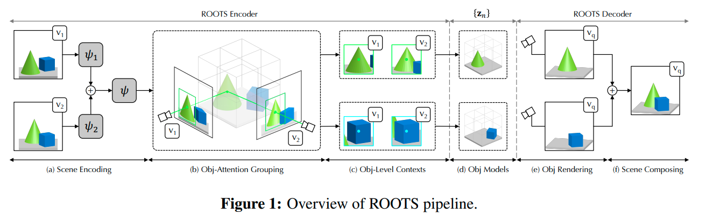

- **前景背景区分方式**： 通过其`Scene Encoder`；其实是在GVFM下做3D物体检测
  
  - 把3D 空间分为 $`N_{max}=N_x \times N_y \times N_z`$ 个cell，每个最多检测1个物体（类似Yolo，扩展到三维）；
  - 检测是否有一个物体其中心落在了cell内；如果有，那么回归出一个连续量 $`\boldsymbol{z}_{ijk}^{where} \in \mathbb{R}^3`$ 来specify坐标
  - 具体做法：把一系列context 观测 $`\mathcal{C}=\{(\boldsymbol{x}_c, \boldsymbol{y}_c)\}`$ encode into a Geometric Volume Feature Map 三维体素特征空间 $`\boldsymbol{r} \in \mathbb{R}^{N_x \times N_y \times N_z \times d}`$ ，逐个cell infer 是否有物体以及中心点坐标
  
    - GVFM需要把一系列partial observation aggregate起来；
    - ① 对$`\mathcal{C}`$ 计算一个order-invariant summary $`\psi`$ ：$`\psi=\sum_{c=1}^{\lvert\mathcal{C} \rvert} \psi_{\mathcal{c}}=\sum_{c=1}^{\lvert\mathcal{C} \rvert} f_\psi(x_c, y_c)`$  
    - ② 对 $`\psi`$ 应用一个3D transposed convolution 来把 scene-level 表征$`\psi`$ split 成单个的$`\boldsymbol{r}_{ijk}`$ slots
- **主要贡献**
  - object-aware scene encoder，把一系列观测首先映射到体素特征空间，再逐cell检测回归有无物体及中心坐标
    - ==思考== ：
      - 这个decoder可以设法用于我们的拓扑图构建
      - 我们是用拓扑图的形式来organize各个物体；每个feature只来自于一个物体的观测，也只存一个物体的信息
  - 重点考虑了object level如何重建图片；对我们会有一定帮助
- **效果**

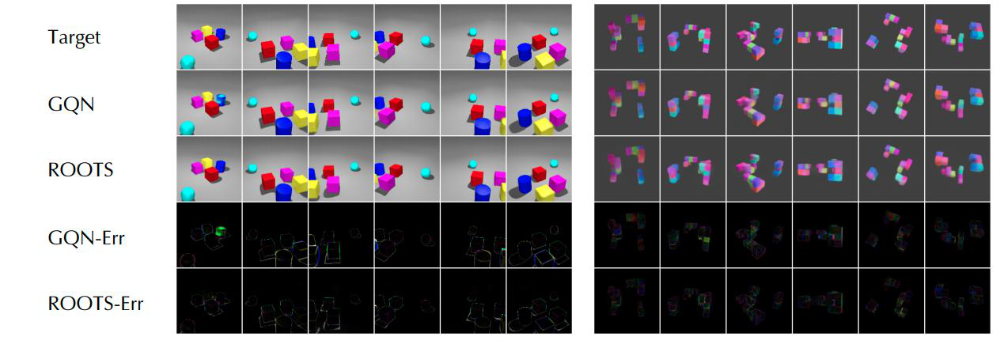

---

**`"Self-supervised Learning of 3D Objects from Natural Images"`**  
**[** `2019` **]** **[[paper]](https://arxiv.org/pdf/1911.08850.pdf)**  **[** :mortar_board: `The University of Tokyo` **]** **[** :office: `RIKEN` **]**  
**[**  `Hiroharu Kato and Tatsuya Harada`  **]** < RGBD-GAN 同组> 
**[** _`natural images`_ **]**  

  
Click to expand

- **自监督的方式，从真实世界图片中提取出3D物体**
- **两阶段训练**
  - 首先学习一个base shape，然后从base shape到full model
  - 如果不用两阶段训练，学习到的形状都变成了一个椭球，变得模糊化了。
  -  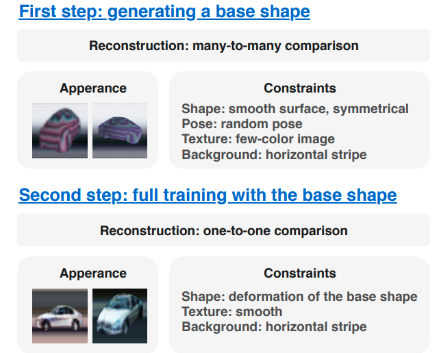
-  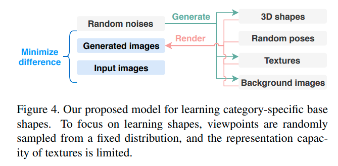
- **主要贡献**
- > 为了应对复杂的形状、复杂的真实世界背景，使用对于物体表面和背景的强regularization
  > To suppress it, we propose using strong regularization and constraints on object surfaces and background images. 
  > 可以从cifar10, pascal这样的数据集中重建出各种各样的物体
  > 由于数据集中经常有ill-posed摆放的图片，学习出并且利用先验知识是关键。
  > Since this is a severely ill-posed problem, learning and leveraging the prior knowledge of objects is the key to this task.

---

**`"Multi-Object Representation Learning with Iterative Variational Inference"`**  
**[** `2019` **]** **[[paper]](https://arxiv.org/pdf/1903.00450.pdf)** **[[code]](https://www.github.com)** **[** :mortar_board: `University` **]** **[** :office: `company` **]**  
**[**  `xxxx`  **]**  
**[** _`abcd`, `efgh`_ **]**  

  
Click to expand

- **主要贡献**
  - 

---

**`"Reconstruction Bottlenecks in Object-Centric Generative Models"`**  
**[** `2020` **]** **[[paper]](https://arxiv.org/pdf/2007.06245.pdf)** **[[code]](https://www.github.com)** **[** :mortar_board: `University` **]** **[** :office: `company` **]**  
**[**  `xxxx`  **]**  
**[** _`GENESIS-based`, `efgh`_ **]**  

  
Click to expand

- **主要贡献**
  - 

---

**`"RELATE: Physically Plausible Multi-Object Scene Synthesis Using Structured Latent Spaces"`**  
**[** `0000` **]** **[[paper]](https://arxiv.org/pdf/2007.01272.pdf)** **[[code]](https://github.com/hyenal/relate)** **[[web]](http://geometry.cs.ucl.ac.uk/projects/2020/relate/)** **[[video]](http://geometry.cs.ucl.ac.uk/projects/2020/relate/paper_docs/EhrhardtGrothEtAl_Relate_NeurIPS_2020.webm)** **[** :mortar_board: `University` **]** **[** :office: `company` **]**  
**[**  `xxxx`  **]**  
**[** _`baseline->GENESIS`, `efgh`_ **]**  

  
Click to expand

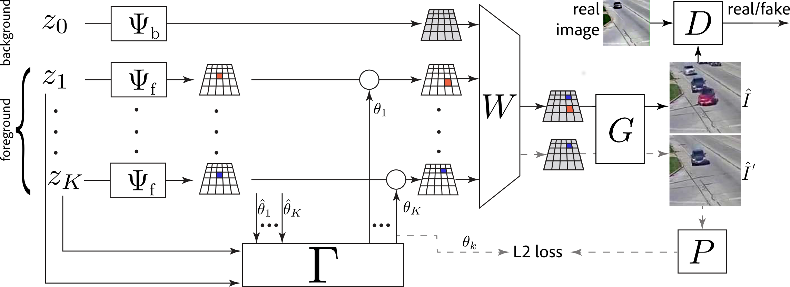

- **主要贡献**
  - 

---

**`"Learning 3D Object-Oriented World Models from Unlabeled Videos"`**  
**[** `ICMLW2020` **]** **[[paper]](http://e2crawfo.github.io/pdfs/icml_ool_2020.pdf)**  **[** :mortar_board: `McGill University` **]**  
**[**  `Eric Crawford`, `Joelle Pineau `  **]**  
**[** _`SRN-based`, `3D objects moving through a 3D world`, `probabilistic`, `encoder/detector focused`_ **]**  

main preliminary: SRN

  
Click to expand

| 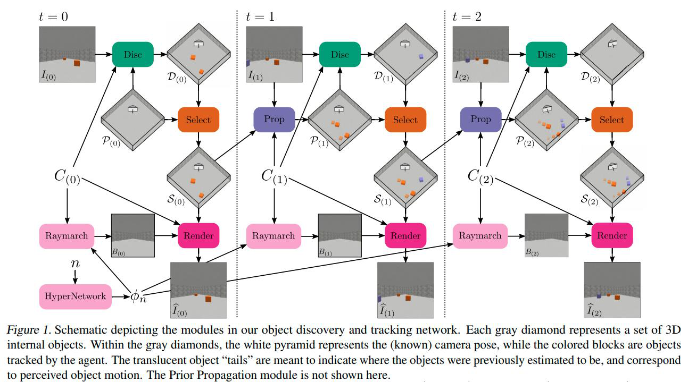 |
| ------------------------------------------------------ |
|                                                        |

- **Motivation**
  - 不仅可以从感知流中分割出物体
  - 而且可以提取物体的3D信息、在3D空间中跟踪他们
- **主要特点**
  - **用的是SRN**
  - **物体是运动的；视频输入**

---

**`"Neural Graphics Pipeline for Controllable Image Generation"`**  
**[** `2020` **]** **[[paper]](https://arxiv.org/pdf/2006.10569.pdf)** **[[code]](https://www.github.com)** **[** :mortar_board: `University` **]** **[** :office: `company` **]**  
**[**  `xxxx`  **]**  
**[** _`abcd`, `efgh`_ **]**  

  
Click to expand

| 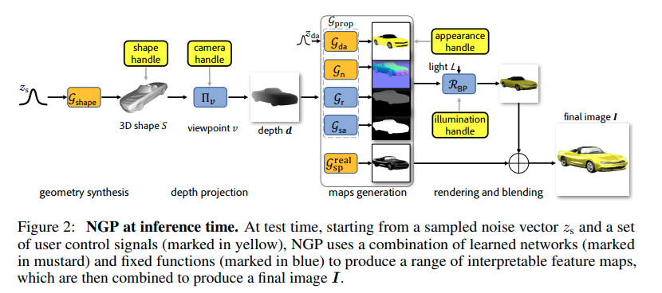 |
| ------------------------------------------------------------ |
|                                                              |

- **主要贡献**
  - 

---

**`"Rotationally-Temporally Consistent Novel View Synthesis of Human Performance Video"`**  
**[** `ECCV2020` **]** **[[paper]](https://www.ecva.net/papers/eccv_2020/papers_ECCV/papers/123490375.pdf)**  **[** :mortar_board: `University of North Carolina` **]** **[** :office: `Adobe`,` Korea Advanced Institute of Science and Technology` **]**  
**[**  `Youngjoong Kwon`  **]**  
**[** _`Novel View Video Synthesis`, `Synthetic Human Dataset`_ **]**  

  
Click to expand

Authors: Youngjoong Kwon , Stefano Petrangeli , Dahun Kim , Haoliang Wang , Eunbyung Park , Viswanathan Swaminathan , and Henry Fuchs

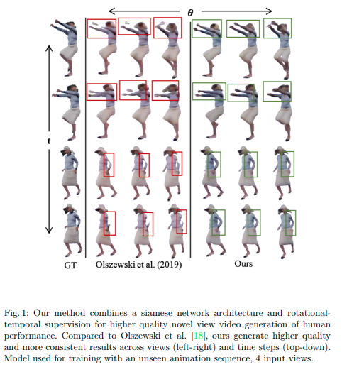

- **主要贡献**
  - 

---

**`< 3D object aware video generation> "Unsupervised object-centric video generation and decomposition in 3D"`**  
**[** `NeurIPS2020` **]** **[[paper]](https://arxiv.org/pdf/2007.06705.pdf)** **[[code]](https://github.com/pmh47/o3v)** **[[web]](https://www.pmh47.net/o3v/)** **[** :office: `IST Austria` **]**  
**[**  `Paul Henderson,Christoph H. Lampert `  **]**  
**[** _`encoder-decoder`, `object-centric generative models`, `inspired by classical image segmentation`,`object tracking`_ **]**  

**[** `review`: 从视频中分解出物体（及运动）与背景的3D表征，传统机器学习功底深厚，loss设计值得研究；利用了视频中的一些hint (object tracking)，没有用到多视几何 **]**

  
Click to expand

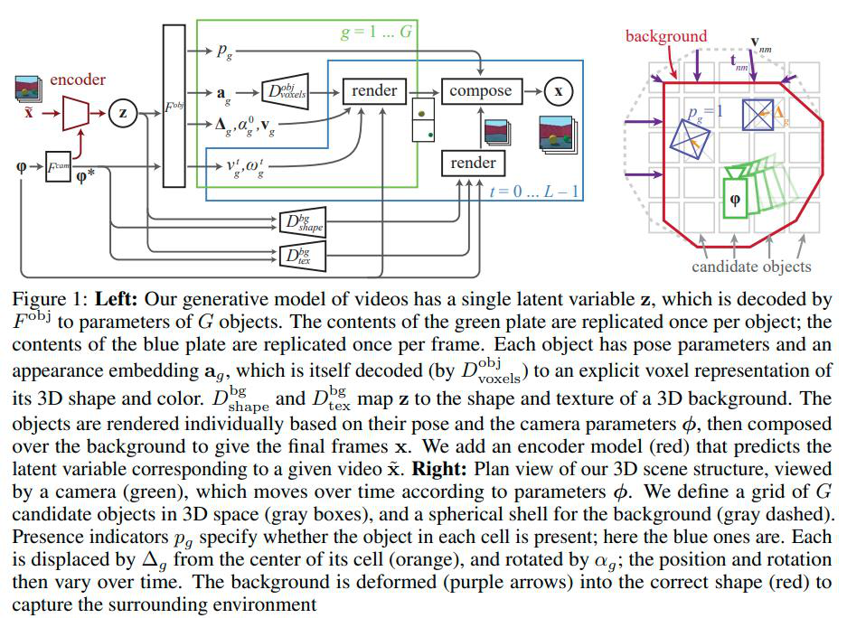

- **前景背景区分方式**
  - 通过encoder 编码 context views of a video $`\{x_z, v_z\}`$ 为两个隐向量：scene embedding和camera paramter embedding，把这两个embedding decode为逐个cell中的是否有物体 + 各个物体的外观、pose参数 + 背景形状、材质
  - 借鉴了传统CV中图像分割的一些思想，依靠强大的loss设计，用encoder-decoder的方式实现了视频生成。泛化性未知
- **主要贡献**
  - 通过预测**分割**mask、随时间跟踪物体，把一段given **video** **分解**为其组成物体、背景
  - 通过预测深度、3D bbox， determine 场景及物体的3D结构
  - 生成连贯的视频，视频中物体在一个3D背景中进行3D空间移动
- **主要特点**
  - 从single latent code z  **decode into** G 个 objects的参数 和 背景的形状、材质
  - 每个object逐个被 decode为  pose parameter 和 apperance embedding
    - pose parameter具体操作：
    - 把空间划分为grid，每个cell infer是否有物体(0/1) ，infer每个物体距离cell中心的位移、旋转（并且都是随时间变化的）
  - 把每个物体的pose时间t序列 、外观embedding、背景形状、材质 随时间逐帧渲染
  - _**ego-centric**_ model
- **==loss / regularization==** （<u>*由于从2D videos中infer 3D结构是inherently ambiguous，因此需要regularization来避免degerate solutions*</u>）
  - L1 regularization on 物体速度大小：discourages local minima, 防止模型不能track物体
  - hinge regularization on 物体存在概率：discourages 物体在优化早期在shape还没适应(学到)时就消失
  - (inspired by *图像分割* 任务中的*Markov random fiields*) we penalize edges in the reconstructed foreground mask for occurring in areas of the original image that have small gradients. ：This discourages undesirable but mathematically-correct solutions where an object is in front of an untextured surface, and parts of that surface are incorporated in the object rather than the background. 
    - [ ] what ??
  - standard mesh regulirazers for 背景、mesh物体，避免degenerate shapes：L2 on Laplacian curvature, L1 on angles between faces, L1 on edge lenghts variance

---

**`"Unsupervised Discovery of 3D Physical Objects from Video"`**  
**[** `0000` **]** **[[paper]](https://arxiv.org/pdf/2007.12348.pdf)** **[[code]](https://www.github.com)** **[** :mortar_board: `MIT` **]** **[** :office: `company` **]**  
**[**  `xxxx`  **]**  
**[** _`abcd`, `efgh`_ **]**  

  
Click to expand

| 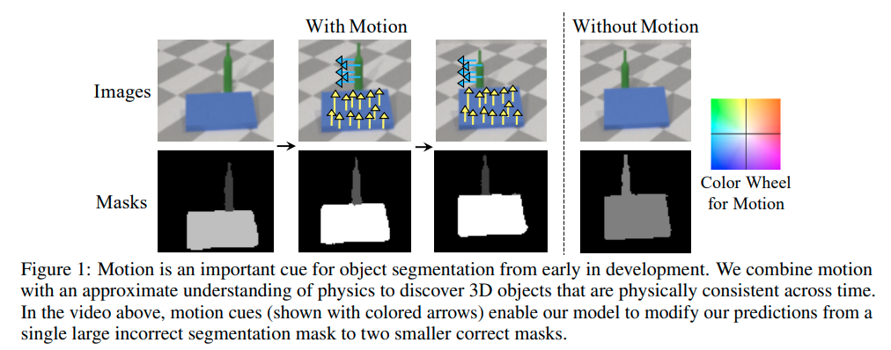 |
| ------------------------------------------------------ |
| 利用物体缓慢移动的motion cue + physics ==(?)==         |

- **主要特点**
  - **数据集中的物体都是缓慢移动的；从motion cue中发现物体**
  - 用SDF表示每个物体
- **Motivation**
  - > we explore how physics, especially object interactions, facilitates learning to disentangle and segment instances from raw videos, and to infer the 3D geometry and position of each object, all without supervision
    > 探索物理学：<u>尤其是物体之间的交互，促进学习出物体之间的解耦，从raw videos中</u>；
    - [ ] what is physics？
  - > our Physical Object Discovery Network (POD-Net) uses both multi-scale pixel cues and physical motion cues to accurately segment observable and partially occluded objects of varying sizes, and infer properties of those objects.
    > 同时使用multi-scale的pixel cue和physical motion cue来精确地分割出可见的、部分被遮挡的尺寸多样的物体，并且infer这些物体的属性

---

**`"Unsupervised Discovery of Object Landmarks via Contrastive Learning"`**  
**[** `0000` **]** **[[paper]](https://arxiv.org/pdf/2006.14787.pdf)** **[[code]](https://www.github.com)** **[** :mortar_board: `MIT` **]** **[** :office: `company` **]**  
**[**  `xxxx`  **]**  
**[** _`abcd`, `efgh`_ **]**  

  
Click to expand

- **主要贡献**
  - 

---

**`"UNSUPERVISED DISCOVERY OF PARTS, STRUCTURE, AND DYNAMICS"`**  
**[** `0000` **]** **[[paper]](https://abc.efg)** **[[code]](https://www.github.com)** **[** :mortar_board: `University` **]** **[** :office: `company` **]**  
**[**  `xxxx`  **]**  
**[** _`abcd`, `efgh`_ **]**  

  
Click to expand

- **主要贡献**
  - 

---

**`"FroDO: From Detections to 3D Objects"`**  
**[** `CVPR2020` **]** **[[paper]](https://openaccess.thecvf.com/content_CVPR_2020/papers/Runz_FroDO_From_Detections_to_3D_Objects_CVPR_2020_paper.pdf)** **[[code]](https://www.github.com)** **[** :mortar_board: `UCL`, `The University of Adelaide` **]** **[** :office: `Facebook` **]**  
**[**  `Martin Runz`, `Kejie Li `  **]**  
**[** _`natural dataset`, `mask-RCNN`, `pre-learnt shape priors`_ **]**  

  
Click to expand

Authos: Martin Runz, Kejie Li, Meng Tang , Lingni Ma , Chen Kong , Tanner Schmidt , Ian Reid , Lourdes Agapito, Julian Straub, Steven Lovegrove, and Richard Newcombed

| 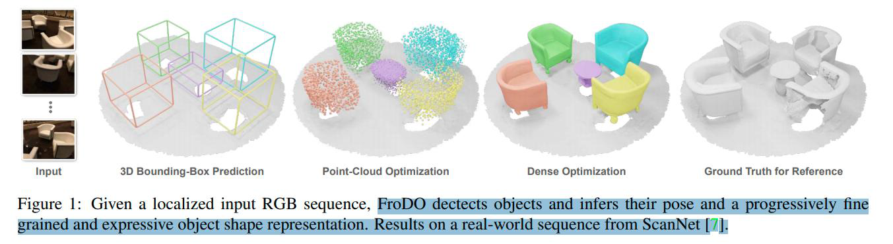       |
| ------------------------------------------------------------ |
| 从一个定位好的RGB输入序列，检测出物体并infer他们的pose和一个progressively fine grained and expressive 物体shape表征 |

- **前景背景区分方式**
  - **使用一个标准的检测、分割框架：mask RCNN**
  - 重点不在分割，而在对分割出来的物体multi view encoder成一个合适的object shape embedding

| 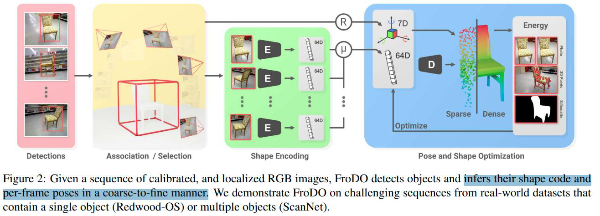 |
| ------------------------------------------------------ |
| 把                                                     |

| 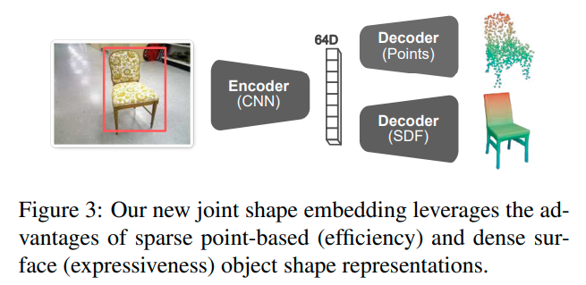       |
| ------------------------------------------------------------ |
| 提出了一种新的joint shape embedding，利用了稀疏点云表征的效率和稠密surface表征的表达能力 |

- **主要贡献**
  - 

