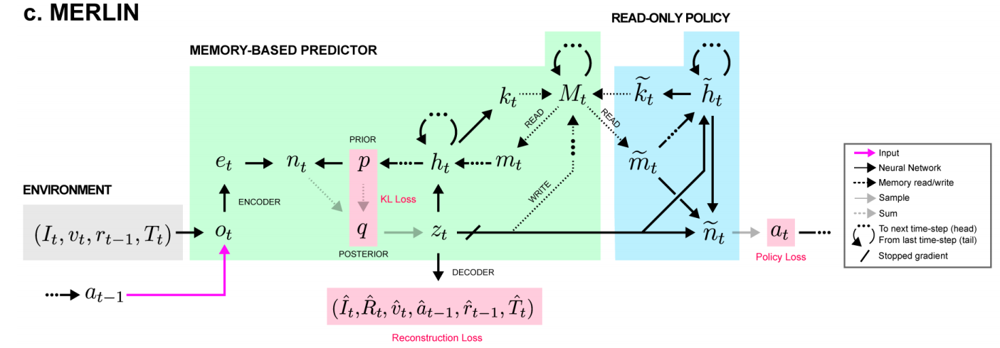
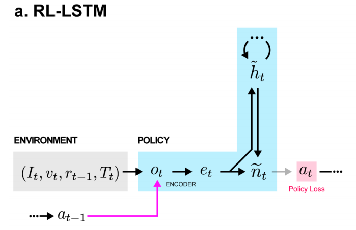
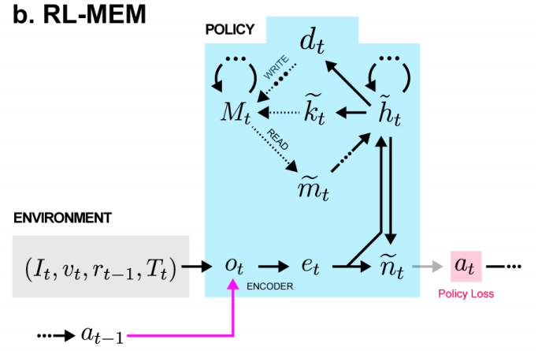

---

**`"unsupervised predictive memory in a goal-directed agent"`**  
**[** `2018` **]** **[[paper]](https://arxiv.org/pdf/1803.10760)** **[[code-(non-official)]](https://github.com/Kajiyu/MERLIN)**   **[** :office: `DeepMind` **]**  
**[**  `Greg Wayne`, `Chia-Chun Hung`, `David Amos`, ...  **]**  
**[** _`abcd`_ **]**  

  
Click to expand

- **Motivation**
- **overview**
  - 
 - 几种不同的记忆模型

| methods                                                      | description |
| ------------------------------------------------------------ | ----------- |
|  |             |
|  |             |
|  |             |

