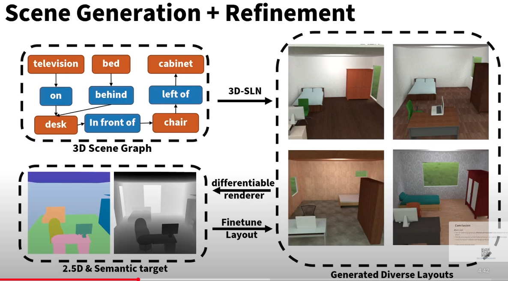
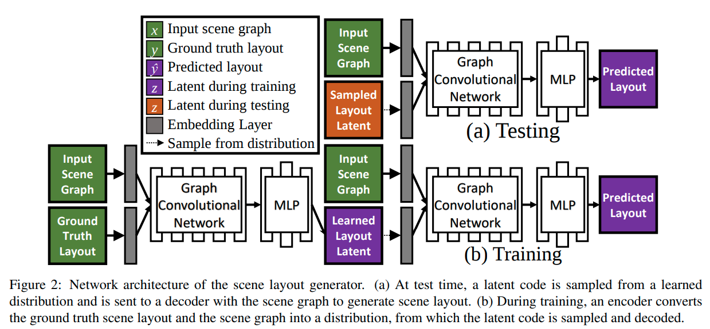
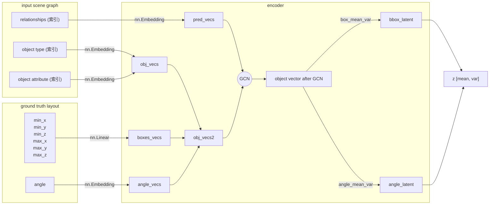
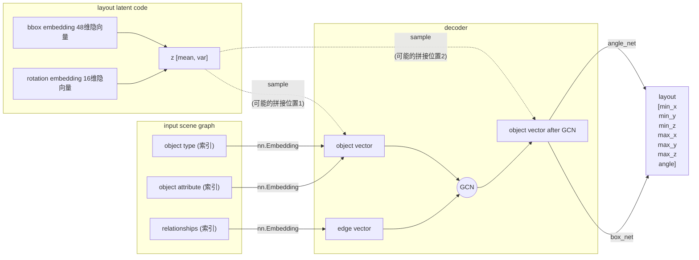
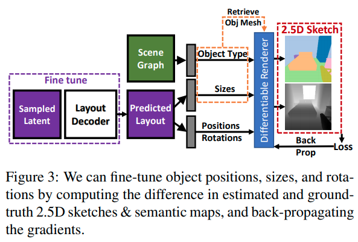
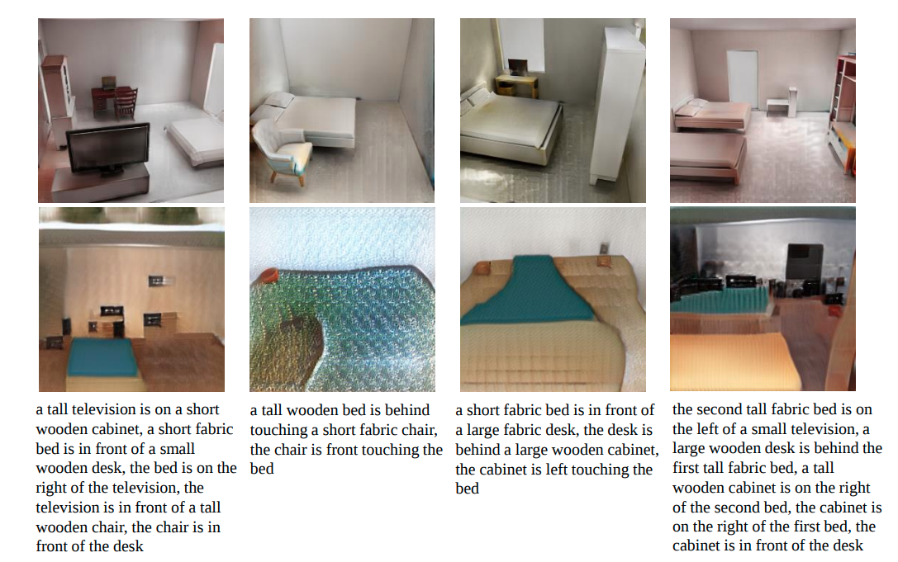
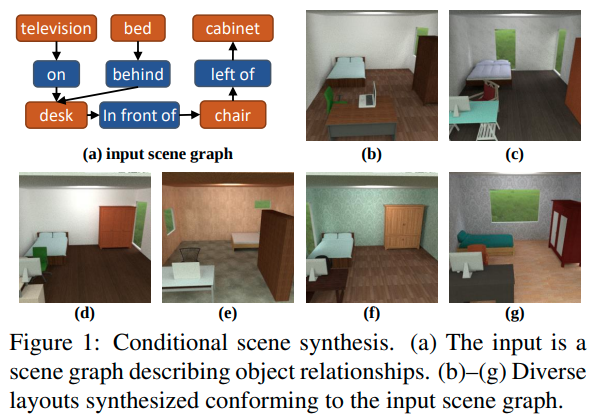
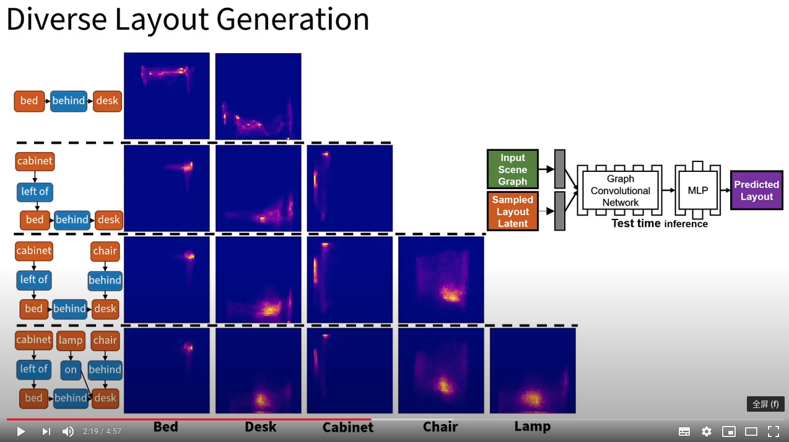

---

**`< layout-conditional 2.5D scene synthesis >"End-to-End Optimization of Scene Layout"`**  
**[** `CVPR2020(oral)` **]** **[[paper]](https://arxiv.org/pdf/2007.11744.pdf)** **[[code]](https://github.com/aluo-x/3D_SLN)** **[[video]](https://www.youtube.com/watch?v=1GQ8IkI6ZJM)** **[[web]](http://3dsln.csail.mit.edu/)** **[** :mortar_board: `MIT: CSAIL, CMU, Stanford` **]**   
**[**  `Andrew Luo, Zhoutong Zhang, Jiajun Wu, Joshua B. Tenenbaum  `  **]**  
**[** _`conditional scene synthesis`, `2.5D`,`variational generative model`， `graph-based variational auto-encoders`_ **]**  

  
Click to expand

|  |
| ------------------------------------------------------------ |
| scene generation + refinement                                |

- **Motivation**
  
  - Traditional scene graph based image generation (e.g. *[CVPR2018] sg2im*)
  
    - 在image space中建模物体关系(而不是scene space)
    - 没有显式的3D物体概念（只有像素）
  - Layout Generation (e.g. *[SIGGRAPH2018] Deep Convolutional Priors for Indoor Scene Synthesis*)
  
    - no spatial-conditioning
    - auto-regressive 自回归 (slow)
  
      - [ ] what?
  - 核心issues
  
    - scene space下的3D关系
    - 解耦的布局、形状、图像构成
    - 基于2.5D+语义目标的object locations的refinement
  
      - [ ] what?
- **主要贡献**
  - 3D-SLN model 可以从一个scene graph生成**diverse and accurate** scene layouts 
  - 3D scene layouts 可以用 2.5D+语义信息 finetune
  - 应用展示：scene graph based layout synthesis + exemplar based image synthesis
- **数据集/数据特征/数据定义**

  - 物体3D model 是直接从SUNCG数据集中 retrive的；选择类别内最相似的bbox
  - scene graph定义：==与我们类似==

    - scene graph `y`由一组triplets构成，$`(o_i, p, o_j)`$
    - $`o_i`$代表第i-th物体的type(索引embedding) + attributes(索引embedding), $`p`$代表空间关系(索引embedding)
  - 本文中layout的数据结构/物理含义：

    - each element $`y_i`$ in layout $`y`$ 定义是一个 7-tuple，代表物体的bbox和竖直轴旋转：$$`y_i=(min_{X_i}, min_{Y_i}, min_{Z_i}, max_{X_i}, max_{Y_i}, max_{Z_i}, \omega_i )`$$
  - 本文中latent space的定义：

    - [box_emdding, angle_ambedding] (因为是VAE，所以还分了mean, var)
- **主要组件**

  - conditional (on scene graph) layout synthesizer
    
    - 产生的而是3D scene layout； 每个物体都有3D bbox + 竖直轴旋转
    - 把传统2D scene graph数据增强为3D scene graph，把每个物体关系编码到三维空间
    - <u>**虽然是一个encoder-decoder结构，但是generate过程其实就用不到encoder了，decoder才是关键**</u>
  - 集成了一个differentiable renderer来只用scene的2D投影来refine 最终的layout

    - 给定一张semantics map和depth map，可微分渲染器来**optimize over** the synthesized layout去**拟合**给定的输入，通过**<u>analysis-by-synthesis</u>** fashion
    - 其实就是一个auto-decoder结构，通过整个可微分通路，把sample出的layout latent反向传播最优化更新（文中称之为"refinement"/"fine tune"/"generate a layout toward a target layout"）
- **layout generator的网络架构**

|  |
| ------------------------------------------------------------ |
| <u>**测试**</u>时，scene graph + 从一个learned distribution 采样latent code => generate scene layout  <u>**训练**</u>时，input scene graph + GT layout 先通过encoder提取出其layout latent  (学出一个distribution)，然后用提取出的layout latent + input scene graph 生成predicted layout |

- **encoder**

 - **decoder**
    - 注意：sample到的z拼接到obj_vecs有两种可选方式
       - 可以先把z拼接到GCN之前的object vectors，然后GCN
       - 也可以先GCN然后再把z拼接到GCN之后的object vectors

- **refinement (finetune) 过程**

|  |
| ------------------------------------------------------------ |
| 类似auto-decoder结构； 通过整个可微分通路，把sample出的layout latent反向传播最优化更新（文中称之为"refinement"/"fine tune"/"generate a layout toward a target layout"） |

- **效果**

  - 2.5D vs. 2D

    - 
  - diverse layout from the same scene graph

    - 
  - diverse layout generation

    - 

