* TOC
{:toc}

---

## indoor scene datasets
 - ~~SUNCG~~ (until now, 2021-01-10)
 - scannet
 - scenenet
- scenenet RGBD
    - 由于随机生成场景时是"从空中往下落"的设定，很多random的场景重度散乱，渲染是realistic了，场景布置非常non-realistic 不过那57个manual的场景还是足够真实的
    - 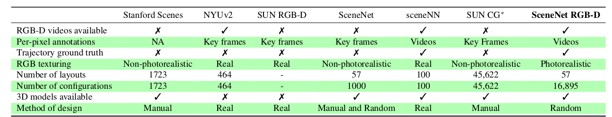
 - replica
 - matterport3D
 - gibson / gibsonv2
 - habitat
 - ai2thor
 - [3DFront](https://tianchi.aliyun.com/specials/promotion/alibaba-3d-scene-dataset), by [Alibaba 躺平](https://www.tangping.com/), 中科院计算所, SFU；[paper](https://arxiv.org/pdf/2011.09127.pdf)
     - 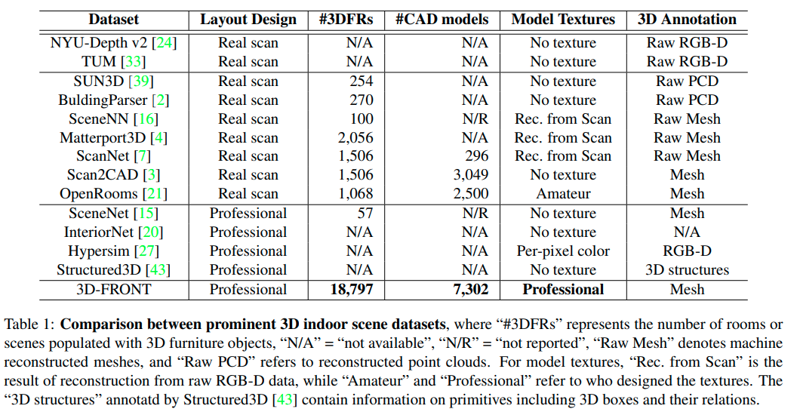

## scene graph / scene text to image generation / indoor scene synthesis

---

**`<Deep-Synth> "Deep Convolutional Priors for Indoor Scene Synthesis"`**  
**[** `SIGGRAPH2018` **]** **[[paper]](https://kwang-ether.github.io/pdf/deepsynth.pdf)** **[[code]](https://github.com/brownvc/deep-synth)** **[[web]]** **[** :mortar_board: `Brown University`, `Princeton University` **]**  
**[**  `Kai Wang`, `Manolis Savva`, `Angel X Chang`, `Daniel Ritchie`  **]**  
**[** _`abcd`_ **]**  

  
Click to expand

- **Motivation**

---

**`<Fast-Synth> "Fast and Flexible Indoor Scene Synthesis via Deep Convolutional Generative Models"`**  
**[** `CVPR2019` **]** **[[paper]](https://arxiv.org/pdf/1811.12463)** **[[code]](https://github.com/brownvc/fast-synth)** **[[web]]** **[** :mortar_board: `Brown University` **]**   
**[**  `Daniel Ritchie`, `Kai Wang`, `Yu-an Lin`  **]**  
**[** _`abcd`_ **]**  

  
Click to expand

- **Motivation**

---

**`<3D_SLN>"End-to-End Optimization of Scene Layout"`**  
**[** `CVPR2020(oral)` **]** **[[paper]](https://arxiv.org/pdf/2007.11744.pdf)** **[[code]](https://github.com/aluo-x/3D_SLN)** **[[video]](https://www.youtube.com/watch?v=1GQ8IkI6ZJM)** **[[web]](http://3dsln.csail.mit.edu/)** **[** :mortar_board: `MIT:CSAIL`, `CMU`, `Stanford` **]**   
**[**  `Andrew Luo`, `Zhoutong Zhang`, `Jiajun Wu`, `Joshua B. Tenenbaum`  **]**  
**[** _`scene graph`, `conditional scene synthesis`, `2.5D`,`variational generative model`， `graph-based variational auto-encoders`_ **]**  

  
Click to expand

|  |
| ------------------------------------------------------------ |
| scene generation + refinement                                |

- **Motivation**
  - Traditional scene graph based image generation (e.g. *[CVPR2018] sg2im*)
    - 在image space中建模物体关系(而不是scene space)
    - 没有显式的3D物体概念（只有像素）
  - Layout Generation (e.g. *<Deep-Synth> [SIGGRAPH2018] Deep Convolutional Priors for Indoor Scene Synthesis*)
    - no spatial-conditioning
    - auto-regressive 自回归 (slow)
      - [x] Q: what? A: 第n+1个物体的属性depend on 前n个物体的属性；序列化的结构
  - 核心issues
    - scene space下的3D关系
    - 解耦的布局、形状、图像构成
    - 基于2.5D+语义目标的object locations的refinement
      - [x] Q: what?  A: 朝着一个target 图片/语义分割图 来用auto-decoder的形式 优化出layout
- **主要贡献**
  - 3D-SLN model 可以从一个scene graph生成 **diverse and accurate** scene layouts 
  - 3D scene layouts 可以用 2.5D+语义信息 finetune
  - 应用展示：scene graph based layout synthesis + exemplar based image synthesis
- **数据集/数据特征/数据定义**
  - 物体3D model 是直接从SUNCG数据集中 retrive的；选择类别内最相似的bbox
  - scene graph定义：==与我们类似==
    - scene graph `y`由一组triplets构成，$$(o_i, p, o_j)$$
    - $$o_i$$代表第i-th物体的type(索引embedding) + attributes(索引embedding), $$p$$代表空间关系(索引embedding)
  - 本文中layout的数据结构/物理含义：
    - each element $$y_i$$ in layout $$y$$ 定义是一个 7-tuple，代表物体的bbox和竖直轴旋转：$$y_i=(\min_{X_i}, \min_{Y_i}, \min_{Z_i}, \max_{X_i}, \max_{Y_i}, \max_{Z_i}, \omega_i )$$
  - 本文中latent space的定义：
    - [box_emdding, angle_ambedding] (因为是VAE，所以还分了mean, var)
- **主要组件**
  - conditional (on scene graph) layout synthesizer
    - 产生的而是3D scene layout； 每个物体都有3D bbox + 竖直轴旋转
    - 把传统2D scene graph数据增强为3D scene graph，把每个物体关系编码到三维空间
    - **<u>虽然是一个encoder-decoder结构，但是generate过程其实就用不到encoder了，decoder才是关键</u>**
  - 集成了一个differentiable renderer来只用scene的2D投影来refine 最终的layout
    - 给定一张semantics map和depth map，可微分渲染器来 **optimize over** the synthesized layout去 **拟合** 给定的输入，通过 **<u>analysis-by-synthesis</u>** fashion
    - 其实就是一个auto-decoder结构，通过整个可微分通路，把sample出的layout latent反向传播最优化更新（文中称之为"refinement"/"fine tune"/"generate a layout toward a target layout"）
- **layout generator的网络架构**

|  |
| ------------------------------------------------------------ |
| **<u>测试</u>** 时，scene graph + 从一个learned distribution 采样latent code => generate scene layout  **<u>训练</u>** 时，input scene graph + GT layout 先通过encoder提取出其layout latent  (学出一个distribution)，然后用提取出的layout latent + input scene graph 生成predicted layout |

- **encoder**

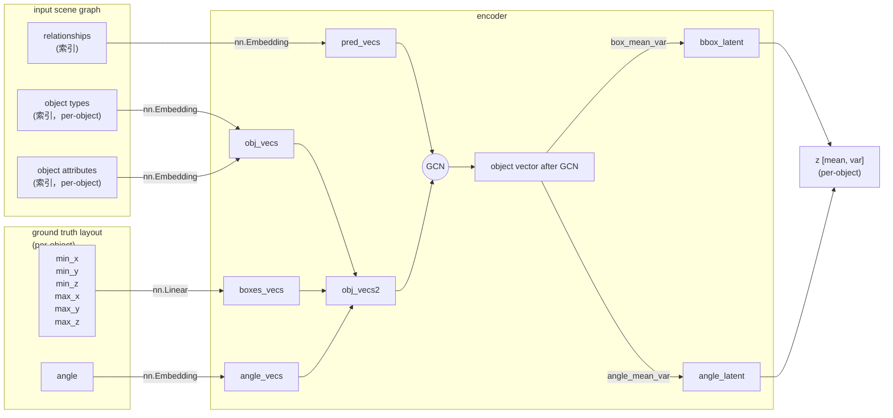

 - **decoder**
    - 注意：sample到的z拼接到obj_vecs有两种可选方式
       - 可以先把z拼接到GCN之前的object vectors，然后GCN
       - 也可以先GCN然后再把z拼接到GCN之后的object vectors

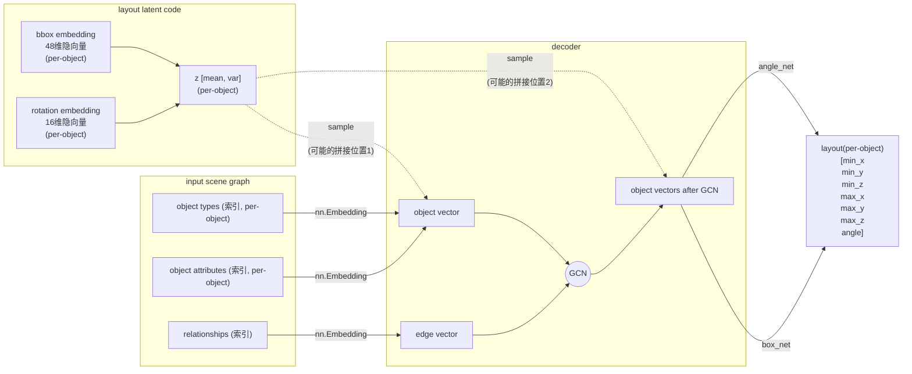

- **refinement (finetune) 过程**

|  |
| ------------------------------------------------------------ |
| 类似auto-decoder结构； 通过整个可微分通路，把sample出的layout latent反向传播最优化更新（文中称之为"refinement"/"fine tune"/"generate a layout toward a target layout"） |

- **效果**
  - 2.5D vs. 2D
    - 
  - diverse layout from the same scene graph
    - 
  - diverse layout generation
    - 

---

**`"SceneFormer: Indoor Scene Generation with Transformers"`**  
**[** `arXiv2020` **]** **[[paper]](https://arxiv.org/pdf/2012.09793.pdf)** **[[code]]** **[[web]]** **[** :mortar_board: `TUM` **]**   
**[**  `Xinpeng Wang`, `Chandan Yeshwanth`, `Matthias Nießner`  **]**  
**[** _`text description`, `transformer`_ **]**  

  
Click to expand

- **review**
  - 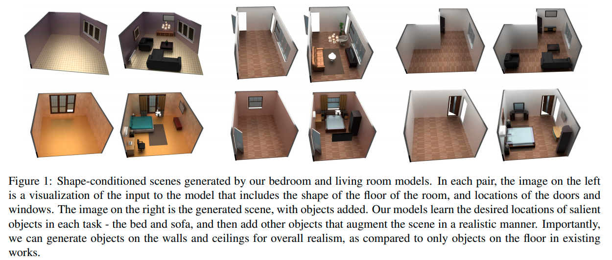
  - 对比之前的只能在地上放东西的方法，本篇还可以生成墙上、天花板上的东西，而且整体的真实性得到提到
  - 3D_SLN的被引
  - 笔者评价：
    - 手动选择关系族确实会biased，但像这篇这样直接用隐式的transformer捕捉场景的pattern也不合适。它相当于把各种物体的信息全部揉在了一团；如果在场景中添加一个新种类的物体，模型就"傻眼"了、不可适用了；
      - 比如你的数据集卧室里只有床、枕头、柜子，有人就是要往卧室摆个电视机，你能怎么办？或者用户新购买了一种模型在各种屋子都没见过的家具怎么办？如果是本篇的方法，对于这种级别的修改，要在新数据集上**<u>重新训练整个</u>**模型，这显然是不合理、有违自然的；因为新添加的物体种类只是一种增量式的更新，已经学到的知识应该是保留的。
    - 比较合适的思路，应该是逐pair、逐category地考虑、建模、构建关系；
      - 关系的种类数$$N$$不应是个定值；甚至可能不是一个有穷值；关系的划分，可能也不是离散的，而是连续的？是一个此起彼伏的概率密度函数？
- **Motivation**
  - **任务描述**：
    - indoor scene generation: to generate a sequence of objects, their locations and orientations conditioned on the shape and size of a room. 室内场景生成任务：生成一个物体序列，包括物体的位置、朝向，conditioned on 房间的形状和大小
    - 现存的大规模室内场景数据集，使得我们可以从`user-defined indoor scenes`中提取出`pattern`，然后基于这些`pattern`生成新的场景
    - 未来用处：生成虚拟的室内场景对于内饰供应商有商业价值：可以在AR,VR平台向用户展示，用户可以`interactively modify it`
  - 现有的方法，除了物体的位置之外，还：
    - **依赖于这些场景的2D或3D外观** 
    - **并且对物体之间的关系做出假设**
      - 目前有一些需要用到物体关系标注的方法，假定一族固定的、手动设计的物体之间的关系
      - **<u>本篇用transformer机制，直接从物体的raw locations和orientations来提取pattern，避免由于手动选择关系引入的bias</u>**
        - 意思就是把pattern当成纯隐的来提取；
        - 一个直接的例子，比如沙发和电视之间的对应$$\Delta pose$$关系，就比较隐式，文中的方法可以很好的生成
  - 本篇 **不使用任何外观信息**，**并且利用transformer机制自己学出来物体之间的关系**
  - 只需要**输入** <u>(空)房间的形状</u>，还有<u>房间的文字描述</u>，然后就可以生成整个房间
- **dataset**
    - large object and scene datasets: ModelNet, ShapeNet, 
    - and other human-annotated scene datasets with synthetic objects / human-created scene dataset:  <**SUNCG**>[*Semantic scene completion from a single depth image. CVPR2017*](https://sscnet.cs.princeton.edu/)
        - 去掉bad samples, as previous works done : 
            - [**Planit**: *Planning and instantiating indoor scenes with relation graph and spatial prior networks. TOG2019* ]
            - [*Fast and flexible indoor scene synthesis via deep convolutional generative models. CVPR2019* ]
        - 最后得到 6351个卧室和1099个living room
        - 卧室使用50种物体类型，客厅用39个物体类型
        - 房间：用(0,90,180,270) degrees的旋转来增强数据集；位置(0,0.5)均匀分布采样
        - 房间的句子描述数据用的是`heuristic`的方法来产生（也就是hand-crafted）
 - **Overview**
    - `auto-regressive`自回归方式：第$$(n+1)^{th}$$物体的属性 conditioned on 前n个物体的属性
    - 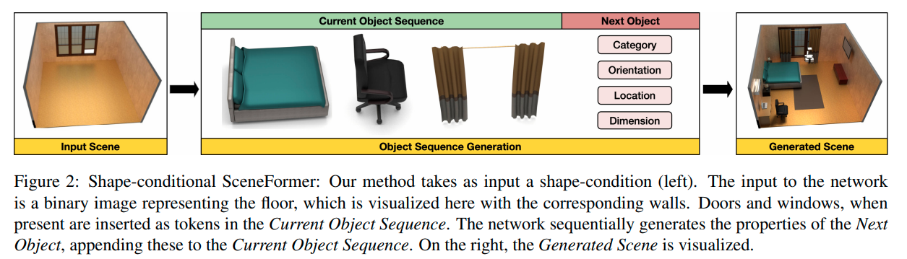
    - 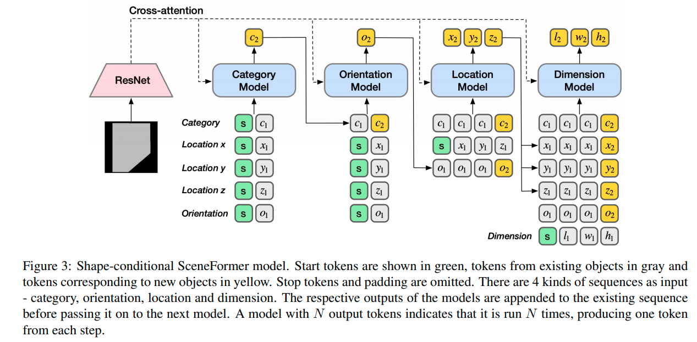
 - **results**
    - 如果没有给出房间形状，则用一个room-shape prior来放置物体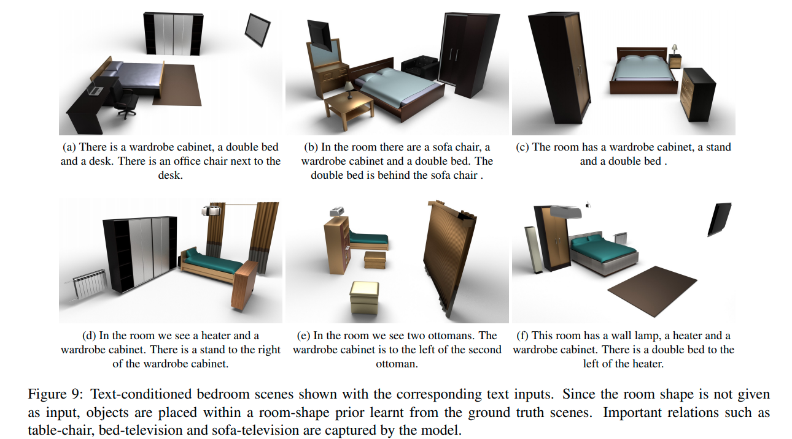
 - **future work**
    - 可以用于真实场景的3D重建

---

**`"Learning Canonical Representations for Scene Graph to Image Generation"`**  
**[** `ECCV2020` **]** **[[web]](https://roeiherz.github.io/CanonicalSg2Im/)** **[[paper]](https://arxiv.org/pdf/1912.07414.pdf)** **[[code]](https://github.com/roeiherz/CanonicalSg2Im)** **[** :mortar_board: `Tel Aviv University`, `UCB`, `Bar-Ilan University` **]** **[** :office: `NVIDIA` **]**  
**[**  `Roei Herzig`, `Amir Bar`, `Huijuan Xu`, `Gal Chechik`, `Trevor Darrell`, `Amir Globerson`  **]**  
**[** _`semantic equivalence`_ **]**  

  
Click to expand

- **Motivation**
  - 过去的sg2im的一个不足是不能捕捉graphs中的语义等价性(semantic equivalence)
    - 即：同样一张图片可以用多个逻辑上等价的SG来表述
  - 所以提出从数据中学习出canonical graph representations
  - 主要展示3个数据集：visual genome, COCO, clevr
- **Overview**
  - SG to canonical weighted SG
  - weighted SG to layout
  - layout to image
- **Scene Graph Canonicalization**
  - transitive relation, converse relations
- **效果**
  - 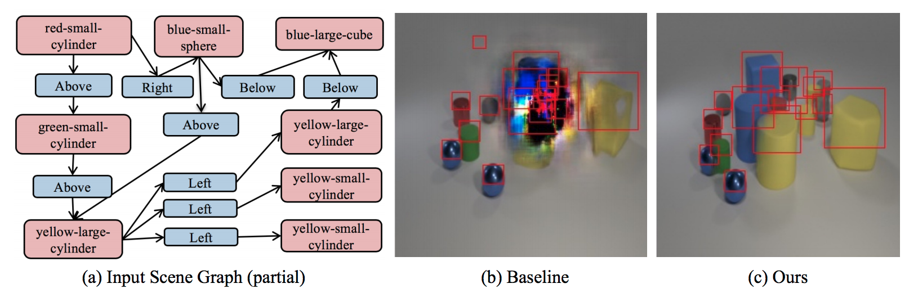

## capsule networks

 - keywords
    - Google scholar - [GE Hinton](https://scholar.google.com.hk/citations?hl=zh-CN&user=JicYPdAAAAAJ&view_op=list_works&sortby=pubdate)

---

**`"Stacked Capsule Autoencoders"`**  
**[** `NeurIPS2019` **]** **[[paper]](https://papers.nips.cc/paper/2019/file/2e0d41e02c5be4668ec1b0730b3346a8-Paper.pdf)** **[[code]](https://github.com/phanideepgampa/stacked-capsule-networks)** **[** :mortar_board: `Oxford` **]** **[** :office: `Google Brain`, `DeepMind` **]**  
**[**  `Adam R. Kosiorek`, `Sara Sabour`, `Yee Whye Teh`, `Geoffrey E. Hinton`  **]**  
**[** _`capsule networks`_ **]**  

  
Click to expand

- **Motivation**
  - 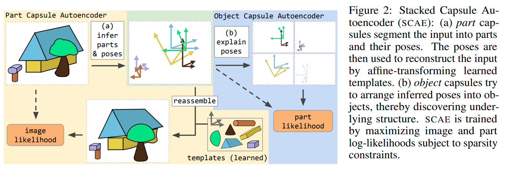

---

**`"Canonical Capsules: Unsupervised Capsules in Canonical Pose"`**  
**[** `arXiv2020` **]** **[[paper]](https://arxiv.org/pdf/2012.04718.pdf)** **[[code]]** **[** :mortar_board: `University of British Columbia`, `University of Toronto`, `University of Victoria` **]** **[** :office: `google` **]**  
**[**  `Weiwei Sun`, `Andrea Tagliasacchi`, `Boyang Deng`, `Sara Sabour`, `Soroosh Yazdani`, `Geoffrey Hinton`, `Kwang Moo Yi`  **]**  
**[** _`capsule network`, `3D pointclouds`, `Canonical`_ **]**  

  
Click to expand

- **Motivation**
  - unsupervised capsule architecture for 3D point clouds
  - 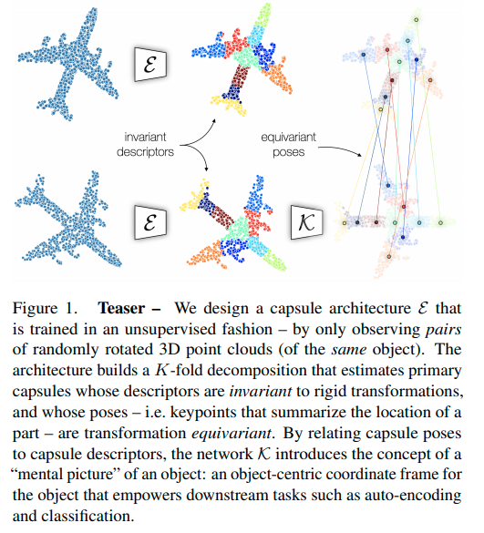
- **overview**
  - 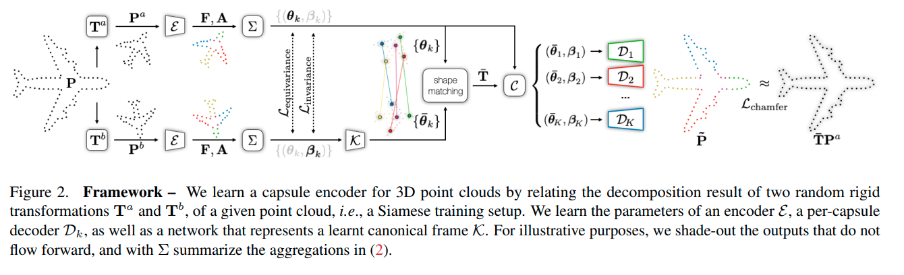
  - decomposition
    - 把点云$$\boldsymbol{P} \in \mathbb{R}^{P \times D}$$用一个encoder计算出K-fold attention map $$\boldsymbol{A} \in \mathbb{R}^{P \times K}$$和逐点的feature $$\boldsymbol{F} \in \mathbb{R}^{P \times C}$$ 
    - 然后计算$$k$$-th capsule的pose $$\boldsymbol{\theta}_k \in \mathbb{R}^3$$ 和对应的capsule descriptor $$\boldsymbol{\beta}_k \in \mathbb{R}^C$$
      - $$\boldsymbol{\theta}_k = \frac {\sum_p A_{p,k}P_p} {\sum_p A_{p,k}}$$
      - $$\boldsymbol{\beta}_k=\frac {\sum_p A_{p,k}F_p} {\sum_p A_{p,k}}$$
      - 其实就是attention map加权和后的点坐标和attention map加权和后的点feature
  - canonicalization
    - 单纯地保证不变性和等变性并不足以学出一个object-centric的3D表征，因为缺乏一种(无监督)的机制来==**<u>bring information into a shared "object-centric" reference frame</u>**==
    - 并且，一个"合适"的canonical frame其实就是一个convention，所以我们需要一个机制让网络做出一个**<u>选择</u>**——并且必须在所有物体中都是一致的
      - 比如，一个沿着+z轴放置的飞机和一个沿着+y轴放置的飞机是**<u>一样好</u>**的
    - 为了实现这一点：link the capsule descriptors to the capsule poses in canonical space；i.e. ask that objects with similar appearance to be located in similar Euclidean neighborhoods in canonical space
      - 具体做法是用一个全连接层，从descriptor直接回归出每个capsule的pose
      - $$\overline{\theta}=\mathcal{K}(\beta)$$  $$\overline{\theta} \in \mathbb{R}^{K\times 3}$$是canonical poses， $$\mathcal{K}$$是全连接神经网络， $$\beta \in \mathbb{R}^{K \times C}$$ 是capsule的descriptor
      - [ ] Q: why?居然直接从K个胶囊描述子直接回归出K个canonical pose

---

**`"Unsupervised part representation by Flow Capsules"`**  
**[** `arXiv2020` **]** **[[paper]](https://arxiv.org/pdf/2011.13920.pdf)** **[[code]]** **[** :mortar_board: `University of Toronto` **]** **[** :office: `Google` **]**  
**[**  `Sara Sabour`, `Andrea Tagliasacchi`, `Soroosh Yazdani`, `Geoffrey E. Hinton`, `David J. Fleet`  **]**  
**[** _`capsule networks`, `motion cue`_ **]**  

  
Click to expand

- **Motivation**
  - capsule networks不能高效地学到low level的part descriptions
  - exploit motion as a powerful perceptual cue for part definition  用运动作为一个部件定义的有力的感知线索
- results
  - 从复杂背景中找出来原来的三角形、正方形、圆形等 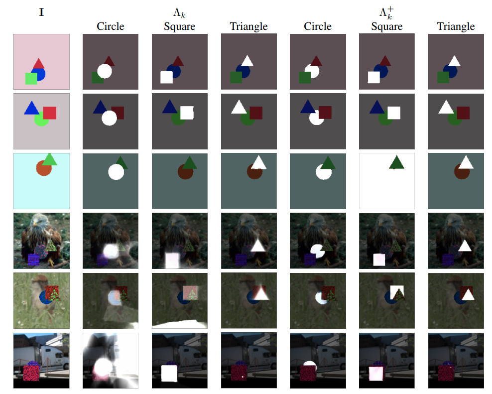
  - 对于运动的人学出来的部件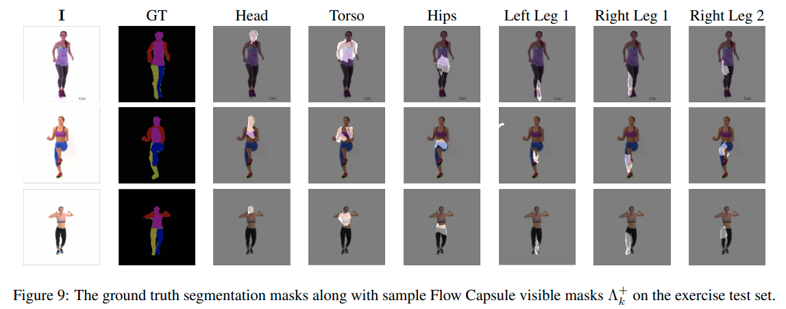

