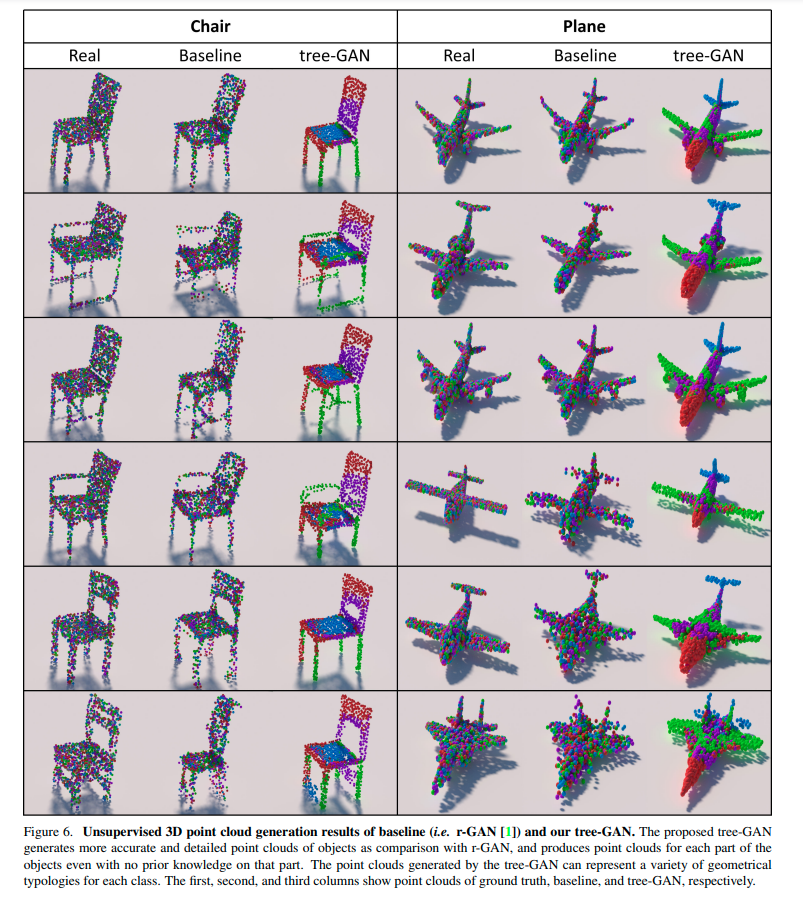
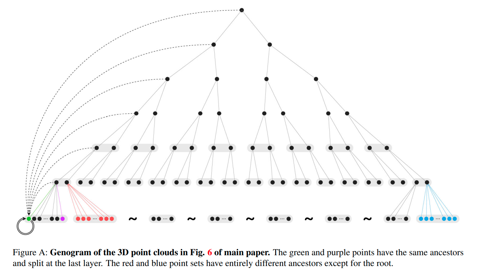
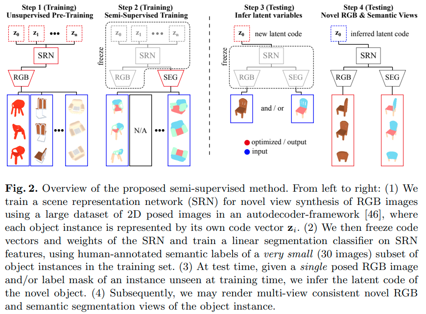
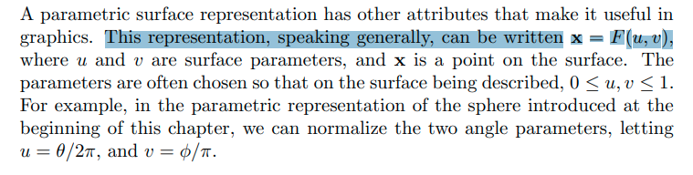

[toc]

- keyword
  - image segmentation
  - (implicit function) isosurface extraction
  - isosurface + GAN ?
  - differentiable + isosurface ?
  - semantic + isosurface ?
  - **point-based** representation
    - point set generation network (大多是auto-decoder结构，输出固定个数的点)
    - point cloud generation (GAN)
    - 
  - implicit field/feature + semantic information
  - sitzmann inferring semantic 引文

## point set generation (fixed length)

---

**`<r-GAN, l-GAN> <PC-GAN> "learning representations and generative models for 3d point clouds"`**  
**[** `ICLR2018` **]** **[[paper]](https://arxiv.org/pdf/1707.02392)** **[[code]](https://www.github.com)** **[** :mortar_board: `University` **]** **[** :office: `company` **]**  
**[**  `xxxx`  **]**  
**[** _`abcd`_ **]**  

  
Click to expand

- 评价

  - 使用了全连接层；由于全连接层在生成有结构的数据时有困难，因此难以产生带有多样性的真实形状
- **Motivation**
- 主要构成

  - Raw point cloud GAN (r-GAN) 产生raw $`2048 \times 3`$ point set 输出

    - generator从高斯噪声vector产生 $`2048 \times 3`$ 点云集输出
    - discriminator使用正常的auto encoder，直接输入raw point cloud
  - Latent-space GAN (l-GAN)

    - 首先预训练一个pre-trained AE，然后generator和discriminator 都在这个pretrained AE的 bottle-neck variables 操作

---

**`"A Point Set Generation Network for 3D Object Reconstruction from a Single Image"`**  
**[** `2016` **]** **[[paper]](https://arxiv.org/pdf/1612.00603.pdf)** **[[code]](https://github.com/fanhqme/PointSetGeneration)** **[** :mortar_board: `Tsinghua, Stanford` **]**   
**[**  `Haoqiang Fan,Hao Su,Leonidas Guibas  `  **]**  
**[** _`point set generation`_ **]**  

  
Click to expand

- **Motivation**

---

**`<DPC> "Unsupervised Learning of Shape and Pose with Differentiable Point Clouds"`**  
**[** `2018` **]** **[[paper]](https://abc.efg)** **[[code]](https://www.github.com)** **[** :mortar_board: `MPI` **]** **[** :office: `Intel` **]**  
**[**  `Eldar Insafutdinov`, `Alexey Dosovitskiy`  **]**  
**[** _`abcd`_ **]**  

  
Click to expand

- **Motivation**
  - from unlabeled category-specific images to 3D shape + camera pose
  - 直接用MLP输出点云集

## point cloud generation (from distribution to distribution)

---

**`<tree-GAN> "3D Point Cloud Generative Adversarial Network Based on Tree Structured Graph Convolutions"`**  
**[** `ICCV2019` **]** **[[paper]](https://openaccess.thecvf.com/content_ICCV_2019/papers/Shu_3D_Point_Cloud_Generative_Adversarial_Network_Based_on_Tree_Structured_ICCV_2019_paper.pdf)** **[[supp]](https://openaccess.thecvf.com/content_ICCV_2019/supplemental/Shu_3D_Point_Cloud_ICCV_2019_supplemental.pdf)** **[[code]](https:// github.com/seowok/TreeGAN)** **[** :mortar_board: `(Korea)Chung-Ang University` **]**   
**[**  `Dong Wook Shu`  **]**  
**[** _`abcd`_ **]**  

  
Click to expand

- **Motivation**
  
  - 
  - tree结构的GCN

[image-to-point cloud] Geometric adversarial loss for single-view 3D-object reconstruction

[point cloud-to-point cloud]  Point cloud auto-encoder via deep grid deformation.

GANS: 

[40] 使用图卷积+GAN；邻接矩阵的计算太复杂，要平方计算

## continuous function representation (sampling)

---

**`"Inferring Semantic Information with 3D Neural Scene Representations"`**  
**[** `3DV 2020` **]** **[[web]](https://www.computationalimaging.org/publications/semantic-srn/)** **[[paper]](https://arxiv.org/pdf/2003.12673.pdf)**  **[** :mortar_board: `Stanford` **]**  
**[**  `Amit Kohli,Vincent Sitzmann, Gordon Wetzstein `  **]**  
**[** _`multi-modal features， semi-supervision`_ **]**  

  
Click to expand

- **Motivation**
  
  - 证明像SRN这样的隐式神经表征也可以包含多模态的信息：外观，形状，语义，*etc.*
- **OverView**
- 1. [训练] 正常的类别物体SRN预训练
    2. [训练] 固定SRN的参数和RGB neural renderer，在<u>已经固定</u>的SRN feature上利用少量的监督数据(如文中只用了30张语义标注好的RGB图片) 训练一个额外的语义分类器
    3. [测试] 单张RGB图片 ==**<u>and/or</u>**== 单张标注好的语义图片，提取code
       1. 注意这里的and/or：训练的时候RGB和语义监督信号都有，测试的时候只需要二者之一就足够，不一定全都要
    4. [测试] 利用第3步提取好的code在更多camera view下render出RGB和语义
  - 

- occupancy networks: 多分辨率等值面提取技术

## differentiable mesh extraction / differentiable volumetric rendering / implicit field isosurface (not watertight)

SRN也算此行列；可以微分的ray marching

---

**`"MeshSDF: Differentiable Iso-Surface Extraction"`**  
**[** `NeurIPS2020` **]** **[[paper]](https://arxiv.org/pdf/2006.03997.pdf)** **[[code]](https://github.com/cvlab-epfl/MeshSDF)** **[** :mortar_board: `EPFL` **]** **[** :office: `Neuralconcept`, `Intel` **]**  
**[**  `Edoardo Remelli`, `Pascal Fua `   **]**  
**[** _`differentiable iso-surface extraction`_  **]**  

[differentiable iso-surface extraction]

  
Click to expand

- **Motivation**
  - 

---

**`<DVR> "Differentiable Volumetric Rendering: Learning Implicit 3D Representations without 3D Supervision"`**  
**[** `CVPR2020` **]** **[[paper]](https://arxiv.org/pdf/1912.07372.pdf)** **[[code]](https://github.com/autonomousvision/differentiable_volumetric_rendering)** **[** :mortar_board: `MPI`,`University of Tubingen` **]**   
**[** `Michael Niemeyer,Andreas Geiger ` **]**  
**[**  _`differentiable volumetric rendering`_ **]**  

  
Click to expand

- **Motivation**
  - 

## iso-surface generation / generative / GAN

## implicit field/feature semantic information

## general thoughts

### 很有启发性的 [course book](https://people.cs.clemson.edu/~dhouse/courses/405/notes/implicit-parametric.pdf)  

- 一个球面形状的隐式形式和参数化形式：`implicit form` & `parametric form`
- implicit的形式无法直接通过其生成点，但是一般可以通过test来判断点在object内还是object外，对于ray-tracing非常友好
  - 
- parametric的形式可以直接通过其生成surface上的点，对于OpenGL等方法很有帮助
  - 

### implicit form 与 parametric form 之间的转换

### learning parametric surface / converting from implicit field

- keyword
  - neural parametric surface

---

**`"Pix2Surf: Learning Parametric 3D Surface Models of Objects from Images"`**  
**[** `ECCV2020` **]** **[[paper]](https://arxiv.org/pdf/2008.07760.pdf)** **[[supp]](https://geometry.stanford.edu/projects/pix2surf/pub/pix2surf_supp.pdf)** **[[web]](https://geometry.stanford.edu/projects/pix2surf/)** **[[code]](https://github.com/JiahuiLei/Pix2Surf)** **[** :mortar_board: `Zhejiang University`, `Stanford` **]** **[** :office: `Adobe` **]**  
**[**  `Jiahui Lei`, `Srinath Sridhar`, `Niloy Mitra`, `Leonidas J. Guibas`  **]**  
**[** _`parametric 3D shape/parameterization`, `3D reconstruction`, `multi-view`, `single-view`_ **]**  

  
Click to expand

- **Result**
  
  - 评价：可以看到学出来的曲面可以不是闭合的
  - 
    
- **Motivation**
  - 

