* TOC
{:toc}

---

- keyword
  - image segmentation
  - (implicit function) isosurface extraction
  - isosurface + GAN ?
  - differentiable + isosurface ?
  - semantic + isosurface ?
  - **point-based** representation
    - point set generation network (大多是auto-decoder结构，输出固定个数的点)
    - point cloud generation (GAN)
  - implicit field/feature + semantic information
  - sitzmann inferring semantic 被引

## point set generation (fixed length)

---

**`<r-GAN, l-GAN> <PC-GAN> "learning representations and generative models for 3d point clouds"`**  
**[** `ICLR2018` **]** **[[paper]](https://arxiv.org/pdf/1707.02392)** **[[code]]** **[** :mortar_board: `University` **]** **[** :office: `company` **]**  
**[**  `xxxx`  **]**  
**[** _`abcd`_ **]**  

  
Click to expand

- 评价

  - 使用了全连接层；由于全连接层在生成有结构的数据时有困难，因此难以产生带有多样性的真实形状
- **Motivation**
- 主要构成
  - Raw point cloud GAN (r-GAN) 产生raw $$2048 \times 3$$ point set 输出
    - generator从高斯噪声vector产生 $$2048 \times 3$$ 点云集输出
    - discriminator使用正常的auto encoder，直接输入raw point cloud
  - Latent-space GAN (l-GAN)
    - 首先预训练一个pre-trained AE，然后generator和discriminator 都在这个pretrained AE的 bottle-neck variables 操作

---

**`"A Point Set Generation Network for 3D Object Reconstruction from a Single Image"`**  
**[** `2016` **]** **[[paper]](https://arxiv.org/pdf/1612.00603.pdf)** **[[code]](https://github.com/fanhqme/PointSetGeneration)** **[** :mortar_board: `Tsinghua`, `Stanford` **]**   
**[**  `Haoqiang Fan`, `Hao Su`, `Leonidas Guibas`  **]**  
**[** _`point set generation`_ **]**  

  
Click to expand

- **Motivation**

---

**`<DPC> "Unsupervised Learning of Shape and Pose with Differentiable Point Clouds"`**  
**[** `2018` **]** **[[paper]](https://arxiv.org/pdf/1810.09381.pdf)** **[[code]]** **[** :mortar_board: `MPI` **]** **[** :office: `Intel` **]**  
**[**  `Eldar Insafutdinov`, `Alexey Dosovitskiy`  **]**  
**[** _`abcd`_ **]**  

  
Click to expand

- **Motivation**
  - from unlabeled category-specific images to 3D shape + camera pose
  - 直接用MLP输出点云集

## point cloud generation (from distribution to distribution)

---

**`<tree-GAN> "3D Point Cloud Generative Adversarial Network Based on Tree Structured Graph Convolutions"`**  
**[** `ICCV2019` **]** **[[paper]](https://openaccess.thecvf.com/content_ICCV_2019/papers/Shu_3D_Point_Cloud_Generative_Adversarial_Network_Based_on_Tree_Structured_ICCV_2019_paper.pdf)** **[[supp]](https://openaccess.thecvf.com/content_ICCV_2019/supplemental/Shu_3D_Point_Cloud_ICCV_2019_supplemental.pdf)** **[[code]](https:// github.com/seowok/TreeGAN)** **[** :mortar_board: `(Korea)Chung-Ang University` **]**   
**[**  `Dong Wook Shu`, `Sung Woo Park`, `Junseok Kwon`  **]**  
**[** _`abcd`_ **]**  

  
Click to expand

- **Motivation**
  - 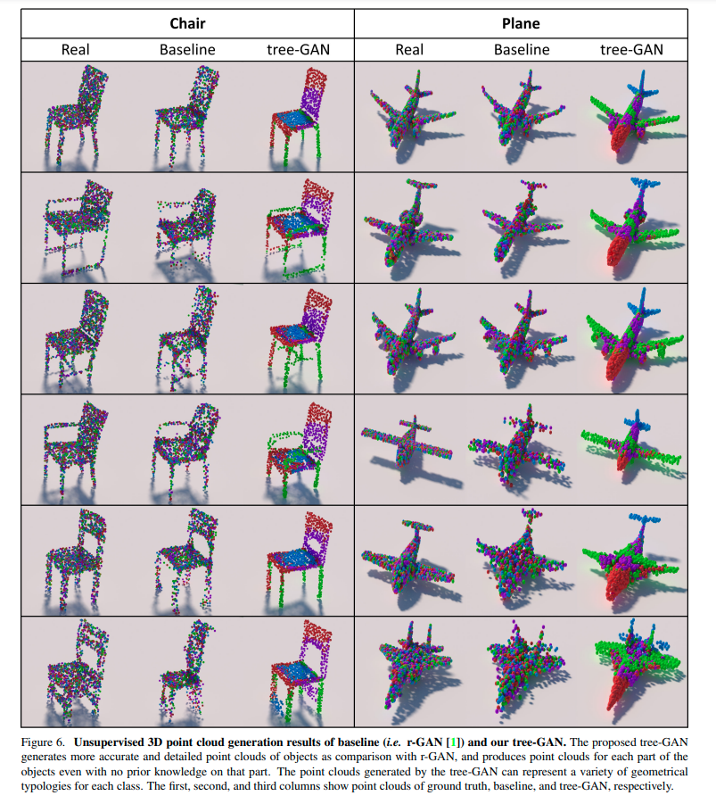
  - tree结构的GCN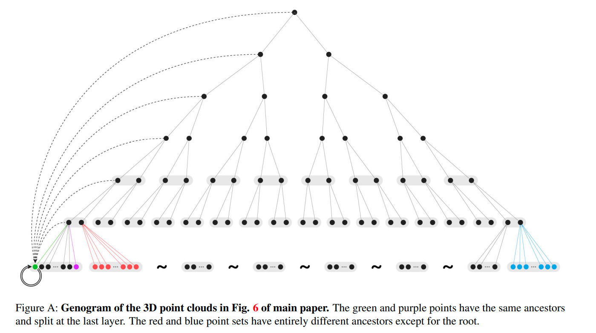

[image-to-point cloud] Geometric adversarial loss for single-view 3D-object reconstruction

[point cloud-to-point cloud]  Point cloud auto-encoder via deep grid deformation.

GANS: 

[40] 使用图卷积+GAN；邻接矩阵的计算太复杂，要平方计算

## continuous function representation (sampling)

- occupancy networks: 多分辨率等值面提取技术

## continuous function representation (ray tracing)

- DVR

## iso-surface / parametric generation / generative / GAN

## implicit field/feature semantic information

---

**`<semantic-SRN> "Inferring Semantic Information with 3D Neural Scene Representations"`**  
**[** `3DV 2020` **]** **[[web]](https://www.computationalimaging.org/publications/semantic-srn/)** **[[paper]](https://arxiv.org/pdf/2003.12673.pdf)**  **[** :mortar_board: `Stanford` **]**  
**[**  `Amit Kohli`, `Vincent Sitzmann`, `Gordon Wetzstein`  **]**  
**[** _`multi-modal features`, `semi-supervision`_ **]**  

  
Click to expand

- **Motivation**
  - 证明像SRN这样的隐式神经表征也可以包含多模态的信息：外观，形状，语义，*etc.*
- **OverView**
- 1. [训练] 正常的类别物体SRN预训练
    2. [训练] 固定SRN的参数和RGB neural renderer，在<u>已经固定</u>的SRN feature上利用少量的监督数据(如文中只用了30张语义标注好的RGB图片) 训练一个额外的语义分类器
    3. [测试] 单张RGB图片 ==**<u>and/or</u>**== 单张标注好的语义图片，提取code
       1. 注意这里的and/or：训练的时候RGB和语义监督信号都有，测试的时候只需要二者之一就足够，不一定全都要
    4. [测试] 利用第3步提取好的code在更多camera view下render出RGB和语义
  - 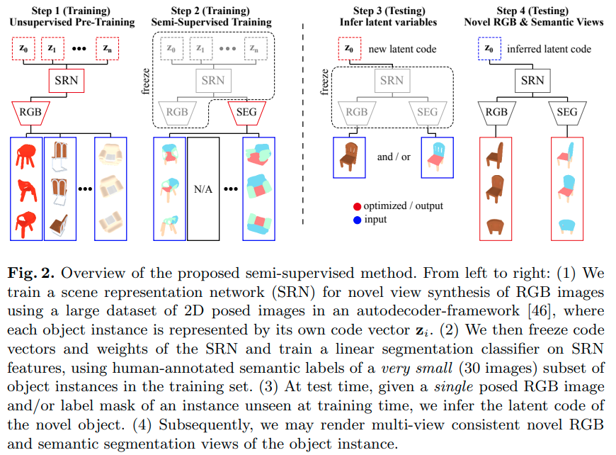

## NeRF 引用中带label

暂无

## semantic envelope 

---

**`"Neural Cages for Detail-Preserving 3D Deformations"`**  
**[** `CVPR2020(Oral)` **]** **[[paper]](https://igl.ethz.ch/projects/neural-cage/06035.pdf)** **[[code]](https://github.com/yifita/deep_cage)** **[[web]](https://yifita.github.io/project/neural-shape/)** **[[web]](https://igl.ethz.ch/projects/neural-cage/)** **[** :mortar_board: `ETH`, `IIT Bombay` **]** **[** :office: `Adobe` **]**  
**[**  `Wang Yifan`, `Noam Aigerman`, `Vladimir G. Kim`, `Siddhartha Chaudhuri`, `Olga Sorkine-Hornung`  **]**  
**[** _`cage-based deformation`, `pointnet encoder`, `deformation`_ **]**  

  
Click to expand

- **Motivation**
  - 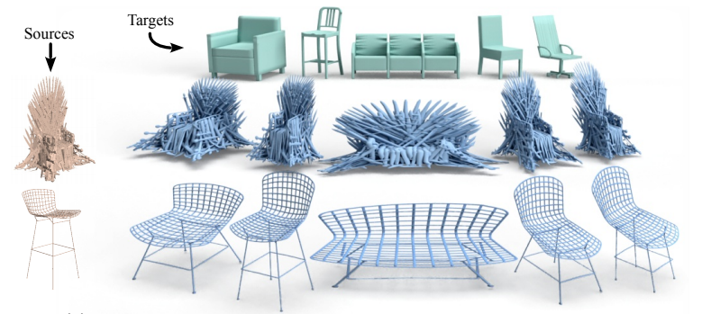
  - 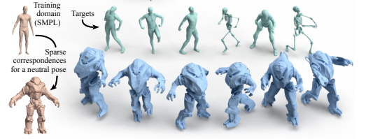
  - deformation一般都会有两组互相矛盾的目标函数
    - alignment with the target 和目标对齐
    - adhering to quality metrics 比如最小的扭曲，保留局部几何细节
  - 过去有一些手动的方法，但是往往局限于具体的表面
  - 过去也有一些神经网络-based方法，预测所有顶点的new positions
    - 但是由于神经网络难以捕捉、保留、产生高频的特征
  - 本篇通过借助一种传统的几何处理技术：`cage-based deformations` (CBD)，来circumvent上述问题
    - *Harmonic coordinates for character articulation, Pushkar Joshi et al., 2007*
    - *Mean value coordinates for closed triangular meshes. Tao Ju et al., 2005*
    - *Green coordinates. Yaron Lipman et al., 2008*
- **Overview**
  - 不直接变形surface，而是变形稀疏笼子； surface上面的每个点都有笼子顶点的加权和表达，权重函数不变，通过变形笼子来变形surface 这样可以最大程度保留局部细节，相当于直接扭曲空间，而不是移动surface vertices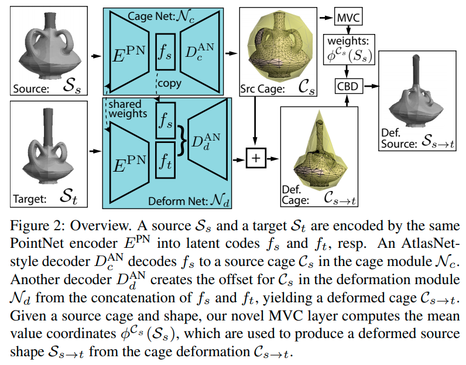
- **results**
  - 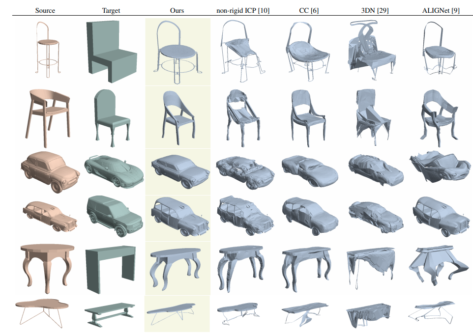
  - deformation transfer
    - 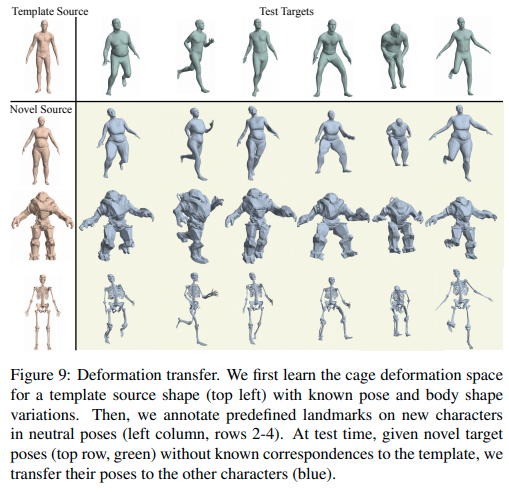
- **cage-based deformations CBD**
  - **intuition**
    - instead of 单独变形表面上的那些点，CBD 直接 warp 整个surface 嵌入到的那个ambient space
  - CBD通过控制一个稀疏的triangle mesh: $$cage \; \mathcal{C}$$控制这个warping
    - 在给定一个cage后，ambient space中的任意一点$$\boldsymbol{\rm p}\in\mathbb{R}^3$$ 被一组`generalized barycentric coordinates` 编码，即通过cage顶点$$\boldsymbol{\rm v}_j$$的加权平均来表达： $$\boldsymbol{\rm p}=\sum \phi^{\mathcal{C}}_j(\boldsymbol{\rm p}) \boldsymbol{\rm v}_j$$  其中权重函数$$\{ \phi^{\mathcal{C}}_j \}$$ 依赖于$$\boldsymbol{\rm p}$$ 相对于cage 顶点$$\{\boldsymbol{\rm v}_j\}$$的相对位置
    - 通过简单地offset cage的顶点，然后再用pre-computed weights去计算ambient space中的任意一点新坐标$$\boldsymbol{\rm v}_j'$$，就可以实现变形 $$\boldsymbol{\rm p}'=\underset {0 \leq j \lt \lvert V_{\mathcal{C}}\rvert }{\sum} \phi^{\mathcal{C}}_j(\boldsymbol{\rm p}) \boldsymbol{\rm v}_j'$$ 注意上式中的权重函数$$\{ \phi^{\mathcal{C}}_j \}$$还是之前计算好的，即权重函数不变，只有笼子顶点变了
  - attain weight functions
    - 过去CBD领域构造了很多规则来获取带有各种特殊属性的权重函数，比如补间、线性精度、平滑和最小的扭曲；
    - 本文选择了`mean value coordinates` (MVC) ，因为他们的方法补间属性很好，并且简洁、对source cage顶点和deformed cage顶点可微
- **learning**：如何改成learning based CBD
  - 目标是end-to-end pipeline，所以训练网络去预测source cage和target cage
  - cage-prediction model $$\mathcal{N}_{\mathcal{C}}$$：给定一个source shape$$\mathcal{S}_{\mathcal{s}}$$，预测它的cage $$\mathcal{C}_{\mathcal{s}}$$
    - $$ \mathcal{C}_{\mathcal{s}}=\mathcal{N}_{\mathcal{C}}(\mathcal{S}_{\mathcal{s}})+\mathcal{C}_0 $$
  - deformation-prediction model $$\mathcal{N}_{d}$$，预测从$$\mathcal{C}_{\mathcal{S}}$$的offset，来获得deformed cage
    - $$ \mathcal{C}_{\mathcal{s}\rightarrow t}=\mathcal{N}_{d}(\mathcal{S}_{t},\mathcal{S}_{\mathcal{s}})+\mathcal{C}_{\mathcal{s}} $$
  - source shape提输入点云的pointNet feature，decode预测source cage  source net的pointNet feature和target shape的pointNet feature拼一起，decode预测deformed cage source cage通过MVC得到source shape的权重函数，然后用CBD变形得到deformed shape 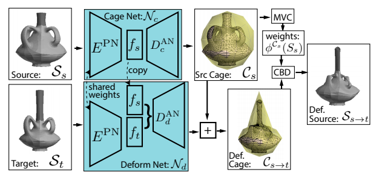
- **losses**
  - 主要分三项
    - 最优化source cage，鼓励正的mean value coordinates；就是惩罚负的MVC坐标（相当于让surface一定在笼子里）
    - 最优化变形：衡量和目标对齐；就是chamfer distance
    - 最优化变形：衡量shape细节保留
  - shape细节保留
    - 来自Laplacian regularization 的灵感，让形状更平滑
    - 对于man-made shapes，使用两个额外的loss来学到这类人工制品的形状的先验
      - normal consistency：法向量一致性 保留平面元素，比如桌面 惩罚deformation后的PCA-normal 有效提升了感知的质量
      - 类似 *3DN: 3D deformation network. Wang et al. CVPR2019*，使用对称性loss：衡量形状和它在x=0平面的镜像的chamfer distance
      - 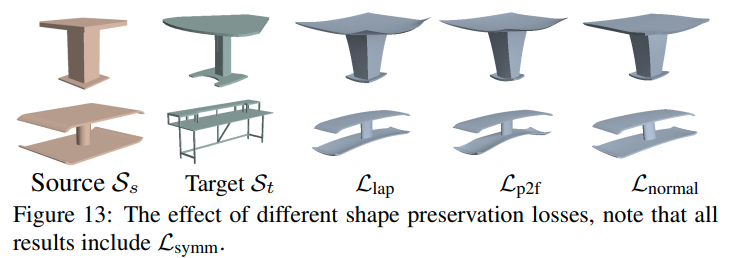

## semantic activated surface / interface area

---

**`"Where2Act: From Pixels to Actions for Articulated 3D Objects"`**  
**[** `arXiv2021` **]** **[[paper]](https://arxiv.org/pdf/2101.02692)** **[[code]](https://github.com/daerduoCarey/where2act)** **[[web]](https://cs.stanford.edu/~kaichun/where2act/)** **[** :mortar_board: `Stanford` **]** **[** :office: `Facebook` **]**  
**[**  `Kaichun Mo`, `Leonidas Guibas`, `Mustafa Mukadam`, `Abhinav Gupta`, `Shubham Tulsiani`  **]**  
**[** _`category extrapolation`_ **]**  

  
Click to expand

- **Motivation**
  - 对于带关节的物体，infer哪里去操作；
  - :pushpin: 可以做 **<u>category extrapolation</u>**！infer不在训练类别外的类别的操作面！
  - 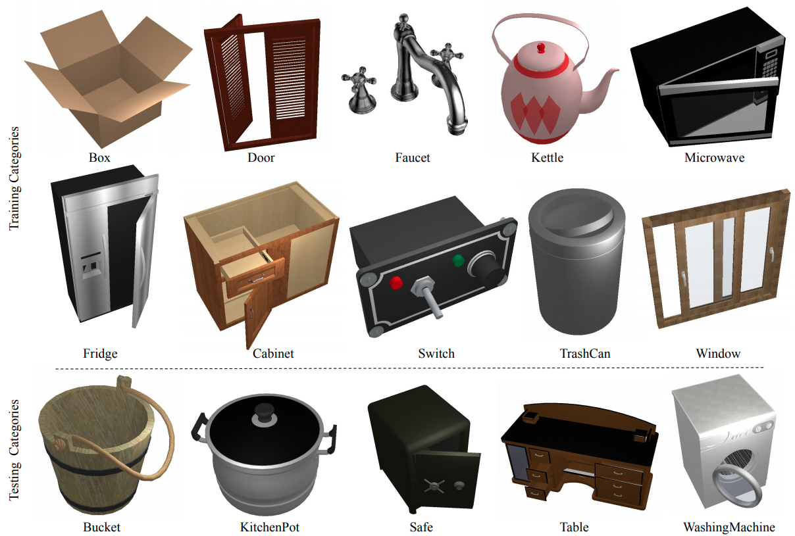
- **Overview**
  - 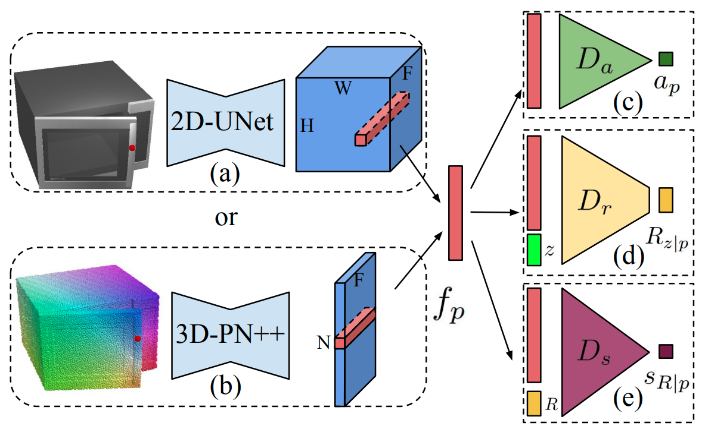

