* TOC
{:toc}

# part/structure-aware shape representation

## shape correspondence

 - *Deformed Implicit Field: Modeling 3D Shapes with Learned Dense Correspondence*
 - *Deep Implicit Templates for 3D Shape Representation*

---

**`"Unsupervised Learning of Intrinsic Structural Representation Points"`**  
**[** `CVPR2020` **]** **[[paper]](https://arxiv.org/pdf/2003.01661.pdf)** **[[code]](https://github.com/NolenChen/3DStructurePoints)**  **[** :mortar_board: `The University of Hong Kong`, `MPI`, `Shandong University` **]** **[** :office: `Adobe` **]**  
**[**  `Nenglun Chen`, `Lingjie Liu`, `Zhiming Cui`, `Runnan Chen`, `Duygu Ceylan`, `Changhe Tu`, `Wenping Wang`  **]**  
**[** _`abcd`_ **]**  

  
Click to expand

- **Motivation**
  - 点云输入，无监督地learning structures of 3D shape
  - 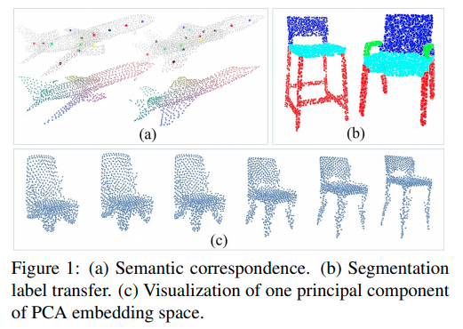
- **results**
  - 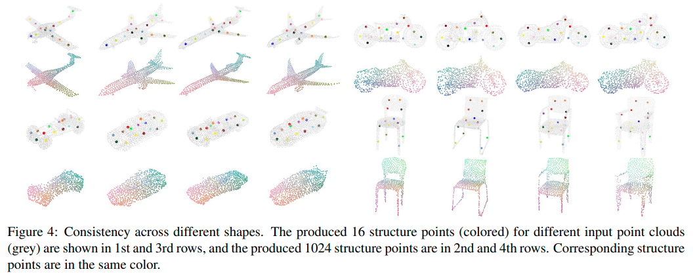

---

**`"Learning Implicit Functions for Topology-Varying Dense 3D Shape Correspondence"`**  
**[** `NeurIPS2020(Oral)` **]** **[[paper]](https://arxiv.org/pdf/2010.12320.pdf)** **[[supp]](http://cvlab.cse.msu.edu/pdfs/Implicit_Dense_Correspondence_Supp.pdf)** **[[code]](https://github.com/liuf1990/Implicit_Dense_Correspondence)** **[[web]](http://cvlab.cse.msu.edu/project-implicit-dense-correspondence.html)** **[** :mortar_board: `Michigan State University` **]**   
**[**  `Feng Liu`, `Xiaoming Liu`  **]**  
**[** _`implicit function`, `correspondence score`, `category shape correspondence`_ **]**  

  
Click to expand

- **Motivation**
  - 给定一组3D shapes（点云），category-specific model 无监督地学出逐pair（source 与target之间）的correspondence和部件segmentation
  - 即使拓扑不一样也能学到相关性
  - 有`correspondence`相关性分数输出 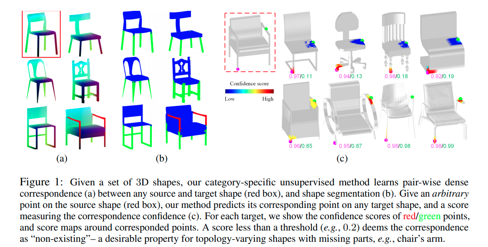
- **Overview**

## shape analysis

---

**`<IP-Net> "Combining Implicit Function Learning and Parametric Models for 3D Human Reconstruction"`**  
**[** `ECCV2020(Oral)` **]** **[[paper]](https://arxiv.org/pdf/2007.11432.pdf)** **[[code]](https://github.com/bharat-b7/IPNet)** **[[web]](http://virtualhumans.mpi-inf.mpg.de/ipnet/)** **[** :mortar_board: `MPI` **]** **[** :office: `Google` **]**  
**[**  `Bharat Lal Bhatnagar`, `Cristian Sminchisescu`, `Christian Theobalt`, `Gerard Pons-Moll`  **]**  
**[** _`parametric human body model SMPL`_ **]**  

  
Click to expand

- **Motivation**
  - **<u>keypoint 1</u>**：不是inside / outside两类区分的单层表面，而是 inside the body (R0), between the body and clothing (R1), outside the clothing (R2) 3类区分的双层表面 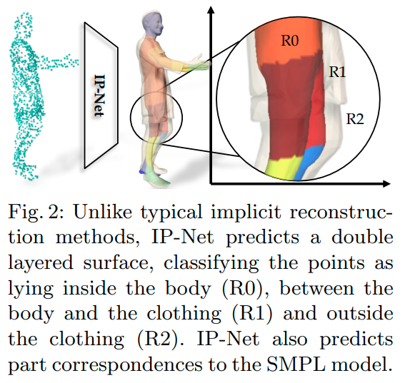
  - **keypoint 2** 
    - 隐函数类的方法可以产生任意分辨率的细节，但是一般是static的不能控制
    - 建立和parametric body model ([SMPL](https://smpl.is.tue.mpg.de/))的相关性，可以对预测出的implicit surface `register`注册 SMPL+D ，让预测出的implicit representation **<u>可以控制</u>**  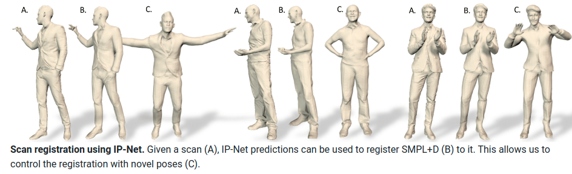
- **overview**
  - 输入一个稀疏点云（来自有关节、不同形状、不同pose、不同clothing的人类），一个occupancy predictor估计R0,R1,R2，一个multi-class classifier 估计part label（人的14类part） 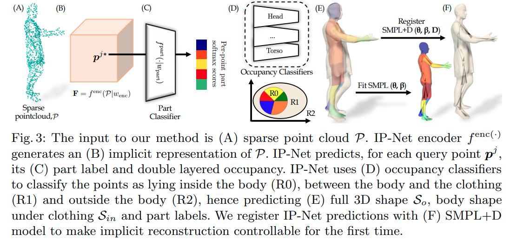
    - 使用Marching Cubes从predict出的implicit functions产生mesh surface（内表面，外表面）
  - 把IP-Net的predictions注册到SMPL人类模型
    - optimization-based ，最优化SMPL的参数来fit 内表面预测$\mathcal{S}_{in}$
    - 额外利用IP-Net预测出的part-labels，来保证SMPL的不同部件的mesh能正确解释对应部件的surface区域
  - 同样的idea还可以generalize to 3D hands
    - 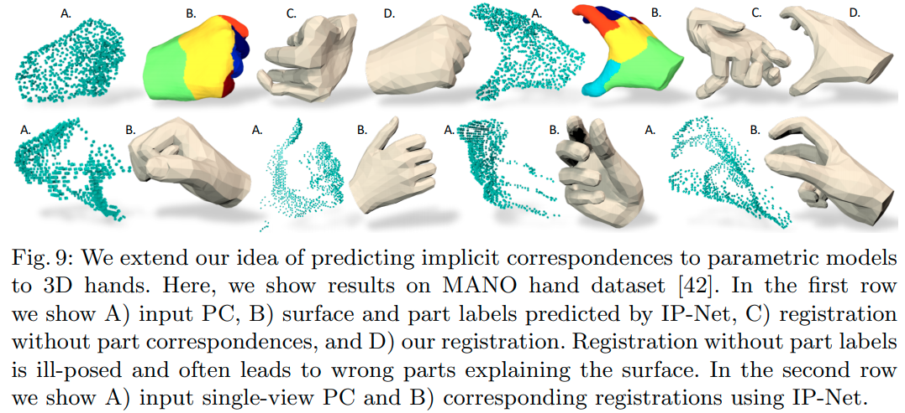

## structured models
 - BSP-Net: Generating Compact Meshes via Binary Space Partitioning
 - partnet
 - structure net

---

**`"BAE-NET: Branched Autoencoder for Shape Co-Segmentation"`**  
**[** `ICCV2019` **]** **[[paper]](https://openaccess.thecvf.com/content_ICCV_2019/papers/Chen_BAE-NET_Branched_Autoencoder_for_Shape_Co-Segmentation_ICCV_2019_paper.pdf)** **[[supp]](https://openaccess.thecvf.com/content_ICCV_2019/supplemental/Chen_BAE-NET_Branched_Autoencoder_ICCV_2019_supplemental.pdf)** **[[code(tf)]](https://github.com/czq142857/BAE-NET)**  **[** :mortar_board: `SFU`, `IIT Bombay` **]** **[** :office: `Adobe` **]**  
**[**  `Zhiqin Chen`, `Kangxue Yin`, `Matthew Fisher`, `Siddhartha Chaudhuri`, `Hao Zhang`  **]**  
**[** _`one-shot learning`, `k-neuron`, `inside-outside indicator`_ **]**  

  
Click to expand

- *<IM-Net> Learning Implicit Fields for Generative Shape Modeling (CVPR2019)* 的续作，inside / outside indicator作为shape表征
- **Motivation**
  - 把形状的 `co-segmentation` 看做表征学习问题
  - 可以无监督、弱监督、`one-shot learning`，只需要用几个exemplars，就可以在shape 分割任务上好过在分割shape上训练的SOTA
  - 无监督的 **<u>co-segmentation</u>**  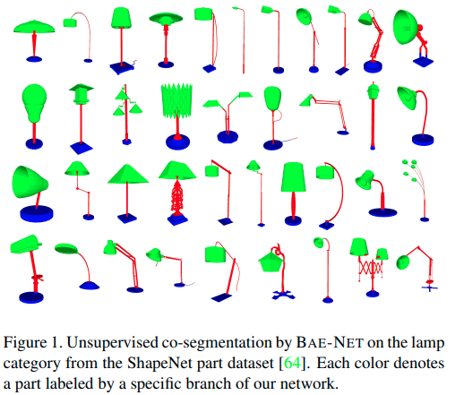
- **overview**
  - 就是在*Learning Implicit Fields for Generative Shape Modeling* 的基础上，从原来的单个inside / outside indicator变成 `k` 个inside / outside indicator (`branched output`, one neuron each) ，然后在最后max pooling 把几个neuron `compose`在一起。
  - 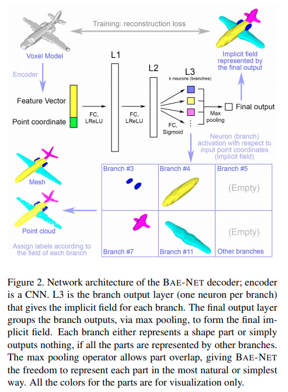
  - 让网络 **<u>“自动”</u>** 学出来一个个natural shape的neuron；没有强制保证 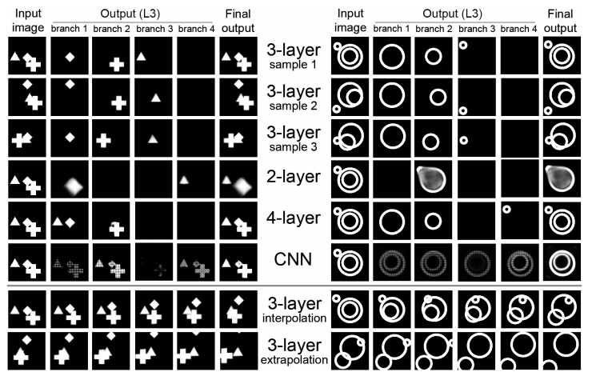

---

**`<NSDN> "Neural Star Domain as Primitive Representation"`**  
**[** `NeurIPS2020` **]** **[[paper]](https://arxiv.org/pdf/2010.11248.pdf)**  **[** :mortar_board: `The University of Tokyo` **]** **[** :office: `RIKEN AIP` **]**  
**[**  `Yuki Kawana`, `Yusuke Mukuta`, `Tatsuya Harada`  **]**  
**[** _`abcd`_ **]**  

  
Click to expand

- **Motivation**
  - Reconstructing 3D objects from 2D images + structured reconstruction
  - 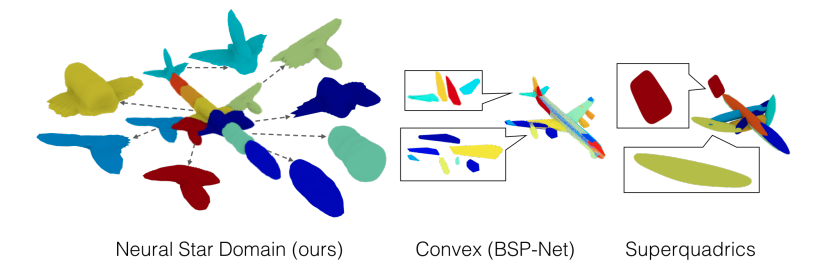
  - 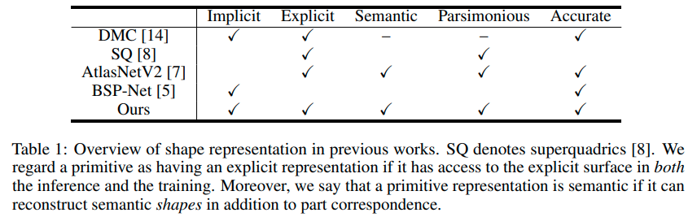
- **overview**
  - 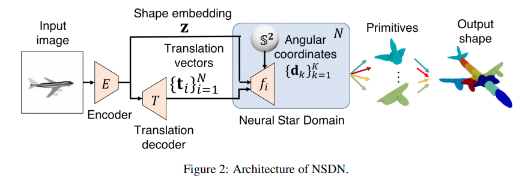

---

**`"DSM-Net: Disentangled Structured Mesh Net for Controllable Generation of Fine Geometry"`**  
**[** `2020` **]** **[[web]](http://geometrylearning.com/dsm-net/)** **[[paper]](https://arxiv.org/pdf/2008.05440.pdf)**  **[** :mortar_board: `中科院计算所`, `中科院大学`, `Stanford`, `Cardiff University` **]** **[** :office: `company` **]**  
**[**  `Jie Yang`, `Kaichun Mo`, `Yu-kun Lai`, `Leonidas Guibas`, `Lin Gao`  **]**  
**[** _`3D shape generation`, `disentangled representation`, `structure`, `geometry`, `hierarchies`_ **]**  

  
Click to expand

- **Motivation**
  - 把structure(topology)和geometry进一步解耦，in a synergistic manner
  - 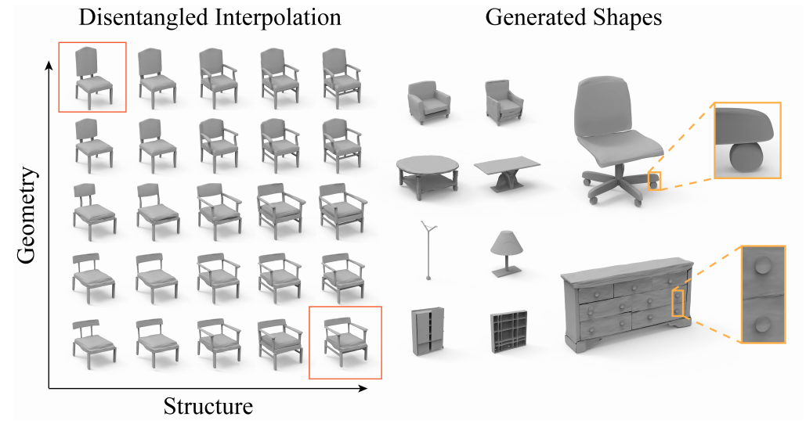
- **Overview**
  - 用Recursive Neural Networks(RvNNs, 注意RNN是recurrent NN) hierarchically encode和decode  structure和geometry，在hierarchy的每一层都有bijective mapping 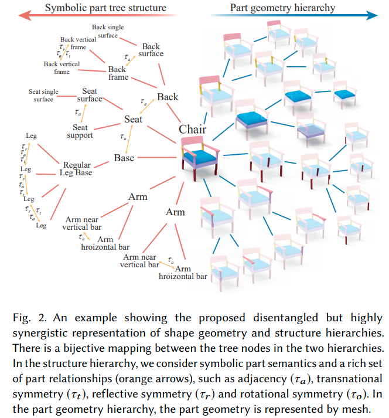
  - 同时用两个分开的但是高度耦合的VAE学习structure 和geometry，把他们encode into two latent spaces
- **disentangled shape  representation**
  - structure hierarchy抽象出符号部件(symbolic parts)与关系
    - inspired by *PT2PC: Learning to Generate 3D Point Cloud Shapes from Part Tree Conditions. 2020*
    - 每个部件用semantic label (e.g. chair back, chair leg)表示，引入PartNet dataset中丰富的部件关系
      - $\boldsymbol{\rm H}$ **<u>纵向的parent-child inclusion 关系</u>** (e.g. chair back and chair back bars)
      - $\boldsymbol{\rm R}$ **<u>横向的among-sibling 部件对称性与邻接性</u>**(e.g. chair back bars have translational symmetry)
  - geometry hierarchy是部件的geometry
    - 表征就是正常的多顶点mesh
    - 假设一个5402顶点构成的封闭mesh，计算oriented bounding box
    - 然后通过non-rigid registration 变形这个mesh到target part geometry
    - 然后用ACAP作为部件表征
      - *Sparse data driven mesh deformation. 2019*
      - *SDM-NET: Deep Generative Network for Structured Deformable Mesh. 2019*
  - structure hierarchy和geometry hierarchy之间有bijective mapping
    - 符号部件$l_i$对应部件geometry $G_i$，层级$\boldsymbol{\rm H}$和关系$\boldsymbol{\rm R}$则隐式地互相一致
      - 在学习的时候两个hierarchies有communication channels
    - 虽然结构和几何要解耦，但是他们还是需要彼此兼容来产生好的、现实的形状
      - 一方面，shape structure 为 part geometry提供high-level guidance
        - e.g. 如果four legs of a chair对称，那么他们应该具有identical part geometry
      - 另一方面，给定part geometry以后，只有若干种适用的shape structures（而不是全部）
        - e.g. 如果没有lift handle或者gas cylinder parts，不可能组装一个swivel chair
- **conditional part geometry VAE**
  - encode和decode时候都condition on part structure information
  - 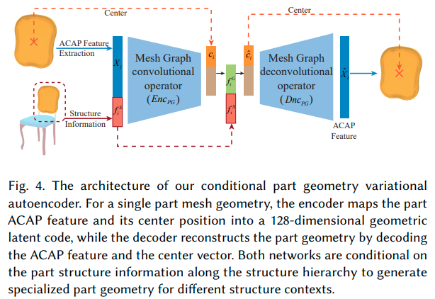
- **Disentangled Geometry and Structure VAEs**
  - 下图蓝色代表geometry，红色代表structure encoding的时候，从geometry和structure feature encode出geometry decoding的时候，从geometry和structure feature decode出geometry 
  - 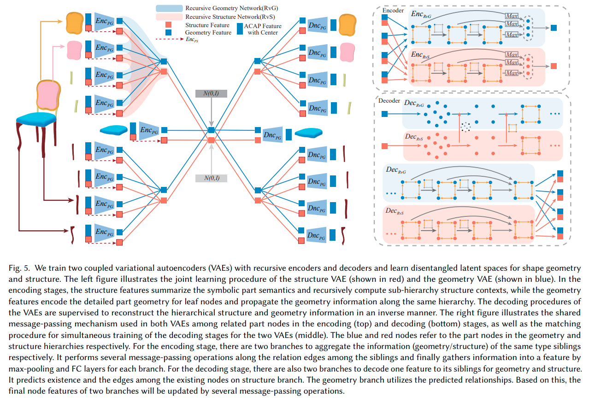
  - [ ] what?
- **results**
  - 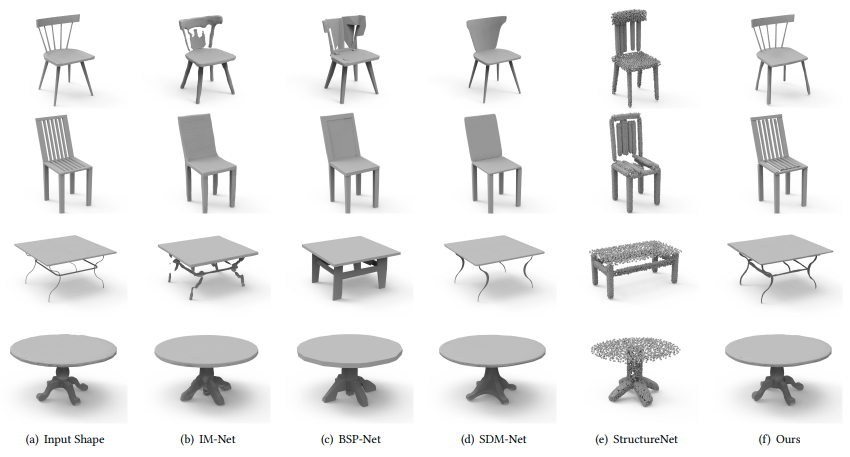

---

**`"Compositionally Generalizable 3D Structure Prediction"`**  
**[** `2021` **]** **[[paper]](https://arxiv.org/pdf/2012.02493.pdf)** **[[code]](https://www.github.com)** **[** :mortar_board: `UCSD`, `USTC`, `Stanford` **]** **[** :office: `Google` **]**  
**[**  `Songfang Han`, `Jiayuan Gu`, `Kaichun Mo`, `Li Yi`, `Siyu Hu`, `Xuejin Chen`, `Hao Su`  **]**  
**[** _`object parts`, `single view`, `partnet dataset`_ **]**  

  
Click to expand

- **Review**
  - 思路、框架清晰；carefully designed subproblems
  - 可解释性很强，不是随随便便拿来GCN胡乱用一下
  - 部件表征：cuboids
- **Motivation**
  - 学到不同物体、不同物体类别之间那些公共的部件、部件间的关系、连接
  - 把整个物体的shape生成问题转为几个子问题的组合
  - 关注的是逐part pair的相对位置的预测
  - 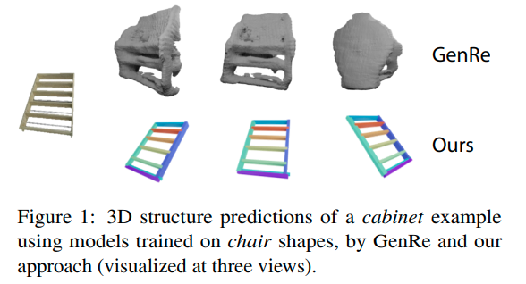
- **overview**
  - 用geometry primitives来代表部件（具体来说，oriented bounding cuboids，长方体），每个部件有$p_i=[c_x,c_y,c_z,s_x,s_y,s_z,q]$
    - 遵循StructureNet的设定 *Structurenet: Hierarchical graph networks for 3d shape generation 2019*
  - 所有模块都是有监督的；part真值来自于PartNet的3D labels
  - 步骤：
    - MaskRCNN来提取部件instance mask
    - identify parallelism for part pairs，对每组平行的部件预测他们共享的edge direction
    - identify translational symmetry within part pairs，对每组平动对称的部件预测他们共享的edge length
    - 预测部件pairs之间的连接性，提取一个基于连接性的部件树
    - 预测邻接部件的相对位置，在遍历部件树的时候组装整个形状
  - [isolation principle] 重度依赖部件masks作为模块的输入来引起对局部区域的关注
  - [relativity principle] 依赖于pairwise关系
  - 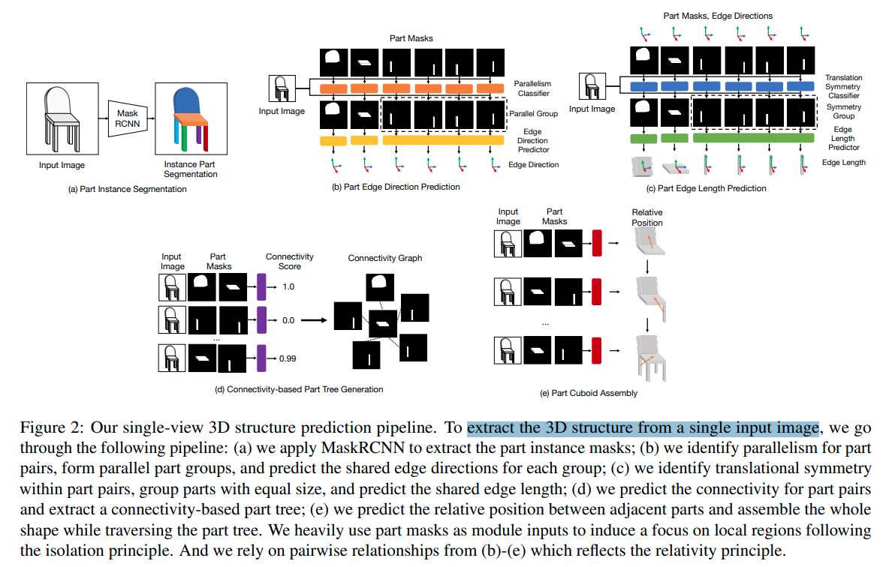
- ==**relative position prediciton**==
  - 从root part开始，逐pair地添加other parts
  - 很多过去的工作都是估计在相机坐标系下的绝对位置，或者是一个(类别级别先验)canonical space下的pose
  - 然而，绝对位置对于shape scale敏感，对optical axis的平动也很敏感，对于简单的类别内预测的表现都很差
  - **<u>Connectivity-based Part Tree</u>**：追求通过strong **pairwise** relationships来组装parts
    - 主要用的是基于连接性的关系
    - 首先识别空间上接触的部件pair，然后预测他们之间的相对位置
    - 选择【接触关系】原因：
      - 接触的部件空间上接近，互相之间有strong arrangement constraints
      - 当没有遮挡情况下，评估两个部件有没有接触在图像上都不太难，并不需要类别级别的知识
      - 这种关系非常普遍
      - 对于新类别的物体也可以很好地迁移
    - ==**思考**==
      - 这里的想法和我们非常一致，我们扩展到更多类型的关系应该就可以实现
    - 主要方法
      - 训练一个连接性分类器，预测parts pair是否在原来的3D shape 互相接触
      - 用连接性类构建一个part tree
        - 首先构建一个连接图，把连接性分数高的pair连接起来
        - 然后贪婪地构建一个spanning tree
          - 具体：通过预测出的大小，选最大的part作为root node，然后迭代地选剩下的最大的部件连到当前树上
          - 如果图中包含多个连接起来的components，那就构建part forest
  - **<u>joint-based relative position</u>** 逐pair预测相对位置
    - instead of 直接预测两个center的相对位置，基于接触点来用上更强的位置先验
    - 接触点必须位于每个部件的cuboid中
    - 用接触点来参数化部件center之间的相对关系
      - 接触点
        - 在part $p_1$坐标系下接触点坐标$c^1$，在part $p_2$坐标系下接触点坐标$c^2$，假设$p_1$, $p_2$在world frame下坐标为$l_1^W$, $l_2^W$，由于是同一个点，应有 $l_1^W+c^1=l_2^W+c^2$
        - 则两个center之间的相对位置可以这样infer： $l_{1 \rightarrow2}^W=l_2^W-l_1^W=c^1-c^2$
        - - [x] Q：这里可能有些问题，考虑到坐标系旋转，并不应是简单加法，不过意思到了 A：没有问题，这里$c^1$, $c^2$都是世界坐标系下的
      - 接触点估计：如何infer $c^i$
        - 接触点应位于cuboid表面或者cuboid内部，因此将接触点表示为cuboid顶点的interpolation $c^i=\sum_{j=1}^{8}\omega_{i,j}\cdot v_{i,j}$, where $\sum_{j=1}^8\omega_{i,j}=1$ and $\omega_{i,j} \geq0$
        - 用神经网络预测$\omega_i,j$，输入reference image和两个部件mask的feature的stack
        - 为了让接触点预测的结果和cuboid顶点顺序无关，结构和PointNet segmentation的结构类似
        - *Deep learning on point sets for 3d classification and segmentation.2017* 
      - 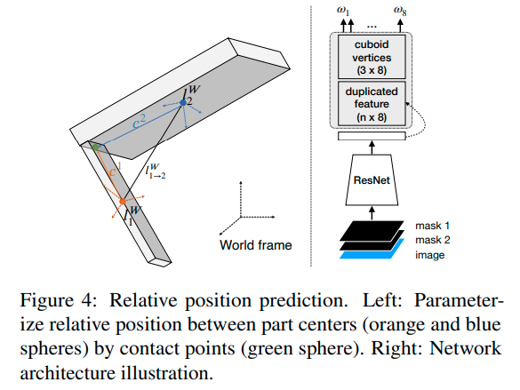
- **效果**
  - 真值mask基本可以做到很完美的组装，predicted mask效果也可以接受，毕竟predict出来的mask会出问题
  - 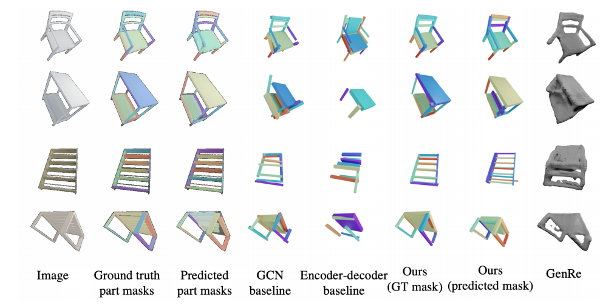

# deep assembly

